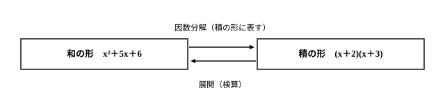

# L03 因数分解①——「積の形に表す」と共通因数

- unit_id: hs-math-i-numbers-and-expressions
- 位置づけ: 単元第3レッスン（1.5時間）。展開（L01〜L02）の逆向きの操作として因数分解を定義し、共通因数のくくり出しと中3公式の逆で「積の形」に表す。
- distribution_status: published_draft
- license: CC-BY-4.0
- verify_required: 例題数値・記述は監修者検証必須。
- 主概念: ①因数分解の定義と展開との往復（検算の型） ②共通因数のくくり出し（−1を含む）

---

## 1. 展開の逆をたどる——因数分解の定義

L01〜L02では、

(x＋2)(x＋3) = x²＋5x＋6

のように、かっこの積で書かれた式をかっこのない和の形に直す「展開」を練習した。今回は、この等式を右から左へ読む。つまり、

x²＋5x＋6 = (x＋2)(x＋3)

のように、1つの多項式をいくつかの式の**積の形に表す**こと——これを、その多項式を**因数分解**するという。中3で「展開の公式の逆」として学んだ操作である。積をつくっている1つ1つの式（上の例では x＋2 と x＋3）を因数ということも、中3で学んだとおりだ。和をつくる部品が項（L01）、積をつくる部品が因数——という対比で押さえておくとよい。

数Ⅰでの最初の目標は、計算より前に、この定義を自分の言葉で言えるようになることである。展開と因数分解は同じ等式を逆向きにたどる関係にあり、この往復がレッスン全体の背骨になる。

大事なのは、答えを書くたびに「積の形になっているか」を言葉で確かめることだ。因数分解の答えは、式の一部を抜き出したものでも、計算して出した1つの数値でもない。**全体が1つの積**になっていて、しかも**展開すると元の式に戻る**——この2つがそろって、はじめて因数分解と言える。

:::guide
**因数分解の「答え」は等式で書く**

学び始めによくある考え方に、「x²＋5x＋6 の因数は x＋2 だから、答えは x＋2」のように、見つけた部品だけを書いて答えにしてしまうものがある。因数を見つける目は良い。ただ、問われているのは「この多項式を積の形に表せ」であって、部品さがしではない。答えはあくまで x²＋5x＋6 = (x＋2)(x＋3) という**等式の形**——元の式全体が、どんな積に等しいのかを示すところまでで1セットだ。「積の形に表す」という定義を自分の言葉で言えるようにしておくと、答案を書き終えるたびに「いま自分は積の形を書いたか」と自分で検査できるようになる。
:::

## 2. 「積の形」かどうかを見分ける

次の2つの式変形を比べよう。どちらの等式も、計算としては正しい。

- x²＋6x = x(x＋6)
- x²＋6x−5 = x(x＋6)−5

上の式は、右辺全体が x と x＋6 の積になっている——因数分解である。下の式は、右辺が「積から5を引いた形」であり、全体としては引き算の混ざった和の形のまま——**等式としては正しいが、因数分解ではない**。

このように、「式変形として正しいか」と「積の形になっているか」は別々の検査である。因数分解と言えるためには、両方に合格しなければならない。この判定そのものを、練習の問1で問う。

## 3. 最初の一手——共通因数のくくり出し

分配法則 m(a＋b)=ma＋mb を逆向きに使うと、

ma＋mb = m(a＋b)

と書ける。各項に共通にふくまれている因数 m を**共通因数**といい、共通因数をかっこの外にくくり出すことが、因数分解の最初の一手になる。

**例題1** 6x²＋4x を因数分解せよ。

6x² と 4x に共通な因数を、数の部分（6と4に共通な2）と文字の部分（両方の項にある x）に分けて探すと、共通因数は 2x。

6x²＋4x = 2x(3x＋2)

検算として展開すると、2x(3x＋2)=6x²＋4x となり、元の式に戻る。

ここで、2(3x²＋2x) で止めてはいけない。かっこの中の 3x²＋2x には、まだ共通因数 x が残っている。**共通因数は残らず、くくり出せるだけくくり出す**。「かっこの中にもう共通因数がないか」まで見て、仕上がりとする。

## 4. 先頭が−の式——−1のくくり出しを独立の一歩に

**例題2** −x²＋4x−4 を因数分解せよ。

見た目の近さだけで (x−2)² と書きたくなるかもしれない。しかし展開して検算すると (x−2)²=x²−4x＋4 となり、先頭の −x² に戻らない。つまりこれは誤りである。

x²の係数が負のときは、**まず −1 をくくり出して、かっこの中の先頭の符号を＋にする**。この一歩を、それ自体で1つのステップとして必ず踏む。

−x²＋4x−4 = −(x²−4x＋4) = −(x−2)²

検算: −(x−2)² = −(x²−4x＋4) = −x²＋4x−4。元に戻る。

−1をくくり出すとき、かっこの中では**すべての項の符号が変わる**（＋4x は −4x に、−4 は ＋4 になる）。ここを丁寧に書くことが、次の節の公式を安心して使うための土台になる。

:::guide
**なぜ「−1のくくり出し」をわざわざ独立の一歩にするのか**

−x²＋4x−4 のような式を見ると、「x² と 4 が2乗の形だから」と、見覚えのある公式へそのまま当てはめたくなる。この「形が似ているから当てはめる」は自然な発想だが、先頭の符号が−のままでは4公式のどれとも一致しない——公式の左辺は、どれも a² や x² のように＋の2乗で始まっているからだ。そこで、公式に会いに行く前の準備として −1 をくくり出し、かっこの中を公式が使える形に整える。この一歩を頭の中で済ませず紙の上に書くのは、符号の反転（すべての項の符号が入れ替わる操作）が、暗算ではいちばん取りこぼしやすいからだ。急がば回れ——1行増やすことが、いちばん速くて確実な道になる。
:::

## 5. 中3の4公式を逆向きに使う

中3で学んだ4つの乗法公式は、右から左へ読めば、そのまま因数分解の公式になる。

| 展開（中3の公式） | 因数分解（逆向きに読む） |
|---|---|
| (a＋b)² = a²＋2ab＋b² | a²＋2ab＋b² = (a＋b)² |
| (a−b)² = a²−2ab＋b² | a²−2ab＋b² = (a−b)² |
| (a＋b)(a−b) = a²−b² | a²−b² = (a＋b)(a−b) |
| (x＋a)(x＋b) = x²＋(a＋b)x＋ab | x²＋(a＋b)x＋ab = (x＋a)(x＋b) |

**例題3** x²＋7x＋10 を因数分解せよ。

表の4つ目の公式を使う。積が10、和が7になる2つの数を探す。10=1×10=2×5 のうち、和が7になるのは2と5。

x²＋7x＋10 = (x＋2)(x＋5)

検算: (x＋2)(x＋5)=x²＋5x＋2x＋10=x²＋7x＋10。元に戻る。変形したら展開で元に戻す——この往復を毎回の習慣にしよう。

**例題4** x²−81 を因数分解せよ。

81=9² だから、「2乗の差」の公式で

x²−81 = (x＋9)(x−9)

ここで (x−9)² と書くのは誤りである。展開すると (x−9)²=x²−18x＋81 となり、x²−81 とは、x の項が現れるうえ定数項の符号も逆（＋81 と −81）の、別の式になる。**「2乗の差」a²−b² と「差の2乗」(a−b)² は別物**——迷ったら展開して確かめれば、その場で見分けがつく。

:::guide
**「2乗の差」と「差の2乗」——混同はどこから来るか**

a²−b² と (a−b)² の混同は、「2乗」と「差」という同じ材料の順番違いを、つい同じものとみなしてしまうことから生まれる。「2乗してから引く」と「引いてから2乗する」は操作の順序が違い、結果も違う。違いの正体は展開すると見える——(a−b)² = a²−2ab＋b² には真ん中に −2ab の項があり、b² の符号も＋になる。a²−b²（こちらは −b²）とはこの2箇所が違う、別物の式なのだ。だから迷ったときの手当ては1つでよい。**書いた答えを展開して、元の式に戻るか確かめる**。この検算は、公式を正しく思い出せているかどうかに関係なく、その場で正誤を教えてくれる。
:::

## 6. 手順の型

因数分解の手順を型としてまとめる。

1. **共通因数**を探し、あればくくり出す（先頭の項が−なら、−1のくくり出しを1つのステップとして必ず検討する）。
2. かっこの中（共通因数がなければ式全体）に、4公式の逆が使えるか調べる。
3. 答えの**全体が積の形**になっているか、定義に照らして確かめる（積に何かを足し引きした形が残っていないか。かっこの中に共通因数が残っていないか）。
4. **展開して元の式に戻る**ことを検算する。

3と4は別々の検査である（2節で確かめたとおり）。なお、x²の係数が2以上で共通因数もない式——たとえば 3x²＋7x＋2 のような型——を分解する道具は、次のL04で新しく1つ加える。

## 7. 練習

**問1**
(1) 因数分解とはどういう操作か。「積」という語を使って1〜2文で説明せよ。
(2) 次のア〜エのうち、右辺が左辺の因数分解になっているものをすべて選べ。なっていないものは、その理由を一言で答えよ。
(ア) x²＋4x = x(x＋4)
(イ) x²＋4x＋3 = x(x＋4)＋3
(ウ) x²−25 = (x−5)²
(エ) x²−25 = (x＋5)(x−5)

**問2** 次の式を因数分解せよ。
(1) 6x²＋9x
(2) 4a²b−6ab²

**問3** −x²＋10x−25 を因数分解せよ。

**問4** 次の式を因数分解せよ。
(1) x²＋8x＋16
(2) x²−49

**問5** 次の式を因数分解せよ。
(1) x²＋9x＋14
(2) x²−2x−15

---

:::stretch
**S1** ある生徒が、次の2つの因数分解を答えた。6節の手順の型の検査3（積の形の仕上がり）と検査4（展開の検算）を使って、それぞれの誤りを見つけ、正しい因数分解に直せ。
(1) x²−36 = (x−6)²
(2) 3x²−12x = 3(x²−4x)
:::

<!-- gen_nav:nav:start（自動生成・手編集しない） -->

---

[← 前のレッスン](lesson_02.md)｜[単元の目次](README.md)｜[解答](answer_key_L01-04.md)｜[次のレッスン →](lesson_04.md)

<!-- gen_nav:nav:end -->
