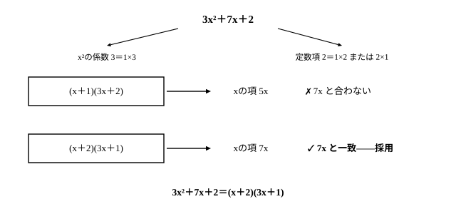

# L04 因数分解②——acx²＋(ad＋bc)x＋bdの型と1文字着目

- unit_id: hs-math-i-numbers-and-expressions
- 位置づけ: 単元第4レッスン（2時間）。L03に続く因数分解の後半——x²の係数が1でない2次式の型と、2つの文字を含む式を1つの文字に着目して整理する見方を扱う。
- distribution_status: published_draft
- license: CC-BY-4.0
- verify_required: 例題数値・記述は監修者検証必須。
- 主概念: ①acx²＋(ad＋bc)x＋bd型の因数分解（係数の組の探索） ②1つの文字に着目・置き換えによる因数分解

---

## 1. x²の係数が1でないとき——L02の公式を逆向きに使う

L03で確かめたとおり、因数分解とは多項式を「積の形に表す」ことであり、中学の公式を逆向きに使えば x²＋5x＋6=(x＋2)(x＋3) のような式を分解できた。ただし中学の4番目の公式がそのままの形で使えるのは、x²の係数が1の式までである。

3x²＋7x＋2 のように x²の係数が1でない式には、L02で学んだ数学Ⅰの新公式

(ax＋b)(cx＋d) = acx²＋(ad＋bc)x＋bd

を逆向きに使う。つまり、x²の係数が ac に、定数項が bd に、xの係数が ad＋bc になるような a, b, c, d の組を探せばよい。

**例題1** 3x²＋7x＋2 を因数分解せよ。

x²の係数3と定数項2を積に分解する。3=1×3、2=1×2 または 2×1 だから（係数がすべて正なので、負の数の組は考えなくてよい）、候補は次の2つに絞られる。組が正しいかどうかは、展開したときのxの項で照合する。

| 候補 | 展開すると | xの項 |
|---|---|---|
| (x＋1)(3x＋2) | 3x²＋2x＋3x＋2 = 3x²＋5x＋2 | 5x |
| (x＋2)(3x＋1) | 3x²＋x＋6x＋2 = 3x²＋7x＋2 | 7x |

xの項が 7x と一致するのは2つ目の組だけである。したがって

3x²＋7x＋2 = **(x＋2)(3x＋1)**

x²の係数と定数項は「積の条件」、xの係数は「組み合わせが正しいかを判定する照合の条件」という役割分担になっている。慣れれば候補の照合は頭の中でできるようになるが、最初は表に書き出してよい。

:::guide
**照合は「xの項」だけ計算すれば足りる**

候補の組は、もともと x²の係数が ac、定数項が bd になるように作ってある。つまり、どの候補も展開すれば x²の項と定数項は最初から必ず合っている。合っているかどうか未定なのは、真ん中の ad＋bc——xの項だけだ。(ax＋b)(cx＋d) を展開したときにxの項を作るのは、外側の ax×d と内側の b×cx の2つだけだから、照合は「外側の積と内側の積を足して、xの係数と比べる」に絞ってよい。例題1なら、(x＋1)(3x＋2) は 1×2＋1×3=5 でちがう、(x＋2)(3x＋1) は 1×1＋2×3=7 で一致——この計算だけで組が決まる。候補表の全展開は、この仕組みを一度目で確かめるためのもので、慣れたら省いてよい。ただし、答えを決めたあとの検算は全体を展開して必ず行う。途中を軽くした分の保険は、ここでかける。
:::

## 2. 符号を手がかりにする——定数項が負の場合

**例題2** 6x²−x−2 を因数分解せよ。

定数項が −2（負）だから、bとdは異符号である。x²の係数は 6=1×6 または 2×3。たとえば (2x−1)(3x＋2) を試すと、展開は 6x²＋4x−3x−2 = 6x²＋x−2 で、xの項の符号だけが合わない。このようなときは、bとdの符号を入れかえた組を試せばよい。

(2x＋1)(3x−2) を展開すると 6x²−4x＋3x−2 = 6x²−x−2 で一致する。

6x²−x−2 = **(2x＋1)(3x−2)**

また、候補の探索を始める前に、**共通因数を先に確かめる**こと（L03の手順の再訪）。たとえば 4x²＋10x＋6 は、そのまま探索を始めると係数が大きくて組を見つけにくいが、先に2をくくり出せば

4x²＋10x＋6 = 2(2x²＋5x＋3) = 2(x＋1)(2x＋3)

と、小さい係数で探索できる。

## 3. 手順の型

acx²＋(ad＋bc)x＋bd 型の因数分解は、次の順で進める。

1. **共通因数**があれば先にくくり出す（−1のくくり出しを含む——L03）。
2. x²の係数と定数項を、それぞれ積に分解する**候補**として書き出す（定数項の符号から、組の符号の見当をつける）。
3. 各候補を仮に積の形に置き、**展開したときのxの項**が合うものを選ぶ。
4. 最後に全体を**展開して検算**する。積の形に表せて、展開すれば元に戻る——この往復が因数分解の完了条件である（L03で決めた習慣）。

組が見つからないように見えても、あわてて形だけそれらしい積を作らないこと。展開して元に戻らない積は答えではない。迷ったら「積の形に表す」という定義に戻り、手順の1から候補の書き出しをやり直せばよい。

## 4. 2つの文字を含む式——1つの文字に着目する

L01では、2つ以上の文字を含む式を「1つの文字に着目して」降べきの順に整理した。同じ見方が、因数分解でもそのまま道具になる。

**例題3** x²＋5xy＋6y² を因数分解せよ。

xに着目すると、この式は x²＋(5y)x＋6y² ——「xの2次式」とみなせる。yを数のように扱えば、積が 6y²・和が 5y になる2つの式は 2y と 3y（2y×3y=6y²、2y＋3y=5y——L03例題3と同じ探し方だ）だから、中学の公式 x²＋(a＋b)x＋ab=(x＋a)(x＋b) がそのまま使える。

x²＋5xy＋6y² = **(x＋2y)(x＋3y)**

検算: (x＋2y)(x＋3y) = x²＋3xy＋2xy＋6y² = x²＋5xy＋6y² ✓

**例題4** x²＋3xy＋2y²＋4x＋5y＋3 を因数分解せよ。

項が6つあって手が出ないように見えるが、xに着目して降べきの順に整理すると見通しが立つ。

x²＋3xy＋2y²＋4x＋5y＋3 = x²＋(3y＋4)x＋(2y²＋5y＋3)

xを含まない部分 2y²＋5y＋3 は、yについて§1〜§3と同じ型なので、係数の組の探索で

2y²＋5y＋3 = (y＋1)(2y＋3)

と分解できる。ここで積が (y＋1)(2y＋3)、和が (y＋1)＋(2y＋3) = 3y＋4 ——ちょうど「積が定数部分・和がxの係数」という中学の公式の形になっている。よって

x²＋(3y＋4)x＋(y＋1)(2y＋3) = **(x＋y＋1)(x＋2y＋3)**

検算: (x＋y＋1)(x＋2y＋3) を展開すると x²＋3xy＋2y²＋4x＋5y＋3 に戻る ✓

もし和が合わなければ、定数部分の分解の組を替えて照合し直す。どの文字に着目するかを自分で決め、式を「1つの文字の2次式」とみなす——この見方の切り替えこそが、このレッスンでいちばん大切な技である。

:::guide
**新しい公式は1つしか増えていない——増えたのは「見方」**

例題3と例題4の仕上げに使った公式は、中学の x²＋(a＋b)x＋ab=(x＋a)(x＋b) そのものだ。数学Ⅰで新しく加わった公式は、L02の (ax＋b)(cx＋d) の型1つだけ。それでも扱える式の幅が大きく広がったのは、「どの文字の2次式として見るか」を自分で選べるようになったからだ。文字が2つ以上あると手が出ない、と感じるときによくあるのは、公式が足りないのではなく、まだ見方を決めていないだけ、という状態だ。まず「この文字に着目する」と決めて、他の文字を数のように扱い、降べきの順に整理し直す。すると、すでに知っている型が浮かび上がることが多い。浮かばなければ、着目する文字を替えてもう一度整理すればよい。
:::

## 5. 置き換えで簡単な式に帰着させる

共通のまとまりを含む式は、まとまりを1つの文字に置き換えると、すでに知っている型に帰着できる。中学で使った置き換えを（L02では展開に使った）、因数分解でも使う。

**例題5** (x＋y)²−4(x＋y)＋3 を因数分解せよ。

M = x＋y とおくと、

M²−4M＋3 = (M−1)(M−3)

Mをもとに戻して、

(x＋y)²−4(x＋y)＋3 = **(x＋y−1)(x＋y−3)**

置き換えたら、**最後に必ずもとの文字に戻す**。(M−1)(M−3) のまま答えを書き終えてしまう誤りが起きやすい。

検算も展開でできる: (x＋y−1)(x＋y−3) を展開すると x²＋2xy＋y²−4x−4y＋3 となり、もとの式を直接展開した結果と一致する ✓

:::guide
**置き換えは「あだ名」——あだ名のまま答案を締めない**

M = x＋y の置き換えは、長いまとまりに一時的なあだ名を付ける工夫だ。あだ名のおかげで M²−4M＋3 という見慣れた型に帰着できた。ただし、もとの問題は x と y の式だから、(M−1)(M−3) で終えると「問題の文字で答えていない」ことになる。よくあるのは、型に帰着できた安心感で、もとに戻す一手を忘れてしまう流れ——対策は「おいたら、戻す」をワンセットで型に組み込むことだ。「M = x＋y とおく」と書いた答案は、Mをもとに戻す行まで書いて初めて閉じる。なお、もとに戻したあとにかっこの中がさらに整理できるときは、整理まで済ませて答えとする。
:::

## 6. 練習

この単元の練習の式は、整数の係数の組で必ず分解できるように作ってある。答えを出したら、展開して元に戻ることを確かめるところまでを1セットにする（§3の手順4）。

**問1** 次の式を因数分解せよ。
(1) 2x²＋7x＋3  (2) 3x²−10x＋8  (3) 4x²＋4x−3

**問2** 次の式を因数分解せよ。
(1) 6x²＋x−12  (2) 8x²−20x＋12

**問3** 次の式を因数分解せよ。
(1) x²＋7xy＋12y²  (2) 2x²−5xy＋3y²

**問4** x²＋3xy＋2y²−x−3y−2 を因数分解せよ。どの文字に着目して整理したかも一言添えよ。

**問5** 次の式を因数分解せよ。
(1) (x＋2)²−5(x＋2)＋6  (2) (x−y)²＋2(x−y)−15

---

:::stretch
**S1** x²＋xy＋2y−4 を因数分解せよ。また、xとyのどちらに着目して整理すると早いか、理由を1文で説明せよ（ヒント: 2つの文字の次数が違うときは、次数の低い方の文字に着目すると式が簡単に見える）。
:::

<!-- gen_nav:nav:start（自動生成・手編集しない） -->

---

[← 前のレッスン](lesson_03.md)｜[単元の目次](README.md)｜[解答](answer_key_L01-04.md)｜[次のレッスン →](lesson_05.md)

<!-- gen_nav:nav:end -->
