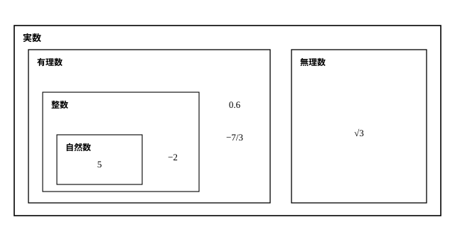
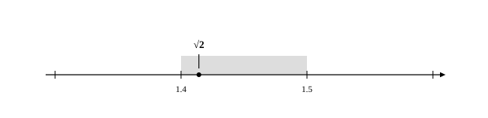

# L05 実数の体系——既習の数を1枚の地図にまとめる

- unit_id: hs-math-i-numbers-and-expressions
- 位置づけ: 単元第5レッスン（1.5時間）。ここから3レッスン（L05〜L07）は「数」の側を扱う。中学までに広げてきた数の全体を「実数」という1枚の地図にまとめ、分数が有限小数・循環小数で表される仕組みを調べる回。L06の根号計算・L07の有理化の土台になる。
- distribution_status: published_draft
- license: CC-BY-4.0
- verify_required: 例題数値・記述は監修者検証必須。
- 主概念: ①実数の体系（既習の数の地図化・四則で閉じている・数直線と1対1） ②分数が有限小数・循環小数で表される仕組み

---

## 1. 数の世界はこうして広がってきた

L01〜L04では式の側（展開と因数分解）を扱った。ここからは数の側に入る。といっても、新しい数を1つずつ覚える回ではない——登場する数はすべて、中学までに出会ったものだ。このレッスンの仕事は、それらを1枚の地図に整理し直すことにある。

数の世界の広がりをふり返っておこう。

- 小学校まで: ものを数える数 1, 2, 3, …（自然数）と、0・分数・小数。
- 中1: 負の数を導入し、整数（…, −2, −1, 0, 1, 2, …）と、その間を埋める負の分数・小数まで広がった。
- 中3: 平方根を学び、√2 のように分数で表せない数に出会った。分数で表せる数を有理数、表せない数を無理数と呼ぶことも、ここで学んだ。

言葉が4つ並んだ——自然数・整数・有理数・無理数。どちらが「有理」でどちらが「無理」か迷ったら、「分数（整数の比）で表す理（すじみち）が有る数・無い数」と名前ごと覚えてしまうとよい。これは記憶用の語呂で、語の由来の説明ではない。そして、この4つの言葉どうしの関係（どれがどれの仲間か）は、§3で1枚の地図にまとめて確かめる。

有理数の意味を確かめておく。整数 m と 0 でない整数 n を使って m/n の形（分数の形）に表せる数が有理数である。5=5/1、−0.3=−3/10 のように、整数も、有限の桁で書ける小数も分数の形に直せるから有理数だ。

では、有理数と無理数の境界線はどこに引かれているのか。次の節で「分数を小数で表すとどうなるか」を調べると、それがはっきり見えてくる。

## 2. 分数と小数——割り算の余りが仕組みを語る

分数を小数に直すには、分子を分母で割ればよい。やってみると、結果は2種類に分かれる。

**例題1** 次の分数を小数で表せ。
(1) 3/8  (2) 5/11

(1) 3÷8=0.375。割り切れて、小数第3位で終わった。
(2) 5÷11 を筆算すると、50÷11=4 余り 6、60÷11=5 余り 5、また 50÷11=4 余り 6、……と同じ計算が続く。5/11=0.4545… となって、45 という並びが限りなく繰り返される。

(1)のように、ある位で終わる小数を**有限小数**という。(2)のように、ある位から先で同じ数字の並びが限りなく繰り返される小数を**循環小数**という。繰り返される部分（45 の部分）は**循環節**と呼ばれる。繰り返しが小数点のすぐ後から始まるとは限らない——たとえば 1/6=0.1666… は、小数第2位から 6 の繰り返しが始まる循環小数である。

なぜこの2種類しか出てこないのか。仕組みは割り算の余りにある。

- **割り切れる場合**。分母の素因数が 2 と 5 だけなら、分母と分子に同じ数を掛けて、分母を 10・100・1000 …にできる（10=2×5 だから、2 と 5 は 10 の累乗の材料になれる——素因数のうち特別なのはこの2つだけだ）。3/8 なら、分母 8=2×2×2 に 125 を掛けて 3/8=375/1000=0.375。だから有限小数になる。なお、分母で判定する前に約分を済ませておくこと。たとえば 21/35 は分母に 7 があるが、約分すると 3/5——分母の素因数は 5 だけになり、有限小数 0.6 である。
- **割り切れない場合**。11 で割る割り算の余りは 0〜10 の 11 種類しかない。余りが 0 になれば割り切れて終わり。0 にならないなら、余りの候補は 1〜10 の高々 10 種類だから、割り算を続けていけば、いつか必ず前に出た余りがもう一度現れる。同じ余りからは同じ計算が続くので、商の数字も同じ並びを繰り返す——循環小数になる。

つまり、**分数（有理数）を小数で表すと、必ず有限小数か循環小数のどちらかになる**。逆に、有限小数は分母が 10 の累乗の分数に直せるし、循環小数も分数に直せる（その方法は stretch で体験する）。この行き来をまとめると、大事な結論が1つ出る。

**小数で書いたとき、繰り返しなく限りなく続く数は、分数では表せない——それが無理数である**。

:::guide
**「いつか必ず同じ余りが出る」と、なぜ言い切れるのか**

引き出しが 10 個しかないところに 11 枚のカードをしまえば、どれかの引き出しには必ず 2 枚以上入る。割り算の余りも同じだ——引き出しにあたるのが余りの値（1〜10 の 10 個）、しまうカードにあたるのが筆算の1段ごとの割り算である。11 で割るとき割り切れないなら、余りの置き場は 1〜10 の 10 個しかないのに、割り算は限りなく続く。だから遅くとも 11 段目までに、どれかの余りが 2 回目の登場を果たす。そして筆算の各段は「余りを 10 倍して割る」だけで決まるから、同じ余りが出た瞬間から先は、前と完全に同じ計算がなぞられる。この理屈にはおまけが付く——循環節の長さの上限が分母だけでわかるのだ。たとえば 7 で割るなら余りの候補は 1〜6 の 6 種類だから、循環節はどんなに長くても 6 桁。実際 1/7=0.142857142857… で、ちょうど 6 桁の循環節を持つ。仕組みを押さえるとは、計算する前に「繰り返しはこの長さまでに必ず現れる」と予言できるようになることだ。
:::

<!-- 本文昇格話題源: RESEARCH_BRIEF_20260829 zatsudan許可リストZ10（分数はなぜ有限小数か循環小数になるのか——S1 高等学校学習指導要領解説 数学編（平成30年告示）内容の取扱い(2)の必須規定。本文昇格はブリーフ§11・NE_CONTENT_MAP §2 L05行の明示指定どおり）。具体例の数値（3/8・5/11・1/7等）は執筆時自作 -->

## 3. 実数——1枚の地図にまとめる

有理数と無理数を合わせた数の全体を**実数**という。これまでに出会った数は、すべて実数の地図の上に載る。

**例題2** 次の6つの数について、自然数・整数・有理数・無理数のうち、あてはまる仲間をすべて答えよ。
5, −2, 0.6, −7/3, √3, √9

まず、根号が外せるものがないかを確かめる。√9 は 9=3² だから √9=3——見た目に根号があっても、正体は自然数だ。一方 √3 は、3 がどの整数の2乗でもないから根号が外せない。

- 5 …… 自然数・整数・有理数
- −2 …… 整数・有理数
- 0.6 …… 有理数（0.6=6/10=3/5）
- −7/3 …… 有理数
- √3 …… 無理数
- √9 …… 自然数・整数・有理数（√9=3）

地図の入れ子に注意しよう。自然数は整数の仲間でもあり、整数は有理数の仲間でもある。だから 5 の答えは3つ並ぶ。そして、どの実数も「有理数か無理数のどちらか一方」に必ず入る。

この地図のよさは、計算が地図の外へはみ出さないことにある。ある範囲の2つの数について計算した結果が、いつでも同じ範囲に収まるとき、その範囲で計算が**閉じている**という（除法では 0 で割る場合を除く。以下同じ）。

| 数の範囲 | 加法 | 減法 | 乗法 | 除法 |
|---|---|---|---|---|
| 自然数 | ○ | ×（例: 3−5=−2） | ○ | ×（例: 2÷3=2/3） |
| 整数 | ○ | ○ | ○ | ×（例: 2÷3=2/3） |
| 有理数 | ○ | ○ | ○ | ○ |
| 実数 | ○ | ○ | ○ | ○ |

この表は、中1で調べた「数の範囲と計算の可能性」の拡大版だ。引き算がいつでもできるように整数へ、割り算がいつでもできるように有理数へと、数の世界は「閉じていない計算」を閉じさせる方向に広がってきた。ただし、有理数から実数への拡張だけは動機が違う。表のとおり、有理数の段ですでに四則は閉じている。それでも広げたのは、√2 のように、長さとしては確かに存在するのに有理数の地図に載らない数を、数の仲間に入れるためだ。そして実数まで広げても、四則で閉じたまま——地図は破綻なく完成する。

:::guide
**√2＋1 は「計算が終わっていない式」ではなく、1つの数**

√2＋1 を見て「まだ足し算が残っている。答えはどう書けばいいの？」と感じる人は多い。その感覚の根っこには、「数とは 5 や 0.6 のように書き切れるもの」という思い込みがある。√2 は小数で書こうとすると 1.4142…と限りなく続いて書き切れない。だから、√2 という記号のままにしておくのが、この数のいちばん正確な書き表し方だ。√2＋1 も同じで、これ以上簡単には表せない、数直線上の1点を指す立派な1つの数である。文字式で a＋1 をそれ以上まとめずにそのまま扱ってきたのと、同じ呼吸だと思えばいい。この見方は、次のL06で根号の計算を進めるときの土台になる——√2＋1 のような数どうしの計算は、それぞれを「1つの数」とみなせて初めて安心して実行できる。
:::

## 4. 実数と数直線——1対1に対応する

実数の地図には、もう1枚の顔がある。数直線だ。

**どの実数にも数直線上の点がちょうど1つ対応し、逆に、数直線上のどの点にも、それが表す実数がちょうど1つ対応する**。この関係を、実数と数直線上の点が1対1に対応するという。

無理数も例外ではない。√2 の場所を確かめよう。中3でやったように、2乗して比べる。正の数どうしでは、2乗の大小と数の大小の向きが一致するから、

- 1.4²=1.96、1.5²=2.25 で、1.96<2<2.25 だから 1.4<√2<1.5
- 1.41²=1.9881、1.42²=2.0164 で、1.9881<2<2.0164 だから 1.41<√2<1.42

と、√2 の居場所は数直線の上でいくらでも狭く挟み込める。√2 は「どこかふわふわした数」ではなく、数直線上の決まった1点なのである。

**例題3** √5 は、数直線上で 2.2 と 2.3 の間にあることを説明せよ。

2.2²=4.84、2.3²=5.29 だから、4.84<5<5.29。正の数では2乗の大小と数の大小の向きが一致するので、2.2<√5<2.3。よって √5 は数直線上で 2.2 と 2.3 の間にある。

検算: 挟めているかどうかは、2乗の値がもとの数（ここでは 5）を確かに挟んでいるかで確かめられる。4.84<5 ✓、5<5.29 ✓。この「2乗して挟む」は、根号つきの数と小数・分数の大小比較にそのまま使える型だ。

:::guide
**有理数だけでは、数直線に「すき間」がある**

有理数は、数直線の上にすき間なく並んでいるように見える。実際、異なるどの2つの有理数の間にも、その平均を取れば別の有理数が必ずあるから、有理数の点はいくらでも細かく打てる。ところが、それほどびっしり並んでいても、√2 の場所には有理数がいない——√2 が分数で表せないことが知られているからだ（このことをきちんと証明するには、のちの「集合と命題」の単元で学ぶ論じ方が要る。ここでは事実として受け取っておこう）。つまり、有理数だけの地図では、数直線に見えないすき間が残っている。無理数を加えて実数まで広げたとき、はじめて数直線のすべての点に名前が付く。「実数と数直線上の点が1対1に対応する」という一文は、その完成宣言なのだ。
:::

:::zatsudan
身近なところにも、無理数は隠れている。コピー用紙を1枚用意して、長い辺で半分に折ってみてほしい。半分になった紙は、もとの紙と同じ形——短い辺と長い辺の比が同じ——になるように作られている。この「半分にしても形が変わらない」を式にしてみよう。短い辺を 1、長い辺を x とすると、半分に折った紙の短い辺は x/2、長い辺は 1。形が同じだから、比の等式 1:x=(x/2):1 が成り立つ。比の性質（外側の項の積=内側の項の積）から 1×1=x×(x/2)、つまり x²=2。長さは正だから x=√2 である。コピー用紙は、縦横比が 1:√2 になるように設計されている（実物の寸法はミリ単位に丸められている）——教室の机の上に、この単元の主役が最初から置かれていたわけだ。気になったら実物の2辺を測って、長い辺÷短い辺が 1.41 くらいになるか確かめてみよう。
:::
<!-- zatsudan話題源: RESEARCH_BRIEF_20260829 zatsudan許可リストZ2（S1 高等学校学習指導要領解説 数学編（平成30年告示）課題学習〈数と式〉: コピー用の用紙の横と縦の長さの比を「生徒の身近にある無理数」として探究——本文確認）。1:√2の値はS1に明示なし→比の等式からの計算で導出（NE_CONTENT_MAP §2 L05行の指示どおり）。この比の通称（S1で0件実測の教材慣用語）は不使用——語の特定と経緯は notes/lesson_05_notes.md §4 に記録。割付=NE_CONTENT_MAP_20260829 §2 L05行（Z2→L05・重複なし） -->

## 5. 練習

**問1** 次の8つの数について、自然数・整数・有理数・無理数のうち、あてはまるものをすべて答えよ。
6, −3, 0, 0.7, −5/2, √10, √36, −√4

**問2** 次の各文は正しいか。正しければ○を、正しくなければ×を答え、×の場合は理由を1〜2文で説明せよ。
(1) 限りなく続く小数で表される数は、すべて無理数である。
(2) 整数は、どれも有理数である。
(3) 2つの無理数の和は、いつも無理数である。

**問3** 次の分数を小数で表せ。また、(1)は割り切れる理由を分母の素因数に注目して、(2)は同じ数字の並びが限りなく繰り返される理由を割り算の余りに注目して、それぞれ説明せよ。
(1) 9/40  (2) 8/33

**問4** 次の問いに答えよ。
(1) √7 は、数直線上で 2.6 と 2.7 の間にあることを、2乗の値を比べて説明せよ。
(2) 次の5つの数を、小さい方から順に並べよ。
−√2, −1.3, 0, 5/3, √3

---

:::stretch
**S1** 循環小数は、次の手順で分数に直せる。x=0.444… とおくと、10x=4.444…。ここで 10x−x を計算すると、小数点から下の 444… の部分がそろって消え、9x=4 となる。
(1) この手順で、0.444… を分数で表せ。
(2) 0.7272…（72 が限りなく繰り返される循環小数）を分数で表せ。繰り返しの頭がそろうように、10x のかわりに何倍を使えばよいかを考えること。
(3) 同じ手順を 0.999… に使うと、どんな数になるか。計算で求め、その結果からわかることを1〜2文で述べよ。
:::

<!-- gen_nav:nav:start（自動生成・手編集しない） -->

---

[← 前のレッスン](lesson_04.md)｜[単元の目次](README.md)｜[解答](answer_key_L05-07.md)｜[次のレッスン →](lesson_06.md)

<!-- gen_nav:nav:end -->
