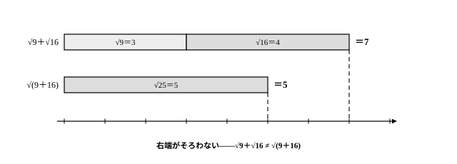

# L06 根号の計算——乗法公式と結びつける

- unit_id: hs-math-i-numbers-and-expressions
- 位置づけ: 単元第6レッスン（1.5時間）。実数サブ単元（L05〜L07）の2本目。L05で「実数」の地図に載せた√のついた数の計算を中3から確かめ直し、L01〜L02の乗法公式を√の計算に持ち込む。
- distribution_status: published_draft
- license: CC-BY-4.0
- verify_required: 例題数値・記述は監修者検証必須。
- 主概念: ①根号計算と乗法公式の結合（L01〜L02の公式の再利用） ②√の加法の誤りの反例検証

---

## 1. 中3の根号計算を確かめ直す——√2×√3 は √6 になるか

L05では、これまでに学んだ数の全体を「実数」という1枚の地図にまとめた。√2 のような数も、分数では表せないことが知られている数（無理数）として、数直線上の1点をきちんと占める1つの数である。このレッスンでは、その√のついた数の**計算**を確かめ直し、L01〜L02で磨いた乗法公式と結びつける。

まず√の約束から。正の数 a に対して、**2乗すると a になる正の数**を √a と書くのだった（中3既習）。2乗すると a になる数——a の平方根——は √a と −√a の2つあるが、記号 √a はそのうち正のほうだけを指す約束である。だから

(√a)² = a

である。たとえば (√2)²=2、(√5)²=5。また、積については次の規則を中3で学んだ（a, b は正の数）。

√a×√b = √(ab)

本当にそうだったか、中3でも試した「予想→確認」を電卓でもう一度やってみよう。√キーを押すと √2=1.4142135…、√3=1.7320508… と表示される。小数では書ききれない数どうしの掛け算が、√6 という1つのすっきりした形になるのだろうか。電卓に √2×√3 をそのまま計算させると 2.4494897…。続けて √6 を出すと、こちらも 2.4494897…——ぴたりと重なる。

もちろん、電卓の表示が重なることは証明ではない（表示された桁までの確認にすぎない）。規則そのものの根拠は、√の約束に戻ればよい。√a×√b は正の数で、2乗すると (√a)²×(√b)²=ab になる。「2乗すると ab になる正の数」は √(ab) のことだから、両者は同じ数である。**近似値は確かめの道具、等式の根拠は計算規則**——この使い分けは、このレッスン全体の検算の型になる。

<!-- 本文昇格Z6話題源: RESEARCH_BRIEF_20260829 zatsudan許可リストZ6（S2 中学校学習指導要領解説（平成29年）: √2×√3=√6を電卓で「予想→確認」する指導活動 本文確認）。NE_CONTENT_MAP_20260829 §2 L06行の指定により導入活動へ昇格（ブリーフ明示許可）。表示した小数は真値の切り捨て桁（notes/lesson_06_notes.md §1で照合済み） -->

## 2. 加法・減法——中の数が同じ√だけをまとめる

√のついた数の足し引きは、同類項の整理（L01）と同じ要領でできる。たとえば

2√2＋3√2 = (2＋3)√2 = 5√2

これは分配法則そのものだ——√2 という1つの数が2個分と3個分で、合わせて5個分。一方、√2＋√3 のように、中の数をこれ以上簡単にできない形にしたうえで**中の数が違う**√どうしは、これ以上まとめられない。√2＋√3 や 1＋√2 は、そのままの形が完成した答えである（まとめたつもりで √5 と書いてはいけない——§4で確かめる）。

見た目が違っても、√の中を簡単にすると仲間だったと分かる場合がある。√18=√(9×2)=3√2 のように、中の数から2乗の因数をくくり出すのが先である。

**例題1** 次の式を計算せよ。
(1) 3√2＋5√2−4√2  (2) √12＋√27  (3) √50−√32＋√8

(1) (3＋5−4)√2=4√2。
(2) まず中を簡単にする。√12=√(4×3)=2√3、√27=√(9×3)=3√3。よって 2√3＋3√3=5√3。
(3) √50=5√2、√32=4√2、√8=2√2。よって (5−4＋2)√2=3√2。

検算は電卓（近似値）で。(2) なら、左辺 √12＋√27 を電卓で計算すると 8.6602540…、右辺 5√3 も 8.6602540… で重なる。√の式変形は見た目が大きく変わるぶん、この「両辺を数として突き合わせる」確かめがよく効く。

:::guide
**√2 は文字ではないのに、「同類項」の型が使えるのはなぜ？**

2√2＋3√2=(2＋3)√2 の根拠は、L01の同類項の整理と同じ分配法則だ。ただし理屈の向きに注意したい。「x でできたから √2 でもできる」のではない。分配法則はもともと**どんな数についても**成り立つ計算の約束で、√2 は（小数で書ききれないだけで）1つの決まった数だから、最初からこの約束の適用範囲に入っている。文字の計算のほうが、「どんな数を入れても成り立つ」計算の代表選手だったのだ。逆に √2＋√3 がまとめられないのは、2x＋3y をまとめられないのと同じ構図で、共通のまとまりがない。√どうしだから仲間とは限らず、√8 のように一見別物が 2√2 に直すと仲間だったりもする。手順の先頭に「まず中を簡単にする」が来るのは、この仲間の判定を間違えないためである。
:::

:::zatsudan
円周率πのことを思い出してほしい。πは、小数で書き表そうとすると限りなく続いて、書ききることができない。それでも私たちは、この数に「π」という1文字の名前を与えたおかげで、円周の長さや円の面積を正確に扱えるようになった。√2 のような√のついた数の書き表し方も、まったく同じ発明である。「2乗すると2になる正の数」は小数では書ききれないが、「√2」と書いてしまえば、規則に従って正確に計算できる。そして √2＋1 のような和も、これ以上簡単には表せない、それで完成した1つの数だ——文字式の a＋1 をひとかたまりとして扱えるのと同じ見方である。書ききれない数に記号を与えて、計算の世界に迎え入れる。πで一度やったことを、√でもう一度やっている——そう思うと、√の計算の「答えの形」への見方が少し変わってこないだろうか。
:::
<!-- zatsudan話題源: RESEARCH_BRIEF_20260829 zatsudan許可リストZ9（S2 中学校学習指導要領解説（平成29年）: πとの類比明文・√2＋1を「これ以上簡単には表せない一つの数」〔文字式のa＋1と同様の見方〕とみる記述 本文確認）。出典の確認範囲内の記述のみ使用（πの数値・無理数性の断定は書いていない）。割付=NE_CONTENT_MAP_20260829 §2 L06行（Z9→L06・重複なし） -->

## 3. 乗法公式を√の計算に使う——公式の文字は入れ物

掛け算には、分配法則と乗法公式がそのまま使える。L01〜L02で使った公式のうち、このレッスンで使う4つを再掲する。

| 公式 | 展開した形 |
|---|---|
| (a＋b)² | a²＋2ab＋b² |
| (a−b)² | a²−2ab＋b² |
| (a＋b)(a−b) | a²−b² |
| (x＋a)(x＋b) | x²＋(a＋b)x＋ab |

公式の文字 a や b は「入れ物」であり、どんな数を入れても成り立つ。√3 や √2 も1つの数だから、入れる資格は同じだ。入れたあとは (√a)²=a と √a×√b=√(ab) で整理すればよい。

**例題2** 次の式を計算せよ。
(1) (√3＋√2)(√3−√2)  (2) (√5＋√2)²  (3) (√7＋2)(√7−3)

(1) 和と差の積の公式で、(√3)²−(√2)²=3−2=1。
(2) (√5)²＋2×√5×√2＋(√2)²=5＋2√10＋2=7＋2√10（√5×√2=√10）。
(3) (x＋a)(x＋b) の公式の x の位置に √7 を入れて、(√7)²＋(2−3)√7＋2×(−3)=7−√7−6=1−√7。

検算には、公式を使わず分配法則で開き直す「別経路」の確かめが向いている。(1) なら (√3＋√2)(√3−√2)=3−√6＋√6−2=1——途中に現れた √6 が消えて、同じ答えに着地する。公式の当てはめに不安が残るときは、この開き直しを習慣にしよう。

(1) の答えにも注目してほしい。√を含む数どうしの積が、ただの整数 1 になった。「和と差の積」は√を消す力を持っている——この力は、次のL07で、分母に√を含む数を扱いやすい形に直すときの主役になる。

:::guide
**「√の式の計算規則」を新しく覚えた……わけではない**

このレッスンに、新しい公式は1つも出ていない。使ったのは、分配法則、乗法公式（L01〜L02）、そして (√a)²=a と √a×√b=√(ab)（中3）だけだ。乗法公式は分配法則から導いた恒等式——文字にどんな数を入れても成り立つ等式——だから、入れるものが整数から √2 に替わっても、公式の側は何も変わらない。変わるのは後始末だけである。(√a)²=a で2乗を外し、√の中から2乗の因数をくくり出し、中の数が同じ√どうしをまとめる。「展開は公式まかせ、整理は√の既習規則」という2段構えが見えていれば、複雑そうに見える式でも手が止まらない。L05で√のついた数を「実数」の地図に載せたことには、こういうご利益がある——地図に載った数は、地図の上で通用する計算の約束を、その約束に付いている条件（0で割らない、など）ごと、ぜんぶそのまま使ってよいのだ。
:::

## 4. 和の√は分けられない——反例を1つ挙げればよい

積では √a×√b=√(ab) が成り立った。では和ではどうか。

√a＋√b = √(a＋b) ……これは正しいだろうか。

**例題3** √a＋√b=√(a＋b) がどんな正の数 a, b でも成り立つとはいえないことを、成り立たない例を1つ挙げて示せ。

a=9, b=16 で試す。左辺は √9＋√16=3＋4=7。右辺は √(9＋16)=√25=5。7≠5 だから、この式は a=9, b=16 では成り立たない。よって「どんな a, b でも成り立つ」とはいえない。

このように、「いつでも成り立つ」という主張をくつがえすには、**成り立たない例（反例）を1つ**示せば十分である。すべての a, b を調べる必要はない。1つの反例が主張全体を倒す——この議論の作法は中3の平方根でも触れたもので、後の「集合と命題」の単元であらためて主役になる。

√の中が 9 や 16 のような2乗の数でなくても、電卓の近似値で確かめられる。√2＋√3=3.1462643… に対して、√(2＋3)=√5=2.2360679…——大きくずれている。和の√は、√の和にはならない。

:::guide
**積は分けられて、和は分けられない——この差はどこから来る？**

√(ab)=√a×√b と √(a＋b)≠√a＋√b。似た形なのに運命が分かれる理由は、「2乗」との相性にある。√a×√b を2乗すると (√a)²×(√b)²=ab——2乗は掛け算ときれいに役割分担するから、√(ab) と同じ数になる（§1で確かめたとおり）。ところが √a＋√b を2乗すると、a と b のほかに**余分な項**が必ず現れる。L01の「(a＋b)² を a²＋b² としたくなったら」の説明で、(a＋b)² には a² と b² のほかに「すき間」の 2ab が現れた——あれと同じ構図が、ここにも隠れている。どんな項が現れ、その結果 √a＋√b と √(a＋b) のどちらが大きいと言えるのか。それを自分の手で確かめる仕事は、stretch の S1 に残しておく。なお、(a＋b)² を a²＋b² としたくなる誤りと、√(a＋b) を √a＋√b としたくなる誤りは、「形が似ていれば分けられるはず」という同じ期待から来ている。形の類推が通用するかどうかは、いつも計算規則に戻って確かめる——通用しないことなら反例1つで確かめられるのだから、安い手間である（通用すると言い切るには、§1のように計算規則そのものから根拠を出す）。
:::

<!-- 本文昇格Z7話題源: RESEARCH_BRIEF_20260829 zatsudan許可リストZ7（S2 中学校学習指導要領解説（平成29年）: √a＋√b＝√(a＋b)が成り立たないことを反例で示す指導 本文確認）。NE_CONTENT_MAP_20260829 §2 L06行の指定により本文（§4・例題3）へ昇格（ブリーフ明示許可）。sets-and-logicへの言及は予告1文のみ（NE_CONTENT_MAP §5の境界準拠・命題・真偽の用語体系は導入していない） -->

## 5. 練習

**問1** 次の式を計算せよ。
(1) 2√3＋7√3−4√3  (2) √18＋√32

**問2** √48−√75＋√12 を計算せよ。

**問3** 次の式を計算せよ。
(1) (√7＋√5)(√7−√5)  (2) (√6−√2)²

**問4** (√5＋3)(√5−2) を計算せよ。

**問5** 「a が b より大きい正の数ならば、いつでも √a−√b=√(a−b) が成り立つ」という主張は正しいか。正しくない場合は、反例を1つ挙げて説明せよ。

---

:::stretch
**S1** a, b はどちらも正の数とする。
(1) (√a＋√b)² を展開し、a＋b との大小を比べよ。
(2) (1) の結果を使って、√a＋√b と √(a＋b) の大小を答えよ。（正の数どうしでは、2乗して大きいほうが、もとの数も大きい。）
:::

<!-- gen_nav:nav:start（自動生成・手編集しない） -->

---

[← 前のレッスン](lesson_05.md)｜[単元の目次](README.md)｜[解答](answer_key_L05-07.md)｜[次のレッスン →](lesson_07.md)

<!-- gen_nav:nav:end -->
