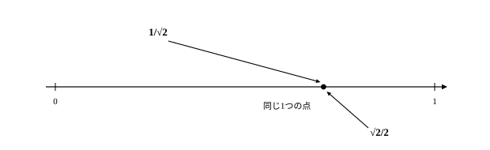
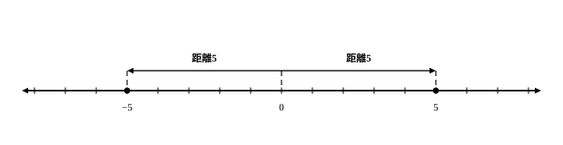

# L07 分母の有理化と絶対値——数直線で見る

- unit_id: hs-math-i-numbers-and-expressions
- 位置づけ: 単元第7レッスン（2時間）。実数サブ単元（L05〜L07）の締めくくり——L06の根号計算を割り算（分母の有理化）まで広げ、中1既習の絶対値を数直線上の距離として整え直して、数直線で範囲を読むL08への橋を架ける。
- distribution_status: published_draft
- license: CC-BY-4.0
- verify_required: 例題数値・記述は監修者検証必須。
- 主概念: ①分母の有理化（手続きと目的をセットで・二項の分母まで） ②絶対値＝数直線上の距離（|x|=c の基本形まで）

---

## 1. 分母に√が残ると、何が困るか

L06で、根号を含む式の足し算・引き算・掛け算はできるようになった。残るのは割り算だ。たとえば 1 を √2 で割った答えは、分数の形で 1/√2 と書ける。計算としてはこれで終わりに見える。ところが、この数のおよその大きさを知ろうとすると、急に手が重くなる。

中3で確かめたように 1.4<√2<1.5 である。1/√2 の値を知るには、1÷1.4… という割り算を筆算ですることになる。だが、同じ数は別の形にも書ける。分子と分母の両方に √2 を掛けると

1/√2 = √2/(√2×√2) = √2/2

√2/2 なら、√2 のおよその値を半分にするだけだ。1.4<√2<1.5 の各辺を半分にして 0.7<√2/2<0.75——「およそ0.7」が暗算で出る。**値は同じなのに、式の形しだいで計算の労力が変わる**。分母から根号をなくすこの整え方が、今回の前半の主役である。

## 2. 分母の有理化——一項の分母

分母に根号を含む分数を、分母に根号を含まない形に直すことを、**分母を有理化する**という。分母を √2 のような無理数から 2 のような有理数に変えるので、この名前がある——L05の言葉の再登場だ。§1でやったこと——分子と分母の両方に同じ数を掛ける——が、そのまま手順になる。√2/√2=1 を掛けているだけだから、値は変わらない。

**例題1** 次の分数の分母を有理化せよ。
(1) 1/√3  (2) 6/√2

(1) 分子と分母に √3 を掛ける。1/√3=√3/(√3×√3)=√3/3
(2) 分子と分母に √2 を掛ける。6/√2=6√2/2=3√2。約分できるところまで整えるのを忘れない。

有理化の検算は、**答えに元の分母を掛けて、元の分子に戻るか**を見る。(1) は √3/3 に √3 を掛けると 3/3=1 で元の分子 1 に戻る。(2) は 3√2×√2=3×2=6 で元の分子 6 に戻る。この「逆に掛けて戻す」検算は、L03で使った「因数分解の検算は展開」と同じ発想だ。

:::guide
**なぜ「分母」を整えるのか——分子の√はそのままでよいのか**

有理化の目的は、√を式から追放することではない。√2/2 の分子には √2 が堂々と残っている。整えたいのは「何で割るか」の側だ。割る数が 2 のような有理数になれば、値の見積りは「√2 のおよその値を思い出して割るだけ」になる。2つの数の大小比較や、分母をそろえる通分でも、形がそろって見通しがよくなることが多い。逆に言えば、分母に√が残っていても数として間違いではない——1/√2 と √2/2 は数直線上の同じ点である。有理化は「誤った答えの修正」ではなく「使いやすい形への整理整頓」だと捉えておくと、この後の二項の分母でも目的を見失わない。
:::

:::zatsudan
√2 の値を、電卓の√キーを押す前に自分で追いつめてみよう。1.4²=1.96、1.5²=2.25 だから、2 はこの間にあり、1.4<√2<1.5。次に幅を1桁縮める。1.41²=1.9881、1.42²=2.0164 だから 1.41<√2<1.42。もう1桁——1.414²=1.999396、1.415²=2.002225 だから 1.414<√2<1.415。この「2乗して挟み込む」やり方は中3で√2の近似値を求めたときのもので、原理的には何桁でも続けられる。電卓の√キーが一瞬で返す 1.414… は、この地道な挟み込みの先にある値だ。そして今回の主役 √2/2 は、その半分——0.707…——だとすぐ見積もれる。分母に√が残った 1/√2 の形からは、この「半分にするだけ」の近道は見えてこない。
:::
<!-- zatsudan話題源: RESEARCH_BRIEF_20260829 zatsudan許可リストZ8（S2 中学校学習指導要領解説（平成29年）: 1.4＜√2＜1.5の挟み込み近似・√キー電卓 本文確認）。出典の確認範囲内の話題のみ使用・追加の桁は本文内の2乗計算（整数演算・notes検算済み）で導出。割付=NE_CONTENT_MAP_20260829 §2 L07行（Z8→L07・重複なし） -->

## 3. 二項の分母——和と差の積を使う

分母が √5＋√2 のような2項の和や差のときは、√5 だけを掛けてもうまくいかない（√2 の項に根号が残る）。ここで効くのが、L06でも使った乗法公式

(√a＋√b)(√a−√b) = (√a)²−(√b)² = a−b

だ。掛けると2乗だけが残るので、根号が一度に消える。分母が「和」なら「差」を、「差」なら「和」を——**符号だけ変えた相方**（√5＋√2 なら √5−√2、√3−1 なら √3＋1）を分子と分母に掛ければよい。

**例題2** 次の分数の分母を有理化せよ。
(1) 1/(√5＋√2)  (2) √3/(√3−1)

(1) 分子と分母に √5−√2 を掛ける。
1/(√5＋√2)=(√5−√2)/((√5＋√2)(√5−√2))=(√5−√2)/(5−2)=(√5−√2)/3
(2) 分子と分母に √3＋1 を掛ける。
√3/(√3−1)=√3(√3＋1)/((√3−1)(√3＋1))=(3＋√3)/(3−1)=(3＋√3)/2

検算: (1) 答えに元の分母を掛ける。(√5−√2)/3×(√5＋√2)=(5−2)/3=1 で元の分子に戻る。(2) (3＋√3)/2×(√3−1)=(3√3−3＋3−√3)/2=2√3/2=√3 で元の分子に戻る。

:::guide
**「符号だけ変えた相方」でなければならない理由**

分母の√を消したいだけなら、同じ √5＋√2 をもう1回掛けてもよさそうに見える。やってみると (√5＋√2)²=5＋2√10＋2=7＋2√10——交差項 2√10 に根号が残って失敗する。2つの√を同時に消せるのは、交差項どうしが打ち消し合う「和と差の積」の形だけだ。つまり相方選びは新しい暗記事項ではなく、「どの乗法公式なら√の項が消えるか」からの逆算である。分母が √3−1 のように「√と整数の差」でも理屈は同じで、相方は √3＋1。掛けた後の分母を (√3)²−1²=2 まで書き切ってから約分する習慣にすると、符号の取り違えにその場で気づける。
:::

## 4. 絶対値——数直線上の距離

後半は、数直線でものを見るもう1つの道具を整える。絶対値という言葉は中1で学んだ——数直線上で、原点からその数までの距離のことだった。ここからは、これを記号

|a|

で書き表す。|3|=3、|−3|=3、|0|=0。距離だから、絶対値は必ず0以上の数になる。

**例題3** 次の問いに答えよ。
(1) |−7| を求めよ。  (2) |√5−3| を求めよ。  (3) |x|=5 を満たす x をすべて求めよ。

(1) −7 と原点の距離は 7。よって |−7|=7。
(2) まず中身の √5−3 が正か負かを判定する。5<9 だから √5<3（正の数どうしは、2乗の大小がそのまま元の大小になる）。よって √5−3 は負の数であり、原点からの距離は符号を反転した 3−√5。すなわち |√5−3|=3−√5。
(3) 原点からの距離が5の数は、右に5進んだ 5 と、左に5進んだ −5 の2つ。よって x=5 と x=−5。

:::guide
**「マイナスを外す」という要約の限界**

|−3|=3 のような例だけを見ていると、「絶対値とはマイナス記号を外すこと」と要約したくなる。この要約は、|√5−3| のようにマイナス記号が先頭に見えない式に出会った瞬間に効かなくなる。頼れるのは距離の定義だ。手順はいつも同じ2歩——①中身が正か負か（あるいは0か）を判定する。②正か0ならそのまま、負なら符号を反転したものが答えになる。①の判定材料は、根号を含む数なら2乗の比較で足りる（5<9 だから √5<3）。また、|x|=5 の答えが2つあることも、距離で見れば当たり前になる——原点から距離5の点は、左右に1つずつあるからだ。この「数直線の上で目で確かめる」見方は、次のL08で不等式の解を数直線上の範囲として読むときの下地になる。
:::

## 5. 練習

**問1** 次の分数の分母を有理化せよ。
(1) 1/√7  (2) 10/√5

**問2** 次の分数の分母を有理化せよ。
(1) 3/(2√3)  (2) √5/√2

**問3** 次の分数の分母を有理化せよ。
(1) 1/(√7＋√5)  (2) 1/(√6−√2)

**問4** 次の分数の分母を有理化せよ。
(1) 4/(√5−1)  (2) (√3＋√2)/(√3−√2)

**問5** 次の問いに答えよ。
(1) |−6|＋|4−9| を求めよ。  (2) |2−√6| を求めよ。  (3) |x|=8 を満たす x をすべて求めよ。

---

:::stretch
**S1** 1/(√2＋1) の値のおよその大きさを、次の手順で見積もる。
(1) 分母を有理化せよ。
(2) 1.41²=1.9881、1.42²=2.0164 であることを用いて 1.41<√2<1.42 が成り立つ理由を一言で述べ、1/(√2＋1) の値がどの範囲にあるかを小数で答えよ。
(3) 有理化せずに 1/(√2＋1) を直接見積もろうとすると、どんな計算が必要になるか。有理化した場合と比べて、2〜3文で説明せよ。
:::

<!-- gen_nav:nav:start（自動生成・手編集しない） -->

---

[← 前のレッスン](lesson_06.md)｜[単元の目次](README.md)｜[解答](answer_key_L05-07.md)｜[次のレッスン →](lesson_08.md)

<!-- gen_nav:nav:end -->
