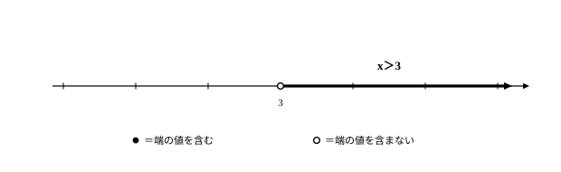
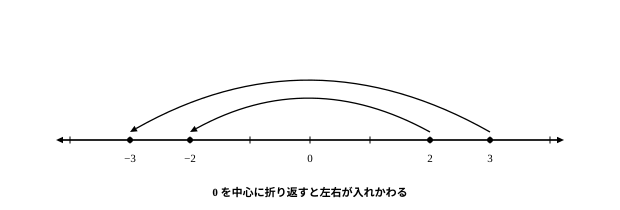

# L08 不等式とその解——「解く」は高校の新しい技

- unit_id: hs-math-i-numbers-and-expressions
- 位置づけ: 単元第8レッスン（2時間）。一次不等式サブ単元（L08〜L10）の初回。中1で「表す」まで学んだ不等式を、高校で初めて「解く」。解の意味を先に固め、性質①〜④を根拠に解く型を作って、L09・L10の土台にする。
- distribution_status: published_draft
- license: CC-BY-4.0
- verify_required: 例題数値・記述は監修者検証必須。
- 主概念: ①不等式の解の意味（条件を満たすxの値の全部の集まり＝数直線上の範囲） ②不等式の性質①〜④と一次不等式の解法（一次方程式との対比）

---

## 0. 本編の前に——中学から持ってくる2つの道具

このレッスンの主役は「不等式を**解く**」という、高校で初めて取り組む技だ。ただし材料は新品ではない。中学から持ってくる道具を2つ、先に別々に確かめておく。

**道具①: 不等式は、大小関係を「表す」式。**
中1では、数量の大小関係を不等号で式に表すことを学んだ。たとえば「1本a円のペン3本と1冊b円のノート1冊を買ったら、代金の合計は900円より安かった」は 3a＋b<900 と表せる。a=150、b=250 なら左辺は 700 で、たしかにこの条件に合う。なお、<や≦のような記号そのものを**不等号**といい、不等号を使って大小関係を表した式（3a＋b<900 など）を**不等式**という。記号の読みもここでそろえる——a<b は「aはbより小さい」（「b未満」ともいう）、a>b は「aはbより大きい」、a≦b は「aはb以下」（a<b または a=b）、a≧b は「aはb以上」。中学で学んだのはここまで、つまり大小関係を式に**表す**（そして読み取る）ところまでだった。

**道具②: 一次方程式の解き方（移項）。**
一次方程式 3x−4=8 は、−4 を右辺に移項して 3x=8＋4=12、両辺を3で割って x=4 と解ける。「移項するとき符号が変わる」——この手さばきは中1以来のものだ。

今回やるのは、この2つの合体だ。表すだけだった不等式を、方程式のように「解く」。ただし、答えの形が方程式とは大きく違う。まずそこから見ていく。

## 1. 不等式の解——条件を満たすxの値の全部の集まり

不等式 3x−2>7 を考える。この式を成り立たせる x は、どんな値だろうか。いろいろな値を代入して確かめてみる。

| x | −1 | 2 | 3 | 3.1 | 4 | 10 |
|---|---|---|---|---|---|---|
| 左辺 3x−2 の値 | −5 | 4 | 7 | 7.3 | 10 | 28 |
| 7より大きいか | 成り立たない | 成り立たない | 成り立たない | 成り立つ | 成り立つ | 成り立つ |

x=3 のときは左辺も 7 になり、7>7 は成り立たない（「より大きい」に等号は含まれない）。3 を少しでも超えると——3.1 でも 3.001 でも——成り立つ。境目は 3 で、成り立つのは「3より大きい数ぜんぶ」だと分かる。

不等式を成り立たせる x の値を、その不等式の**解**といい、解をすべて求めることを、不等式を**解く**という。この不等式の解をまとめて式で書けば x>3。この「x>3」は答えの数が1個あるという意味ではなく、**条件を満たすxの値の全部の集まり**を表している。x=4 も x=100 も 3.001 も全部解であり、それをまとめて「x>3」と書いている。中学で解いた方程式の解（数が1個か数個）とは答えの形が違う——ここを最初に約束しておく。

あらためて言葉にする。不等式の解をすべて集めたものは、**条件を満たすxの値の全部の集まり**——数直線上の範囲になる。数直線の上では、x>3 は「3 の位置に ○ を置き、そこから右へのびる範囲」としてかく。○ は「端の値そのもの（ここでは3）は含まない」という印だ。等号つきの x≧3 なら、3 自身も解に入るので ● でかく。この ●（含む）・○（含まない）の約束は、この先の単元でもずっと同じ形で使う。

:::guide
**答えが無数にあるのに、「解けた」と言えるの？**

方程式 3x−2=7 の答えは x=3 の1個で、「解けた」という実感を持ちやすい。一方、不等式の解 x>3 は、3.001 も 4 も 100 も含む、書き並べることのできない集まりだ。それでも「解けた」と言えるのは、範囲を1つの式で言い切れたからだ。「3より大きい数ぜんぶ」——この一言があれば、どんな値を聞かれても、解かどうかを即答できる。x=3.0001 は 3 より大きいから解、x=2.9999 は大きくないから解でない。つまり x>3 は「答えの一覧表」ではなく「合格条件の宣言」であり、数直線の範囲図は、その宣言を一目で見える形にしたものだ。方程式の感覚のまま「答えは数を1個書くもの」と思って進むと、x>3 という解を「4 くらいのどれか1個」のように読み違えることが起こる。答えの形そのものが変わった——これが、このサブ単元の入口で起きているいちばん大事な変化だ。
:::

## 2. 不等式の性質——数で確かめてから一般化する

不等式を「解く」には、方程式の移項にあたる変形の規則が要る。いきなり一般論に行かず、成り立っている不等式 2<5 に同じ操作を両辺へ施して、大小関係がどうなるかを数で確かめる。

- 両辺に 3 を足す → 5 と 8 → 5<8（向きはそのまま）
- 両辺から 4 を引く → −2 と 1 → −2<1（向きはそのまま）
- 両辺に 3 を掛ける → 6 と 15 → 6<15（向きはそのまま）
- 両辺に −1 を掛ける → −2 と −5 → **−2>−5**（向きが変わった）
- 両辺を −2 で割る → −1 と −2.5 → **−1>−2.5**（向きが変わった）

足す・引く・正の数を掛ける（正の数で割る）では大小関係は保たれ、**負の数を掛ける・負の数で割ると、不等号の向きが変わる**。これを文字で一般化したものが、不等式の性質①〜④である。

1. a>b ならば a＋c>b＋c
2. a>b ならば a−c>b−c
3. a>b で m>0 ならば ma>mb
4. a>b で m<0 ならば **ma<mb**（不等号の向きが変わる）

不等号が ≦・≧ のときも、①〜④は同じ形で成り立つ（等号のときは、どの操作をしても両辺が等しいままだから）。

③④は割り算にもそのまま使える。m で割ることは 1/m を掛けることだから、a/m と b/m の大小も同じ規則に従う。①②を組み合わせると、方程式と同じ**移項**が不等式でもできることになる（両辺に同じ数を足す・引くの言い換えだから、向きは変わらない）。

要注意なのは④だけだ。もう一度、いちばん簡単な例で見ておく。2<3 の両辺に −1 を掛けると、−2 と −3。数直線にとると、−2 は −3 より右にあるから −2>−3——向きが逆転している。

:::guide
**なぜ負の数を掛けると向きが変わるのか——0を中心に折り返して見る**

(−1)倍という操作は、数直線の上では「0 を中心にした折り返し」だ。2 と 3 に −1 を掛けると −2 と −3 に移る。折り返しだから、右にあった 3 の行き先 −3 は左側に、左にあった 2 の行き先 −2 は右側に来る——左右が入れ替わるので、大小も入れ替わる。これが性質④の正体だ。では −3 を掛けるときはどうか。「3倍してから −1 倍」と2段階に分ければ、3倍は性質③（向きそのまま）、−1 倍は折り返し（反転1回）で、やはり向きはちょうど1回変わる。負の数で割るのも同じで、「−2 で割る」は「−1/2 を掛ける」ことだから、折り返しが1回入っている。「向きが変わるのは、操作の中に折り返しが入っているとき、その1回だけ」と整理しておくと、規則の丸暗記でなく、理屈として思い出せる。
:::

## 3. 一次不等式を解く——一次方程式と並べて

道具がそろった。一次不等式を、一次方程式と並べて解いてみる。

**例題1** 一次不等式 4x−5<2x＋3 を解け。

同じ係数の方程式 4x−5=2x＋3 と並走させる。

| 手順 | 一次方程式 4x−5=2x＋3 | 一次不等式 4x−5<2x＋3 |
|---|---|---|
| xの項を左辺・数の項を右辺に移項（性質①②） | 4x−2x=3＋5 | 4x−2x<3＋5 |
| 両辺を整理 | 2x=8 | 2x<8 |
| 両辺を 2 で割る（正の数——向きそのまま・性質③） | x=4 | x<4 |
| 答えの形 | 数が1個 | 条件を満たすxの値の全部の集まり（数直線上の範囲） |

使った操作は移項と「正の数で割る」だけなので、途中の手さばきは方程式と完全に同じに見える。違いは最後の答えの形だ。解は **x<4**——4 より小さい数ぜんぶ、数直線では 4 に ○ を置いて左へのびる範囲である。

検算として、範囲の中と外から1つずつ代入する。x=0（範囲の中）では左辺 −5・右辺 3 で −5<3 は成立、x=5（範囲の外）では左辺 15・右辺 13 で 15<13 は不成立。この「中と外で1点ずつ確かめる」を毎回の習慣にする。

**例題2** 一次不等式 7−2x≦x＋1 を解け。

xの項を左辺に、数の項を右辺に移項して −2x−x≦1−7、整理して −3x≦−6。両辺を −3 で割る——負の数で割るので、不等号の向きが変わって

**x≧2**

検算は必ず**もとの不等式**で行う（変形後の式で確かめると、向きの変え忘れがあっても気づけない）。x=3（範囲の中）では左辺 1・右辺 4 で 1≦4 は成立、x=0（範囲の外）では左辺 7・右辺 1 で 7≦1 は不成立。さらに端点 x=2 では両辺とも 3 になり、等号つき（≦）だから x=2 自身も解に入る——数直線では 2 に ● を置く。

:::guide
**−3x≦−6 で止まったら——移項の向きを選び直す別ルート**

例題2では −3x≦−6 まで進み、負の数で割って向きを変えた。実は、移項の集め方を選び直すと、負の係数をそもそも作らないルートもある。7−2x≦x＋1 で、xの項を右辺に、数の項を左辺に集めると 7−1≦x＋2x、つまり 6≦3x。両辺を正の 3 で割って 2≦x。「2はx以下」、言い換えれば x≧2 で、同じ解に着く。どちらのルートも性質①〜④の正しい使い方だから、答えは必ず一致する。向きの変え忘れが心配なうちは「係数が正になる側にxを集める」ルートが安全だし、あえて両方のルートで解いて一致を見れば、それ自体が強い検算になる。ただし、負の数で割る操作（性質④）をずっと避けて通ることはできない——この先の問題では普通に出てくるので、別ルートは「逃げ道」ではなく「検算の相棒」として持っておくのがよい。
:::

## 4. 手順の型

1. かっこがあれば分配法則で外し、式を整理する。
2. xを含む項を一方の辺に、数の項を他方の辺に移項して、ax<b（ax≦b などの形も同様）に整える。移項では向きは変わらない（性質①②）。
3. 両辺をxの係数 a で割る。**a が負の数のときは、不等号の向きを変える**（性質④）。
4. 解を数直線上の範囲としてかく。端点は、等号つきなら ●、等号なしなら ○。
5. 検算——範囲の中と外から1点ずつ、**もとの不等式**に代入して確かめる。

:::guide
**「中と外で1点ずつ」は何を捕まえ、何を捕まえないか**

範囲の中の1点で成立を確かめると、「解と主張した側」が本当に成立する側だと分かる。外の1点で不成立を確かめると、成立側と不成立側の割り当てが逆になっていないか——つまり不等号の向きの誤り——を捕まえられる。負の数で割ったときの向きの変え忘れは、このペアでまず見つかる。ただし、この2点では捕まらない誤りもある。境界の位置そのもののずれだ。例題1の正しい解は x<4 だが、誤って x<5 と答えたとしても、中の x=0 は成立（−5<3）、外の x=6 は不成立（19<15 は成り立たない）で、どちらも「期待どおり」に見えてしまう。境界のずれまで捕まえたいときは、3点目として端点そのものを入れる——端点で両辺が等しくなれば境界は正しい（x=5 では 15 と 13 で等しくないから、ずれがその場で発覚する）。しかも端点の代入は、等号の有無（端点が解に入るかどうか）の確認まで同時にやってくれる。急ぐときは中と外の2点、丁寧にやるときは端点を足して3点——この使い分けを持っておくと強い。
:::

## 5. 練習

**問1** 不等式 2x＋1>9 について、次の問いに答えよ。
(1) x=3、x=4、x=5 のうち、この不等式の解であるものをすべて選べ。
(2) この不等式の解を数直線に表すとき、x=4 の位置に置く印は ● と ○ のどちらか。理由とともに2文程度で説明せよ。

**問2** −4<6 について、次の操作をしたあとの両辺の値を求め、正しい不等号で結べ。
(1) 両辺に −3 を掛ける。
(2) 両辺を −2 で割る。

**問3** 次の一次不等式を解け。
(1) 5x−3<2x＋9
(2) 2x＋7≦4x−1

**問4** 一次不等式 4−3x>x＋16 を解け。また、範囲の中と外から1点ずつ代入して検算せよ。

**問5** 一次不等式 2(x−3)≧5(x＋3) を解け。

---

:::stretch
**S1** 解が x≧−2 となる一次不等式を、次の条件で1つずつ作れ。作ったら、実際に解いて、解が x≧−2 になることを確かめよ。
(1) 左辺に 3x の項を含む形
(2) xの係数が負の数で、解く途中で不等号の向きが変わる形
:::

<!-- gen_nav:nav:start（自動生成・手編集しない） -->

---

[← 前のレッスン](lesson_07.md)｜[単元の目次](README.md)｜[解答](answer_key_L08-10.md)｜[次のレッスン →](lesson_09.md)

<!-- gen_nav:nav:end -->
