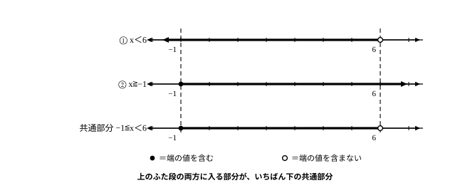

# L09 連立不等式——数直線で共通部分をとる

- unit_id: hs-math-i-numbers-and-expressions
- 位置づけ: 単元第9レッスン（1.5時間）。一次不等式サブ単元（L08〜L10）の2本目。L08で作った「解＝数直線上の範囲」を2本重ね、それぞれ解いて共通部分をとる型で連立不等式を解けるようにする。L10（活用——図・表から立式する）の土台になる。
- distribution_status: published_draft
- license: CC-BY-4.0
- verify_required: 例題数値・記述は監修者検証必須。
- 主概念: ①連立不等式の解＝各不等式の解の共通部分（数直線にそれぞれの解を表して重ねる）

---

## 1. 2つの条件を同時に——連立不等式

L08で、1本の不等式を「解く」技を作った。不等式の解は数が1個ではなく、**条件を満たすxの値の全部の集まり**——数直線上の範囲だった。今回は、これを2本同時に扱う。

日常の条件は、1つだけで来るとは限らない。「2以上であってほしい。ただし5未満に収めたい」のように、条件が2つ同時に付く場面がある。そこで、2つの不等式 x≧2 と x<5 の**両方**を満たす x を、いろいろな値で確かめてみる。

| x | 0 | 2 | 3 | 5 | 6 |
|---|---|---|---|---|---|
| x≧2 は | 成り立たない | 成り立つ | 成り立つ | 成り立つ | 成り立つ |
| x<5 は | 成り立つ | 成り立つ | 成り立つ | 成り立たない | 成り立たない |
| 両方は | 成り立たない | 成り立つ | 成り立つ | 成り立たない | 成り立たない |

両方が成り立つのは、2 から 5 の手前までの範囲だ。2 自身は入る（x≧2 の等号が効く）が、5 は入らない（5<5 は成り立たない）。これをまとめて 2≦x<5 と書く。この書き方は「2≦x と x<5 の両方が成り立つ」ことをひとまとめにした形で、「xは2以上5未満」と読む。

このように、いくつかの不等式を組にして、それらを同時に満たす x を考えるとき、その組を**連立不等式**という。「連立」は、中学で学んだ連立方程式と同じ使い方——複数の式を組にして、同時に満たすものを考える、という意味だ。組にしたどの不等式も満たす x の値を連立不等式の解といい、解をすべて求めることを、連立不等式を解くという。解をすべて集めたものが、どの不等式も満たすxの値の全部の集まり（数直線上の範囲）になる。

数直線で見るとどうなるか。x≧2 の範囲（2 に ● を置いて右へのびる）と、x<5 の範囲（5 に ○ を置いて左へのびる）を、同じ数直線の上下に並べてかく。2つの範囲が重なっている部分が、ちょうど 2≦x<5 だ。2つの範囲の重なっている部分を、その**共通部分**という。連立不等式の解は、各不等式の解（範囲）の共通部分である——これが今回の主役の見方だ。

## 2. 型で解く——それぞれ解いて、数直線で重ねる

**例題1** 次の連立不等式を解け。

- 3x−4<x＋8 ……①
- 2x＋5≧x＋4 ……②

まず、①と②をそれぞれ、L08の型で別々に解く。

①は、xの項を左辺・数の項を右辺に移項して 3x−x<8＋4、整理して 2x<12。両辺を正の 2 で割って x<6。

②は、2x−x≧4−5 から x≧−1。

次に、2つの解を同じ数直線の上下に並べてかく。x<6 は「6 に ○・左へのびる範囲」、x≧−1 は「−1 に ●・右へのびる範囲」。両方に入っている部分——共通部分——を取り出すと、−1 から 6 の手前までの範囲になる。解は

**−1≦x<6**

端の値は、もとの2つの不等式の両方に聞いて決める。x=−1 は、①で −7<7（成立）、②で両辺とも 3 になり等号成立（≧だから成立）——両方成り立つので解に入る（●）。x=6 は、①で両辺とも 14 になり 14<14 は成り立たない——①で落ちるので解に入らない（○）。

検算の型も、L08から連立向けに広げておく。共通部分の**中**から1点、**外**から左右1点ずつを、**もとの2つの不等式**に代入する。中の x=0 では ①が −4<8・②が 5≧4 でどちらも成立。外の右 x=7 では ①が 17<15 となり不成立、外の左 x=−2 では ②が 1≧2 となり不成立。「中は両方成立・外はどこかで不成立」が期待どおりに出れば合格だ。

:::guide
**「別々に解いてよい」のはなぜか——変形は範囲の言い換えだから**

連立不等式の解き方は、よく見ると2段階でできている。前半は、①と②をそれぞれ x<6・x≧−1 という読みやすい形に変形する段階。後半は、2つの範囲を重ねて読む段階だ。前半が許されるのは、L08の性質①〜④による変形が「解の集まりを変えない言い換え」だからだ。3x−4<x＋8 と x<6 は、見た目こそ違うが、指している範囲はまったく同じ——だから①を x<6 に置き換えても、「①と②の両方を満たす x」の中身は1つも増えないし、1つも減らない。新しく覚える作業は後半の「重ねて読む」だけで、そこは数直線が引き受けてくれる。①と②はどちらから解いても結果は同じだし、2本の変形はお互いに干渉しない——1本ずつはL08の技のままで、組み合わせ方だけが新しい。
:::

## 3. 端の値と「解はない」——際どいところを正しく読む

**例題2** 次の連立不等式を解け。

- 4x−3>2x−1 ……①
- 5−x≧2x−16 ……②

①は、4x−2x>−1＋3 から 2x>2、両辺を正の 2 で割って x>1。

②は、−x−2x≧−16−5 から −3x≧−21。両辺を −3 で割るので、不等号の向きが変わって x≦7。連立になっても、1本ずつを解く手さばきはいつもどおりだ（負の数で割れば向きが変わる——L08の性質④）。

数直線で重ねると、共通部分は「1 の右どなりから 7 まで」の範囲になる。解は

**1<x≦7**

端の確認。x=1 は①で両辺とも 1 になり、1>1 は成り立たない——解に入らない（○）。x=7 は①で 25>13（成立）、②で両辺とも −2 になり等号成立——両方成り立つので解に入る（●）。検算は、中の x=2 で ①が 5>3・②が 3≧−12 とどちらも成立、外の左 x=0 で①が −3>−1 となり不成立、外の右 x=8 で②が −3≧0 となり不成立——期待どおり。

:::guide
**端の値が入るかどうかは、両方に聞いてから決める**

共通部分の端にくる値は、片方の不等式にとっては範囲の真ん中でも、もう片方にとっては境界ぎりぎり、ということが多い。例題2の x=7 がそうで、①にとっては余裕で成立する値だが、②にとっては両辺が等しくなる境界の値だ。解に入るかどうかを決める基準はただ1つ、「もとの2つの不等式が両方成り立つか」だけ。②が等号つき（≧）だから x=7 は②でも成立し、解に入った。もし②が等号なしだったら、同じ位置でも入らない。迷ったら、端の値をもとの2つの不等式に代入する——これで機械的に決まる。とくに注意したいのは、2つの範囲の端がぴったり同じ値に重なる場合だ。たとえば x≦5 と x<5 の共通部分は x<5。2つの範囲が同じ向きにのびていて、● と ○ が同じ位置に重なったら、共通部分に残るのは「両方に入っている方」、つまり等号なしの ○ の側だ（向きが反対のときは、●と○が同じ位置なら共通部分はなくなる。●と●が向かい合ったときだけ、その1点が残る）。「等号が付いている方が強い」といった暗記ではなく、「両方が成り立つ範囲だけが残る」という判断の根拠に毎回戻れば、迷わない。
:::

**例題3** 次の連立不等式を解け。

- 2x−7>x−3 ……①
- 3x＋5≦x＋3 ……②

①は、2x−x>−3＋7 から x>4。②は、3x−x≦3−5 から 2x≦−2、両辺を正の 2 で割って x≦−1。

数直線にかくと、①の範囲は 4 から右へ、②の範囲は −1 から左へ——2つの範囲は離れていて、重なりがない。両方を満たす x は1つもない。だからこの連立不等式の**解はない**。

確かめに、2つの範囲のすき間から x=0 を選んで代入すると、①は −7>−3 で不成立、②は 5≦3 で不成立——どちらも落ちる。どの x を持ってきても、①と②の少なくとも一方が必ず不成立になる。

:::guide
**「解はない」も、りっぱな答え**

重なりがないとき、答案には「解はない」と書く。これは失敗でも手詰まりでもなく、「2つの条件を同時に満たす数は存在しない」という立派な情報だ。計画の場面に置き換えれば「その条件設定では計画が成立しない——どちらかの条件をゆるめる必要がある」という、次の行動まで教えてくれる結論にあたる。気をつけたいのは、離れた2つの範囲を無理にひとつなぎにして書いてしまうことだ。例題3で x>4 と x≦−1 を「−1≦x≦4」や「4<x≦−1」のようにまとめるのは誤り——a<x≦b 型の書き方は、2つの範囲に重なりがあって、その重なりを表すときにだけ使える。そもそも 4<x≦−1 を満たす数は存在しない（4より大きく、しかも −1 以下の数はない）。逆向きの読み違いにも注意したい。2つの範囲が同じ向きにのびているとき——たとえば x>1 と x>5——の共通部分は、広い方の x>1 ではなく、きびしい方の x>5 だ。x=3 は x>1 には入るが x>5 には入らないから、両方は満たしていない。どの場合も、書く前に数直線をかけば一目で決着する。「まず数直線」を合言葉にしよう。
:::

## 4. 手順の型

1. それぞれの不等式を、L08の型で別々に解く。負の数を掛ける・負の数で割るときに不等号の向きを変えるのも、いつもどおり（L08の性質④）。
2. それぞれの解を、同じ数直線の上下に並べてかく。端の値は、等号つきなら ●、等号なしなら ○。
3. 両方の範囲に入っている部分（共通部分）を読み取り、−1≦x<6 のような1つの式で答える。重なりがなければ「解はない」と答える。
4. 端の値が解に入るかどうか迷ったら、その値を**もとの2つの不等式の両方**に代入して決める。両方成り立つときだけ解に入る。
5. 検算——共通部分の中から1点、外から左右1点ずつ（共通部分が片側にだけのびているときは、外がある側の1点でよい）を、もとの2つの不等式に代入する。中は両方成立、外はどこかで不成立になるはずだ。

:::zatsudan
日帰りの小旅行を計画してみる。使えるお金は全部で5000円まで。往復の電車代に1800円、昼ごはんには800円は見ておきたい。ここまでで 1800＋800=2600円。残るのはおみやげ代だ。おみやげ代を x 円とすると、合計の条件から 2600＋x≦5000。一方で、家族と友だちの分を考えると1000円は使いたいから、1000≦x。条件が2つ同時に付いた——これはまさに連立不等式で、解けば 1000≦x≦2400。「おみやげは1000円から2400円までの間で選べば計画は成立する」と分かる。買い物や旅行の計画のように、下限と上限が同時に付く場面は、連立不等式のいちばん自然な出番だ。文章から式を立てるところは、次のL10でじっくりやる。
:::
<!-- zatsudan話題源: RESEARCH_BRIEF_20260829 zatsudan許可リストZ4（S1 高等学校学習指導要領解説 数学編（平成30年告示）活用例: 「買い物や旅行等の計画…必要経費等の条件を連立不等式に表して考える」本文確認）。出典の確認範囲内の話題のみ使用・場面設定と金額（5000・1800・800・1000円）は自作例（S1に数値の明示なし・notes検算済み）。本文例題への昇格はせず雑談枠として使用。割付=NE_CONTENT_MAP_20260829 §2 L09行（Z4→L09・重複なし） -->

## 5. 練習

**問1** 次の連立不等式を解け。

- 2x−1<x＋2 ……①
- 3x＋5>x−1 ……②

**問2** 次の連立不等式を解け。

- 4x＋1≦x＋10 ……①
- 2−x<3x＋10 ……②

**問3** 次の連立不等式について、以下の問いに答えよ。

- 3x−2≧x＋4 ……①
- 5x−1>2x＋8 ……②

(1) この連立不等式を解け。
(2) x=3 はこの連立不等式の解といえるか。①・②のそれぞれに代入した結果をもとに、2文程度で説明せよ。

**問4** 次の連立不等式を解け。

- x＋9<3x−1 ……①
- 4x−3≦2x＋3 ……②

---

:::stretch
**S1** 次の連立不等式を解け。また、解を数直線に表すとどのような見た目になるか、1〜2文で説明せよ。

- 2x＋3≦x＋5 ……①
- 3x−4≧x ……②
:::

<!-- gen_nav:nav:start（自動生成・手編集しない） -->

---

[← 前のレッスン](lesson_08.md)｜[単元の目次](README.md)｜[解答](answer_key_L08-10.md)｜[次のレッスン →](lesson_10.md)

<!-- gen_nav:nav:end -->
