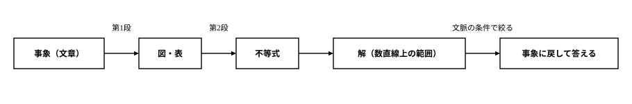
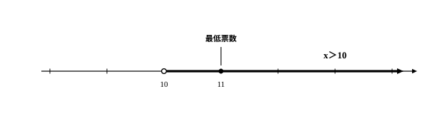

# L10 一次不等式の活用——図・表から立式する

- unit_id: hs-math-i-numbers-and-expressions
- 位置づけ: 単元第10レッスン（1.5時間）。一次不等式サブ単元（L08〜L10）の締め。L08の「解く」とL09の連立不等式を、日常・社会の事象に使う。文章→図・表→式の2段階で立式し、解を事象に戻して答えるところまでを1本の流れにする。
- distribution_status: published_draft
- license: CC-BY-4.0
- verify_required: 例題数値・記述は監修者検証必須。
- 主概念: ①文章→図・表→式の2段階翻訳 ②解の解釈（文脈の条件で解を絞って答えに直す）

---

## 1. このレッスンでやること——「表す」と「解く」をつないで使う

道具はそろっている。中1で、数量の大小関係を不等式で表すことを学んだ（3a＋b<900 のような形——L08の道具①）。L08で、不等式を解いて、解を「条件を満たすxの値の全部の集まり」＝数直線上の範囲として求められるようになった。L09では、2つの不等式を組にした連立不等式を、それぞれの解を数直線にかいて共通部分をとる方法で解いた。

このレッスンは、その道具一式を現実の問題に使う回だ。流れは1本道である。

事象（文章）→ 不等式 → 解（数直線上の範囲）→ 事象に戻して答える

真ん中の「解く」はL08・L09の手順がそのまま使える。今回新しく練習するのは両端——**文章から式を作る**入口と、**解を答えに直す**出口だ。そして実は、この両端こそが山場になる。式ができてしまえば解くのは手順どおりだが、文章を前にして最初の1行が書けない、ということが起こりやすい。そこで今回は、いきなり式を書かず、あいだに図・表を1枚はさむ。

## 2. 2段階翻訳——文章→図・表→式

文章を一気に式へ翻訳しようとせず、2段階に分ける。なお「2段階翻訳」はこの教材での呼び名で、覚える用語ではない——ただし、いきなり式を書かず、あいだに図・表をはさむ進め方そのものは、文章題の定番の作法である。

1. **第1段**（文章→図・表）: 登場する数量を書き出し、動く数量をxと置いて、ほかの数量をxで表して表に整理する。条件（何と何を比べるのか）も表の1行にする。
2. **第2段**（図・表→式）: 表の「条件」の行を、そのまま不等式に書き写す（条件の行が言葉のままでは式にならないときは、比べる2つの数量を表にもう1行足してから写す——例題2）。

**例題1** 1冊450円のノートを何冊か買うと、送料が600円かかる。代金の合計（ノート代＋送料）を3000円以下にしたい。ノートは最大何冊買えるか。

第1段——数量を表に整理する。動く数量はノートの冊数だから、これをx冊と置く。

| 数量 | xで表すと |
|---|---|
| ノートの冊数 | x冊 |
| ノートの代金 | 450x円 |
| 送料 | 600円 |
| 代金の合計 | 450x＋600（円） |
| 条件 | 代金の合計が3000円以下 |

第2段——「条件」の行を式に書き写す。「代金の合計が3000円以下」だから

450x＋600≦3000

あとはL08の手順で解く。600 を移項して 450x≦2400、両辺を正の 450 で割って x≦2400/450、約分して x≦16/3。

ここで終わりにしない。16/3 は 5.33… で、5 と 6 のあいだの数だ。不等式の解は x≦16/3（16/3 以下の数ぜんぶ）だが、聞かれているのは「最大何冊買えるか」であり、冊数は自然数しかありえない。x≦16/3 を満たす自然数のうち最大のものを拾って、答えは **5冊**。

検算は事象に戻して、境目の両側で行う。5冊なら 450×5＋600=2850（円）で3000円以下に収まり、6冊なら 450×6＋600=3300（円）で3000円を超える。「答えの冊数では条件に収まり、1冊増やすとあふれる」——この2つが両方確かめられたら、答えは境目に正しく立っている。

:::guide
**表は、3つの決断を代わりにしてくれる**

立式で手が止まるとき、実は3つの別々の決断が一度に押し寄せている。①何をxと置くか、②ほかの数量をxでどう表すか、③条件はどの数量とどの数量の比較か——の3つだ。表はこれを1行ずつに分解する。①は最初の行を書く決断、②は各行を埋める決断、③は「条件」の行を書く決断で、自分がどこで止まったのかが目に見えるようになる。全部を頭の中で一度にやろうとして真っ白になるのと、3つのうち2つは済んでいて残り1つを考えればよいのとでは、景色がまるで違う。そして、いきなり式を書ける問題でも表は無駄にならない。式の各項が表のどの行から来たかを指でたどれば、それがそのまま立式の検算になる。
:::

:::guide
**≦か<か迷ったら、境目の値を文章に当てて聞く**

「以下・以上なら等号あり、より大きい・未満なら等号なし」という対応は正しい。ただ、丸暗記だけに頼ると、文章側の言い方が変わった瞬間——「3000円までにしたい」「3000円を超えないように」——に不安になる。確実なのは、境目の値そのものを文章に当てて判定することだ。ちょうど3000円になる買い方は「合計を3000円以下にしたい」に合うか——合う。だから等号を入れて ≦。逆に「安くなるのはいつか」と問われたら、ちょうど同額のとき「安くなった」と言えるか——言えない。だから等号なしの <。この境目テストは、記号を選んだあとの読み違いもその場で捕まえてくれる。
:::

## 3. 解を事象に戻す——最低何票で当選するか

2段階翻訳のもう1つの見どころは出口、つまり解を事象に戻すところだ。次の例題は、不等式を解いてからが本番になる。

**例題2** クラスの40名が、その40名の中から、1人1票ずつ投票して（棄権や無効票はないものとする）、得票の多い順に3名のクラス代表を選ぶ。得票が同数で並んで3人目が決まらないときは、くじ引きになる。開票の内訳によらず必ず当選するためには、最低何票取ればよいか。

<!-- 本文昇格Z3話題源: RESEARCH_BRIEF_20260829 zatsudan許可リストZ3（S1=高等学校学習指導要領解説 数学編（平成30年告示）の活用例「40名のクラスから3名のクラス代表を選ぶ選挙で最低何票入れば当選するか」）。本文例題への昇格はNE_CONTENT_MAP_20260829 §2 L10行「本文昇格」の指定（S1明文のため昇格可）。設定（40名・3名・最低票数を問う）はS1の確認範囲内。細部の規定（1人1票・棄権なし・同数はくじ引き）と解法・検算の数値は自作 -->

第1段——数量を表に整理する。自分の得票をx票と置く。

| 数量 | xで表すと |
|---|---|
| 票の総数 | 40票 |
| 自分の得票 | x票 |
| 自分以外の票の合計 | 40−x票 |
| 当選できないおそれのある内訳 | 自分以外に、x票以上の人が3人いる |
| 比べる数量 | 3人がx票以上取るのに要る票 3x票 と、自分以外の票 40−x票 |
| 必ず当選する条件 | そのような内訳が作れない |

表の4行目を確かめておく。自分以外にx票以上の人が3人いれば、自分は4番手以下になるか、よくても同数で並んでくじ引きに回る——どちらにしても「必ず当選」とは言えない。逆に、x票以上の人が自分以外に2人以下なら、自分は上から3番以内が確定して当選する。

第2段——「作れない」を式にする。3人が全員x票以上取るには、票が少なくとも3x票要る。自分以外の票は全部で40−x票しかないから、3x票のほうが40−x票より多ければ、この内訳は作れない。

3x>40−x

解く。−x を左辺に移項して 4x>40、両辺を正の 4 で割って x>10。

出口の解釈。不等式の解は x>10（10より大きい数ぜんぶ）だが、票数は自然数だから、これを満たす最小の自然数を拾って、答えは **11票**。

検算も事象に戻して、境目の両側で行う。11票のとき、自分以外の票は29票。3人が11票以上取るには33票要るが、29票しかないから作れない——必ず当選する。10票のとき、自分以外の30票を10票ずつ3人に配ると、自分を含む4人が10票で並んで、3つの枠をくじ引きで争うことになる——「必ず」とは言えない。境目のすぐ外側（10票）で、実際に困る内訳が作れることまで確かめると、11という答えの確かさが実感できる。

:::guide
**「必ず」を式にする——最悪の場合を1つに絞る**

「開票の内訳によらず必ず当選」のような、全部の場合にわたる主張は、そのままでは1本の式にならない。内訳は何通りもあるからだ。例題2で効いたのは言い換えである。「どの内訳でも当選する」を「当選できない内訳が1つも作れない」と裏返し、さらに「作れない」を票の合計の不足——3人にx票ずつ配るには3x票要るが、残りは40−x票しかない——という1本の不等式に落とした。自分にいちばん不利な内訳（最悪の場合）だけを相手にすれば、それ以外の内訳はすべてそれより自分に有利だから、1つずつ確かめる必要がなくなる。この「全部の場合⇄最悪の1つ」の言い換えは、この問題だけの小技ではなく、高校数学のあちこちで再登場する考え方の型だ。
:::

## 4. 手順の型

1. 文章を読み、動く数量をxと置く（単位もいっしょに書く）。
2. ほかの数量をxで表し、図・表に整理する（第1段の翻訳）。
3. 「条件」の行を不等式に書き写す（第2段の翻訳）。等号を入れるかどうかは、境目の値を文章に当てて確かめる。
4. L08・L09の手順で解き、解を数直線上の範囲としてとらえる。
5. 解を事象に戻す——文脈の条件（個数・人数・票数なら自然数、重さ・長さなら正の数、など）で絞り、聞かれた形（最大何冊・何kgより多く、など）で答える。
6. 検算——答えの値と、境目のすぐ外側の値を事象に戻して確かめる（収まる・あふれるの両方を見る）。

:::guide
**不等式の解と、問題の答えは同じではない**

例題1で、不等式の解は x≦16/3、問題の答えは「5冊」だった。この2つのあいだには1段の階段がある。解は「条件を満たすxの値の全部の集まり」であり、文章題ではそこへ文脈の条件——冊数は自然数、票数は自然数、重さなら正の数——が後から重なる。数直線に解の範囲をかき、その上で文脈の許す値だけを拾う、と2段に分けて考えれば混同しない。注意したいのは、文脈がいつも1個の値まで絞るとは限らないことだ。重さや長さのような、とびとびでない量なら絞り込みは起こらず、範囲がそのまま答えになる。だから、解を出して満足せず、最後に必ず「問われたのは何だったか」へ戻る。出口の1歩まで含めて、文章題の解答は完成する。
:::

## 5. 練習

各問とも、例題と同じ流れ（表に整理→不等式→解く→事象に戻す）で解くこと。

**問1** 1個80円のみかんを何個かと、1袋200円のお菓子を1袋買う。代金の合計を1000円以下にしたい。みかんをx個買うとして、次の問いに答えよ。
(1) 次の表の空らん（ア）（イ）を、xの式で埋めよ。

| 数量 | xで表すと |
|---|---|
| みかんの代金 | （ア）円 |
| お菓子の代金 | 200円 |
| 代金の合計 | （イ）円 |
| 条件 | 代金の合計が1000円以下 |

(2) 条件を不等式で表せ。
(3) (2)の不等式を解き、みかんは最大何個買えるか答えよ。また、その個数のときの代金の合計を求めて、条件に合うことを確かめよ。

**問2** 同じ品質の米を、近所の店では1kgあたり300円で売っている。少しはなれた直売所では1kgあたり240円だが、行き帰りに交通費が360円かかる。x kg 買うとして、次の問いに答えよ。
(1) 近所の店で買う場合の金額と、直売所で買う場合の金額（交通費込み）を、それぞれxの式で表せ。
(2) 「直売所で買うほうが安くなる」という条件を不等式で表せ。また、等号を入れない理由を1文で説明せよ。
(3) (2)の不等式を解き、直売所のほうが安くなるのは何kgより多く買うときか答えよ。

**問3** 生徒会役員の選挙では、60名が、その60名の中から1人1票ずつ投票し（棄権や無効票はないものとする）、得票の多い順に2名が役員に選ばれる。得票が同数で並んで2人目が決まらないときは、くじ引きになる。開票の内訳によらず必ず当選するために最低何票必要か、例題2にならって次の順で求めよ。
(1) 自分の得票をx票とするとき、自分以外の票の合計をxの式で表せ。
(2) 「自分以外の2人が、2人ともx票以上取る」という内訳が作れないための不等式を作れ。
(3) (2)の不等式を解き、必要な最低票数を答えよ。また、その票数より1票少ないと「必ず当選」とは言えなくなることを、実際の内訳を1つ作って確かめよ。

---

:::stretch
**S1** 1本150円のバラをx本と、1本100円のガーベラを、合わせて12本になるように買って花束を作る。次の2つの条件をどちらも満たしたい。

- 条件A: バラの代金の合計が、ガーベラの代金の合計より高い。
- 条件B: 花束全体の代金（バラ＋ガーベラ）が1700円以下。

バラの本数として考えられるものをすべて求めよ。（ヒント: ガーベラは (12−x)本。条件A・条件Bをそれぞれ不等式に表すと、2つの不等式の組——連立不等式になる。L09のとおり、それぞれの解を数直線にかいて共通部分をとり、最後に本数の条件で絞ること。）
:::

<!-- gen_nav:nav:start（自動生成・手編集しない） -->

---

[← 前のレッスン](lesson_09.md)｜[単元の目次](README.md)｜[解答](answer_key_L08-10.md)｜[次のレッスン →](lesson_11.md)

<!-- gen_nav:nav:end -->
