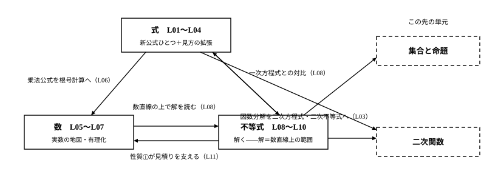

# L11 単元のまとめ——3つの新しい枠組み

- unit_id: hs-math-i-numbers-and-expressions
- 位置づけ: 単元第11レッスン（1時間）。L01〜L10の統合演習・総括回。**本線では新しい概念・新しい用語は立てない**（雑談・発展の枠を除く）。親単元「数と式」直属の章末相当（どの子単元にも属さない）——単元全体をふり返り、次の単元への接続を確かめる。
- distribution_status: published_draft
- license: CC-BY-4.0
- verify_required: 例題数値・記述は監修者検証必須。
- 主概念: ①親単元の構造マップ（数⇄式⇄不等式の往復と、集合と命題・二次関数への接続予告）

---

## 1. 単元の地図——3つの新しい枠組みをたたみ直す

最初のレッスン（L01）で、この単元の地図を渡した——「扱う内容の多くは中学で出会ったもの。ただし、新しい枠組みが3つ入ってくる」。L10まで歩き終えたいま、その3つを自分の言葉で言えるかどうかが、この総括回の出発点になる。

- 数の側（L05〜L07）: これまでに学んだ数の全体を「実数」という1枚の地図にまとめた。分数を小数で表すと有限小数か循環小数のどちらかになり、その仕組みは割り算の余りにあった。実数は数直線上の点と1対1に対応し、√のついた数も、数直線上の決まった1点を占める1つの数である。
- 式の側（L01〜L04）: 展開・因数分解で新しく増えた公式は (ax＋b)(cx＋d)=acx²＋(ad＋bc)x＋bd の1つだけ。かわりに「1つの文字に着目する」「共通のまとまりを置き換える」という見方が加わって、扱える式の幅が大きく広がった。
- 不等式（L08〜L10）: 不等式を「解く」ことに高校で初めて取り組んだ。解は数が1個とは限らず、解をすべて集めると**条件を満たすxの値の全部の集まり**（数直線上の範囲）になる。変形の根拠は性質①〜④で、要注意は④——負の数を掛ける・負の数で割ると不等号の向きが変わる——だけだった。連立不等式は、それぞれの解を数直線にかいて共通部分をとる。

このレッスンでは、新しいことを何も足さない。3つの枠組みを例題で1つずつ確かめ直し、枠組みどうしのつながりを見て、単元をたたむ。

:::guide
**「新しい枠組みは3つ」と数えられることの値打ち**

単元の終わりに内容を数え上げるのは、テスト前の暗記のためではない。「どこが新しかったか」が言えると、復習の効きどころが変わるからだ。中学から持ってきた道具——4公式、根号の計算、移項——は、思い出せば動く。集中して確かめる価値があるのは、新しく入った枠組みのほうだ。3つのうちどれかの説明につまったら、そこが再訪先になる。数の地図があやしければL05へ、見方の切り替えがあやしければL01とL04へ、解の意味と性質④があやしければL08へ。逆に、3つとも自分の言葉で説明できるなら、この単元は「覚えた」のではなく「つながった」状態にある。単元の最後に地図をたたみ直すこの習慣は、この先のどの単元でも同じように使える。
:::

## 2. 式——公式は1つ、見方が2つ

式の側の総仕上げとして、次の例題を見る。L02の新公式、L01とL04の「1つの文字に着目する」見方、L03以来の検算の往復が、1問の中で全部働く。

**例題1** 2x²＋7xy＋3y²＋5x＋5y＋2 を因数分解せよ。

項が6つあるが、あわてない。x に着目して降べきの順に整理する（L01・L04の見方）。

2x²＋(7y＋5)x＋(3y²＋5y＋2)

x を含まない部分は y の2次式なので、先に因数分解する。3y²＋5y＋2 は、係数の組の探索（L04）で

3y²＋5y＋2 = (y＋1)(3y＋2)

これで式全体は 2x²＋(7y＋5)x＋(y＋1)(3y＋2)。x²の係数 2=2×1 と、いま分解した定数部分から候補を作り、x の項で照合する。(2x＋y＋1)(x＋3y＋2) を試すと、外どうし・内どうしの積の和は 2×(3y＋2)＋1×(y＋1)=7y＋5——x の係数と一致する。組を入れかえた (2x＋3y＋2)(x＋y＋1) では 2×(y＋1)＋1×(3y＋2)=5y＋4 で合わない。よって

2x²＋7xy＋3y²＋5x＋5y＋2 = **(2x＋y＋1)(x＋3y＋2)**

検算: 展開すると 2x²＋6xy＋4x＋xy＋3y²＋2y＋x＋3y＋2 = 2x²＋7xy＋3y²＋5x＋5y＋2 で元に戻る。「積の形に表す」（L03の定義）が達成できた。

ふり返ると、この1問で使った道具は、新公式 (ax＋b)(cx＋d) の逆向き（係数の組の探索）と、「1つの文字に着目する」見方の2つだけだ。公式は1つしか増えていないのに扱える式の幅が広がったのは、見方が増えたからである——式パートの結論を、この1問が体現している。

## 3. 数——1枚の地図と、形をととのえる技

数の側の総仕上げは、有理化・根号計算・挟み込みの合流点に立つ。

**例題2** 4/(√7−√3) の分母を有理化せよ。また、その値がどの範囲にあるかを、小数で見積もれ。

分母が差の形だから、符号だけ変えた相方 √7＋√3 を分子と分母に掛ける（L07）。

4/(√7−√3) = 4(√7＋√3)/((√7−√3)(√7＋√3)) = 4(√7＋√3)/(7−3) = √7＋√3

分母が 7−3=4 になって分子の 4 と約分でき、√7＋√3 だけが残った。和と差の積が√を消す（L06）——その力を分母に向けたのが有理化だった。

値の見積りは挟み込み（L05）で。2.6²=6.76、2.7²=7.29 で 6.76<7<7.29 だから 2.6<√7<2.7（L05の練習で確かめた挟み込みそのものだ）。同様に 1.7²=2.89、1.8²=3.24 から 1.7<√3<1.8。√7 と √3 をそれぞれの範囲の中で足し合わせると、和は 2.6＋1.7=4.3 と 2.7＋1.8=4.5 の間に収まる。

4.3<√7＋√3<4.5

検算: 答えに元の分母を掛けて戻す（L07の型）。(√7＋√3)(√7−√3)=7−3=4 で、元の分子 4 に戻る。

見逃せないのは、最後の見積りの一歩だ。「√7<2.7 と √3<1.8 だから √7＋√3<2.7＋1.8」——この足し算を支えているのは、実は不等式の性質①（L08）である。√7<2.7 の両辺に √3 を足して √7＋√3<2.7＋√3、次に √3<1.8 の両辺に 2.7 を足して 2.7＋√3<2.7＋1.8、とつなげば、きちんと確かめられる。数の見積りの中で、不等式の枠組みが働いている——3つの枠組みは別々の引き出しではなく、1枚の地図の隣どうしなのだ。

:::guide
**「1つの数とみる」と「1つの文字とみる」——単元をつらぬく同じ見方**

√2＋1 を「計算が終わっていない式」ではなく「これ以上簡単に表せない1つの数」とみる（L05〜L06）。a＋b というまとまりを M という1つの文字とみる（L02・L04）。x 以外の文字を数の仲間とみて、2種類の文字の式を「x の2次式」とみる（L01・L04）。——この単元で何度も出てきたこれらの場面は、じつは同じ1つの技の別の顔だ。複数の部品でできたものを、ひとかたまりとして扱う。かたまりとして扱えば、部品の細部をいったん忘れて、よく知っている型（公式・手順）をそのまま当てはめられる。用が済んだら、かたまりをほどいて細部に戻ればよい——M を元の式に戻す、√の近似値を思い出す、というように。式変形が上達するとは、計算が速くなることだけでなく、この「かたまりの作り方・ほどき方」の引き出しが増えることでもある。この技は、この先の単元でも形を変えて何度も現れる。
:::

## 4. 不等式——「解く」という新しい技

不等式パートの総仕上げは、解の意味・性質④・共通部分を1問で通す。

**例題3** 次の連立不等式を解け。

- 2x＋3<4x＋9 ……①
- 5x−2≦3x＋6 ……②

それぞれを、L08の型で別々に解く。

①は、2x−4x<9−3 から −2x<6。両辺を −2 で割るので、不等号の向きが変わって x>−3。

②は、5x−3x≦6＋2 から 2x≦8。両辺を正の 2 で割って x≦4。

2つの解を同じ数直線の上下に並べてかき、共通部分をとる（L09）。−3 には ○（①が等号なしなので含まない）、4 には ●（②が等号つきなので含む）。解は

**−3<x≦4**

検算はL09の型で。中の x=0 は、①が 3<9・②が −2≦6 でどちらも成立。外の左 x=−4 は①が −5<−7 となり不成立、外の右 x=5 は②が 23≦21 となり不成立。端の値は両方に聞いて決める——x=−3 は①の両辺がともに −3 になり、−3<−3 は成り立たないから解に入らない（○）。x=4 は②の両辺がともに 18 で等号成立、①も 11<25 で成立するから解に入る（●）。

この答え −3<x≦4 も、1個の数ではなく、条件を満たすxの値の全部の集まり（数直線上の範囲）である。そして、ここでも枠組みは重なって働いている。解を読む場所は数直線——数の側で整えた道具（L05・L07）の上だし、1本ずつを解く手さばきは、一次方程式との対比（L08）から作ったものだ。

:::guide
**単元をつらぬくもう1本の柱——検算の型・総ざらい**

この単元では、内容と同じくらいの熱心さで「確かめ方」を練習してきた。並べてみると6つの型があった。①1点代入——式の整理・展開の前後で x=1 などを入れ、値が一致するかを見る（L01〜L02）。②展開して戻す——因数分解の答えは、展開して元の式に戻るかで判定する（L03〜L04）。③近似値の突き合わせ——√の式変形は、両辺をおよその値にして重なるかを見る。2乗して挟むのも同じ仲間だ（L05・L06）。④逆に掛けて戻す——有理化の答えは、元の分母を掛けて元の分子に戻るかを見る（L07）。⑤中と外で1点ずつ——不等式の解は、範囲の中と外から代入して成立・不成立を確かめる。丁寧にやるなら端の値も見る（L08〜L09）。⑥事象に戻して境目の両側——文章題の答えは、答えの値と1つ外側の値を事象に戻して、収まる・あふれるの両方を見る（L10）。6つに共通するのは、「答えを出した道とは別の道で、もう一度答えに触る」ことだ。同じ道を2回通っても、同じ思い込みは2回とも通ってしまう。別の道なら、それを捕まえやすい（ただし1点代入や近似値の一致は見逃すこともある——L01・L02・L06で見たとおり）。どの型を使うかは問題の種類が決めてくれるから、迷うことはない。「解いたら、別の道で確かめる」——この習慣ごと、次の単元に持っていこう。
:::

## 5. この先へ——地図の矢印の先

単元の地図からは、次の単元へ矢印がのびている。

- 集合と命題へ。この単元では、不等式の解を「条件を満たすxの値の全部の集まり」と日常の言葉で呼び、√2 が分数で表せないことは「知られている」で止めた（L05）。集まりを言い表す道具立てと、「表せない」ことを証明する論じ方は、次の「集合と命題」の単元で学ぶ——「いつでも成り立つ」という主張を、反例1つで倒す作法（L06）も、そこで主役級の出番がある。
- 二次関数へ。展開・因数分解の技能（L01〜L04）と、「解＝数直線上の範囲」の見方（L08〜L10）は、のちの「二次関数」の単元がそのまま使う。

:::zatsudan
最後に、この単元の道具が全部つながる話を1つ。古代ギリシャでまとめられた数学書『原論』（ユークリッド）には、1本の線分を「全体と長い部分の比が、長い部分と短い部分の比に等しくなる」ように分ける、という分け方が登場する。この分け方から生まれる比が、黄金比と呼ばれているものだ。歴史的な建造物にも見られると言われる比でもある。では、人はこの比の形を本当に「美しい」と感じるのだろうか——これは感覚の問題に見えて、実はデータを集めて確かめられる問いで、その確かめ方は「データの分析」の単元で学ぶ。そして黄金比の値そのものは、いまのきみが持っている道具——根号の計算・挟み込み・有理化——だけで見積もれる。下の S1 で試してほしい。
:::
<!-- zatsudan話題源: RESEARCH_BRIEF_20260829 zatsudan許可リストZ1（S1 高等学校学習指導要領解説 数学編（平成30年告示）課題学習〈数と式〉: 黄金比——ユークリッド原論の比例論による定義の紹介・建造物・データの分析と関連付けた「黄金比を美しいと感じるか」の検証活動 本文確認）。語りをzatsudan・計算をstretchに分離（NE_CONTENT_MAP_20260829 §2 L11行の指示どおり）。「美しいと感じるか」の答えは断定していない（検証活動の紹介のみ）。定義の言い回しは執筆者による標準的定式化（notes §5参照・監修対象）。割付=NE_CONTENT_MAP_20260829 §2 L11行（Z1→L11・重複なし） -->

## 6. 練習

問1は式（L01〜L04）、問2は数（L05〜L07）、問3は不等式（L08〜L10）の総合問題である。手が止まったら、その範囲のレッスンに戻って確かめてから再挑戦しよう。

**問1** 次の問いに答えよ。
(1) 置き換えを使って (x＋2y＋3)(x＋2y−3) を展開せよ。
(2) 6x²−7x−3 を因数分解せよ。
(3) x²＋4xy＋3y²＋2x＋4y＋1 を因数分解せよ。

**問2** 次の問いに答えよ。
(1) 7/12 を小数で表すと、有限小数と循環小数のどちらになるか。分母の素因数に注目して計算の前に予想し、割り算で確かめよ。
(2) (√3＋√2)²−(√3−√2)² を計算せよ。
(3) 1/(√6＋2) の分母を有理化せよ。

**問3** 次の問いに答えよ。
(1) 次の連立不等式を解け。解を数直線に表すときの端の印（● か ○ か）も答えよ。

- 3x＋1<x＋11 ……①
- 2−3x≦x＋10 ……②

(2) 1個120円のパンと1個90円のおにぎりを、合わせてちょうど10個買う。代金の合計を1100円以下にしたいとき、パンは最大で何個買えるか。パンの個数を x 個として不等式をつくり、解いて答えよ（L10の型どおり、表に整理してから立式するとよい）。

---

:::stretch
**S1** 1本の線分を、全体と長い部分の比が、長い部分と短い部分の比に等しくなるように分ける（zatsudanで紹介した黄金比の分け方）。短い部分の長さを 1、長い部分の長さを x とすると、全体は x＋1 だから、比の等式 (x＋1):x = x:1 が成り立つ。比の性質（外側の項の積=内側の項の積）から x²=x＋1 となる。この等式を満たす正の数が x=(1＋√5)/2 で、これが黄金比と呼ばれる値である。
(1) x=(1＋√5)/2 が x²=x＋1 を満たすことを、左辺 x² と右辺 x＋1 をそれぞれ計算して確かめよ。
(2) 2.2<√5<2.3 が成り立つことを2乗の比較で確かめ、それを使って (1＋√5)/2 の値の範囲を小数で答えよ。
(3) 黄金比の逆数 2/(1＋√5) の分母を有理化せよ。また (1＋√5)/2−1 を計算し、2つの結果を見比べて気づくことを1文で述べよ。
:::

<!-- gen_nav:nav:start（自動生成・手編集しない） -->

---

[← 前のレッスン](lesson_10.md)｜[単元の目次](README.md)｜[解答](answer_key_L11.md)

<!-- gen_nav:nav:end -->
