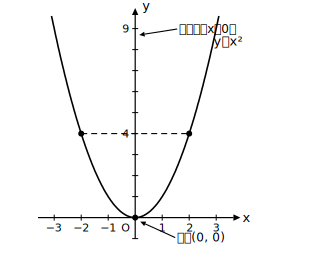
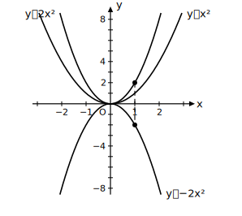

# L01 関数を広げる——y=ax²から二次関数へ

- unit_id: hs-math-i-quadratic-functions
- 位置づけ: 単元第1レッスン（2時間）。中学既習の y=ax²・一次関数から「二次関数」への橋渡し。
- distribution_status: published_draft
- license: CC-BY-4.0
- verify_required: 例題数値・記述は監修者検証必須。
- 主概念: ①二次関数の定義 ②y=ax²のグラフの復習（放物線・軸・頂点）

---

## 1. 中学で学んだこと——「yはxの2乗に比例する」

中学では、「yはxの2乗に比例する」関数 y=ax² を学んだ。たとえば y=2x² では、xの値を決めるとyの値がただ1つ決まる。表で確かめよう。

| x | −3 | −2 | −1 | 0 | 1 | 2 | 3 |
|---|----|----|----|---|---|---|---|
| y=2x² | 18 | 8 | 2 | 0 | 2 | 8 | 18 |

xを3倍にするとyは9倍（3²倍）になる。「xをm倍にするとyはm²倍」という性質も中学で確かめたとおりだ。この関数が、これから学ぶ内容の出発点になる。

## 2. y=ax² だけでは表せない場面

縦の長さが x cm、横の長さが縦より2cm長い長方形を考える。面積を y cm² とすると、

y = x(x＋2) = x²＋2x

となる。ここで x は長方形の縦の長さだから、**x＞0**（長さは正の数）でなければならない。式だけでなく、場面が x の範囲を決めていることにも注目しておこう（場面が x の範囲を決める話は、L07の文章題でくわしく再訪する）。

表で見ると、x=1のとき y=3、x=2のとき y=8、x=3のとき y=15。yはxの値によってただ1つ決まるから、これも関数である。しかし y=ax² の形（xの2乗だけの式）では書けない。x² の項に加えて、x の項も混ざった式になっている。

## 3. 二次関数の定義——高校で初めてつける名前

y が x の2次式で表される関数、すなわち

y = ax²＋bx＋c （a, b, c は定数、a≠0）

を、x の**二次関数**という。「二次関数」という呼び名は高校で初めて登場するが、中身は新しいものばかりではない。中学の y=ax² は b=0, c=0 の場合であり、二次関数の仲間の1つである。先ほどの y=x²＋2x も a=1, b=2, c=0 の二次関数だ。

同じように、中学で学んだ一次関数 y=ax＋b は「x の1次式で表される関数」だった。名前のつけ方がそろっていることを確認しておこう。

なお、ここでしているのは **「二次関数」という名前の定義だけ**である。y=ax²＋bx＋c の形の式からグラフをかいたり頂点を調べたりする方法は、まだ扱わない（グラフの調べ方はL02〜L03で順に学ぶ）。このレッスンでは「どんな式を二次関数と呼ぶか」が判定できれば十分である。

## 4. y=ax² のグラフの復習——放物線・軸・頂点

y=x² のグラフを、1の表のような対応表からかいてみると、原点を通るなめらかな曲線になる。この形の曲線を**放物線**という。

放物線には、次の2つの特徴がある。

- グラフは y軸（直線 x=0）について左右対称である。この対称の軸となる直線を、放物線の**軸**という。
- 軸とグラフが交わる点を、放物線の**頂点**という。y=ax² の頂点は原点 (0, 0) である。

「軸」と「頂点」は、この単元全体でグラフの位置を言い表すための基本の言葉になる。

## 5. aの符号と開き方

y=2x² と y=−2x² を比べる。x=1 のとき、y=2x² では y=2、y=−2x² では y=−2。すべての x で y の符号が逆になるから、グラフは x軸について対称になる。

- a＞0 のとき: グラフは**下に凸**（谷の形。頂点が一番低い点）
- a＜0 のとき: グラフは**上に凸**（山の形。頂点が一番高い点）

また、aの絶対値が大きいほどグラフの開き方は狭くなる。y=2x² は y=x² より細い放物線である。

## 6. 練習

**問1** 次のうち、yがxの二次関数であるものをすべて選べ。
(ア) y=3x²  (イ) y=2x＋5  (ウ) y=x²−4x＋1  (エ) y=x³

**問2** y=−x² について、x=−2, −1, 0, 1, 2 に対する y の値の表をつくれ。また、グラフの凸の向き・軸・頂点を答えよ。

**問3** 縦の長さが x cm、横の長さが縦より3cm長い長方形の面積を y cm² とする。y を x の式で表せ。また、y は x の二次関数といえるか。

**問4** y=3x² について、x の値を2倍にすると y の値は何倍になるか。また、x=2 のときの y の値を求めよ。

---

## stretch（本線と分けて提示。余力のある生徒向け）

**S1** y=ax² のグラフ上で、x=t の点と x=−t の点はどんな位置関係にあるか。式を使って説明せよ（対称性を式で確かめる練習）。

<!-- gen_nav:nav:start（自動生成・手編集しない） -->

---

[単元の目次](README.md)｜[解答](answer_key_supplement.md)｜[次のレッスン →](lesson_02.md)

<!-- gen_nav:nav:end -->
