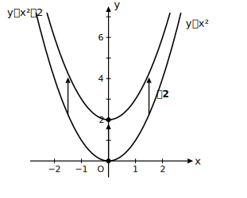
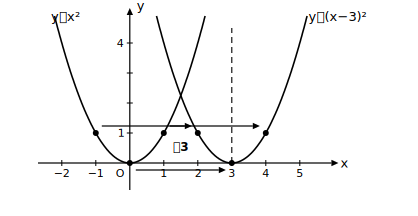
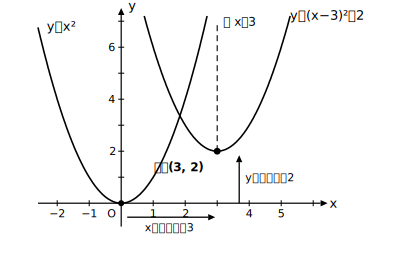

# L02 グラフの平行移動と頂点——y=a(x−p)²＋q

- unit_id: hs-math-i-quadratic-functions
- 位置づけ: 単元第2レッスン（3時間）。L01の y=ax² を平行移動し、軸・頂点を式から読む。
- distribution_status: published_draft
- license: CC-BY-4.0
- verify_required: 例題数値・記述は監修者検証必須。
- 主概念: ①放物線の平行移動（縦・横・両方） ②y=a(x−p)²＋q の軸と頂点の読み取り

---

## 1. 上下に動かす——y=x²＋q

y=x² と y=x²＋2 を、同じ x の値で比べてみる。

| x | −2 | −1 | 0 | 1 | 2 |
|---|----|----|---|---|---|
| y=x² | 4 | 1 | 0 | 1 | 4 |
| y=x²＋2 | 6 | 3 | 2 | 3 | 6 |

どの x でも、y=x²＋2 の値は y=x² よりちょうど2大きい。つまりグラフ全体が **y軸方向に＋2** だけずれる。形は変わらず、位置だけが動く。このような移動を**平行移動**という。移動後の頂点は (0, 2)、軸は変わらず直線 x=0 である。ここで大事な約束を1つ——**動かすのはグラフだけで、座標軸（x軸・y軸）は動かない**。この先ずっと、座標軸は固定したままグラフの側を動かして考える。

## 2. 左右に動かす——y=(x−p)²

今度は y=(x−3)² を表で調べる。

| x | 1 | 2 | 3 | 4 | 5 |
|---|---|---|---|---|---|
| y=(x−3)² | 4 | 1 | 0 | 1 | 4 |

y=x² が x=0 でとっていた値 0 を、y=(x−3)² は x=3 でとる。表の値の並びは y=x² と同じで、**3だけ右に**ずれている。つまり y=(x−3)² のグラフは、y=x² を **x軸方向に＋3** 平行移動したもの。頂点は (3, 0)、軸は直線 x=3 になる。

このずれ方は、**点の移り先**として見るとしくみがはっきりする。y=x² のグラフ上の点 (u, u²) を右に3動かすと点 (u＋3, u²) になる。移った先の点で x=u＋3 だから u=x−3 であり、y座標は u²=(x−3)²。つまり移動後のグラフ上では、どの点でも y=(x−3)² が成り立つ。「グラフ上の**すべての点**がそろって3だけ右へ移り、移った先の点たちが満たす式が y=(x−3)² になる」——これが「x が x−3 に置き換わる」ことの中身である。

式の中は「x−3」なのにグラフは**右（＋3）** へ動く。「x=3 を入れるとカッコの中が 0 になり、そこが頂点になる」と考えると、向きを取り違えない。この規則は上の「点の移り先」の見方の要約であり、丸暗記の合言葉ではないことを押さえておこう。

## 3. 両方動かす——y=a(x−p)²＋q と軸・頂点

1と2を組み合わせる。y=(x−3)²＋2 のグラフは、y=x² を x軸方向に＋3、y軸方向に＋2 平行移動したもので、頂点は (3, 2)、軸は直線 x=3。

一般に、

**y = a(x−p)²＋q のグラフは、y=ax² を x軸方向に p、y軸方向に q 平行移動した放物線で、軸は直線 x=p、頂点は点 (p, q)**

である。この形なら、グラフをかかなくても軸と頂点が式から直接読み取れる。この単元では、この「頂点が読める形」が主役になる。

## 4. aが負の場合・符号の読み間違いに注意

y=−2(x＋1)²＋4 を読んでみる。x＋1 = x−(−1) だから p=−1、q=4。よって頂点は (−1, 4)、軸は直線 x=−1、a=−2＜0 なので上に凸の放物線である。

「(x＋1)² だから頂点の x座標は＋1」としないこと。**カッコの中を0にする x の値**が頂点の x座標である（x＋1=0 より x=−1）。確かめとして x=−1 を代入すると y=4 となり、頂点の座標と一致する。

## 5. 移動していなくても頂点は読める

y=x²−1 のような式は、変形しなくてもこのままで「頂点が読める形」である。y=x² を y軸方向に −1 平行移動したものだから、頂点は (0, **−1**)、軸は直線 x=0。

「−1 があるから頂点の座標にも −1 が入るはず」と機械的に (−1, 0) などとしないこと。**−1 が x についているのか、式全体（y の方向）についているのか**を毎回確かめる習慣をつけよう。

## 6. 練習

**問1** 次の関数のグラフの軸と頂点を答えよ。
(1) y=x²−3  (2) y=x²−7  (3) y=(x＋5)²

**問2** y=2x² のグラフを x軸方向に 4、y軸方向に −1 だけ平行移動した放物線の式を書け。また、その軸と頂点を答えよ。

**問3** y=−(x＋2)²＋5 のグラフの軸・頂点・凸の向きを答えよ。

**問4** 頂点が (2, −3) で、y=x² を平行移動して得られる放物線の式を書け。

**問5** y=3(x−1)²＋2 のグラフは、y=3x² のグラフをどのように平行移動したものか、言葉で説明せよ。

---

## stretch（本線と分けて提示。余力のある生徒向け）

**S1** y=(x−p)² のグラフが点 (5, 4) を通るとき、p の値をすべて求めよ（頂点の位置が2通りありうることをグラフでも確かめる）。

<!-- gen_nav:nav:start（自動生成・手編集しない） -->

---

[← 前のレッスン](lesson_01.md)｜[単元の目次](README.md)｜[解答](answer_key_supplement.md)｜[次のレッスン →](lesson_03.md)

<!-- gen_nav:nav:end -->
