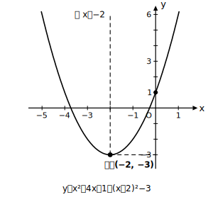

# L03 一般形から頂点を読む——平方完成という道具

- unit_id: hs-math-i-quadratic-functions
- 位置づけ: 単元第3レッスン（3時間）。一般形 y=ax²＋bx＋c を「頂点が読める形」に変形する。
- distribution_status: published_draft
- license: CC-BY-4.0
- verify_required: 例題数値・式変形は監修者検証必須。
- 主概念: ①一般形 y=ax²＋bx＋c ②頂点を読むための式変形（平方完成）

---

## 1. 困りごとから始める——この式の頂点はどこ？

y=x²＋4x＋1 のグラフをかきたい。L02 では y=a(x−p)²＋q の形なら軸と頂点がすぐ読めた。しかしこの式は y=ax²＋bx＋c の形（**一般形**）で、このままでは頂点が読めない。

表で数点を計算してもよいが、頂点がちょうど表の x の値にくるとは限らない。そこで、**式を「頂点が読める形」に変形する**という作戦をとる。このレッスンの目標はこの変形を身につけることであり、変形そのものが目的ではない——**頂点を読むための変形**である。

## 2. 変形のしくみ——(x＋●)² を作る

(x＋2)² = x²＋4x＋4 を思い出す（中学の展開公式）。x²＋4x までは同じだから、

y = x²＋4x＋1 = (x²＋4x＋4)−4＋1 = **(x＋2)²−3**

と書き直せる。「x²＋4x に 4 を足して (x＋2)² を作り、足したぶんの 4 をすぐ引く」——式の値は変えずに形だけを変えている。足す数は **x の係数 4 の半分（=2）の2乗**である。

こうして得た y=(x＋2)²−3 から、頂点 (−2, −3)、軸は直線 x=−2 と読める。この変形は**平方完成**と呼ばれる（「2乗＝平方」の形を完成させる、という意味の呼び名である）。

## 3. 手順の確認——もう1問

y=x²−6x＋7 を平方完成する。

1. x の係数は −6。その半分は −3、2乗すると 9。
2. y = (x²−6x＋9)−9＋7
3. y = **(x−3)²−2**

頂点は (3, −2)、軸は直線 x=3。検算として x=3 を元の式に代入すると y=9−18＋7=−2 となり、頂点の y座標と一致する。**変形したら頂点の x座標を元の式に代入して確かめる**——この検算を毎回の習慣にしよう。

## 4. aが1でない場合——まずaでくくる

y=2x²−8x＋5 は、x² の係数が 2 なのでひと手間増える。**x² と x の項だけを a でくくって**から、カッコの中で平方完成する。

y = 2(x²−4x)＋5 = 2{(x−2)²−4}＋5 = 2(x−2)²−8＋5 = **2(x−2)²−3**

頂点は (2, −3)、軸は直線 x=2、下に凸。カッコを外すとき −4 が 2倍されて −8 になるところが間違えやすい。検算: x=2 のとき元の式で y=8−16＋5=−3。一致する。

## 5. aが負の場合

y=−x²＋2x＋2 では、−1 でくくる。

y = −(x²−2x)＋2 = −{(x−1)²−1}＋2 = −(x−1)²＋1＋2 = **−(x−1)²＋3**

頂点は (1, 3)、軸は直線 x=1、上に凸。くくったときにカッコの中の符号が変わる（＋2x → −2x）ことに注意する。検算: x=1 で y=−1＋2＋2=3。一致する。

## 6. 変形が要らない式を見分ける

平方完成は「頂点を読むための道具」だから、**すでに頂点が読める式には使わなくてよい**。

- y=x²−1 → このままで頂点 (0, −1) が読める（L02の5節）。
- y=(x＋5)² → このままで頂点 (−5, 0) が読める。

どんな式にも同じ手順を機械的に当てはめるのではなく、「この式はもう頂点が読めるか？」を先に1秒だけ考える。この判断ができることも、このレッスンの目標の1つである。

## 7. 練習

**問1** 次の関数を y=a(x−p)²＋q の形に変形し、軸と頂点を答えよ。
(1) y=x²＋2x−3  (2) y=x²−8x＋10

**問2** y=3x²＋6x＋1 を変形し、軸・頂点・凸の向きを答えよ。

**問3** y=−2x²＋4x−5 を変形し、軸・頂点・凸の向きを答えよ。

**問4** 次の関数のうち、変形しなくても頂点が読めるものを選び、その頂点を答えよ。残りは変形して頂点を求めよ。
(ア) y=x²＋5  (イ) y=x²−2x  (ウ) y=(x−4)²＋1

**問5** 問1(1)の答えについて、頂点の x座標を元の式に代入して y座標が合っていることを確かめよ（検算の練習）。

---

## stretch（本線と分けて提示。余力のある生徒向け）

**S1** y=x²＋bx＋3 の頂点の x座標が 2 であるとき、b の値を求めよ。また、そのときの頂点の座標を求めよ。

<!-- gen_nav:nav:start（自動生成・手編集しない） -->

---

[← 前のレッスン](lesson_02.md)｜[単元の目次](README.md)｜[解答](answer_key_supplement.md)｜[次のレッスン →](lesson_04.md)

<!-- gen_nav:nav:end -->
