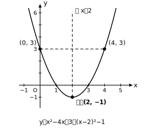
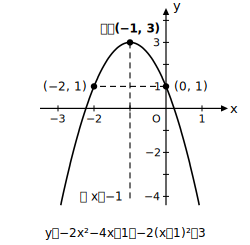

# L04 グラフ描画の総合練習

- unit_id: hs-math-i-quadratic-functions
- 位置づけ: 単元第4レッスン（2時間）。L01〜L03の統合演習・定着回。**新しい概念・新しい用語は立てない**。
- distribution_status: published_draft
- license: CC-BY-4.0
- verify_required: 例題数値・記述は監修者検証必須。
- distribution_status: published_draft
- 主概念: 一般形→頂点が読める形→グラフ、という一連の流れの定着（L01〜L03の統合。新概念なし）

---

## 1. 描く前に集める4つの情報

放物線のグラフを描くとき、いきなり曲線を引かない。先に次の4つを式から集める。

1. **凸の向き**（aの符号。a＞0なら下に凸、a＜0なら上に凸）
2. **軸**（直線 x=p）
3. **頂点**（点 (p, q)）
4. **x=0 のときの y の値**（式に x=0 を代入して計算する。グラフが y軸と交わる点の高さ）

1〜3は L02・L03 で学んだ「頂点が読める形」から読み取る。4は代入計算だけで求まる。この4点がそろえば、グラフの位置と向きは決まる。なお**開き方の広さ・狭さ**はこの4点では決まらず、a の絶対値で決まる（|a| が大きいほど狭い——L01）。手描きでは位置と向きが正しければよい。

## 2. 例題①——一般形から描くまでの一連の流れ

**例題1** y=x²−4x＋3 のグラフをかけ。

まず L03 の変形で頂点が読める形にする。

y = x²−4x＋3 = (x−2)²−4＋3 = **(x−2)²−1**

- 凸の向き: a=1＞0 → 下に凸
- 軸: 直線 x=2 ／ 頂点: (2, −1)
- x=0 のとき: y=0−0＋3=3

頂点 (2, −1) を打ち、点 (0, 3) を通るなめらかな曲線を、軸 x=2 について左右対称になるように描く（対称性から点 (4, 3) も通る）。**検算**: x=2 を元の式に代入すると 4−8＋3=−1 で頂点の y座標と一致する。

## 3. 例題②——aが負・係数が2以上の場合

**例題2** y=−2x²−4x＋1 のグラフをかけ。

y = −2(x²＋2x)＋1 = −2{(x＋1)²−1}＋1 = **−2(x＋1)²＋3**

- 凸の向き: a=−2＜0 → 上に凸
- 軸: 直線 x=−1 ／ 頂点: (−1, 3)
- x=0 のとき: y=1

**検算**: x=−1 を元の式に代入すると −2＋4＋1=3 で頂点と一致。カッコの外に出した −2 のかけ忘れ（−2(x＋1)²−1＋1 とする誤り）が起きやすいので、検算代入までを1セットの手順にする。

## 4. 変形しなくても読める形を見落とさない

y=x²−1 のような式は、変形の必要がない「頂点が読める形」である（頂点などは L02 §5 で確認済み）。

「まず平方完成」と機械的に手を動かす前に、**式がすでに頂点の読める形になっていないか**を最初に確認する。この一呼吸が、変形ミスと時間のロスを減らす。

## 5. 練習

**問1** 次の関数のグラフの凸の向き・軸・頂点・x=0 のときの y の値を求め、グラフをかけ。
(1) y=x²＋2x  (2) y=x²−6x＋5  (3) y=x²−1

**問2** y=2x²−8x＋9 のグラフをかけ（頂点が読める形への変形から）。

**問3** y=−x²＋4x−3 のグラフをかけ。凸の向きに注意すること。

**問4** 問2の関数について、x=2 を元の式に代入し、頂点の y座標と一致することを確かめよ。

**問5** 次の流れの空欄を埋めよ。「一般形 → （　　）が読める形に変形 → 凸の向き・軸・（　　）・x=0 のときの y の値を集める → 軸について（　　）になるように曲線を描く」

---

## stretch（本線と分けて提示。余力のある生徒向け）

**S1** y=−3x²＋6x−1 のグラフをかけ。また、このグラフは y=−3x² のグラフをどのように平行移動したものか、言葉で説明せよ。

<!-- gen_nav:nav:start（自動生成・手編集しない） -->

---

[← 前のレッスン](lesson_03.md)｜[単元の目次](README.md)｜[解答](answer_key_L04-06.md)｜[次のレッスン →](lesson_05.md)

<!-- gen_nav:nav:end -->
