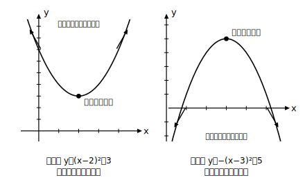

# L05 最大値・最小値（定義域の制限なし）

- unit_id: hs-math-i-quadratic-functions
- 位置づけ: 単元第5レッスン（2時間）。定義域に制限がない場合の最大・最小。区間つきは L06。
- distribution_status: published_draft
- license: CC-BY-4.0
- verify_required: 例題数値・記述は監修者検証必須。
- distribution_status: published_draft
- 主概念: ①凸の向きと最大・最小の対応（頂点で決まる） ②存在しない側（下に凸→最大値なし／上に凸→最小値なし）

---

## 1. 「一番低い点」はどこか——下に凸の場合

y=(x−2)²＋3 のグラフは下に凸で、頂点は (2, 3)。グラフを描くと、y の値が一番小さくなるのは頂点のところだと分かる。(x−2)² は 0 以上の値しかとらず、x=2 のときだけ 0 になるから、y は 3 より小さくならない。

このとき「y は **x=2 で最小値 3** をとる」という。**下に凸の放物線では、頂点の y座標が最小値**である。最小値を答えるときは、「どの x のときか」を必ずセットで書く。

## 2. 下に凸のとき、最大値はどうなるか

同じ y=(x−2)²＋3 で、y の値はどこまで大きくなれるだろうか。x を 10, 100, 1000, … と大きくしていくと、y はいくらでも大きくなり、上限はない。グラフの両腕が上へ開き続けているからである。

ここで、x が動ける範囲のことを**定義域**という（中学までの「変域」にあたる高校での用語）。この例のように条件が何もなければ、x はすべての実数を動ける——「定義域に制限がない」状態である。

つまり **定義域に制限がないとき、下に凸の放物線に最大値は存在しない**。答え方は「**最大値はない**」——これが正式な答えであり、書き忘れや「頂点が最大」とする誤りに注意する。最大・最小の問題では、**存在しない側も含めて両方に答える**のがこの単元の約束である。

## 3. 上に凸の場合——最大値はあり、最小値はない

**例題1** y=−x²＋6x−4 の最大値・最小値を調べよ。

y = −(x²−6x)−4 = −{(x−3)²−9}−4 = **−(x−3)²＋5**

a=−1＜0 なので上に凸、頂点は (3, 5)。グラフは頂点が一番高く、両腕は下へ開き続ける。よって **x=3 で最大値 5 をとり、最小値はない**。

まとめると: **下に凸 → 頂点で最小値・最大値なし／上に凸 → 頂点で最大値・最小値なし**。どちらの場合も「あるのは頂点の側だけ」である。

## 4. 手順の固定——グラフを描いてから答える

最大・最小の問題は、次の手順を毎回そろえる。

1. 頂点が読める形に変形する（すでに読める形ならそのまま。L04 §4）
2. **グラフの概形を描く**（凸の向きと頂点だけの簡単な図でよい）
3. 図を見て、最大値・最小値の**両方**について「値と、そのときの x」または「なし」を答える

式だけで暗算せず、必ず図を経由する。凸の向きの見落としによる「最大と最小の取り違え」は、図を1つ描くだけでほぼ防げる。

## 5. 練習

**問1** 次の関数の最大値・最小値を求めよ（「なし」の場合はそう答えること）。
(1) y=(x＋1)²−2  (2) y=x²＋4x＋1  (3) y=−2x²＋8x−5

**問2** y=x²−1 の最大値・最小値を求めよ。

**問3** y=−(x＋1)² の最大値・最小値を求めよ。

**問4** 次の主張の誤りを説明せよ。「y=x²−6x＋10 は下に凸だから、頂点の y座標 1 が最大値である。」

**問5** y=x²−2x＋c の最小値が 4 であるとき、定数 c の値を求めよ。

---

## stretch（本線と分けて提示。余力のある生徒向け）

**S1** y=x²＋bx＋7 の最小値が 3 であるとき、定数 b の値をすべて求めよ（答えが2つあることをグラフの対称性から説明してみる）。

<!-- gen_nav:nav:start（自動生成・手編集しない） -->

---

[← 前のレッスン](lesson_04.md)｜[単元の目次](README.md)｜[解答](answer_key_L04-06.md)｜[次のレッスン →](lesson_06.md)

<!-- gen_nav:nav:end -->
