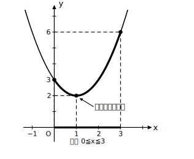
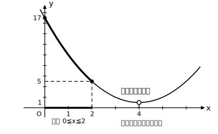
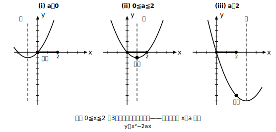

# L06 区間つきの最大・最小と場合分け

- unit_id: hs-math-i-quadratic-functions
- 位置づけ: 単元第6レッスン（3時間）。定義域が区間のときの最大・最小。場合分けは「固定した区間×動く軸」の1型のみ扱う。
- distribution_status: published_draft
- license: CC-BY-4.0
- verify_required: 例題数値・記述は監修者検証必須。
- distribution_status: published_draft
- 主概念: ①区間つき最大・最小の3段手順（頂点が区間内か判定→候補を絞る→比較） ②「動くものを1つに固定」した場合分け（区間は固定・軸だけが動く）

---

## 1. 定義域が区間だと何が変わるか

L05 では x はどんな値でもよかった。今回は定義域が 0≦x≦3 のような**区間**に制限される。グラフのうち、**区間の上にある部分だけ**が使える——残りは「描いてあっても使えない部分」である。

だから答えの候補になる点も変わる。まず身につけるのは、次の**3段の手順**である。

1. **頂点（軸）が区間の中にあるかを判定する**
2. 区間の**中**にあれば「頂点の値＋両端の値」を候補にする。区間の**外**なら「両端の値のみ」を候補にする
3. 候補を比較して最大・最小を決める

※この手順は、0≦x≦3 のように**両端が区間に含まれる**（≦で書かれた）場合のもの。端が含まれない（＜で書かれた）ときは、その端の値は「近づくだけで実現されない」ため候補にできないことがある（L07の例題3で扱う）。

## 2. 例題①——頂点が区間の中にある場合

**例題1** y=(x−1)²＋2（0≦x≦3）の最大値・最小値を求めよ。

**①判定**: 軸は x=1。0≦1≦3 なので頂点は区間の**中**。
**②候補**: 頂点の値と両端の値の3つ。x=1 で y=2、x=0 で y=3、x=3 で y=6。
**③比較**: 一番大きいのは 6、一番小さいのは 2。

よって **x=3 で最大値 6、x=1 で最小値 2**。区間内のグラフだけを太くなぞった図を描くと、太い部分の一番高い点・低い点が答えになっていることが目で確かめられる。

## 3. 例題②——頂点が区間の外にある場合

**例題2** y=(x−4)²＋1（0≦x≦2）の最大値・最小値を求めよ。

**①判定**: 軸は x=4。区間 0≦x≦2 の**外**。
**②候補**: 両端の値**のみ**。x=0 で y=17、x=2 で y=5。頂点の値 1 は、x=4 が定義域に入っていない以上、**この関数では実現されない値**なので候補にしない。
**③比較**: **x=0 で最大値 17、x=2 で最小値 5**。

「頂点と端点をいつも全部比べる」と覚えないこと。頂点が区間の外のときに存在しない値 1 を答えに混ぜてしまう。**先に①の判定、それから候補**——この順序が本体である。

## 4. 端の値だけで決めない——①の判定を毎回声に出す

例題1をもし「両端だけ代入」で解くと、x=0 で 3、x=3 で 6 となり、最小値を 3 と誤答する。本当の最小値 2 は区間の中ほど（頂点）にあるからだ。逆に例題2で頂点まで候補に入れると、実現されない 1 を最小値としてしまう。

どちらの誤りも、**①「頂点は区間の中か？」を最初に言葉にする**ことで防げる。答案の1行目に「軸 x=◯ は区間の中（外）」と書くことを、このレッスンでは義務にする。

## 5. 軸が動く場合——場合分けの考え方

**例題3** y=x²−2ax（0≦x≦2）の最小値を、定数 a の値によって場合分けして求めよ。

変形すると y=(x−a)²−a²。軸は x=a で、**a の値によって軸の位置が動く**。ここで動くものを整理しておく——**動くのはグラフ（とその軸 x=a）で、区間 0≦x≦2 は固定されたまま動かないし、座標軸（x軸・y軸）も動かない**。正確に言うと、a が変わると頂点 (a, −a²) は左右だけでなく**上下にも**動く（グラフは同じ形のまま位置を変える）。ただし、場合分けを決めるのは**軸 x=a が区間に対してどこにあるか**だけである。紙の上で区間に印をつけて固定し、軸の位置が動いていくと考える。

すると、3段手順の①「軸は区間の中か」の答えが a によって変わることが分かる。だから a の範囲で**場合分け**をする。

## 6. 例題③の解——3つの場合

軸 x=a と区間 0≦x≦2 の位置関係は3通り。各場合とも②③は L06 前半と同じ手順である。

- **(i) a＜0（軸が区間の左外）**: 端のみ候補。区間内でグラフは右上がり側だから、最小は左端 **x=0 で最小値 0**
- **(ii) 0≦a≦2（軸が区間の中）**: 頂点が使える。**x=a で最小値 −a²**
- **(iii) a＞2（軸が区間の右外）**: 端のみ候補。最小は右端 **x=2 で最小値 4−4a**

3つの図を並べ、**区間は3枚とも同じ位置に固定**し、軸 x=a が左→中→右と移っていることを図で確認する（頂点の高さ −a² も一緒に変わるが、場合分けを決めているのは軸と区間の位置関係である）。

## 7. 練習

**問1** 次の関数の最大値・最小値を求めよ。答案の1行目に「軸は区間の中／外」の判定を書くこと。
(1) y=x²−4x＋5（1≦x≦4）  (2) y=x²−6x＋10（0≦x≦2）

**問2** y=−x²＋2x＋3（2≦x≦4）の最大値・最小値を求めよ（上に凸に注意）。

**問3** y=−(x−2)²＋4（0≦x≦3）の最大値・最小値を求めよ。

**問4** 例題2（y=(x−4)²＋1、0≦x≦2）について、「最小値は 1」という答案のどこが誤りか、①の判定を使って説明せよ。

**問5** y=(x−a)²＋2（0≦x≦4）の最小値を、定数 a の値によって場合分けして求めよ。

---

## stretch（本線と分けて提示。余力のある生徒向け）

**S1** 例題3の関数 y=x²−2ax（0≦x≦2）の**最大値**を、a の値によって場合分けして求めよ（ヒント: 下に凸の放物線では、区間の両端のうち軸から遠い方の端で最大になる。境目は軸が区間のちょうど真ん中 x=1 に来るとき）。

<!-- gen_nav:nav:start（自動生成・手編集しない） -->

---

[← 前のレッスン](lesson_05.md)｜[単元の目次](README.md)｜[解答](answer_key_L04-06.md)｜[次のレッスン →](lesson_07.md)

<!-- gen_nav:nav:end -->
