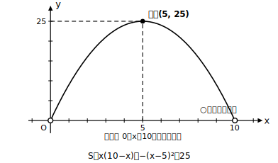
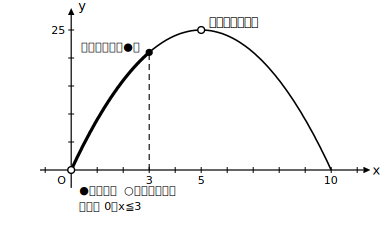

# L07 事象への適用——最大・最小の文章題

- unit_id: hs-math-i-quadratic-functions
- distribution_status: published_draft
- license: CC-BY-4.0
- verify_required: 例題数値・記述は監修者検証必須。
- distribution_status: published_draft
- 位置づけ: 単元第7レッスン（2時間）。L05〜L06の最大・最小を、面積・売上などの事象に適用する。
- 主概念: ①事象の数学化（ことば→二次関数のモデル→最大・最小→解釈） ②**文脈が定義域を決める**
- 注: 本レッスンの文脈・数値はすべて自作の架空設定であり、実在のデータ・企業・料金は用いない。

---

## 1. ことばの問題を関数の問題に直す

ここまでは式が最初から与えられていた。このレッスンでは、面積や売上のような**事象**から自分で式を作る。手順は3段で固定する。**①何をxとおくかを決め、他の量をxで表す → ②目的の量（面積・売上など）をxの式で表し、頂点が読める形に変形する → ③xの範囲（定義域）を文脈から決めてから、最大・最小を求めて事象のことばで答える**。②までで満足せず、③を必ず独立の1ステップとして踏むこと。ここがこのレッスンの主役である。

## 2. 例題1——ロープで囲む長方形

**例題1** 長さ20mのロープ全部を使って長方形の囲いを作る。面積が最大になるのはどんなときか。

縦の長さをx mとすると、周の長さが20mだから横は (10−x) m。面積S は

S = x(10−x) = −x²＋10x = −(x−5)²＋25

ここで止まらず、xの範囲を考える。**縦も横も長さだから正**でなければならない。x＞0 かつ 10−x＞0、つまり **0＜x＜10** がこの問題の定義域である。これは問題文に書かれていない——**文脈（長さは正）が定義域を決めている**。L01の長方形の例で「x＞0」と約束したことの再訪である。

頂点は (5, 25) で、x=5 は定義域 0＜x＜10 の中にある。よって **x=5（縦5m・横5m の正方形）のとき面積は最大値25m²**。最後に「Sの最大値は25」で終えず、「縦5m・横5mのとき面積が最大で25m²」と**事象のことばに戻して**答える。

## 3. 例題2——模擬店の売上モデル

**例題2** 文化祭の模擬店でドリンクを売る。事前の試し売りから、1杯の価格をp円にすると1日に (120−p) 杯売れる、というモデルを立てた（架空の設定）。1日の売上が最大になる価格を求めよ。

売上y円は「価格×杯数」だから

y = p(120−p) = −(p−60)²＋3600

定義域を文脈から決める。価格は正、売れる杯数も正だから 0＜p＜120。頂点 (60, 3600) はこの範囲の中にあるので、**価格60円のとき売上は最大値3600円**。「値上げすればするほど売上が増えるわけではない」——グラフの上に凸の形が、この事象のしくみをそのまま表している。

## 4. 定義域が頂点を締め出すこともある

文脈が決める範囲のせいで、**頂点が定義域の外に出る**ことがある。そのときはL06の手順どおり、まず「頂点（軸）が区間内にあるか」を判定し、区間外なら端点の値だけを候補にする。

**例題3** 例題1で、さらに「縦は3m以下にする」という条件がついたとする。定義域は 0＜x≦3 となり、頂点のx=5 は**区間の外**。S=−(x−5)²＋25 は x≦3 の範囲では増加するから、**x=3（縦3m・横7m）のとき最大値21m²**。式は例題1と同じでも、文脈が変われば定義域が変わり、答えも変わる。なお 0＜x≦3 は左端 x=0 を**含まない**区間である。L06の手順で「端の値」を候補にできるのは**区間に含まれる端**だけ——今回は最大値を与える x=3 が含まれる側なのでそのまま使えるが、含まれない端（x=0 側）の値は実現されないことに注意する。

## 5. 練習

**問1** 長さ36cmの針金全部を折り曲げて長方形を作る。縦をx cmとして面積をxの式で表し、xの範囲を文脈から述べたうえで、面積の最大値とそのときの形を求めよ。

**問2** 長さ12mのロープと、十分に長い壁を使って、壁を1辺とする長方形の囲いを作る（ロープは壁以外の3辺に使う）。壁と垂直な辺をx mとして、面積が最大になるxと最大値を求めよ。xの範囲も明示すること。

**問3** 問2で、さらに「壁と平行な辺は4m以下にする」という条件がついた。このときのxの範囲を求め、面積の最大値とそのときのxを求めよ。

**問4** ある模擬店で、1本の価格をp円にすると (100−p) 本売れるというモデルを立てた（架空の設定）。売上が最大になる価格と、そのときの売上を求めよ。pの範囲も明示すること。

**問5** 「S=x(10−x) の最大値を求めよ」とだけ言われた場合と、例題1のように囲いの面積として求める場合とで、考えるxの範囲はどう違うか。1〜2文で説明せよ。

---

## stretch（本線と分けて提示。余力のある生徒向け）

**S1** 例題2の模擬店で、ドリンク1杯あたり材料費が20円かかるとする。1日の利益（売上−材料費の合計）は (p−20)(120−p) 円と表せる。利益が最大になる価格と最大の利益を求めよ。pの範囲を文脈から述べてから解くこと。

<!-- gen_nav:nav:start（自動生成・手編集しない） -->

---

[← 前のレッスン](lesson_06.md)｜[単元の目次](README.md)｜[解答](answer_key_L07-09.md)｜[次のレッスン →](lesson_08.md)

<!-- gen_nav:nav:end -->
