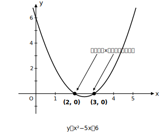

# L08 二次方程式とグラフ——x軸との共有点

- unit_id: hs-math-i-quadratic-functions
- distribution_status: published_draft
- license: CC-BY-4.0
- verify_required: 例題数値・記述は監修者検証必須。
- distribution_status: published_draft
- 位置づけ: 単元第8レッスン（2時間）。中学既習の二次方程式を、グラフとx軸の共有点として捉え直す。
- 主概念: 二次方程式の実数の解＝グラフとx軸の共有点のx座標
- 注: 共有点の「個数」の議論はL09で扱う。本レッスンでは扱わない。解の公式は「解を求める道具」としてのみ使い、√の中身の符号の議論へは進まない。

---

## 1. 方程式とグラフをつなぐ

中学で学んだ二次方程式 x²−5x＋6=0 を、この単元の目でもう一度見る。左辺を関数 y=x²−5x＋6 のyだと思うと、この方程式は「**yが0になるxはどれか**」という問いになる。グラフの上で y=0 が成り立つ点とは、**グラフとx軸が交わる点（共有点）** のことである。つまり——

**二次方程式 ax²＋bx＋c=0 の実数の解は、放物線 y=ax²＋bx＋c とx軸の共有点のx座標**

この単元で「解」と言うときは、**実数の範囲**で考える（L12でも「実数解」と呼ぶ。数の世界をさらに広げる話は数IIで学ぶ）。方程式を「計算の問題」から「グラフの読み取り」へつなぐ、この見方が本レッスンの主役である。

## 2. 例題1——因数分解で解いて、グラフで確かめる

**例題1** 放物線 y=x²−5x＋6 とx軸の共有点の座標を求めよ。

共有点では y=0 だから、x²−5x＋6=0 を解けばよい。因数分解して (x−2)(x−3)=0、よって x=2, 3。共有点は **(2, 0) と (3, 0)** である。y座標はどちらも0——「x軸上の点」なのだから当然だが、答えに書き忘れやすいので注意する。

確かめは代入でできる。x=2 を代入すると 4−10＋6=0、x=3 では 9−15＋6=0。どちらも y=0 になるから、グラフがこの2点をたしかに通ることが式の上で保証される。共有点を求めるだけなら、頂点（平方完成）まで求める必要はない。

## 3. 例題2——因数分解できないときは解の公式

**例題2** 放物線 y=x²−2x−1 とx軸の共有点のx座標を求めよ。

x²−2x−1=0 は整数の範囲で因数分解できない。こういうときは中学で学んだ**解の公式**を使う。

x = (2±√(4＋4))／2 = (2±2√2)／2 = **1±√2**

解の公式は、ここでは「**解を求めるための道具**」である。√2≒1.41 だから共有点のx座標はおよそ −0.41 と 2.41。共有点のx座標は、このように**整数とは限らない**。グラフを描くとき、x軸との交点が目盛りの上にないこともある、と知っておこう。

## 4. 逆向きに読む——グラフから方程式の解を読む

つながりは逆向きにも使える。y=x²−1 のグラフは頂点 (0, −1) の下に凸の放物線で、x軸と (−1, 0), (1, 0) で交わる。このグラフを見れば、方程式 x²−1=0 の解が x=±1 だと**計算せずに読み取れる**。「方程式を解く」と「グラフとx軸の交点を読む」は、同じことの2つの顔である。この見方は、次のL09（共有点の個数）と、L10以降の二次不等式で本格的に活躍する。

## 5. 練習

**問1** 放物線 y=x²−x−6 とx軸の共有点の座標を求めよ。

**問2** 放物線 y=−x²＋4x とx軸の共有点の座標を求めよ。

**問3** 放物線 y=2x²−8x＋6 とx軸の共有点のx座標を求めよ。

**問4** 放物線 y=x²−4x＋1 とx軸の共有点のx座標を求めよ（解の公式を使ってよい）。

**問5** x²の係数が1で、グラフがx軸と2点 (−1, 0), (5, 0) で交わる二次関数の式を1つ書け。

---

## stretch（本線と分けて提示。余力のある生徒向け）

**S1** 放物線 y=x²−2x−2 と直線 y=2x＋3 の共有点の座標を求めよ。（ヒント: 共有点では2つの式のyが等しい。x軸との共有点で使った考え方が、x軸以外の直線でもそのまま使える。）

<!-- gen_nav:nav:start（自動生成・手編集しない） -->

---

[← 前のレッスン](lesson_07.md)｜[単元の目次](README.md)｜[解答](answer_key_L07-09.md)｜[次のレッスン →](lesson_09.md)

<!-- gen_nav:nav:end -->
