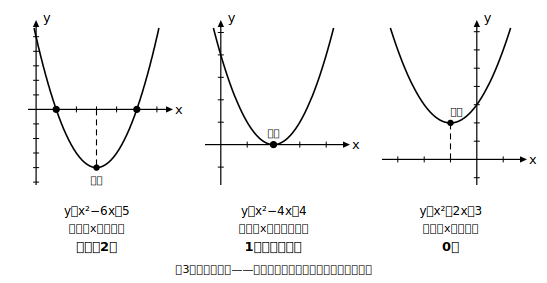
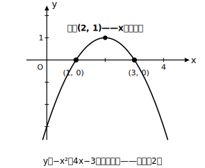

# L09 x軸との共有点の個数

- unit_id: hs-math-i-quadratic-functions
- distribution_status: published_draft
- license: CC-BY-4.0
- verify_required: 例題数値・記述は監修者検証必須。
- distribution_status: published_draft
- 位置づけ: 単元第9レッスン（2時間）。共有点の個数（2個・1個・0個）をグラフで判定する。
- 主概念: 共有点の個数は「凸の向き」と「頂点のy座標の符号」から、グラフの概形で判定できる
- 注: 個数の判定はグラフと頂点のy座標で行う。方程式を解いて数える確認は従。解の公式の√の中身を個数判定の道具として一般化しない（数IIで学ぶ内容には進まない）。

---

## 1. 共有点は2個とは限らない

L08では共有点が2個の場合ばかりだった。しかし放物線とx軸の位置関係は3通りある。**2点で交わる／1点で接する／共有点をもたない**。グラフが1点だけをx軸と共有するとき、グラフはx軸に**接する**といい、その点を**接点**という。この3通りを、方程式を解かずに**グラフの概形から**見分けるのが本レッスンの主役である。

## 2. 判定のしかた——凸の向きと頂点のy座標

決め手は2つだけ。**凸の向き**（aの符号）と、**頂点のy座標の符号**である。たとえば下に凸で頂点がx軸より下にあれば、グラフは頂点から左右へ上がっていく途中で必ずx軸を2回横切る。頂点がちょうどx軸の上にあれば、x軸と触れるのはその1点だけ。頂点がx軸より上なら、グラフ全体がx軸より上にあって共有点はない。

| 凸の向き | 頂点のy座標 | 共有点の個数 |
|---------|-----------|------------|
| 下に凸（a＞0） | 負 | 2個 |
| 下に凸（a＞0） | 0 | 1個（接する） |
| 下に凸（a＞0） | 正 | 0個 |
| 上に凸（a＜0） | 正 | 2個 |
| 上に凸（a＜0） | 0 | 1個（接する） |
| 上に凸（a＜0） | 負 | 0個 |

表を丸暗記する必要はない。**毎回、頂点の位置に点を打ち、凸の向きに小さく概形をかけば**、個数は絵から読める。手順は3段——**①平方完成して頂点を求める → ②凸の向きと頂点のy座標の符号でグラフの概形をかく → ③x軸を横切る回数を読む**。

## 3. 例題——3つの場合を並べる

**例題1** y=x²−6x＋5 のグラフとx軸の共有点の個数を求めよ。

平方完成: y=(x−3)²−4。頂点 (3, −4)、下に凸。頂点がx軸より**下**にあるから、共有点は**2個**。確認として方程式を解くと (x−1)(x−5)=0 より x=1, 5——たしかに2個ある。

**例題2** y=x²−4x＋4 のグラフとx軸の共有点の個数を求めよ。

y=(x−2)² と変形できる。頂点 (2, 0) が**x軸の上にのっている**から、共有点は**1個**。グラフは点 (2, 0) でx軸に接する。

**例題3** y=x²＋2x＋3 のグラフとx軸の共有点の個数を求めよ。

y=(x＋1)²＋2。頂点 (−1, 2)、下に凸。頂点がx軸より**上**にあり、グラフはそこから上がる一方だから、共有点は**0個**。「方程式 x²＋2x＋3=0 には実数の範囲で解がないから0個」と計算で押し切るのではなく、**グラフが浮いているから交わらない**、と絵で言えることが大切である。

## 4. 上に凸の場合——向きが変わると条件が逆になる

**例題4** y=−x²＋4x−3 のグラフとx軸の共有点の個数を求めよ。

y=−(x−2)²＋1。頂点 (2, 1)、上に凸。今度は頂点がx軸より**上**にあることが「2個」の条件になる。グラフは頂点から左右へ下がっていき、x軸を2回横切る。共有点は**2個**（確認: −(x−1)(x−3)=0 より x=1, 3）。**「頂点が下なら2個」と符号だけで覚えない**こと。凸の向きとセットで、必ず概形をかいて判断する。

## 5. 練習

**問1** y=x²−2x−3 のグラフとx軸の共有点の個数を、頂点とグラフの概形から判定せよ。そのあと方程式を解いて確かめよ。

**問2** y=x²＋6x＋9 のグラフとx軸の共有点の個数を判定せよ。共有点があればその座標も答えよ。

**問3** y=−x²＋2x−5 のグラフとx軸の共有点の個数を判定せよ。

**問4** y=−x²−4x のグラフとx軸の共有点の個数を判定し、共有点のx座標を求めよ。

**問5** 「頂点のy座標が負ならば、グラフとx軸の共有点は必ず2個ある」——この主張は正しいか。正しくない場合は、あてはまらない例を1つ挙げて説明せよ。

---

## stretch（本線と分けて提示。余力のある生徒向け）

**S1** kを定数とする。y=x²−4x＋k のグラフがx軸に接するとき、kの値を求めよ。また、共有点が2個になるのはkがどんな範囲のときか。（ヒント: 平方完成して頂点のy座標をkの式で表し、その符号で考える。）

<!-- gen_nav:nav:start（自動生成・手編集しない） -->

---

[← 前のレッスン](lesson_08.md)｜[単元の目次](README.md)｜[解答](answer_key_L07-09.md)｜[次のレッスン →](lesson_10.md)

<!-- gen_nav:nav:end -->
