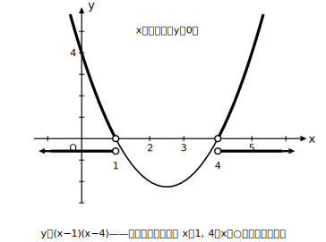
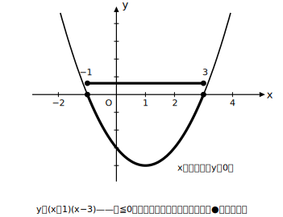

# L10 二次不等式①——前提の確認とグラフで解く

- unit_id: hs-math-i-quadratic-functions
- distribution_status: published_draft
- license: CC-BY-4.0
- verify_required: 例題数値・記述は監修者検証必須。
- distribution_status: published_draft
- 位置づけ: 単元第10レッスン（3時間）。L08〜L09の「グラフとx軸の共有点」を土台に、二次不等式をグラフで解く。
- 主概念: ①「不等式の解」とは条件を満たすxの集合であることの確認 ②y>0 ⇔ グラフがx軸より上、という読み方

---

## 0. 本編の前に——2つの前提を別々に確かめる

二次不等式に入る前に、使う道具を2つ、**別々に**確認する。この2つが混ざったまま進むとつまずきやすい。

**前提①: グラフが読める。**
y=(x−1)(x−5) のグラフは、下に凸で、x軸との共有点は x=1 と x=5 の2個（L08の「解＝共有点のx座標」）。頂点をわざわざ求めなくても、共有点2つと凸の向きだけで概形はかける。これがこのレッスンで使う読み方のすべてである。

**前提②: 「不等式の解」とは何か。**
一次不等式 2x−6>0 の解は x>3。この「x>3」は答えの数が1個あるという意味ではなく、**条件を満たすxの値の全部の集まり**を表している。x=4 も x=100 も 3.001 も全部解であり、それをまとめて「x>3」と書いている。方程式の解（数が数個）とは答えの形が違う——ここを先に約束しておく。

## 1. y>0 をグラフで読む

**例題1** 二次不等式 x²−5x＋4>0 を解け。

y=x²−5x＋4 とおく。因数分解すると y=(x−1)(x−4)。グラフは下に凸で、x軸と x=1、x=4 で交わる。

求めるのは「y の値が 0 より大きくなる x の全部」。グラフで言えば、**グラフがx軸より上にある部分の、xの範囲**である。下に凸だから、グラフがx軸より上にあるのは共有点の外側。よって解は

**x<1 または 4<x**

検算として範囲の中と外から1つずつ代入する。x=0 のとき y=4>0（解に含まれる側・成立）、x=2 のとき y=4−10＋4=−2<0（含まれない側・不成立）。この「中と外で1点ずつ確かめる」を毎回の習慣にする。

## 2. y≦0 をグラフで読む——等号があるときは共有点も入る

**例題2** 二次不等式 x²−2x−3≦0 を解け。

y=(x−1)(x−3)……ではない。まず因数分解を確かめる: x²−2x−3=(x＋1)(x−3)。共有点は x=−1 と x=3、下に凸。

「y≦0」は「x軸より下、**または**x軸上」。x軸上の点（共有点そのもの）も含むから、解は

**−1≦x≦3**

等号なし（<0）なら共有点は入らず −1<x<3 になる。**不等号に等号がつくかどうかで、共有点のx座標を解に入れるかどうかが変わる**——この区別は次のL11で主役になる。

## 3. x²の係数が負のとき——まず正に直す

**例題3** 二次不等式 −x²＋4x−3>0 を解け。

上に凸のまま読んでもよいが、読み間違いを防ぐため、**両辺に−1を掛けて x² の係数を正に直す**手順をすすめる。負の数を掛けるので不等号の向きが変わり、

x²−4x＋3<0

y=(x−1)(x−3) は下に凸で共有点 x=1、x=3。「y<0」は共有点の間だから、解は **1<x<3**。

検算: x=2 を元の不等式に入れると −4＋8−3=1>0 で成立。範囲の外の x=0 では −3>0 は不成立。**検算は必ず元の不等式で行う**（直した式で確かめると、向きの変え忘れに気づけない）。

## 4. 手順の型

1. （必要なら）x²の係数を正に直す。不等号の向きに注意。
2. 左辺=0 の共有点を求め、下に凸のグラフの概形をかく。
3. 「>0 なら上側」「<0 なら下側」の部分のxの範囲を読む。
4. 等号つきなら共有点を含める。
5. 範囲の中と外から1点ずつ、**元の不等式**に代入して確かめる。

## 5. 練習

**問1**（前提確認） (1) y=(x＋2)(x−4) のグラフとx軸の共有点のx座標を答えよ。 (2) 一次不等式 3x−12>0 の解を求め、「解が表しているもの」を一言で説明せよ。

**問2** x²−5x＋6>0 を解け。

**問3** x²＋x−6≦0 を解け。

**問4** −x²＋6x−8≧0 を解け。

**問5** x²−4x>0 を解け（定数項がない形。因数分解 x(x−4) に注意）。

**問6**（言語化） 「x²−5x＋6>0 の解が、グラフのx軸より上の部分のx座標全部になる」のはなぜか。前提②の言葉（解とは何か）を使って2〜3文で説明せよ。

---

## stretch（本線と分けて提示。余力のある生徒向け）

**S1** x²−2x−1<0 を解け（因数分解できない場合。x²−2x−1=0 の解を解の公式で求めてから、グラフで範囲を読む）。

<!-- gen_nav:nav:start（自動生成・手編集しない） -->

---

[← 前のレッスン](lesson_09.md)｜[単元の目次](README.md)｜[解答](answer_key_L10-12.md)｜[次のレッスン →](lesson_11.md)

<!-- gen_nav:nav:end -->
