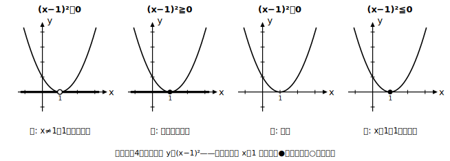
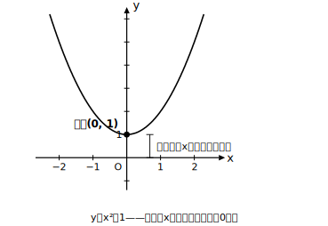

# L11 二次不等式②——共有点が特殊な場合（strict／non-strictの4パターン）

- unit_id: hs-math-i-quadratic-functions
- distribution_status: published_draft
- license: CC-BY-4.0
- verify_required: 例題数値・記述は監修者検証必須。
- distribution_status: published_draft
- 位置づけ: 単元第11レッスン（2.5時間）。共有点が1個・0個の場合の二次不等式に特化する。
- 主概念: ①不等号の種類（等号なし＝strict／等号つき＝non-strict）で解集合が変わる ②接点を「含む・除く」の判断を毎回グラフで言語化する

---

## 1. 共有点が1個のとき——y=(x−1)² で4パターンを全部見る

y=(x−1)² のグラフは、下に凸で、x軸と x=1 の1点だけで接する（L09）。x=1 では y=0、それ以外のすべての x では y>0。この1つのグラフに対して、不等号を4通りに変えて解を読む。

**パターン1: (x−1)²>0**
「x軸より上（0は含まない）」。グラフは x=1 以外のすべてで上にあり、x=1 だけは y=0 なので**除く**。解は **x=1 以外のすべての実数（x≠1）**。

**パターン2: (x−1)²≧0**
「x軸より上、または x軸上」。x=1 の接点も y=0 だから**含む**。解は **すべての実数**。

**パターン3: (x−1)²<0**
「x軸より下」。グラフにx軸より下の部分は1点もない。解は **なし（解なし）**。

**パターン4: (x−1)²≦0**
「x軸より下、または x軸上」。下の部分はないが、x軸上の点が x=1 に1つだけある。解は **x=1**。

4つを並べると、違いを生んでいるのは**接点の1点 x=1 を含むか除くか**だけだとわかる。「すべての実数」「解なし」という答えの形に驚いて丸暗記に走らず、毎回グラフの接点を指差して「この1点は y=0。今の不等号は 0 を含む？含まない？」と**声に出して判断**すること。

## 2. 練習の型——接点の言語化

**例題1** x²−6x＋9≦0 を解け。

x²−6x＋9=(x−3)²。下に凸で x=3 で接する。「≦0」は下または x軸上。下の部分はなく、x軸上は接点 x=3 の1点のみ。等号つきだから接点を**含む**。解は **x=3**。

検算: x=3 で (3−3)²=0≦0 成立。x=4 で 1≦0 不成立。**解が1点だけになる二次不等式がある**——これがパターン4の型である。

## 3. 共有点が0個のとき——同じ4パターンで整理する

y=x²＋1 のグラフは、y=x² を y軸方向に＋1 平行移動したもので、頂点 (0, 1)。頂点のy座標が正で下に凸だから、グラフ全体がx軸より上にあり、x軸との共有点は0個（L09の読み方）。

- **x²＋1>0** → グラフ全体が上。解は**すべての実数**。
- **x²＋1≧0** → 上または x軸上。x軸上の点はないが、上の部分だけで既に全部。解は**すべての実数**。
- **x²＋1<0** → 下の部分はない。**解なし**。
- **x²＋1≦0** → 下も x軸上もない。**解なし**。

共有点が0個のときは、**接点がないので等号の有無で答えが変わらない**（>と≧が同じ、<と≦が同じ）。共有点1個のときとの違いはここにある。

**例題2** x²−2x＋3>0 を解け。

因数分解できないので、頂点を読むための変形（平方完成）をする: x²−2x＋3=(x−1)²＋2。頂点 (1, 2) は x軸より上、下に凸だから共有点は0個で、グラフ全体がx軸より上。解は**すべての実数**。

検算: どの x でも (x−1)²≧0 だから (x−1)²＋2≧2>0。たとえば x=1 で 2>0、x=−1 で 6>0、いずれも成立。

## 4. 判断の手順（このレッスンの型）

1. 左辺のグラフをかく（共有点の個数は、平方完成した頂点のy座標の符号と凸の向きで判断——L09）。
2. 共有点が1個なら、接点の1点を図に打つ。
3. 不等号を読む: 等号なし（>、<）なら「y=0 の点は**除く**」、等号つき（≧、≦）なら「y=0 の点は**含む**」。
4. 答えを言葉で確かめる: 「上側全部＋接点あり／なし」→ すべての実数か、x≠か。「下側なし＋接点あり／なし」→ 解なしか、1点か。
5. 仕上げに1点を代入して検算する——ただし、1点の代入で確かめられるのは「向きの取り違え（含む／除くや上側／下側の逆転）がないか」まで。「すべての実数」「解なし」という結論そのものの根拠は、あくまでグラフと (x−□)²≧0 の性質である（1点で全体は証明できない）。

## 5. 練習

**問1** 次の4つをそれぞれ解け（グラフは1つでよい）。
(1) (x−2)²>0  (2) (x−2)²≧0  (3) (x−2)²<0  (4) (x−2)²≦0

**問2** x²＋4x＋4≧0 を解け。

**問3** x²−8x＋16<0 を解け。

**問4** 次の4つをそれぞれ解け。
(1) x²＋5>0  (2) x²＋5≧0  (3) x²＋5<0  (4) x²＋5≦0

**問5** x²＋2x＋4≦0 を解け（平方完成して共有点の個数から判断）。

**問6**（言語化） (x−2)²>0 と (x−2)²≧0 の解が違う理由を、「接点」という言葉を使って2〜3文で説明せよ。

---

## stretch（本線と分けて提示。余力のある生徒向け）

**S1** −(x−1)²≧0 を解け（上に凸でx軸に接する場合。「≧0 なのに解が1点だけ」になる理由をグラフで説明すること）。

**S2** 不等式 (x−3)²≦k の解が「x=3 の1点だけ」になるような定数 k の値を求めよ。

<!-- gen_nav:nav:start（自動生成・手編集しない） -->

---

[← 前のレッスン](lesson_10.md)｜[単元の目次](README.md)｜[解答](answer_key_L10-12.md)｜[次のレッスン →](lesson_12.md)

<!-- gen_nav:nav:end -->
