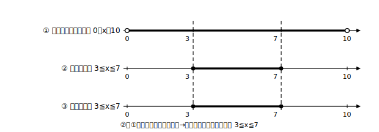

# L12 文脈への活用と単元のまとめ

- unit_id: hs-math-i-quadratic-functions
- distribution_status: published_draft
- license: CC-BY-4.0
- verify_required: 例題数値・記述は監修者検証必須。
- distribution_status: published_draft
- 位置づけ: 単元第12レッスン（1.5時間）。前半0.5時間で二次不等式の文脈適用、後半で単元全体の構造を振り返る。
- 主概念: ①文脈が定義域・条件を決めたうえで二次不等式を使う ②単元マップ（頂点形〈＝頂点が読める形〉⇄一般形、グラフ⇄方程式⇄不等式）の再確認

---

## 1. 文脈のなかの二次不等式

**例題1** 周の長さが 20cm の長方形をつくる。縦の長さを x cm とするとき、面積が 21cm² 以上になるような x の範囲を求めよ。

**手順①: 文脈から定義域を決める（L07の再訪）。** 横の長さは 10−x cm。縦も横も正でなければならないから、x>0 かつ 10−x>0、すなわち **0<x<10**。ここは不等式を解く前に、文脈だけから決まる。

**手順②: 条件を不等式にする。** 面積は x(10−x) cm² だから、条件は x(10−x)≧21。

**手順③: グラフで解く（L10の型）。** 整理して −x²＋10x−21≧0。両辺に−1を掛けて向きを変え、x²−10x＋21≦0、つまり (x−3)(x−7)≦0。下に凸で共有点 x=3、x=7、「≦0」は間（等号つきで両端を含む）。よって 3≦x≦7。

**手順④: 定義域と重ねる。** 3≦x≦7 は 0<x<10 にすべて収まっているので、答えは **3≦x≦7**。

検算: x=3 で面積 3×7=21≧21 成立（端も含む——等号つきだから）。x=5 で 5×5=25≧21 成立。x=2 で 2×8=16 は 21 未満で不成立。**数学の解と文脈の制約（定義域）を最後に必ず突き合わせる**——これがこの単元の文章題すべてに共通する型である。

## 2. 練習

**問1** ボールを打ち上げたときの高さが h=−5t²＋20t（h はm、t は秒、0≦t≦4）で表されるとする。高さが 15m より高くなる t の範囲を求めよ。

**問2** 周の長さが 16cm の長方形をつくる。縦の長さを x cm とするとき、面積が 12cm² 以下になるような x の範囲を求めよ（定義域との重ね合わせに注意）。

## 3. 単元のまとめ——2つの往復がこの単元の骨組み

**往復①: 頂点形 ⇄ 一般形**
- 頂点形——L02の「頂点が読める形」（軸・頂点が読める形）を、このまとめでは短くこう呼ぶ——は y=a(x−p)²＋q の形。
- 一般形 y=ax²＋bx＋c から頂点を読みたいときは、頂点を読むための変形（平方完成）で頂点形に直す（L03）。
- 最大・最小（L05〜L07）は、頂点が読めればグラフから決まる。区間つきなら「軸が区間内か」をまず判定する（L06）。

**往復②: グラフ ⇄ 方程式 ⇄ 不等式**
- 二次方程式の解 ＝ グラフとx軸の共有点のx座標（L08）。
- 共有点の個数は、頂点のy座標の符号と凸の向きで読む（L09）。
- 二次不等式の解 ＝ グラフがx軸より上（下）にある部分のxの範囲（L10）。共有点が1個・0個のときは、接点を含むか除くかを不等号の等号で判断する（L11）。

つまりこの単元は、「**式から頂点を読み、グラフをかき、グラフで方程式・不等式を読む**」という1本の流れでできている。個々の解法を別々に覚えるのではなく、どの問題でも「まずグラフ」に戻れることがゴールである。

**振り返り問題** 次の(1)〜(3)を、上の単元マップのどこ（L番号）を使うか言ってから解け。
(1) y=x²−4x＋1 の頂点を求めよ。
(2) x²−4x＋1=0 の実数解の個数をグラフから答えよ。
(3) x²−4x＋1>0 を解け。

この先（数学II）では、方程式・不等式そのものをさらに詳しく学ぶ。ここで身につけた「グラフで読む」見方がその土台になる。

---

## stretch（本線と分けて提示。余力のある生徒向け）

**S1** 例題1で「面積が 21cm² 以上」を「面積が 25cm² 以上」に変えると、答えはどうなるか。

<!-- gen_nav:nav:start（自動生成・手編集しない） -->

---

[← 前のレッスン](lesson_11.md)｜[単元の目次](README.md)｜[解答](answer_key_L10-12.md)

<!-- gen_nav:nav:end -->
