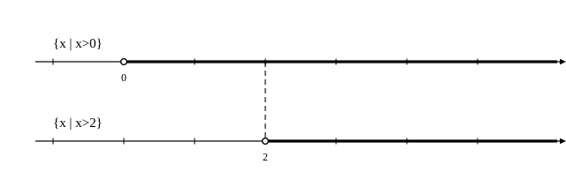

# L01 集合と要素——「集まり」を記号で書く

- unit_id: hs-math-i-sets-and-logic
- 位置づけ: 単元第1レッスン（1時間）。単元の入口。これまで「集まり」と日常の言葉で呼んできたものを「集合」と名づけ、要素・部分集合・空集合を記号で書けるようにする回。L02（共通部分・和集合・補集合）の土台になる。
- distribution_status: published_draft
- license: CC-BY-4.0
- verify_required: 例題数値・記述は監修者検証必須。
- 主概念: ①集合・要素・∈∉と2通りの表し方（要素を書き並べる／条件で表す） ②部分集合⊂・等しい集合・空集合∅

---

## 1. 「集まり」に名前をつける

先行の「数と式」の単元では、不等式の解を「条件を満たす x の値の全部の集まり」と日常の言葉で呼び、数直線の上の範囲としてかいた。中学でも、数の範囲を負の数や無理数へ広げるとき、関数の変域を考えるとき、「集まり」の考え方はすでに使っている。ただし、中学では「集合」という言葉は使わなかった。この単元では、その「集まり」を数学の言葉と記号で書けるようにする。言葉と記号がそろうと、「かつ」「または」「ならば」といった論理の道具が、次のレッスン以降で集合の図と結びついて見えるようになる。

範囲がはっきり決まったものの集まりを**集合**（しゅうごう）といい、集合に入っている1つ1つのものを、その集合の**要素**（ようそ）という。「範囲がはっきり決まった」とは、どんなものを持ってきても、その集合に入るか入らないかが決まる、という意味だ。

- 「10 以下の正の偶数の集まり」は集合である。2 は入る、7 は入らない、12 は入らない——どの数についても、入るかどうかが決まる。
- 「大きい数の集まり」は集合ではない。1000 は入るのか。100 はどうか。決める基準がないので、入るかどうかが定まらない。

集合には A, B のような大文字の名前をつけることが多い。10 以下の正の偶数の集合を A とすると、A の要素は 2, 4, 6, 8, 10 の 5 個で、これを

A={2, 4, 6, 8, 10}

と書く。中かっこ { } の中に要素を書き並べる書き方だ。

a が集合 A の要素であることを **a∈A** と書き、「a は A に**属する**（ぞくする）」と読む。a が A の要素でないことは **a∉A** と書く。A={2, 4, 6, 8, 10} なら、4∈A、7∉A である。記号 ∈ は「入っている」、∉ は「入っていない」の印だと思えばよい。

**例題1** 12 の正の約数全体の集合を A とする。A の要素をすべて書き並べよ。また、4 と 8 について、A に属するかどうかを記号で書け。

12 を割り切る正の整数を小さい順に探す。1, 2, 3, 4, 6, 12 の 6 個で、A={1, 2, 3, 4, 6, 12}。4 は 12 を割り切るので 4∈A。8 は 12 を割り切らない（12÷8 は整数にならない）ので 8∉A。

検算: 12=1×12=2×6=3×4 と、積の形で相方を確かめる。約数は必ず相方と組になるから、1 と 12、2 と 6、3 と 4 の 3 組で 6 個——書き並べた個数と一致する。この「相方と組で数える」は、約数の集合を書くときの見落とし防止になる。ただし、別の数、たとえば 4 の約数を数えるときは、4=2×2 のように相方が自分自身と同じ数になる。そのときは、その約数（ここでは 2）を組にせず1回だけ数える（4 の約数は 1, 2, 4 の 3 個）。

## 2. 集合の2通りの表し方

集合の表し方は2通りある。

1. **要素を書き並べる**: A={1, 2, 3, 4, 6, 12} のように、要素を { } の中に並べる。要素の順番は問わない（{12, 6, 4, 3, 2, 1} と書いても同じ集合である）。
2. **条件で表す**: A={x | x は 12 の正の約数} のように、{ } の中を縦棒で区切り、左に要素を代表する文字、右にその文字が満たす条件を書く。「x は 12 の正の約数である、という条件を満たす x 全体の集合」と読む。

同じ集合が、2通りの書き方で表せる。

A={1, 2, 3, 4, 6, 12}={x | x は 12 の正の約数}

要素が多い集合や、要素を書き並べられない集合では、条件で表す書き方が力を発揮する。たとえば「2 より大きい実数全体の集合」は、要素が限りなくあり、どこから並べ始めるかも決まらないので書き並べられないが、

{x | x>2}

と書けば1行で表せる。不等式の解として数直線にかいてきた範囲は、まさにこの形の集合である。

**例題2** 次の集合を、(1)は要素を書き並べる形に、(2)は条件で表す形に直せ。
(1) {x | x は 20 以下の正の 3 の倍数}
(2) {1, 4, 9, 16, 25}

(1) 3, 6, 9, 12, 15, 18 が 20 以下の正の 3 の倍数のすべてなので、{3, 6, 9, 12, 15, 18}。次の 21 は 20 を超えるから入らない。
(2) 1=1²、4=2²、9=3²、16=4²、25=5² だから、{x | x は 5 以下の自然数の 2 乗}。

検算: (1)は 3×1 から 3×6=18 まで 6 個——20÷3=6 余り 2 なので、3 の倍数は 6 個で数が合う。(2)は書き並べた 5 個を条件に戻して 1², 2², 3², 4², 5² を計算し、もとの 5 個と一致することを確かめる。

:::guide
**なぜ表し方が2通り要るのか**

要素を書き並べる書き方は、要素が何かがひと目でわかる。一方で、{x | x>2} のように、どこから並べ始めるかも決まらない集合には使えない。書き並べようとすると、2.1 も 2.01 も 2.001 も要素で、2 に近い方へいくらでも続く。条件で表す書き方なら、要素が限りなくあっても「入るかどうかの基準」を1行で示せる。ただし、条件で表した集合は読み間違いが起きやすい。{x | x は 20 以下の正の 3 の倍数} を、「20 以下」を落として {3, 6, 9, 12, …} と読んでしまう、あるいは「正の」を落として 0 や −3 を入れてしまう——条件の言葉を1つ落とすと、別の集合になる。条件で表された集合を見たら、条件を区切って1つずつ確かめ、要素を数個書き出してみるのが確実だ。逆に、書き並べられた集合から条件を作るときは、作った条件で要素を生成し直して、もとの並びと過不足なく一致するかを見る。2通りの表し方の間を往復できることが、この節の目標である。
:::

## 3. 部分集合と等しい集合

2つの集合の関係を考える。A={1, 3}、B={1, 2, 3, 4} とすると、A の要素 1 も 3 も、どちらも B の要素である。このように、集合 A のどの要素も集合 B の要素であるとき、A は B の**部分集合**（ぶぶんしゅうごう）であるといい、**A⊂B** と書く。「A は B に**含まれる**」「B は A を含む」とも読む。

A={1, 3}、B={1, 2, 3, 4} なら A⊂B である。B⊂A は成り立たない——B の要素 2 は A の要素ではないからだ。部分集合でないことを示すには、「B に入っていて A に入っていない要素」を1つ見つければよい。

なお、A のどの要素も A の要素だから、A⊂A はいつでも成り立つ（自分自身も部分集合に数える）。「部分」という字だが、「一部分だけ」という意味ではない。部分集合の条件は「A のどの要素も B の要素である」ことだけなので、要素がそっくり同じでも条件は満たされる。

要素が限りなくある集合どうしでも、部分集合の関係は考えられる。{x | x>2} と {x | x>0} を数直線にかいてみよう。

数直線に範囲をかくときの約束を確かめておく。端の値を含むときは ●、含まないときは ○ をおく。x>2 は 2 自身を含まないので 2 に ○、x≧2 なら 2 を含むので ● である。

図を見ると、下段の範囲（x>2）は上段の範囲（x>0）の中にすっぽり入っている。2 より大きい数は、必ず 0 より大きいからだ。つまり

{x | x>2}⊂{x | x>0}

である。この「範囲がすっぽり入る」という見方は、L03で「ならば」の真偽を判定するときの主役になる。

次に、等しい集合。A⊂B と B⊂A が両方とも成り立つとき、A と B は要素がまったく同じで、A と B は**等しい**といい、A=B と書く。たとえば {1, 2, 3} と {3, 1, 2} は、書く順番が違うだけで要素が同じだから等しい。{x | x は 6 の正の約数} と {1, 2, 3, 6} も等しい。

**例題3** A={x | x は 12 の正の約数}、B={x | x は 6 の正の約数}、C={2, 3, 5} とする。B⊂A、C⊂A はそれぞれ成り立つか。

要素を書き並べる。A={1, 2, 3, 4, 6, 12}、B={1, 2, 3, 6}。
B の要素 1, 2, 3, 6 はどれも A の要素だから、B⊂A は成り立つ。
C の要素 5 は A の要素ではない（5 は 12 を割り切らない）。だから C⊂A は成り立たない。

検算: 部分集合の判定は「左の集合の要素を1つずつ、右の集合の中に探す」を全要素についてやり切る。B は 4 個すべて見つかった。C は 2, 3 は見つかるが 5 で止まった——1つでも見つからなければ部分集合ではない。

:::guide
**a∈A と {a}⊂A——「要素」と「部分集合」を書き分ける**

A={1, 2, 3} のとき、2 は A の要素だから 2∈A と書く。では {2}⊂A はどうか。{2} は「2 だけを要素にもつ集合」であり、その要素 2 が A の要素だから、{2}⊂A も正しい。両方正しいのだが、記号の使い分けは決まっている。∈ の左には「もの」（要素）、⊂ の左には「集合」が来る。2⊂A は、⊂ の左に集合でないものを書いているので、記号の使い方が合っていない。{2}∈A は、A の要素は 1, 2, 3 という数であって {2} という集合ではないので、正しくない。迷ったら、左に書いたものが集合（{ } で包んだものや、A・P のように名前をつけた集合）か、要素（数などのもの）かを見る。この区別は、L03で「x∈P ならば x∈Q」（要素の話）と「P⊂Q」（集合の話）を行き来するときに効いてくる。
:::

## 4. 空集合——要素が1つもない集合

条件で集合を表すと、条件を満たすものが1つもないことがある。たとえば {x | x は 2 より大きく 3 より小さい整数} には、要素が1つもない。2 と 3 の間に整数はないからだ。

要素を1つももたない集合を**空集合**（くうしゅうごう）といい、記号 **∅** で表す。空集合も集合の仲間に入れておくと、「条件を満たすものがない」という結果を、集合の言葉で書き表せる。たとえば不等式に解がないとき、解の集合は ∅ である。

空集合について、次のことを約束しておく。空集合は、どんな集合の部分集合でもある——∅⊂A がどんな集合 A についても成り立つ。§3 で見たとおり、部分集合でないことを示すには「左の集合に入っていて右の集合に入っていない要素」を1つ見つければよい。∅ にはそのような要素が1つもないので、∅⊂A が成り立たないとは決して言えない——だから成り立つと約束する。

:::guide
**「解なし」と ∅ は同じことを言っている**

方程式や不等式を解いて「解はない」と答えたことがあるだろう。集合の言葉では、「解の集合が ∅ である」と書く。同じ内容だが、集合で書くと1つ便利なことがある。「解の集合」がいつでも1つの集合として存在し、それがたまたま空だった、と扱えるのだ。解が1個の方程式も、解が範囲になる不等式も、解がない場合も、すべて「解の集合」という同じ枠で並べて見られる。次のレッスンでは、2つの集合の共通部分を考える。共通の要素がないとき、その共通部分は ∅ である——「解なし」の連立不等式が、集合の言葉ではこう表される。気をつけたいのは、{0} と ∅ の違いだ。{0} は 0 という要素を1個もつ集合で、空ではない。「0 だから何もない」と読まないこと。
:::

## 5. 練習

**問1** 30 の正の約数全体の集合を A とする。次の数について、A に属するかどうかを ∈ または ∉ を使って書け。
(1) 6  (2) 8  (3) 1  (4) 30

**問2** 次の集合を、(1)は要素を書き並べる形に、(2)は条件で表す形に、(3)は要素を書き並べる形に直せ。
(1) {x | x は 2 以上 10 以下の偶数}
(2) {1, 3, 5, 7, 9}
(3) {x | x は x²=16 を満たす実数}

**問3** A={1, 2, 4, 8}、B={x | x は 8 の正の約数}、C={2, 4, 6} とする。次の関係は成り立つか。成り立たないものは、その理由となる要素を1つ挙げよ。
(1) A⊂B  (2) B⊂A  (3) A=B  (4) C⊂A

**問4** 次の集合のうち、空集合であるものをすべて選べ。空集合でないものは、要素を1つ挙げよ。
(1) {x | x は 5 より大きく 6 より小さい整数}
(2) {x | x は 5 より大きく 6 より小さい実数}
(3) {x | x は x²=−1 を満たす実数}
(4) {0}

---

:::stretch
**S1** 自然数 n の正の約数全体の集合を D(n) と書くことにする。たとえば D(6)={1, 2, 3, 6} である。
(1) D(4)、D(12)、D(18) を、要素を書き並べる形で表せ。
(2) D(4)⊂D(12)、D(18)⊂D(12)、D(12)⊂D(18) は、それぞれ成り立つか。成り立たないものは、理由となる要素を1つ挙げよ。
(3) (2)の結果から、2つの自然数 m, n について D(m)⊂D(n) が成り立つのは m と n がどういう関係にあるときか予想し、その予想が正しい理由を2〜3文で説明せよ。（理由は、予想した関係が成り立つときに D(m)⊂D(n) が成り立つことを説明すればよい。D(m)⊂D(n) から m と n の関係を導き返すことは求めない）
:::

対応解答: answer_key_L01-03.md

<!-- gen_nav:nav:start（自動生成・手編集しない） -->

---

[単元の目次](README.md)｜[解答](answer_key_L01-03.md)｜[次のレッスン →](lesson_02.md)

<!-- gen_nav:nav:end -->
