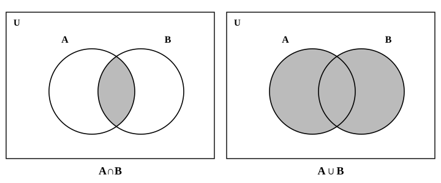
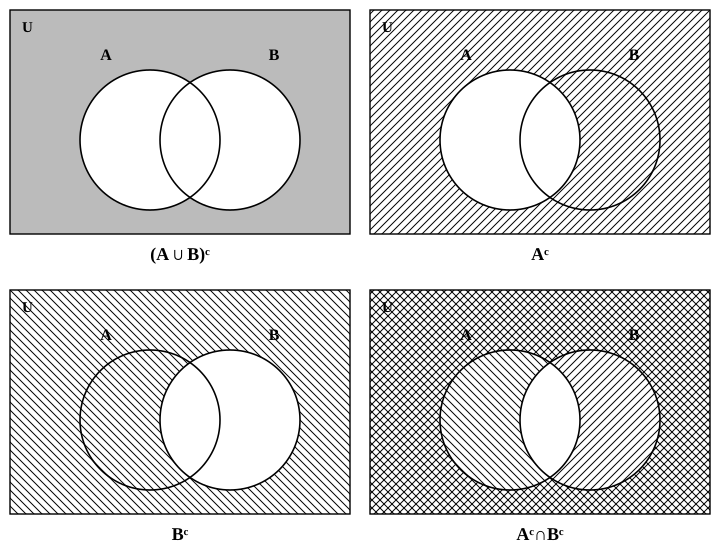

# L02 共通部分・和集合・補集合——ベン図で見る

- unit_id: hs-math-i-sets-and-logic
- 位置づけ: 単元第2レッスン（1.5時間）。L01で書けるようになった集合を2つ重ね、「かつ」「または」「でない」を ∩・∪・補集合の記号で書き、ベン図で見る回。集合の段の仕上げで、L03 以降の命題の真偽判定・L05の条件の否定の土台になる。
- distribution_status: published_draft
- license: CC-BY-4.0
- verify_required: 例題数値・記述は監修者検証必須。
- 主概念: ①共通部分∩（かつ）・和集合∪（または）・全体集合 U と補集合 Aᶜ（でない） ②ベン図とド・モルガンの法則（集合版）

---

## 1. 共通部分と和集合——「かつ」と「または」を記号にする

先行の「数と式」の単元で連立不等式を解いたとき、2つの不等式の解を数直線の上下に並べてかき、両方に入っている部分——共通部分——を読み取った。あれを集合の言葉で読み直すところから始める。

A={x | x≧1}、B={x | x<4} とする。A と B の両方に入っている x 全体は {x | 1≦x<4} で、数直線では 1 に ●、4 に ○ をおいた範囲になる。この「両方に入っている要素全体の集合」を、A と B の**共通部分**といい、**A∩B** と書く。

A∩B={x | x∈A かつ x∈B}

「かつ」が ∩ に対応する。∩ の記号は、伏せたお椀の形で、両方に入っているものだけを中に閉じこめる印と見ておくとよい。

もう1つ。A と B の少なくとも一方に入っている要素全体の集合を、A と B の**和集合**といい、**A∪B** と書く。

A∪B={x | x∈A または x∈B}

「または」が ∪ に対応する。ここで、数学の「または」の意味を確かめておく。**数学で「x∈A または x∈B」というときは、「少なくとも一方に入っている」という意味であり、両方に入っている場合も含む**。日常の会話では「AかBのどちらか一方」の意味で「または」を使うことがあるが、数学では違う。両方に入っている要素は、当然、和集合の要素である。記号の形で言えば、∪ は上の開いた器で、A の要素も B の要素もまとめて受け入れる印である。

**例題1** A={1, 2, 3, 6}、B={2, 3, 5, 7} のとき、A∩B と A∪B を求めよ。

両方に入っている要素は 2 と 3 だから、A∩B={2, 3}。
少なくとも一方に入っている要素を集めると、A∪B={1, 2, 3, 5, 6, 7}。2 と 3 は両方に入っているが、和集合には1回だけ書く（同じ要素を2回書かない）。

検算: A の要素 1, 2, 3, 6 と B の要素 2, 3, 5, 7 が、1つ残らず A∪B に入っているかを見る。逆に、A∪B に書いた 6 個がそれぞれ A か B の少なくとも一方にあるかを見る。A∩B の 2, 3 は、A の中にも B の中にも見つかる。どれも過不足なし。

2つの集合の関係を絵にしたものが**ベン図**と呼ばれる図である。長方形の中に、集合を丸で表す。2つの丸が重なった部分が A∩B、2つの丸を合わせた部分が A∪B にあたる。

共通の要素が1つもないこともある。A={1, 2}、B={3, 4} なら A∩B=∅ である。数直線の範囲でいえば、2つの範囲が重ならないとき、共通部分は空集合になる。和集合は、この例のように2つの範囲が離れているときは1つの範囲にまとまらず、たとえば A={x | x<−1}、B={x | x>3} なら A∪B={x | x<−1 または x>3} のように、「または」でつないだまま書く。

**例題2** A={x | −2≦x≦3}、B={x | 1<x≦5} のとき、A∩B と A∪B を求めよ。

数直線に A と B を上下に並べてかく。A は −2 に ●、3 に ●。B は 1 に ○、5 に ●。
両方に入っている部分は、1 は含まず 1 より大きいところから 3 までで、A∩B={x | 1<x≦3}。1 は B に入らないので ○、3 は A にも B にも入るので ● である。
少なくとも一方に入っている部分は、−2 から 5 までひとつながりで、A∪B={x | −2≦x≦5}。

検算: 端の値をもとの2つの条件に入れて確かめる。x=1 は A に入る（−2≦1≦3）が B に入らない（1<1 は成り立たない）ので、A∩B には入らず A∪B には入る ✓。x=3 は A に入り B にも入る（1<3≦5）ので、両方に入る ✓。x=5 は B にだけ入るので、A∪B には入り A∩B には入らない ✓。

:::guide
**「または」は「少なくとも一方」——A∩B は A∪B の中にある**

ベン図で A∪B を塗ると、A∩B の部分も必ず塗られる。つまり A∩B⊂A∪B がいつでも成り立つ。これは「または」が「少なくとも一方」を意味することの、図での現れだ。日常語の「または」に引っぱられると、「両方に入っているものは、どちらか一方ではないから和集合に入れない」と考えてしまいがちだが、それは数学の「または」ではない。例題1で 2 と 3 を A∪B から外してしまう誤りは、ここから来る。もう1つ、和集合で同じ要素を2回書く誤りもよく見かける。集合は「何が入っているか」だけで決まり、同じものが2回入ることはない。{1, 2, 2, 3} と書いても、それは {1, 2, 3} と同じ集合である。和集合を書くときは、A の要素をまず全部書き、次に B の要素のうち「まだ書いていないもの」だけを付け足す、と手順にしておくと二重書きを防げる。
:::

## 2. 全体集合と補集合——「でない」を記号にする

「3 の倍数でない数」の集合を考えたい。ところが「でない」は、考えている数の範囲が決まらないと定まらない。10 以下の自然数の中で考えるのと、整数全体の中で考えるのとでは、答えが違う。

そこで、考える対象全体の集合をあらかじめ決めておく。これを**全体集合**といい、ふつう U で表す。集合はすべて U の部分集合として考える。

全体集合 U の要素のうち、A に属さないもの全体の集合を、A の**補集合**といい、この教材では **Aᶜ** と書く。

Aᶜ={x | x∈U かつ x∉A}

「でない」が補集合に対応する。教科書では A の上に線を引いて補集合を表すが、この教材では画面表示の都合で Aᶜ と書く（c は complement〔補集合〕の頭文字）。ベン図では、U を表す長方形の中で、A の丸の外側全部が Aᶜ である。

**例題3** U={x | x は 10 以下の自然数} を全体集合とし、A={x | x は 3 の倍数}、B={x | x は偶数} とする。Aᶜ、Bᶜ、(A∩B)ᶜ を求めよ。

U={1, 2, 3, 4, 5, 6, 7, 8, 9, 10}、A={3, 6, 9}、B={2, 4, 6, 8, 10}。
Aᶜ は U から A の要素を取り除いたもので、Aᶜ={1, 2, 4, 5, 7, 8, 10}。
Bᶜ={1, 3, 5, 7, 9}（U の中の奇数）。
A∩B={6} だから、(A∩B)ᶜ は U から 6 を取り除いた {1, 2, 3, 4, 5, 7, 8, 9, 10}。

検算: A の要素と Aᶜ の要素を合わせて小さい順に並べると、1 から 10 までがちょうど1回ずつ現れる ✓。B と Bᶜ でも同じ ✓。補集合は「U を A と Aᶜ に二分する」ので、合わせて U に戻るかどうかが検算になる。

補集合について、次のことが定義からすぐにわかる。

- A∩Aᶜ=∅（A に入っていて A に入っていない要素はない）
- A∪Aᶜ=U（U のどの要素も、A に入るか入らないかのどちらかである）
- (Aᶜ)ᶜ=A（「A でない」でない、は A）
- Uᶜ=∅、∅ᶜ=U

:::guide
**補集合は「全体」を決めてはじめて決まる**

「偶数の補集合は奇数」と覚えている人は多いが、これは全体集合が整数全体のときの話だ。全体集合を実数全体にすると、偶数の補集合には 0.5 も √2 も入り、「奇数」とは全く別の集合になる。全体集合を 10 以下の自然数にすれば、例題3の Bᶜ のように 5 個の要素をもつ集合になる。補集合を求める問題では、全体集合が何かを最初に確かめる——問題文に U が書いてあればそれを、書いていなければ文脈から（自然数の話なら自然数全体、実数の話なら実数全体）読み取る。「でない」は、必ず「何の中で」とセットで意味をもつ。この見方は、L05で条件の否定（「x>2 でない」など）を扱うときにも、そのまま使う。
:::

## 3. ド・モルガンの法則——ベン図で確かめる

「A または B」でない、はどういう集合か。ベン図で考える。A∪B は2つの丸を合わせた部分だから、その補集合 (A∪B)ᶜ は、2つの丸のどちらにも入らない部分——長方形の中で丸の外側だけが残った部分——である。

一方、Aᶜ∩Bᶜ は「A に入らず、かつ B に入らない」部分である。A の外側と B の外側の両方に入っている部分は、やはり2つの丸のどちらにも入らない部分だ。

だから、この2つは同じ集合である。

(A∪B)ᶜ=Aᶜ∩Bᶜ

同じように、「A かつ B」でない、についても

(A∩B)ᶜ=Aᶜ∪Bᶜ

が成り立つ。A∩B は重なった部分だけだから、その補集合は「重なった部分以外の全部」。これは「A の外側」と「B の外側」の少なくとも一方に入っている部分と一致する。この2つの等式は**ド・モルガンの法則**と呼ばれる。言葉でいえば、

- 「A または B」の否定は「A でない、かつ、B でない」
- 「A かつ B」の否定は「A でない、または、B でない」

——補集合をとると、∪ と ∩ が入れ替わる。

**例題4** 例題3の U、A、B について、(A∪B)ᶜ と Aᶜ∩Bᶜ をそれぞれ求め、一致することを確かめよ。

A∪B={2, 3, 4, 6, 8, 9, 10} だから、(A∪B)ᶜ={1, 5, 7}。
Aᶜ={1, 2, 4, 5, 7, 8, 10}、Bᶜ={1, 3, 5, 7, 9} の両方に入っている要素は 1, 5, 7 で、Aᶜ∩Bᶜ={1, 5, 7}。
確かに一致する。

検算: 例題3で求めた (A∩B)ᶜ={1, 2, 3, 4, 5, 7, 8, 9, 10} も、Aᶜ∪Bᶜ={1, 2, 3, 4, 5, 7, 8, 9, 10} と一致する ✓——もう1つの等式も、この U、A、B で成り立っている。

:::guide
**∩ と ∪ の入れ替えを忘れる——ベン図の4つの領域で確かめる**

ド・モルガンの法則でよくある誤りは、(A∪B)ᶜ を Aᶜ∪Bᶜ と書いてしまうことだ。補集合の記号を中に配るだけで、∪ をそのまま残してしまう。Aᶜ∪Bᶜ は「A の外側、または B の外側」で、ベン図では重なった部分以外の全部——(A∪B)ᶜ より広い（等しくなるのは特別な場合だけ）。迷ったら、ベン図を4つの領域に分けて考える。①A だけに入る部分、②B だけに入る部分、③両方に入る部分、④どちらにも入らない部分。A と B から作られる集合はどれも、この4つの領域のどれを含むかで決まる。(A∪B)ᶜ は④だけ。Aᶜ は②と④、Bᶜ は①と④で、その共通部分は④だけ——一致する。一方 Aᶜ∪Bᶜ は①②④で、③だけを除いたもの＝(A∩B)ᶜ である。記号の変形に自信がないときは、この4領域の番号で両辺を書き出して比べればよい。番号の組が同じなら同じ集合を指し、違えば（4つの領域のどれにも要素があるかぎり）違う集合を指す。
:::

:::zatsudan
「または」という言葉を、日常でどう使っているか少し観察してみよう。飲み物の注文で「コーヒーまたは紅茶」と言われたら、ふつうはどちらか一方を選ぶ場面で、両方もらえるとは思わない。ところが「明日は雨または雪」と聞けば、雨と雪が混じって降る場合も含めて受け取るだろう。同じ「または」でも、場面によって「一方だけ」の意味になったり「少なくとも一方」の意味になったりする——日常語は文脈で意味を補っているわけだ。数学はこの揺れを許さず、「少なくとも一方」の意味に固定した。固定したおかげで、A∪B という記号が誰にとっても同じ集合を指す。記号は不親切に見えて、実は誤解を減らすための約束なのである。
:::
<!-- zatsudan話題源: SL_CONTENT_MAP_20260902 §5 許可リスト（日常語の「または」と数学語のずれ・固有名なし）。出典に依存する数値・事実は含まない -->

## 4. 練習

**問1** A={x | x は 20 以下の正の 4 の倍数}、B={x | x は 20 以下の正の 6 の倍数} のとき、A∩B と A∪B を求めよ。

**問2** 次の各組の A、B について、A∩B と A∪B を求めよ。数直線に2つの範囲を上下に並べてかき、端の値を含むかどうか（●か○か）に注意すること。
(1) A={x | −1≦x≦4}、B={x | x>2}
(2) A={x | x≦0}、B={x | x>2}。A∪B は数直線にもかけ。

**問3** U={x | x は 12 以下の自然数} を全体集合とし、A={x | x は 12 の約数}、B={x | x は 3 の倍数} とする。次の集合を求めよ。
(1) Aᶜ  (2) Bᶜ  (3) Aᶜ∩B  (4) A∪Bᶜ

**問4** 全体集合 U の中に2つの集合 A、B があるベン図を、次の4つの領域に分ける。①A だけに入る部分 ②B だけに入る部分 ③A と B の両方に入る部分 ④A にも B にも入らない部分。次の集合は、①〜④のどの領域を合わせたものか。番号で答えよ。
(1) A∩Bᶜ  (2) Aᶜ∪B  (3) (A∩B)ᶜ  (4) Aᶜ∩Bᶜ

**問5** U={x | x は 8 以下の自然数} を全体集合とし、A={1, 2, 3, 4}、B={3, 4, 5, 6} とする。
(1) (A∪B)ᶜ と Aᶜ∩Bᶜ をそれぞれ求め、一致することを確かめよ。
(2) (A∩B)ᶜ と Aᶜ∪Bᶜ をそれぞれ求め、一致することを確かめよ。

---

:::stretch
**S1** 全体集合 U の中に3つの集合 A、B、C があるとき、ベン図は3つの丸でかく。
(1) 3つの丸は、長方形の中をいくつの領域に分けるか。どの丸に入るか入らないかの組み合わせを考えて答えよ。
(2) U={x | x は 12 以下の自然数}、A={x | x は偶数}、B={x | x は 3 の倍数}、C={x | x は 4 の倍数} とする。A∩B∩C、A∩B∩Cᶜ、Aᶜ∩B∩Cᶜ、Aᶜ∩Bᶜ∩Cᶜ の4つの領域に入る要素を、それぞれ書き並べよ。
(3) (1)で数えた領域のうち、(2)の U、A、B、C では要素が1つも入らない領域が2つある。それはどの領域か、記号で表し、要素が入らない理由を1文で説明せよ。
:::

対応解答: answer_key_L01-03.md

<!-- gen_nav:nav:start（自動生成・手編集しない） -->

---

[← 前のレッスン](lesson_01.md)｜[単元の目次](README.md)｜[解答](answer_key_L01-03.md)｜[次のレッスン →](lesson_03.md)

<!-- gen_nav:nav:end -->
