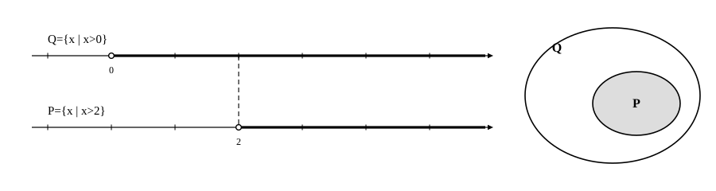

# L03 命題と真偽——集合の包含で判定する

- unit_id: hs-math-i-sets-and-logic
- 位置づけ: 単元第3レッスン（1.5時間）。ここから命題の段に入る。「正しいか正しくないかが決まる文」を命題と呼び、「p ならば q」の真偽を、L01〜L02の集合の包含関係で判定する回。偽であることの証明（反例1つ）は、中2で学び「数と式」でも使った反例の定義をそのまま使う。L04（必要条件・十分条件）の土台になる。
- distribution_status: published_draft
- license: CC-BY-4.0
- verify_required: 例題数値・記述は監修者検証必須。
- 主概念: ①命題・条件・真理集合と、p⇒q が真であることと P⊂Q が同じであること ②偽の証明＝反例1つ（中2の定義をそのまま使う）

---

## 1. 命題——正しいか正しくないかが決まる文

次の3つの文を比べてみよう。

- 「12 は 3 の倍数である」
- 「√2 は有理数である」
- 「7 は大きい数である」

1つ目は正しい。2つ目は正しくない（√2 が分数で表せないことは、実数の学習で「知られている事実」として受け取った。この単元の L07で証明する）。3つ目は、正しいとも正しくないとも決められない——何と比べて大きいのかが決まっていないからだ。

正しいか正しくないかが決まる文や式を**命題**という。命題が正しいとき、その命題は**真**であるといい、正しくないとき**偽**であるという。1つ目の文は真の命題、2つ目は偽の命題、3つ目は命題ではない。「正しくない文は命題ではない」と思わないように注意しよう。偽の命題も、れっきとした命題である。命題であるための条件は「真偽が決まること」だけだ。

命題の多くは「p ならば q」の形に書ける。中学で証明を学んだとき、「ならば」の前を**仮定**、後を**結論**と呼んだ。この教材では、「p ならば q」を記号で

p ⇒ q

と書く。たとえば「x>2 ならば x>0」は、仮定が x>2、結論が x>0 の命題で、x>2 ⇒ x>0 と書ける。

## 2. 条件と真理集合

「x>2」だけを取り出すと、これは命題だろうか。x=5 なら正しく、x=1 なら正しくない——x の値を決めないと真偽が決まらない。だから「x>2」は、そのままでは命題ではない。

このように、文字 x を含み、x の値を決めるとはじめて真偽が決まる文や式を、x に関する**条件**という。「x>2」「x は 3 の倍数である」「x²=9」はどれも条件である。

条件 p があるとき、p を満たす x 全体の集合を考えることができる。これを条件 p の**真理集合**と呼ぶ。条件を小文字 p、その真理集合を大文字 P で書くことにする。真理集合を考えるときは、x の動く範囲——全体集合 U——を決めておく。

たとえば U を実数全体とし、条件 p を「x>2」とすると、その真理集合は P={x | x>2} である。L01で見た「条件で表す集合」は、まさに条件の真理集合だった。

:::guide
**命題と条件を書き分ける——「x が入っていたら条件」ではない**

「x を含む文は条件、含まない文は命題」と覚えると、1か所で困る。「x>2 ならば x>0」は x を含むが、これは命題である。x にどんな実数を入れても成り立つ、ということが（x の値によらず）決まっているからだ。つまり「p ならば q」の形の文は、「x をどう選んでも、p が成り立てば q も成り立つ」という、x 全体についてのひとまとまりの主張であり、その全体として真偽が決まる。たとえば「x>3 ならば x>5」は、x=6 では成り立ち x=4 では成り立たないように見えるが、「x=6 のとき真、x=4 のとき偽」と x ごとに真偽が変わるのではない。x=4 のような例外が1つあることで、命題全体が偽と決まる（§4）。条件と命題の区別は、「x の値を決めないと真偽が決まらないか（条件）、x 全体についての1つの主張として真偽が決まっているか（命題）」で見る。この区別を持っていないと、L05で「条件の否定」を扱うとき、「x>2 でない」（条件の否定・真理集合は補集合）と「命題が偽である」（命題の否定）を混同しやすい。いま、「真理集合をもつのは条件」「真か偽かをもつのは命題」と、対応を1行で押さえておこう。
:::

## 3. 「p ならば q」の真偽を集合で判定する

命題「x>2 ならば x>0」が真であることを、集合で確かめる。仮定 x>2 の真理集合を P={x | x>2}、結論 x>0 の真理集合を Q={x | x>0} とする。L01で数直線にかいたとおり、P の範囲は Q の範囲の中にすっぽり入っていた——P⊂Q である。

P⊂Q とは、「P のどの要素も Q の要素である」ということだった。言い換えると、「x>2 を満たす x は、どれも x>0 を満たす」——これは命題「x>2 ならば x>0」が真であることそのものだ。一般に、

**命題 p⇒q が真であることと、真理集合について P⊂Q が成り立つことは、同じことである**。

逆に、P⊂Q が成り立たないとき、つまり P に入っていて Q に入っていない要素があるとき、命題 p⇒q は偽である。

これで、「ならば」の真偽を判定する道具ができた。仮定と結論の真理集合をそれぞれ求め、包含関係（一方が他方に含まれるかどうか、つまり ⊂ が成り立つかどうか）を調べればよい。数直線で表せる条件なら、範囲がすっぽり入るかどうかを見る。

**例題1** 次の命題の真偽を、真理集合の包含関係で判定せよ。
(1) x>5 ならば x>3
(2) x>3 ならば x>5

(1) P={x | x>5}、Q={x | x>3}。数直線にかくと、P の範囲（5 に ○・右へ）は Q の範囲（3 に ○・右へ）の中に入る。P⊂Q だから、この命題は真。
(2) P={x | x>3}、Q={x | x>5}。P の範囲は Q の範囲からはみ出す——たとえば x=4 は P に入る（4>3）が Q に入らない（4>5 ではない）。P⊂Q は成り立たないので、この命題は偽。

検算: 判定の根拠を、具体的な数で確かめる。(1)は、P から x=6、x=100 を取ると、どちらも Q に入る ✓（ただし、数個確かめるだけでは真の証明にならない。根拠は範囲の包含である）。(2)は、はみ出した数 x=4 を仮定と結論の両方に入れて、仮定は成り立ち結論は成り立たないことを確かめた ✓。

**例題2** x は自然数とする。次の命題の真偽を、真理集合を書き並べて判定せよ。
(1) x が 18 の約数ならば、x は 36 の約数である
(2) x が 36 の約数ならば、x は 18 の約数である

(1) P={1, 2, 3, 6, 9, 18}、Q={1, 2, 3, 4, 6, 9, 12, 18, 36}。P の要素はどれも Q の要素だから P⊂Q。この命題は真。
(2) P={1, 2, 3, 4, 6, 9, 12, 18, 36}、Q={1, 2, 3, 6, 9, 18}。P の要素 4 は Q に入っていない。P⊂Q は成り立たないので、この命題は偽。

検算: (1)は P の 6 個の要素を1つずつ Q の中に探して、6 個とも見つかった ✓。(2)は P の要素 4、12、36 のどれもが Q に入っておらず、1つでもあれば偽と決まる ✓。

要素が限りなくあって書き並べ切れない集合では、要素の形で包含を示す。たとえば「x が 4 の倍数ならば、x は偶数である」なら、4 の倍数は 4×(整数)=2×(2×整数) の形だから、どれも偶数である——P のどの要素も Q に入る。

:::guide
**「成り立つ例が多い」では真にならない——P が Q にひとつ残らず入るか**

命題「x>3 ならば x>5」は、x=6 でも x=10 でも x=1000 でも成り立つ。成り立つ例はいくらでも見つかる。それでもこの命題は偽だ。真であるとは、「仮定を満たす x のすべてについて結論が成り立つ」ことであり、P の要素がひとつ残らず Q に入ることだからである。ひとつでも Q からはみ出せば、包含は壊れる。だから「真だと思う」と言うためには、例をいくつ集めても足りず、範囲の包含（数直線ですっぽり入る、または、要素を全部確かめる）を示さなければならない。例題1(1)の検算で「数個確かめるだけでは証明にならない」と書いたのは、この理由による。逆に、偽であることは、はみ出した要素を1つ見せれば済む。次の節で、この「1つ」の意味を確かめる。
:::

## 4. 偽であることの証明——反例を1つ

命題 p⇒q が偽であるとは、P に入っていて Q に入っていない要素があることだった。そのような要素、すなわち**仮定を満たしていて結論を満たしていない例**を、この命題の**反例**という。中2で学んだ「反例」の定義そのものである。

命題が偽であることを示すには、反例を1つ挙げれば十分である。例題1(2)の x=4、例題2(2)の x=4 が、それぞれの命題の反例だ。「x=12 も 36 も反例だから、全部挙げないといけないのでは」と思うかもしれないが、必要なのは1つでよい。反例が1つあれば、「P のどの要素も Q に入る」という包含は、その1つで壊れているからだ。

反例は、数が1個とは限らない。仮定が2つの文字を含むなら、反例は2つの数の組になる。

**例題3** 先行の「数と式」の単元で、「和の√は分けられない」ことを反例で確かめた。これを命題の形に書き直す。命題「a, b が正の数ならば、√a＋√b=√(a＋b) である」について、仮定と結論を書き、反例を1つ挙げて、この命題が偽であることを示せ。

仮定: a, b が正の数である。結論: √a＋√b=√(a＋b) である。
反例として a=4、b=9 を取る。仮定は満たす（4 も 9 も正の数）。左辺は √4＋√9=2＋3=5。右辺は √(4＋9)=√13。5 と √13 が等しいかどうかは2乗して比べる——5²=25、(√13)²=13 で、25≠13 だから 5≠√13。結論が成り立たない。
仮定を満たし結論を満たさない例（a, b）=（4, 9）があるので、この命題は偽である。

検算: 反例の資格は2つ——仮定を満たすこと（4>0、9>0 ✓）と、結論を満たさないこと（25≠13 ✓）。この2つを両方確かめてはじめて反例になる。結論だけ見て「5 と √13 は違いそう」で止めず、2乗して確かめた。

:::guide
**なぜ反例は1つで足りて、真の証明は1つでは足りないのか**

「1つの例で偽が決まるのに、1つの例で真が決まらないのは不公平だ」と感じるかもしれない。しかしこれは、真と偽の意味の違いから来る当然の非対称である。真は「P のすべての要素が Q に入る」という「すべて」の主張で、偽はその否定——「Q に入らない P の要素が少なくとも1つある」という「少なくとも1つ」の主張だ。「すべて」を示すには全部を調べるか、全部を一度に扱える理屈（範囲の包含）が要る。「少なくとも1つ」を示すには、その1つを見せればよい。反例を挙げるときの注意は、仮定を満たすことを必ず確かめることだ。命題「x>3 ならば x>5」に対して x=2 を持ち出しても、2 は仮定 x>3 を満たさないので反例にならない。反例は P の中から、Q に入らないものを探す。数直線なら「はみ出した部分」に、書き並べた集合なら「P にあって Q にない要素」に、反例は必ずいる。
:::

## 5. 練習

**問1** 次の文のうち、命題であるものには真偽を、条件であるものには「条件」と答えよ。
(1) 15 は 5 の倍数である。
(2) x＋3=7
(3) 1 は素数である。
(4) x を整数とするとき、x が偶数ならば x² は偶数である。

**問2** x は実数とする。次の命題の真偽を、真理集合を数直線に表して判定せよ。偽の場合は反例を1つ挙げよ。
(1) x>4 ならば x>1
(2) x>1 ならば x>4
(3) x≧−1 ならば x>−1

**問3** x は自然数とする。次の命題の真偽を、真理集合の包含関係で判定せよ。偽の場合は反例を1つ挙げよ。
(1) x が 6 の倍数ならば、x は 3 の倍数である
(2) x が 3 の倍数ならば、x は 6 の倍数である

**問4** 次の命題は偽である。反例を1つ挙げ、それが反例である理由（仮定を満たし、結論を満たさないこと）を確かめよ。
(1) x は実数とする。x²=9 ならば x=3 である。
(2) x は自然数とする。x が 4 の倍数ならば、x は 8 の倍数である。

**問5** 次の命題は偽である。反例を1つ挙げ、それが反例である理由を確かめよ。
(1) a, b は実数とする。a>b ならば a²>b² である。
(2) n は自然数とする。n が素数ならば、n は奇数である。

---

:::stretch
**S1** x は 1 以上 20 以下の自然数とする。条件 p を「x は 6 の倍数である」、条件 q を「x は 2 の倍数であり、かつ 3 の倍数である」とする。
(1) p の真理集合 P と q の真理集合 Q を、要素を書き並べる形で表せ。
(2) 命題 p⇒q と命題 q⇒p の真偽を、それぞれ判定せよ。
(3) P と Q の関係を、L01で学んだ記号で表せ。また、(2)の結果とその関係とのつながりを1〜2文で説明せよ。
:::

対応解答: answer_key_L01-03.md

<!-- gen_nav:nav:start（自動生成・手編集しない） -->

---

[← 前のレッスン](lesson_02.md)｜[単元の目次](README.md)｜[解答](answer_key_L01-03.md)｜[次のレッスン →](lesson_04.md)

<!-- gen_nav:nav:end -->
