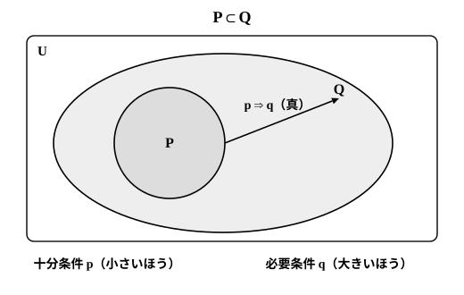
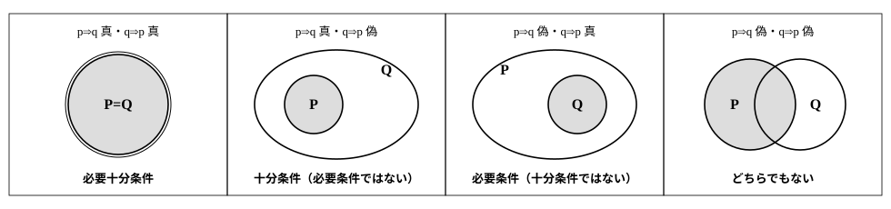

# L04 必要条件・十分条件——向きを図で固定する

- unit_id: hs-math-i-sets-and-logic
- 位置づけ: 単元第4レッスン（1.5時間）。命題と条件の段（L03〜L05）の2本目。L03で「p⇒q が真であることと P⊂Q は同じこと」と固定した包含の図に、「十分条件」「必要条件」という語を後から当てる。必要十分条件と記号 ⇔ を導入し、後続「二次関数」の不等式・方程式の扱いへ渡す。
- distribution_status: published_draft
- license: CC-BY-4.0
- verify_required: 例題数値・記述は監修者検証必須。
- 主概念: ①十分条件・必要条件（P⊂Q の図から語へ） ②必要十分条件・同値（⇔）

---

## 1. 図から始める——小さい集合に入っていれば、大きい集合にも入る

L03で、命題「p ならば q」（p⇒q）が真であることは、条件 p の真理集合 P が条件 q の真理集合 Q に含まれること（P⊂Q）と同じだ、と確かめた。このレッスンでは、その図に**名前**を付ける。名前は2つ出てくるが、覚えるものは図1枚だけである。

n を自然数として、次の2つの条件を考える。

p: n は 6 の倍数　　q: n は 3 の倍数

真理集合を書き出すと、P={6, 12, 18, 24, …}、Q={3, 6, 9, 12, 15, 18, …}。P の要素はすべて Q に入っている（6 の倍数は 3×(2×整数) の形だから 3 の倍数でもある）。一方 Q には、3 や 9 のように P に入らない要素がある。つまり P は Q に含まれ、しかも Q のほうが大きい。だから「n が 6 の倍数ならば n は 3 の倍数」は真で、逆向きの「n が 3 の倍数ならば n は 6 の倍数」は偽（反例 n=3）である。

この図（小さい P が大きい Q の中にある図）を、2通りの日本語で読む。

- P の中にいるものは、必ず Q の中にもいる。——**p であれば、q と言うのに十分**である。
- Q の外にいるものは、P の中にはいられない。つまり、q を満たしていなければ p は成り立ちようがない。——**q であることは、p であるために必要**である。

そこで、次のように呼ぶ。

> p⇒q が真であるとき、
> p は q であるための**十分条件**である、といい、
> q は p であるための**必要条件**である、という。

上の例では、「n は 6 の倍数」は「n は 3 の倍数」であるための十分条件であり、「n は 3 の倍数」は「n は 6 の倍数」であるための必要条件である。**十分条件は小さい集合のほう、必要条件は大きい集合のほう**——判定に迷ったら、語ではなく、この図に戻る。

## 2. 語を当てる——向きを図で決めてから名前を読む

**例題1** x を実数とする。条件 p: x=3 と条件 q: x²=9 について、p は q であるための何条件か。

真理集合は P={3}、Q={3, −3}（2乗して 9 になる実数は 3 と −3 の2つ）。P⊂Q だから p⇒q は真。逆向きの q⇒p は、x=−3 が q を満たすのに p を満たさないので偽（反例 x=−3）。したがって、p は q であるための**十分条件であるが、必要条件ではない**。

検算は、図と反例で行う。P が Q の中にあることを要素で確かめ（3∈Q）、逆向きが崩れることを反例1つで確かめる（−3∈Q だが −3∉P）。「小さいほうが十分」なので、P={3} が小さい側にある p が十分条件——図の読みと語が一致した。

:::guide
**「必要」という言葉を日常の意味で読むと、向きが逆に見える**

例題1の結果を §1 の定義に当てはめると、「x²=9 は、x=3 であるための必要条件」——日本語にすれば「x=3 であるためには x²=9 であることが必要」——となる。この言い方に、しっくりこなかったかもしれない。日常語の「必要」は「それがなければ始まらない前提」という強い意味で使われるので、「x²=9 が前提で、だから x=3」と、因果の向きで読みたくなる。しかし数学の「必要条件」は、因果でも順序でもなく、**集合の大きさ（包含）の関係**だけを言っている。Q={3, −3} は P={3} より大きい。P の中にいるなら必ず Q の中にいるのだから、「Q の中にいること」は「P の中にいること」の必要条件——それだけの意味である。言葉の感じで向きを決めようとすると、人によって逆に読める。だから、判定はいつも図で行う。P と Q を書く、一方が他方にすっぽり入るか、入るならどちらが小さいか見る、小さいほうが十分条件・大きいほうが必要条件。この手順に言葉の感覚が入り込む余地はない。
:::

:::zatsudan
「十分」という言葉のほうは、日常語と数学語でずれが小さい。「これだけあれば十分」は、「それ以上は要らない、それだけで足りる」という意味で、数学の「p であれば q と言うのに足りる」とほぼ同じ向きを向いている。ずれが大きいのは「必要」のほうで、日常語では「なくてはならないもの」「先に用意すべき前提」を指すことが多い。数学の「必要条件」は、「それを満たしていないと話にならない（Q の外にいたら P には入れない）」という意味で、「前提」の感じは共通しているのに、文の中での置かれ方が日常語と逆になりやすい。ずれがあると知っておくだけでも、言葉に引きずられにくくなる——そして最後は図で決める。
:::
<!-- zatsudan話題源: SL_CONTENT_MAP_20260902 §5 許可リスト（日常語の「必要」「十分」と数学語のずれ・固有名なし）。出典に依存する数値・逸話は使用していない -->

## 3. 4つに分ける——十分・必要・必要十分・どちらでもない

条件 p と q が与えられたとき、調べることは2つだけである。p⇒q は真か（P⊂Q か）、q⇒p は真か（Q⊂P か）。この2つの真偽の組み合わせで、答えは次の4通りに分かれる。

| p⇒q | q⇒p | 真理集合の関係 | p は q であるための |
|---|---|---|---|
| 真 | 真 | P と Q が等しい | 必要十分条件 |
| 真 | 偽 | P が Q に含まれ、Q のほうが大きい | 十分条件であるが、必要条件ではない |
| 偽 | 真 | Q が P に含まれ、P のほうが大きい | 必要条件であるが、十分条件ではない |
| 偽 | 偽 | どちらも他方に含まれない | 必要条件でも十分条件でもない |

**例題2** x を実数とする。次の各組について、p は q であるための何条件か。「必要十分条件」「十分条件であるが必要条件ではない」「必要条件であるが十分条件ではない」「必要条件でも十分条件でもない」のいずれかで答え、真理集合の関係を理由として述べよ。

(1) p: x>5、q: x>2
(2) p: x²=4、q: x=2
(3) p: 2x−6=0、q: x=3
(4) p: x>1、q: x<4

(1) P={x | x>5}、Q={x | x>2}。数直線に描くと P は Q の中にある（5 より大きければ 2 より大きい）から p⇒q は真。逆向きの q⇒p は x=3 が反例（3∈Q だが 3∉P）で偽。よって p は q であるための**十分条件であるが、必要条件ではない**。
(2) P={2, −2}、Q={2}。Q⊂P だから q⇒p は真。p⇒q は x=−2 が反例で偽。よって p は q であるための**必要条件であるが、十分条件ではない**。
(3) 2x−6=0 を解くと x=3 だから P={3}。Q={3}。P と Q は等しく、p⇒q も q⇒p も真。よって p は q であるための**必要十分条件**である。
(4) P={x | x>1}、Q={x | x<4}。x=5 は P に入るが Q に入らないので p⇒q は偽。x=0 は Q に入るが P に入らないので q⇒p は偽。よって p は q であるための**必要条件でも十分条件でもない**。

(4) のように、P と Q が重なる部分（1<x<4）を持っていても、どちらも他方を含まなければ「どちらでもない」である。重なることと含むことは別の話だ。

:::guide
**「どちらでもない」も、立派な答えである**

4分類の問題で、「どちらでもない」を答えに選びにくい、という声がある。何かしら関係があるはずだと思って、無理に十分か必要かを選んでしまう。しかし例題2(4) のように、P と Q が互いにはみ出しているなら、p⇒q も q⇒p も偽であり、答えは「どちらでもない」で確定する。この判定を確実にする道具が**反例**で、両方向に1つずつ挙げればよい（P にあって Q にない要素を1つ、Q にあって P にない要素を1つ）。逆に言えば、反例が片方向にしか存在しないなら、答えは「十分」か「必要」のどちらかであり、両方向とも反例が存在しない（P⊂Q と Q⊂P がともに成り立つ）なら「必要十分」である。反例が「見つからない」ことと「存在しない」ことは別なので、後者は包含で確かめる。4分類は、暗記で選ぶものではなく、反例を探した結果として決まる。
:::

## 4. 必要十分条件と同値——記号 ⇔

例題2(3) のように、p⇒q と q⇒p の両方が真であるとき、p は q であるための**必要十分条件**であるという。このとき q も p であるための必要十分条件であり、p と q は**同値**であるという。記号では

p ⇔ q

と書く。真理集合で言えば、**P と Q が等しい**ということである。

**例題3** x を実数とする。条件 p: x²−4x＋4=0 と条件 q: x=2 は同値か。

左辺を因数分解すると x²−4x＋4=(x−2)² だから、p は (x−2)²=0、すなわち x=2 と同じ条件である。P={2}、Q={2} で等しく、p⇒q も q⇒p も真。よって p と q は**同値**である（p ⇔ q）。

検算は、P と Q を要素で突き合わせて行う。x=2 を x²−4x＋4 に代入すると 4−8＋4=0 で p を満たす。逆に、p を満たす x が 2 以外にないことは (x−2)²=0 の解が 2 だけであることから分かる。両方向を確かめて、初めて ⇔ と書いてよい。

:::guide
**⇔ は「＝」の条件版——方程式を解く1行1行が、実は ⇔ でつながっている**

「同値」は、条件の世界での「等しい」である。2つの条件が同値なら、片方を満たすものの集まりと、もう片方を満たすものの集まりが完全に一致する（P=Q）。だから、方程式や不等式を解く作業は、「与えられた条件を、同値な、より簡単な条件に置き換え続ける」作業と言える。例題3で x²−4x＋4=0 を x=2 に書き換えたのも、この置き換えである。ここで大切なのは、⇔ が使えるのは**両方向が真のときだけ**という点だ。例題2(2) の x²=4 と x=2 のように、片方向しか真でない2条件を ⇔ で結んでしまうと、真理集合が変わってしまう（P={2, −2} を Q={2} に縮めてしまい、解を1つ落とす）。この後の単元で不等式や方程式を扱うときに、変形の1行1行が ⇔ になっているか——真理集合を変えていないか——を意識する習慣は、ここから始まる。
:::

## 5. 判定の手順の型

条件 p, q について「p は q であるための何条件か」を答えるときは、次の順に進める。

1. 何についての条件か（x は実数か、n は自然数か）を確かめる。真理集合は、この全体の中で考える。
2. 真理集合 P, Q を求める。数直線に描くか、要素を列挙する。
3. p⇒q が真か（P⊂Q か）を調べる。成り立たないなら、反例（P にあって Q にない要素）を1つ書く。
4. q⇒p が真か（Q⊂P か）を調べる。成り立たないなら、反例（Q にあって P にない要素）を1つ書く。
5. §3の表に当てはめて、「十分条件は小さいほう、必要条件は大きいほう」で答える。両方真なら必要十分条件（⇔）。

## 6. 練習

**問1** x を実数とする。条件 p: x>3 は、条件 q: x>0 であるための何条件か。真理集合の関係を理由として答えよ。

**問2** n を自然数とする。条件 p「n は 12 の約数」は、条件 q「n は 6 の約数」であるための何条件か。真理集合を要素の列挙で書いて答えよ。

**問3** x を実数とする。条件 p: x＋1>0 は、条件 q: x>−1 であるための何条件か。

**問4** x を実数とする。条件 p: x<2 は、条件 q: x>−1 であるための何条件か。理由となる反例も書け。

**問5** x を実数とする。次の各組の条件 p, q は同値か。同値でない場合は、成り立たない向きと反例を答えよ。
(1) p: 2x−8=0、q: x=4
(2) p: x²=16、q: x=4

---

:::stretch
**S1** x を実数とする。条件 p: −2≦x≦4、条件 q: 1≦x≦6、条件 r: 1≦x≦4 について、次に答えよ。
(1) P∩Q と P∪Q を、それぞれ不等式で表せ。また、P は Q に含まれず、Q も P に含まれないことを、反例を1つずつ挙げて示せ。
(2) r は p であるための何条件か。また、r は q であるための何条件か。
(3) 条件「p かつ q」と条件 r は同値であることを、真理集合を使って説明せよ。
:::

対応解答: answer_key_L04-05.md

<!-- gen_nav:nav:start（自動生成・手編集しない） -->

---

[← 前のレッスン](lesson_03.md)｜[単元の目次](README.md)｜[解答](answer_key_L04-05.md)｜[次のレッスン →](lesson_05.md)

<!-- gen_nav:nav:end -->
