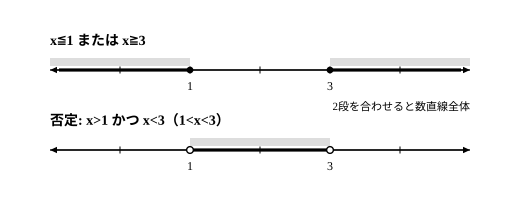

# L05 条件の否定——「かつ・または」「すべて・ある」

- unit_id: hs-math-i-sets-and-logic
- 位置づけ: 単元第5レッスン（1.0時間）。命題と条件の段（L03〜L05）の3本目。条件 p の否定「p でない」の真理集合が補集合 Pᶜ であることを土台に、L02のド・モルガンの法則を条件の言葉に読み替え、「かつ・または」「すべて・ある」を含む条件の否定を作る。次のL06（逆・裏・対偶）で、条件の否定を毎回使う。
- distribution_status: published_draft
- license: CC-BY-4.0
- verify_required: 例題数値・記述は監修者検証必須。
- 主概念: ①条件の否定＝真理集合の補集合・ド・モルガンの法則（条件版） ②「すべて」「ある」の否定

---

## 1. 条件の否定と補集合——「p でない」の真理集合は P の補集合

x を実数とし、全体集合 U を実数全体とする。条件 p: x>2 に対して、「p でない」という条件、すなわち「x>2 でない」を考える。x>2 でない実数とは、2 より大きくない実数、つまり x≦2 を満たす実数である。

条件 p の真理集合を P とすると、「p でない」の真理集合は、U のうち P に入らないもの全部——L02で学んだ**補集合 Pᶜ**である。上の例なら P={x | x>2}、Pᶜ={x | x≦2}。数直線に描くと、P は 2 に○を打って右側、Pᶜ は 2 に●を打って左側で、2つを合わせるとちょうど数直線全体になる。

条件 p に対して、「p でない」という条件を p の**否定**という。否定を作るときの要点は次の2つである。

- 否定の真理集合は補集合 Pᶜ。**P と Pᶜ を合わせると全体集合 U になり、重なりはない**。
- 不等号の否定では、向きを変えるだけでなく、**等号の有無が入れ替わる**（x>2 の否定は x≦2。x<2 ではない）。

**例題1** 次の条件の否定を作れ。(1)(2) では x は実数、(3) では n は自然数とする。
(1) x≧5
(2) x=−1
(3) n は 3 の倍数

(1) 「x≧5 でない」は、x が 5 以上でない、すなわち **x<5**。
(2) 「x=−1 でない」は **x≠−1**。
(3) **n は 3 の倍数でない**。

検算は、真理集合を数直線か列挙で描いて、もとの条件と否定が「合わせて全体・重なりなし」になるかを見る。(1) なら、x≧5 は 5 に●を打って右側、x<5 は 5 に○を打って左側。端点 5 はどちらか一方（ここでは x≧5 の側）だけに入り、2つを合わせると数直線全体になる。(3) なら、自然数を 1 から順に並べて、3 の倍数（3, 6, 9, …）とそれ以外（1, 2, 4, 5, 7, 8, …）で全部の自然数が過不足なく2つに分かれることを確かめる。

:::guide
**否定は「反対」ではない——端点の行方を数直線で確かめる**

「x>2 の否定は？」と聞かれて x<2 と答えたくなるのは、否定を「反対の向き」と考えているからである。しかし否定の真理集合は補集合、つまり**全体集合から P を除いた残り全部**であって、「反対側」ではない。x>2 と x<2 では、x=2 がどちらにも入らず、行き場を失う。数直線に P と否定の真理集合を両方描いて、合わせて全体になっているか（すき間がないか）、重なっていないか、を毎回見る——この検算は、網かけが反対側へ移っているかと端点の○●を見るだけで済む。等号つきの不等号 ≧ の否定が等号なしの < になり、等号なしの > の否定が等号つきの ≦ になるのも、端点が必ずどちらか一方に入るからである。
:::

## 2. 「かつ」「または」の否定——ド・モルガンの法則（条件版）

L02で、「かつ」が ∩ に、「または」が ∪ に対応することを確かめた（A∩B={x | x∈A かつ x∈B}、A∪B={x | x∈A または x∈B}）。これを条件の言葉で言い直す。条件 p, q の真理集合を P, Q とすると、

- 「p かつ q」の真理集合は P∩Q（両方を満たすもの）
- 「p または q」の真理集合は P∪Q（少なくとも一方を満たすもの）

である。そしてL02のド・モルガンの法則は、補集合について

(P∩Q)ᶜ = Pᶜ∪Qᶜ、　(P∪Q)ᶜ = Pᶜ∩Qᶜ

と述べていた。これを条件の言葉に読み替えると、次のようになる。

> 「p かつ q」の否定は「p でない **または** q でない」
> 「p または q」の否定は「p でない **かつ** q でない」

これを**ド・モルガンの法則**（条件版）と呼ぶ。「かつ」と「または」が入れ替わり、p と q がそれぞれ否定される。

**例題2** x を実数とする。次の条件の否定を作れ。
(1) x≧0 かつ x<5
(2) x≦1 または x≧3

(1) 「かつ」の否定は「または」。x≧0 の否定は x<0、x<5 の否定は x≧5。よって否定は **x<0 または x≧5**。
(2) 「または」の否定は「かつ」。x≦1 の否定は x>1、x≧3 の否定は x<3。よって否定は **x>1 かつ x<3**、すなわち **1<x<3**。

検算は§1と同じで、もとの条件と否定を数直線に描き、合わせて全体・重なりなしを見る。(2) では、もとの条件が 1 と 3 を含む（●）ので、否定は 1 と 3 を含まない（○）。上の図の2段を重ねると、すき間も重なりもなく数直線全体が埋まる。

:::guide
**なぜ「かつ」と「または」が入れ替わるのか——「両方」の外側は「少なくとも一方が外」**

「x≧0 かつ x<5」の否定を「x<0 かつ x≧5」としてしまう誤りは、否定を各部分に配っただけで「かつ」を残したときに起こる。しかし「x<0 かつ x≧5」を満たす実数は1つもない（0 より小さくて同時に 5 以上の数はない）から、真理集合は空集合 ∅ になり、もとの条件の真理集合と合わせても数直線全体にならない。図で考えれば、入れ替わる理由は明らかである。「p かつ q」の真理集合は P と Q の重なり（P∩Q）で、その外側にいるとは、**P の外か Q の外か、少なくとも一方の外**にいること——つまり「p でない または q でない」である。「両方満たす」の否定は「両方満たさない」ではなく「どちらか一方でも満たさない」。日常語で「AもBも持っている」の否定が「AかBのどちらかは持っていない」であるのと同じである。答えを書いたら、数直線で「合わせて全体・重なりなし」を確かめる習慣が、この入れ替え忘れを機械的に検出してくれる。
:::

## 3. 「すべて」と「ある」の否定

条件 p の前に「すべての x について……」「ある x について……」を付けると、x 全体についての1つの主張として真偽が定まる文、つまり命題になる（L03で見た、命題と条件の区別を思い出そう）。「すべての x について p」は、x にどの値を入れても p が成り立つ、という主張であり、「ある x について p」は、p を成り立たせる x が少なくとも1つある、という主張である。

「すべての x について p」を否定するには、p が成り立たない x が1つでもあればよい。だから

> 「すべての x について p」の否定は「ある x について p でない」
> 「ある x について p」の否定は「すべての x について p でない」

である。ここでも「すべて」と「ある」が入れ替わり、中の条件 p が否定される。「すべての x について p」の否定を「すべての x について p でない」としないように注意する——1つの例外があれば、「すべて」はもう崩れている。これは、L03で見た「命題が偽であることを示すには反例を1つ挙げればよい」と同じことを、否定の言葉で言い直したものである。

**例題3** 次の命題の否定を作れ。また、もとの命題と否定のどちらが真か答えよ。
(1) すべての実数 x について x²≧0
(2) ある自然数 n について n＋3=1

(1) 否定は「**ある実数 x について x²<0**」。実数を2乗すると 0 以上になる（正の数も負の数も2乗すると正、0 の2乗は 0）から、もとの命題が真で、否定は偽。
(2) 否定は「**すべての自然数 n について n＋3≠1**」。自然数 n は 1 以上だから n＋3 は 4 以上で、1 になることはない。よって、もとの命題は偽で、否定が真。

命題とその否定は、必ず一方だけが真になる。(1)(2) ともそうなっていることが、答えの検算になる。

:::guide
**「すべて」の否定を「すべて……でない」にしない**

箱の中のボールが「すべて赤い」という主張を否定するのに、「すべて赤くない」と言う必要はない。赤くないボールが**1つでも**あれば、「すべて赤い」は崩れる。だから否定は「赤くないボールが少なくとも1つある」＝「ある……について赤くない」である。逆に「赤いボールがある」の否定は、赤いボールが1つもないこと、つまり「すべてのボールが赤くない」になる。「すべて」と「ある」の入れ替えは、§2の「かつ」と「または」の入れ替えとよく似ている——x の候補が有限個なら、「すべての x について p」は、それぞれの x について p を「かつ」でつないだものと同じであり、「ある x について p」は「または」でつないだものと同じだからである（x が実数のように書き並べられない場合も、この見方は考え方の目安になる）。どちらの入れ替えも、根っこは「補集合」の1つの考え方から出ている。
:::

## 4. 否定を作る手順の型

1. 全体集合を確かめる（x は実数か、n は自然数か）。
2. 単純な条件は、不等号の向きと等号の有無を入れ替える（> の否定は ≦、≦ の否定は >、≧ の否定は <、< の否定は ≧）。= の否定は ≠、≠ の否定は =。
3. 「かつ」「または」でつながれた条件は、「かつ」と「または」を入れ替え、それぞれの部分を否定する（ド・モルガンの法則）。
4. 「すべて」「ある」の付いた命題は、「すべて」と「ある」を入れ替え、中の条件を否定する。
5. 検算: もとの条件と否定の真理集合を数直線（または列挙）に描き、合わせて全体集合・重なりなしになっているかを見る。端点の○●を確かめる。「すべて」「ある」の付いた命題では、この検算で確かめられるのは中の条件の否定だけである。「すべて」と「ある」が入れ替わっているかは別に見る（§3）。

## 5. 練習

**問1** x を実数とする。次の条件の否定を作れ。
(1) x≦−3
(2) x≠7

**問2** x を実数とする。条件「x≧−1 かつ x<6」の否定を作れ。

**問3** 次の命題の否定を作れ。また、もとの命題と否定のどちらが真か答えよ。
(1) すべての実数 x について x＋1>0
(2) ある自然数 n について n²=10

**問4** x を実数とする。条件「x<0 または x≧2」の否定を作れ。また、もとの条件の真理集合と、その否定の真理集合を、それぞれ数直線に表せ（端点は●＝含む、○＝含まない、で描く）。

---

:::stretch
**S1** x, y を実数とする。命題「すべての実数 x, y について、x²>y² ならば x>y」を考える。
(1) この命題は正しいか。正しくなければ、反例を1つ挙げて示せ。
(2) 反例が1つあれば、この命題は偽である。反例とは「仮定を満たし、結論を満たさない例」（L03）だから、反例が1つあることは「ある実数 x, y について、x²>y² であって x>y でない」と言い表せる。これが §3 で学んだ「すべて」の否定の形になっていることを使って、この命題が偽である理由を1文で説明せよ。
(3) x, y をともに正の実数に限ると、この命題は真になる。(1) で挙げた反例が、この場合には反例でなくなる理由を述べよ。
:::

対応解答: answer_key_L04-05.md

<!-- gen_nav:nav:start（自動生成・手編集しない） -->

---

[← 前のレッスン](lesson_04.md)｜[単元の目次](README.md)｜[解答](answer_key_L04-05.md)｜[次のレッスン →](lesson_06.md)

<!-- gen_nav:nav:end -->
