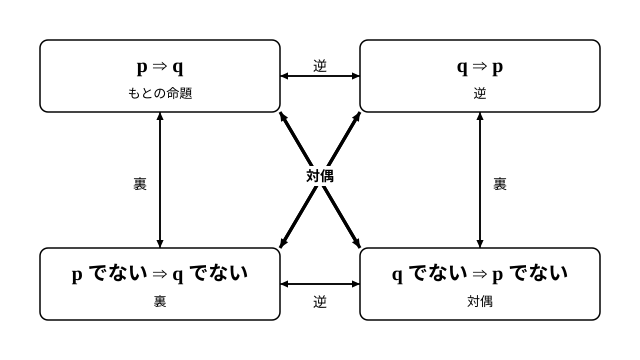

# L06 逆・裏・対偶——対偶を利用した証明

- unit_id: hs-math-i-sets-and-logic
- 位置づけ: 単元第6レッスン（1時間）。ここから2レッスン（L06〜L07）は「証明」の段。中2で学んだ「逆」に「裏」「対偶」を加えて4つの命題の関係を整理し、対偶を使って命題を証明する回。L07の背理法へつながる。
- distribution_status: published_draft
- license: CC-BY-4.0
- verify_required: 例題数値・記述は監修者検証必須。
- 主概念: ①逆・裏・対偶と真偽の対応（対偶はもとの命題と真偽が一致・逆と裏が一致） ②対偶を利用した証明

---

## 1. 中2の「逆」をふり返る——逆は成り立つとは限らない

中2の図形の証明で、命題の仮定と結論を入れかえた命題を、もとの命題の**逆**ということを学んだ。そして、もとの命題が正しくても、その逆が正しいとは限らないことも確かめた。数の命題で確かめ直しておこう。

命題「整数 n が 6 の倍数ならば、n は 3 の倍数である」は真である。6 の倍数は 6×(整数) と書け、6=3×2 だから 3×(2×整数) の形になり、3 の倍数だからだ。

この命題の仮定と結論を入れかえた逆は「整数 n が 3 の倍数ならば、n は 6 の倍数である」。これは偽である。n=9 は 3 の倍数だが 6 の倍数ではない——反例が1つあれば偽（L03）。

この単元の言葉で言い直す。条件 p を「n は 6 の倍数」、条件 q を「n は 3 の倍数」とすると、もとの命題は p⇒q、その逆は q⇒p である。p⇒q において p を仮定、q を結論と呼ぶのは中2と同じだ。真偽を真理集合で見ると（L03）、P⊂Q（6 の倍数はすべて 3 の倍数の中にある）だから p⇒q は真。一方 Q⊂P ではない（9 は Q にあって P にない）から q⇒p は偽。「p⇒q が真」と「q⇒p が真」は別の事柄——包含の向きが違うのだから、当然である。

## 2. 逆・裏・対偶——4つの命題を四角形に置く

p⇒q から作れる命題は、逆だけではない。条件の否定（L05）を使うと、あと2つ作れる。命題 p⇒q に対して、

- q⇒p を、もとの命題の**逆**という（中2の再訪）。
- 「p でない ⇒ q でない」を、もとの命題の**裏**という。
- 「q でない ⇒ p でない」を、もとの命題の**対偶**という。

逆は「入れかえる」、裏は「両方を否定する」、対偶は「入れかえて、両方を否定する」。4つを四角形の頂点に置くと関係が見やすい。

図から読めることが2つある。第一に、逆の逆はもとの命題に戻る（裏の裏、対偶の対偶も同じ）。第二に、**逆の対偶は裏**であり、**裏の対偶は逆**である。たとえば逆 q⇒p を「入れかえて両方否定」すると「p でない ⇒ q でない」——裏になっている。この第二の事実は、§3で効いてくる。

**例題1** x は実数とする。命題「x=3 ならば x²=9 である」の逆・裏・対偶を作り、それぞれの真偽を答えよ。偽のときは反例を1つ示せ。

条件 p を「x=3」、条件 q を「x²=9」とする。「x=3 でない」は x≠3、「x²=9 でない」は x²≠9 と書ける。

- もとの命題 p⇒q「x=3 ならば x²=9」……真（3²=9）。
- 逆 q⇒p「x²=9 ならば x=3」……偽。反例 x=−3（(−3)²=9 だが −3≠3）。
- 裏「x≠3 ならば x²≠9」……偽。反例 x=−3（−3≠3 だが (−3)²=9）。
- 対偶「x²≠9 ならば x≠3」……真。x² が 9 でないなら、x は 3 でも −3 でもない。だから x≠3。

真偽が「真・偽・偽・真」と並んだ。もとの命題と対偶が同じ真、逆と裏が同じ偽——これは偶然だろうか。

:::guide
**「裏」と「対偶」の作り分け——手順を2段に分ける**

対偶を作るつもりで裏を作ってしまう、という取り違えがよく起きる。どちらも「でない」が付くので、見た目が似ているからだ。作るときは手順を2段に分けるとよい。①仮定と結論を入れかえる（これで逆ができる）。②できた命題の両方の条件を否定する（これで逆の裏、つまりもとの命題の対偶ができる）。①だけなら逆、②だけなら裏、①と②の両方で対偶——上の四角形の図でいえば、横に1歩が逆、縦に1歩が裏、対角線に1歩が対偶である。作ったあとは、四角形の対角の位置にあるかを目で確かめる。この2段の手順は、否定の作り方に注意が要る命題（「かつ」「または」を含む条件——L05）でも同じように使える。
:::

## 3. 対偶はもとの命題と真偽が一致する——真理集合で確かめる

例題1の「真・偽・偽・真」は偶然ではない。真理集合で説明できる。

p⇒q が真であることは、真理集合の包含 P⊂Q と同じことだった（L03）。また、「p でない」の真理集合は P の補集合 Pᶜ、「q でない」の真理集合は Qᶜ である（L05）。すると、対偶「q でない ⇒ p でない」が真であることは、Qᶜ⊂Pᶜ と同じことになる。

そこで問いは「P⊂Q と Qᶜ⊂Pᶜ は同じことか」になる。同じである。P が Q の内側にあるとき、Q の外にある要素を1つとると、それは P の外にもある（もし P の中にあれば、P⊂Q から Q の中にもあるはずで、Q の外にとったことに反する）。つまり Qᶜ⊂Pᶜ。逆に Qᶜ⊂Pᶜ なら、いま示したこと（2つの集合 X、Y について、X⊂Y なら Yᶜ⊂Xᶜ）を X=Qᶜ、Y=Pᶜ として使えばよい。(Pᶜ)ᶜ⊂(Qᶜ)ᶜ が得られ、補集合の補集合はもとの集合に戻る（(Aᶜ)ᶜ=A——L02）から、P⊂Q である。

数直線で見ると実感しやすい。たとえば「x>2 ならば x>0」では P={x | x>2}、Q={x | x>0} で P⊂Q。その対偶「x≦0 ならば x≦2」の真理集合は Qᶜ={x | x≦0}、Pᶜ={x | x≦2} で、確かに Qᶜ⊂Pᶜ になっている。P が Q の右側の一部に収まっていれば、その外側どうしを見ても、Q の外側（左）は P の外側（左）にすっぽり収まる。

こうして、次の事実が成り立つ。

**命題 p⇒q とその対偶「q でない ⇒ p でない」の真偽は、必ず一致する**。

逆と裏についても同じことがいえる。§2で見たとおり、裏は逆の対偶だから、**逆と裏の真偽も必ず一致する**。一方、もとの命題と逆の真偽は一致するとは限らない（§1）。まとめると次の表になる。

| 命題 | 真理集合の包含 | 例題1での真偽 |
|---|---|---|
| p⇒q（もとの命題） | P⊂Q | 真 |
| 対偶「q でない ⇒ p でない」 | Qᶜ⊂Pᶜ | 真 |
| 逆 q⇒p | Q⊂P | 偽 |
| 裏「p でない ⇒ q でない」 | Pᶜ⊂Qᶜ | 偽 |

例題1で確かめる。P={3}、Q={−3, 3} だから P⊂Q は成り立ち（真）、Q⊂P は成り立たない（−3 が Q にあって P にない——これが逆の反例だった）。

:::guide
**「p ならば q」が正しいとき、「q ならば p」も正しい気がするのはなぜか**

p⇒q が真だと知ったとき、つい「q なら p だ」と読み替えてしまうことがある。「x=3 なら x²=9。だから x²=9 なら x=3」——例題1の逆は偽だったのに、である。日常の会話では、この読み替えがだいたい通用してしまう。「雨が降れば道がぬれる」を聞いて、道がぬれていれば雨が降ったのだろうと考える。それで困らないのは、道をぬらす原因がふつう雨くらいしかないからだ。ところが数学の命題では、q を成り立たせるものが p 以外にもあるのがふつうである。x²=9 を成り立たせるのは 3 だけでなく −3 もある。真理集合でいえば、Q が P より大きく、Q の中で P の外にある要素（例題1なら −3）が逆の反例になる。読み替えたくなったら、「q を成り立たせる、p 以外のものはないか」と一度自分に問う。これが、逆の真偽をもとの命題と切り離して考える習慣になる。なお、この読み替えが正しいのは P と Q が一致するときだけ——それが L04の「必要十分条件」である。
:::

## 4. 対偶を利用した証明

対偶ともとの命題の真偽が一致する、という事実には、証明での使い道がある。**p⇒q を直接示すのが難しいとき、対偶「q でない ⇒ p でない」を示せば、p⇒q が示せたことになる**。これを対偶を利用した証明という。

**例題2** n は整数とする。「n² が偶数ならば、n は偶数である」を証明せよ。

直接示そうとすると手が止まる。仮定「n² が偶数」からは、n² を 2×(整数) と書けることしかわからず、そこから n の形を取り出すのは難しい。そこで対偶を考える。

対偶は「n が偶数でないならば、n² は偶数でない」、つまり「n が奇数ならば、n² は奇数である」。整数は偶数か奇数のどちらかだから、「偶数でない」は「奇数である」と言い換えられる。奇数には 2k＋1（k は整数）という具体的な形があるので、こちらは計算で示せる。

証明: 対偶「n が奇数ならば、n² は奇数である」を示す。n が奇数のとき、ある整数 k を使って n=2k＋1 と書ける。このとき

n²=(2k＋1)²=4k²＋4k＋1=2(2k²＋2k)＋1

2k²＋2k は整数だから、n² は 2×(整数)＋1 の形、つまり奇数である。よって対偶は真であり、もとの命題「n² が偶数ならば、n は偶数である」も真である。（証明終わり）

確かめとして、対偶を正しく作れているかを見直す。①入れかえ: 「n は偶数 ⇒ n² は偶数」、②両方を否定: 「n は偶数でない ⇒ n² は偶数でない」。四角形の対角の位置にある。また、具体例で当ててみる。n=3 なら n²=9 で奇数。n=−5 なら n²=25 で奇数。対偶の主張と合っている。

手順を型にしておく。

1. 命題を「p ならば q」の形に整理し、p と q をはっきりさせる。
2. 対偶「q でない ならば p でない」を作る。否定は言い換えられるなら言い換える（「偶数でない」→「奇数」）。
3. 対偶を証明する。「q でない」の具体的な形（2k＋1 など）から計算を始める。「q でない」が「A または B」のように2つの場合に分かれるときは、A の場合と B の場合をそれぞれ計算し、どちらの場合にも「p でない」が成り立つことを示す（問4・S1）。
4. 「対偶が真だから、もとの命題も真」と一言添えて締める。

:::guide
**いつ対偶へ回るのか——「でない」のほうが具体的なとき**

対偶を使う証明は、回り道に見える。まっすぐ示せるなら、まっすぐ示せばよい。回り道が得になるのは、結論の否定「q でない」のほうが、仮定 p より扱いやすい形をしているときだ。例題2では、仮定「n² が偶数」からは n の形が見えないが、結論の否定「n は偶数でない」は「n=2k＋1」という計算できる形をしている。証明を始める前に、p と「q でない」を並べて、どちらが「式で書ける」かを見比べる——それが対偶へ回るかどうかの判断になる。もう1つ、対偶で示してよい理由を忘れないこと。それは §3 で確かめた「対偶ともとの命題は真偽が一致する」という事実であって、慣習ではない。この「否定を仮定して進む」考え方をさらに一歩進めたものが、次の L07で学ぶ背理法である。
:::

## 5. 練習

**問1** 命題「整数 n が 4 の倍数ならば、n は偶数である」の逆・裏・対偶を作り、それぞれの真偽を答えよ。偽のときは反例を1つ示せ。

**問2** x は実数とする。命題「x>5 ならば x>1 である」について、次の問いに答えよ。
(1) 条件 p を「x>5」、条件 q を「x>1」とする。真理集合 P、Q と、その補集合 Pᶜ、Qᶜ を {x | …} の形で書け。
(2) この命題の対偶を作り、(1)の集合の包含関係を使って対偶が真であることを説明せよ。
(3) この命題の逆の真偽を答えよ。偽のときは反例を1つ示せ。

**問3** x は実数とする。次の命題の真偽を、対偶を作って判定せよ。偽のときは反例を1つ示せ。
(1) x²≠1 ならば x≠1 である。
(2) x≠1 ならば x²≠1 である。

**問4** n は整数とする。「n² が 3 の倍数ならば、n は 3 の倍数である」を、対偶を利用して証明せよ。3 の倍数でない整数は、整数 k を使って 3k＋1 または 3k＋2 のどちらかの形に書けることを使ってよい。

---

:::stretch
**S1** m、n は整数とする。「mn が奇数ならば、m と n はともに奇数である」を、対偶を利用して証明せよ。「m と n はともに奇数」は「m は奇数 かつ n は奇数」だから、その否定は「m は偶数 または n は偶数」になる（L05）。
:::

対応解答: answer_key_L06-07.md

<!-- gen_nav:nav:start（自動生成・手編集しない） -->

---

[← 前のレッスン](lesson_05.md)｜[単元の目次](README.md)｜[解答](answer_key_L06-07.md)｜[次のレッスン →](lesson_07.md)

<!-- gen_nav:nav:end -->
