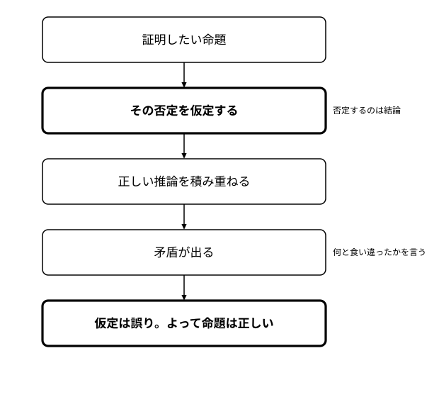
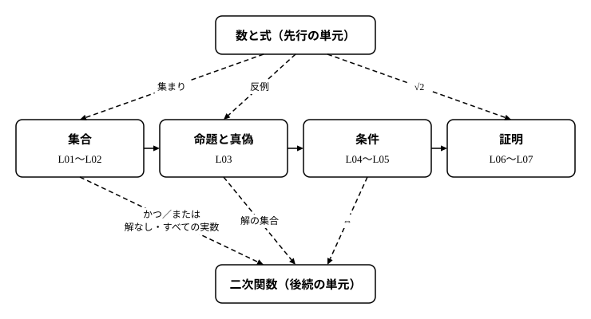

# L07 背理法——√2が無理数であることを証明する・単元のまとめ

- unit_id: hs-math-i-sets-and-logic
- 位置づけ: 単元第7レッスン（1.5時間）・最終回。前半は背理法——結論の否定を仮定して矛盾を導く証明法——を学び、「数と式」の単元で先送りにした「√2 は分数で表せない」を証明する。後半（§4以降）は単元のまとめで、**新しい概念・新しい用語は立てない**。集合→命題→条件→証明の1枚地図をたたみ、次の「二次関数」で使う言葉を確かめる。
- distribution_status: published_draft
- license: CC-BY-4.0
- verify_required: 例題数値・記述は監修者検証必須。
- 主概念: ①背理法の構造（結論の否定を仮定→矛盾→結論）と √2 が無理数であることの証明 ②単元のまとめと「二次関数」への受け渡し（解の集合・かつ／または・解なし・すべての実数・⇔）

---

## 1. 「表せない」をどう証明するか——背理法の流れ図

「数と式」の単元で、√2 が分数で表せないことは「知られている」と述べて、証明は先送りにした（同単元の L05）。この単元で論じ方の道具がそろったので、約束を果たそう。

まず、何が難しいのかを見ておく。「√2 は分数で表せる」なら、その分数を1つ見せれば済む。ところが「表せない」は、どの分数を持ってきても √2 にならない、という主張だ。分数は限りなくあるから、1つずつ確かめて回ることはできない。「〜でない」「〜は存在しない」型の命題は、直接示そうとすると、この壁にぶつかる。

そこで発想を変える。「√2 は分数で表せる」と仮に認めてみて、そこから正しい推論を進め、あり得ないこと（矛盾）が出てくることを示す。あり得ないことが出たのは、最初に認めた仮定が誤りだったからだ。だから「√2 は分数で表せない」——これが結論になる。

この証明の型を**背理法**（はいりほう）という。流れを先に図で見ておく。

1. 証明したい命題を確かめる。
2. その命題の否定（「〜でない」）を仮定する。
3. 仮定と、すでに正しいと分かっていることから、推論を積み重ねる。
4. 矛盾——すでに正しいと分かっていることや、仮定そのものと食い違う事柄——が出る。
5. 矛盾が出たのは仮定が誤りだったからである。よって、証明したい命題は正しい。

命題は、真か偽のどちらか一方である（L03）。「命題が偽である」と仮定して矛盾が出たなら、残る可能性は「真である」だけ——背理法は、この「どちらか一方」を根拠にしている。

:::guide
**何を仮定するのか——否定するのは「結論」**

背理法でつまずく最初の場所は、「何を仮定するか」である。仮定するのは、証明したい命題の否定であって、それ以外のものではない。「√2 は無理数である」を示すなら、仮定は「√2 は無理数でない（有理数である）」——ここを取り違えて、関係のないことを仮定してしまうと、矛盾が出ても何も示したことにならない。図形の例で型を見ておこう。「直線の外の1点から、その直線に引ける垂線は1本だけである」を背理法で示すなら、仮定は「垂線が2本以上引ける」。そのうちの2本を取ると、2本の垂線と直線で三角形ができ、その内角に直角が2つ含まれることになる。直角2つだけで 180 度になるから、3つ目の角の分だけ内角の和が 180 度を超える——三角形の内角の和が 180 度であることと食い違う。よって垂線は1本だけ。「1本だけ」の否定は「1本もない、または2本以上引ける」だが、少なくとも1本引けることは作図で分かっているので、この例で実際に仮定したのは「2本以上引ける」の方であり、矛盾の相手は「三角形の内角の和は 180 度」という、既に正しいと分かっている事柄である。「否定したのは何か」「食い違った相手は何か」の2つを言えることが、背理法を理解している目印になる。
:::

## 2. √2 は無理数である——先送りした約束を果たす

無理数とは、有理数でない実数のことだった。有理数は、整数 m と 0 でない整数 n を使って m/n の形（分数の形）に書ける数である。したがって「√2 は無理数」の否定は「√2 は有理数」——分数の形に書ける、である。

**例題1** √2 は無理数であることを証明せよ。√2 が正の数であることと、L06の例題2「n が整数のとき、n² が偶数ならば n は偶数である」は使ってよい。

証明: √2 が無理数でない、つまり有理数であると仮定する。√2>0 だから、分子と分母をともに正の整数にとることができ（m/n の m と n がともに負なら、両方の符号を変えても同じ数である）、自然数 a、b を使って

√2=a/b

と書ける。分数は約分しておけるので、a と b は 1 以外に共通の約数をもたない（これ以上約分できない）としてよい。両辺を b 倍して b√2=a、両辺を 2乗して

2b²=a²

a² は 2×(整数) の形だから偶数である。L06 例題2により、a は偶数。そこで自然数 c を使って a=2c と書くと、2b²=(2c)²=4c² となり、両辺を 2 で割って

b²=2c²

今度は b² が偶数だから、同じく L06 例題2により b も偶数である。すると a と b はともに偶数で、共通の約数 2 をもつ。これは「a と b は 1 以外に共通の約数をもたない」ことと矛盾する。矛盾が出たのは、最初の仮定「√2 は有理数である」が誤りだったからである。よって √2 は無理数である。（証明終わり）

書き終えたら、3点を確かめる。①否定したのは何か——「√2 は無理数」の否定「√2 は有理数」。②積み重ねた推論は正しいか——2乗の計算 (2c)²=4c²、L06 例題2の適用（2回）。③矛盾の相手は何か——自分で置いた「約分済み」という設定。この3点が言えれば、証明は閉じている。

:::guide
**矛盾の「相手」を言えるか——約分済みの設定はなぜ置いたのか**

例題1の証明で、はじめに「a と b は 1 以外に共通の約数をもたない」と断っておいた。この一文は飾りではなく、最後に矛盾を突きつける相手として置いた設定である。もしこの断りを省くと、「a も b も偶数」が出ても、それ自体は何とも食い違わない（4/2 のように、分子と分母がともに偶数の分数はいくらでもある）。矛盾とは「すでに正しいと決まっていることと食い違う」ことだから、何と食い違ったのかが言えなければ、証明は閉じていない。背理法の証明を読むときも書くときも、「矛盾する」と書いた直後に「何と」を添える習慣をつけよう。例題1では「約分済み」という自分で置いた設定が相手だった。§1の垂線の例では「三角形の内角の和は 180 度」という定理が相手だった。相手は、仮定そのものでも、既知の事実でも、途中で出した式でもよい——ただし、必ず名指しできるものでなければならない。
:::

## 3. 有理数と無理数の和

背理法がよく効くもう1つの型を見る。

**例題2** a を有理数、x を無理数とする。a＋x は無理数であることを証明せよ。

証明: a＋x が無理数でない、つまり有理数であると仮定し、a＋x=r（r は有理数）とおく。すると x=r−a である。有理数どうしの差は有理数だから（分数どうしの差は、通分すれば再び整数を 0 でない整数で割った形になる）、x は有理数となる。これは x が無理数であることと矛盾する。よって a＋x は無理数である。（証明終わり）

3点確認。①否定したのは「a＋x は無理数」——仮定は「a＋x は有理数」。②推論は、移項と「有理数の差は有理数」。③矛盾の相手は、問題の前提「x は無理数」。

「〜は無理数である」を示すときの型が見えてくる。「有理数である」と仮定すると、分数の形や r という文字が使えるようになって計算が動き出し、その先で、既に無理数だと分かっている数（ここでは x）が有理数になってしまう——それが矛盾になる。

:::guide
**対偶と背理法——どちらも「否定を仮定して進む」**

L06の対偶を利用した証明と、このレッスンの背理法は、似ている。どちらも、示したいことをまっすぐ示す代わりに、否定から出発するからだ。違いは、否定から何を目指すかにある。対偶の証明は「p ならば q」型の命題で、「q でない」から出発して「p でない」に到着することを目指す。到着先が最初から決まっている。背理法は、「q でない」（「p ならば q」型なら「p であって q でない」——L03 の反例の形、すなわち仮定を満たし結論を満たさない場合である）から出発して、何でもよいから矛盾に到着することを目指す。到着先は決まっていない——既知の事実と食い違ってもよいし、仮定そのものと食い違ってもよい。この自由さのぶん、背理法は「〜でない」「〜は1つだけ」「〜は存在しない」型の命題に広く使える。逆にいえば、背理法では「何と矛盾したか」を自分で名指しする責任が生じる（前の guide）。対偶の証明で矛盾の相手が要らないのは、到着先「p でない」が決まっているからである。使い分けの目安は、命題が「p ならば q」の形で「q でない」が計算しやすい形なら対偶、命題が「〜でない」型で、否定を認めると計算が動き出すなら背理法。
:::

## 4. 単元のまとめ——集合から証明までの1枚地図

ここから先は、新しいことを足さない。7つのレッスンを1枚の地図にたたむ。

- **集合**（L01〜L02）: ものの集まりを集合として捉え、要素 ∈ ∉、部分集合 ⊂、空集合 ∅、共通部分 ∩、和集合 ∪、全体集合 U と補集合 Aᶜ の記号で書けるようにした。「かつ」は ∩、「または」は ∪、「でない」は補集合。ド・モルガンの法則は、ベン図で確かめた。
- **命題と真偽**（L03）: 真偽が定まる文が命題、x を含み x の値で真偽が決まる文が条件。p⇒q が真であることは、真理集合の包含 P⊂Q と同じこと。偽であることを示すには、反例を1つ挙げればよい。
- **条件**（L04〜L05）: p⇒q が真のとき、p は q の十分条件、q は p の必要条件。P⊂Q の図で向きを固定した。両方向に真なら必要十分条件（⇔）。条件の否定は真理集合の補集合で、「かつ」「または」の否定はド・モルガンの法則で作る。
- **証明**（L06〜L07）: 対偶はもとの命題と真偽が一致する（P⊂Q と Qᶜ⊂Pᶜ は同じこと）ので、対偶を示せばよい。背理法は、結論の否定を仮定して矛盾を導く。

地図の骨組みは1本の線でつながっている。**「ならば」の命題の真偽は集合の包含で決まる**——この1文が、L03から L06までの判定と証明をすべて支え、L07 の背理法もその上に立っている。必要条件・十分条件は包含の向き、条件の否定は補集合、対偶の正しさは Qᶜ⊂Pᶜ、背理法の根拠は「真か偽のどちらか一方」。集合の言葉で命題を扱えるようになったこと、それがこの単元で手に入れたものである。

## 5. この先へ——「二次関数」で使う言葉

次の「二次関数」の単元は、この単元の言葉を既に知っているものとして使う。とくに次の5つを、いま確かめておく。

| 二次関数で出てくる言い方 | この単元の言葉で読むと |
|---|---|
| 不等式の解 | 条件を満たす x の値の全部の集まり——真理集合。数直線上の範囲として表す |
| x<1 または 4<x | 2つの範囲の和集合 ∪。「または」は少なくとも一方 |
| −1≦x かつ x≦3 | 2つの範囲の共通部分 ∩ |
| 解なし | 条件を満たす x が1つもない——真理集合が空集合 ∅ |
| すべての実数 | どの実数も条件を満たす——真理集合が全体集合 U（実数全体） |

もう1つ、⇔ は「必要十分条件」の記号として、不等式の変形にも使う。たとえば 2x−4>0 ⇔ x>2 は、変形の前後で解の集合が変わらないことを表している。

「または」の書き方に、1つ注意がある。「x<1 または 4<x」を 4<x<1 とつなげて書いてしまうと、それは「4 より大きく、かつ 1 より小さい」——そんな数は1つもないから、真理集合が ∅ になってしまう。和集合は、2つの範囲を「または」でつないだまま書く。

## 6. 練習

**問1** 次は「√2＋1 は無理数である」を背理法で証明したものである。空欄〔ア〕〜〔エ〕を埋めよ。

> √2＋1 が無理数でない、つまり〔ア〕であると仮定し、√2＋1=r（r は有理数）とおく。すると √2=〔イ〕である。有理数どうしの差は有理数だから、√2 は〔ウ〕となる。これは〔エ〕と矛盾する。よって √2＋1 は無理数である。

**問2** √3 は無理数であることを、背理法で証明せよ。L06の問4「n が整数のとき、n² が 3 の倍数ならば n は 3 の倍数である」は使ってよい。

**問3** a を 0 でない有理数、x を無理数とする。ax は無理数であることを証明せよ。また、a=0 のときにはこの命題が成り立たない理由を1文で述べよ。有理数を 0 でない有理数で割った商が有理数であること（分数どうしの割り算の結果は、再び整数を 0 でない整数で割った形になる）は使ってよい。

**問4** 全体集合を U={1, 2, 3, …, 10} とし、U の要素 x についての条件 p を「x は 4 の倍数」、条件 q を「x は偶数」とする。
(1) p、q の真理集合 P、Q を、要素を並べて書け。
(2) 命題 p⇒q の真偽を、P と Q の包含関係で判定せよ。また、その逆 q⇒p の真偽を答え、偽ならば反例をすべて挙げよ。
(3) p は q の十分条件、必要条件、必要十分条件のどれか。
(4) 対偶「x が偶数でないならば、x は 4 の倍数でない」について、Pᶜ と Qᶜ を要素を並べて書き、Qᶜ⊂Pᶜ が成り立つことを確かめよ。

---

:::stretch
**S1** √2＋√3 は無理数であることを、背理法で証明せよ。√2 が無理数であること（例題1）は使ってよい。√2＋√3=r（r は有理数）と仮定して √3=r−√2 とし、両辺を 2乗して √2 を r で表すとよい。
:::

対応解答: answer_key_L06-07.md

<!-- gen_nav:nav:start（自動生成・手編集しない） -->

---

[← 前のレッスン](lesson_06.md)｜[単元の目次](README.md)｜[解答](answer_key_L06-07.md)

<!-- gen_nav:nav:end -->
