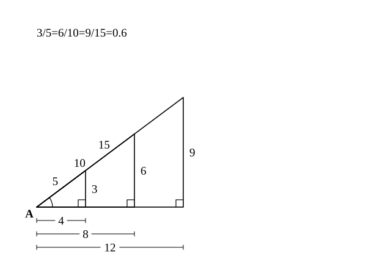
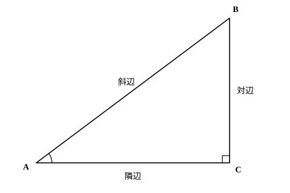

# L01 三角比とは——直角三角形の辺の比が角で決まる

- unit_id: hs-math-i-trigonometric-ratios
- 位置づけ: 単元第1レッスン（2時間）。中3の相似（縮図による測量）を出発点に、「直角三角形の辺の比は角の大きさだけで決まる」ことを確かめ、その比に sin・cos・tan の名前をつける回。L02（長さや角を求める・測量）と L03（相互関係）の土台になる。
- distribution_status: published_draft
- license: CC-BY-4.0
- verify_required: 例題数値・記述は監修者検証必須。
- 主概念: ①相似で「比が角だけで決まる」（中3相似の回収）と sin・cos・tan の定義（3つの決定） ②三角比の表の引き方（自作表）

---

## 1. 縮図を引かずに済ませたい——中3の測量をふり返る

中3の相似の単元で、直接は測れない木の高さを求めたことを思い出そう。手順はこうだった。木の根元から一定の距離だけ離れた地点に立ち、木のてっぺんを見上げる角を測る。次に、測った距離と角をもとに縮図（たとえば 1/200 の直角三角形）を紙にかき、縮図の上で、目の高さから木のてっぺんまでにあたる辺を定規で測って 200 倍し、最後に目の高さを足して木の高さに直す。

この方法はたしかに使える。ただ、測るたびに縮図を1枚かき直さなければならないし、定規で読み取れる精度にも限りがある。「同じ角なら、縮図をかかなくても答えが出せないだろうか」——これがこのレッスンの出発点だ。

答えを先に言えば、出せる。しかも、そのための道具は中3の相似の中にすでにそろっている。

## 2. 同じ鋭角をもつ直角三角形は、みな相似

角 A を共有する3つの直角三角形を、頂点 A を重ねてかいてみる。小さい順に、斜辺 5・角 A の向かいの辺 3・角 A をはさむ辺のうち斜辺でない方 4、斜辺 10・向かいの辺 6・はさむ辺 8、斜辺 15・向かいの辺 9・はさむ辺 12 だとしよう（それぞれ 3²＋4²=5²、6²＋8²=10²、9²＋12²=15² が成り立つから、三平方の定理の逆（中3）により、確かに直角三角形である）。

この3つの三角形は、どれも角 A と直角をもつ。中3で学んだ相似条件「2組の角がそれぞれ等しい」により、3つは互いに相似である。相似な図形では対応する辺の比がすべて等しいから、1つの三角形の中で「向かいの辺 ÷ 斜辺」を計算すると、

3/5=0.6、6/10=0.6、9/15=0.6

と、3つとも同じ値になる。「はさむ辺 ÷ 斜辺」も 4/5=8/10=12/15=0.8、「向かいの辺 ÷ はさむ辺」も 3/4=6/8=9/12=0.75 で、やはりそろう。

大事なのは、この値が三角形の大きさに関係なく決まっていることだ。角 A が同じであるかぎり、直角三角形をどれだけ大きくかいても小さくかいても、2辺の比は変わらない。言いかえると、**直角三角形の2辺の比は、1つの鋭角の大きさだけで決まる**。

これが §1 の問いへの答えになる。角ごとに「向かいの辺 ÷ 斜辺」などの値を一度だけ求めて表にしておけば、次からは縮図をかかずに、表の値と測った長さから未知の辺が計算できる。その表がこのレッスンの終わりに出てくる三角比の表であり、表に載せる比に名前をつけたものが三角比である。

:::guide
**「相似比」と「比の値」を取り違えない**

上の3つの三角形について、大きさの違いを表す「相似比」は 1:2:3 である（斜辺で見ると 5:10:15）。一方、ここで注目した 0.6 は、1つの三角形の中で「向かいの辺は斜辺の何倍か」を表す値であり、三角形どうしを比べる相似比とは別物だ。相似比は比べる三角形の組によって変わる（1:2、1:3、2:3）が、0.6 は3つの三角形で共通——三角比が使えるのは、この「1つの三角形の内側で作る比」がそろうからである。「どの三角形とどの三角形を比べているのか」「それとも1つの三角形の中の2辺を比べているのか」を、式を立てる前に一度言葉にしておくと迷わない。
:::

## 3. 三角比の定義——3つの決定

∠C=90° の直角三角形 ABC で、角 A に注目する。3つの辺にはそれぞれ呼び名がある。

- 直角の向かいにある辺 AB を**斜辺**という。3辺のうちいちばん長い。
- 注目する角 A の向かいにある辺 BC を、角 A の**対辺**（たいへん）という。
- 角 A をはさむ2辺 AB・AC のうち、斜辺でない方 AC を、角 A の**隣辺**（りんぺん）という。

この3辺から2辺を選んで作る比のうち、次の3つに名前をつける。

- sin A = BC/AB = 対辺/斜辺 ……角 A の**正弦**（せいげん・サイン）
- cos A = AC/AB = 隣辺/斜辺 ……角 A の**余弦**（よげん・コサイン）
- tan A = BC/AC = 対辺/隣辺 ……角 A の**正接**（せいせつ・タンジェント）

この3つをまとめて角 A の**三角比**（さんかくひ）という。sin・cos・tan は記号で、「sin A」で1つの数を表す（s と i と n のかけ算ではない）。§2 で確かめたとおり、これらの値は角 A の大きさだけで決まり、三角形の大きさにはよらない。

定義を式で覚える前に、式の背後で自分が何を決めているのかを確かめておこう。三角比を1つ書くには、次の**3つの決定**が要る。

1. **どの直角三角形を見るか**——直角がどこにあり、注目する鋭角はどれか。この2つが決まって初めて「斜辺」「対辺」「隣辺」が定まる。
2. **どの2辺を使うか**——sin は対辺と斜辺、cos は隣辺と斜辺、tan は対辺と隣辺。
3. **どちらを分母にするか**——sin と cos は斜辺が分母、tan は隣辺が分母。

この3つを毎回意識して書くと、向きの違う三角形でも、頂点の名前が違う三角形でも、同じ手順で三角比が読める。

**例題1** ∠C=90°、AB=13、BC=5、AC=12 の直角三角形 ABC について、sin A、cos A、tan A と、sin B、cos B、tan B を求めよ。

まず角 A に注目する。斜辺は直角の向かいの AB=13、角 A の対辺は BC=5、隣辺は AC=12。

sin A=5/13、cos A=12/13、tan A=5/12

次に角 B に注目する。斜辺は変わらず AB=13 だが、角 B の対辺は AC=12、隣辺は BC=5 に入れかわる。

sin B=12/13、cos B=5/13、tan B=12/5

検算: 5²＋12²=25＋144=169=13² で、確かに直角三角形である。また sin A と cos B、cos A と sin B が同じ値になった——注目する角を変えると対辺と隣辺が入れかわるからで、この対応は L03 でもう一度使う。

**例題2** ∠E=90°、DE=4、EF=3、FD=5 の直角三角形 DEF について、sin D、cos D、tan D と sin F を求めよ。

頂点の名前が定義の図（A・B・C）と違うが、手順は同じだ。直角は E にあるから、斜辺はその向かいの FD=5。角 D の対辺は D の向かいの EF=3、隣辺は残りの DE=4。

sin D=3/5、cos D=4/5、tan D=3/4

角 F については、対辺が DE=4、隣辺が EF=3 になるから、sin F=4/5。

検算: 3²＋4²=25=5² ✓。この三角形は §2 の最初の三角形（斜辺 5・対辺 3・隣辺 4）と同じ形で、sin D=0.6 は §2 の 0.6 と一致する。

:::guide
**向きの違う三角形は、「斜辺→対辺→隣辺」の順に読む**

直角が右下にあり、注目する角が左下にある図——定義の図の向き——なら迷わないのに、三角形が回転したり裏返ったりすると急に読めなくなる、という人は多い。読む順番を固定すれば防げる。①直角を見つけ、その向かいの辺を斜辺と決める（斜辺は角の位置に関係なく、直角の向かいで決まる）。②注目する角の向かいの辺を対辺と決める。③残った1辺が隣辺。この順で3辺に印をつけてから、定義の式に当てはめる。それでも読みにくいときは、注目する角が左下・直角が右下になるように三角形を自分でかき直してよい——相似な三角形は同じ三角比をもつのだから、かき直しても値は変わらない。
:::

## 4. sin A の2つの見方

sin A=BC/AB という式には、2通りの読み方がある。

1つ目は、**斜辺 AB の長さを 1 としたときの対辺 BC の長さ**と見る読み方。AB=1 なら sin A=BC/1=BC だから、sin A はそのまま対辺の長さになる。§2 で使った「角 A が同じなら形は同じ」を思い出せば、どんな直角三角形も斜辺 1 に縮めて考えてよい。

2つ目は、**斜辺 AB に対する対辺 BC の割合**と見る読み方。sin A=0.6 なら、対辺は斜辺の 0.6 倍だ。斜辺が 10 なら対辺は 6、斜辺が 25 なら対辺は 15 になる。

2つの読み方は同じことを別の言葉で言っている。「斜辺が 1 のときの長さ」は、そのまま「斜辺の何倍か」という割合でもあるからだ。cos A・tan A についても同じで、cos A は「斜辺 1 のときの隣辺の長さ（斜辺に対する隣辺の割合）」、tan A は「隣辺 1 のときの対辺の長さ（隣辺に対する対辺の割合）」と読める。

この2つの見方は、次の L02 で「三角比の値をかけると長さが出るのはなぜか」を説明するときの根拠になる。式を覚えるだけでなく、どちらの読み方も自分の言葉で言えるようにしておこう。

## 5. 三角比の表の引き方

§2 の結論は「角ごとの比を一度だけ表にしておけば、縮図は要らない」だった。その表がこれである——[三角比の表](trig_table.md)。0° から 90° まで 1° 刻みで、sin・cos・tan の値が小数第4位まで載っている（この表は本教材のために計算して作ったもので、値は小数第5位を四捨五入している）。

**角から値を読む**。表の左の列で角を探し、その行を右へ読む。

**例題3** 三角比の表を使って、sin 35°、cos 35°、tan 35° の値を求めよ。

表の 35° の行を読むと、sin 35°=0.5736、cos 35°=0.8192、tan 35°=0.7002 である。

検算: 表の値が定義と合っているかは、§4 の見方で確かめられる。sin 35° は「斜辺 1 のときの対辺の長さ」だから 0 と 1 の間の数であるはずで、0.5736 はそうなっている。cos 35°=0.8192 も同様。tan 35°=0.7002 は対辺/隣辺 で、35° は 45° より小さいから（隣辺の長さをそろえて比べると、45° のとき対辺は隣辺と等しく、角が小さいほど対辺は短いので）対辺は隣辺より短く、tan は 1 より小さいはず——これも合う。

**値から角を読む（逆引き）**。三角比の値がわかっていて角を知りたいときは、逆に引く。求めたい三角比の列を上から下へ追い、与えられた値に最も近い値を探し、その行の角を読む。

**例題4** cos A=0.82 のとき、三角比の表を使って角 A のおよその大きさを求めよ。

cos の列を追うと、34° の行に 0.8290、35° の行に 0.8192 がある。0.82 との差は 34° が 0.0090、35° が 0.0008 だから、35° の方が近い。よって A≒35°。

§2 の三角形（斜辺 5・対辺 3・隣辺 4）の角 A についても、sin A=0.6 を sin の列で探すと、36° の 0.5878 と 37° の 0.6018 の間で 37° の方が近い。つまり、あの三角形の角 A はおよそ 37° である。中3では分度器で測るしかなかった角が、辺の長さと表から求まった。

表のかわりに電卓の sin・cos・tan のキーを使ってもよい（角の単位を「度」にしておく）。結果は小数第5位を四捨五入して小数第4位までにすれば表の値と一致する。

:::guide
**表の値は「およそ」であり、角も「およそ」になる**

表の値は小数第5位を四捨五入した近似値で、表は 1° 刻みしかない。だから逆引きで求まるのは「表の値がいちばん近い行の角」であり、cos A=0.82 に対する 35° も、正確には「cos の値が 0.82 にいちばん近い行は 35° だ」という意味だ。問いが「最も近い整数の角」を求めているときは、この角を答えればよい。本当の角にいちばん近い整数の角とたいていは一致するが、表の値は等間隔に並んでいないので、値をはさむ2つの行との差がほとんど同じときには 1° ずれることがある。この単元では、表を使って求めた角には ≒ をつけ、「およそ 35°」と答える。逆に、三角形の辺が 3・4・5 のように与えられていて sin A=3/5 と分数で書けるときは、その分数が正確な値であり、0.6 に直したり表で角に直したりする必要はない——問いが「角の大きさ」を求めているときだけ表を引く。何を正確な値として持ち、どこで近似に切りかえるかを意識しておくと、後の計算で桁がぶれない。
:::

## 6. 練習

**問1** ∠C=90°、AB=25、BC=7、AC=24 の直角三角形 ABC について、次の値を求めよ。
(1) sin A、cos A、tan A
(2) sin B、cos B、tan B

**問2** ∠B=90°、AB=8、BC=15、CA=17 の直角三角形 ABC がある。直角が B にあることに注意して図をかき、sin A、cos A、tan A と sin C、cos C、tan C を求めよ。

**問3** 三角比の表を使って、次の値を求めよ。
(1) sin 52°、cos 52°、tan 52°
(2) sin 8°、tan 8°
(3) sin 52° と cos 38° の値を比べ、気づいたことを1文で書け。

**問4** 三角比の表を使って、次の角 A のおよその大きさ（最も近い整数の角）を求めよ。
(1) sin A=0.6  (2) tan A=2.5  (3) cos A=0.9

**問5** 同じ大きさの角 A をもつ直角三角形は、大きさが違っても sin A の値が同じになる。その理由を、中3で学んだ相似の言葉（相似条件・対応する辺の比）を使って2〜3文で説明せよ。

---

:::stretch
**S1** 階段の1段は、足を乗せる水平な面と、その段の高さでできている。前者を踏面（ふみづら）、後者を蹴上げ（けあげ）という。踏面と蹴上げは、階段の傾きの角 A を1つの鋭角とする直角三角形の隣辺と対辺にあたる。
(1) 踏面 27 cm・蹴上げ 18 cm の階段 A について、tan A の値を求め、三角比の表で傾きの角 A のおよその大きさを求めよ。
(2) 踏面 30 cm・蹴上げ 17 cm の階段 B についても同じように求めよ。
(3) 2つの階段のどちらが急か。角を求めなくても tan の値だけで比べられる理由を1〜2文で説明せよ。
:::

対応解答: answer_key_L01-05.md

<!-- gen_nav:nav:start（自動生成・手編集しない） -->

---

[単元の目次](README.md)｜[解答](answer_key_L01-05.md)｜[次のレッスン →](lesson_02.md)

<!-- gen_nav:nav:end -->
