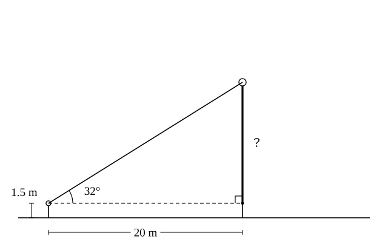

# L02 三角比を使う——長さと角を求める・測量

- unit_id: hs-math-i-trigonometric-ratios
- 位置づけ: 単元第2レッスン（1.5時間）。L01 で定義した三角比を「長さを求める道具」として使う回。対辺=斜辺×sin A のような読み替えの理由を言えるようにし、仰角・俯角を使った架空の測量で高さや距離を求め、30°・45°・60° の三角比の値を中3の比から導く。L03（相互関係）・L10（活用）の土台になる。
- distribution_status: published_draft
- license: CC-BY-4.0
- verify_required: 例題数値・記述は監修者検証必須。
- 主概念: ①斜辺×sin A=対辺 など（値をかけると長さが出る理由） ②直接測れない高さ・距離（架空の測量）と特別角（30°・45°・60°=中3の比の回収）

---

## 1. 定義の式を、かけ算に読み替える

L01 の定義 sin A=対辺/斜辺 は、比の値を求める式だった。これを「対辺を求める式」に読み替える。両辺に斜辺をかけると、

対辺=斜辺×sin A

となる。同じように cos A=隣辺/斜辺 から 隣辺=斜辺×cos A、tan A=対辺/隣辺 から 対辺=隣辺×tan A が出る。

式の変形としては両辺に同じものをかけただけだが、この式がなぜ成り立つのかを、L01 §4 の見方で言えるようにしておこう。sin A は「斜辺を 1 としたときの対辺の長さ」、つまり「対辺は斜辺の sin A 倍」という割合だった。だから、斜辺が 10 なら対辺はその sin A 倍で 10×sin A になる。**三角比の値をかけると長さが出るのは、三角比が「何倍か」という割合だから**である。「そう習ったから」ではなく、この一文で理由が言えるかどうかが、このレッスンの最初の確認点だ。

**例題1** ∠C=90°、AB=10、∠A=35° の直角三角形 ABC について、BC と AC の長さを小数第2位まで求めよ。三角比の表を使ってよい。

BC は角 A の対辺、AC は隣辺、AB=10 は斜辺である。表から sin 35°=0.5736、cos 35°=0.8192 なので、

BC=AB×sin A=10×0.5736=5.736≒5.74
AC=AB×cos A=10×0.8192=8.192≒8.19

検算: 三平方の定理で確かめる。5.74²＋8.19²=32.9476＋67.0761=100.0237 で、AB²=100 とほぼ一致する（四捨五入のずれの範囲）。

:::guide
**答えを出したら、三平方の定理で1回だけ検算する**

三角比で2辺を求めたときは、求めた2辺と斜辺が「対辺²＋隣辺²=斜辺²」をほぼ満たすかを確かめる。ぴったりにはならない——表の値も答えも四捨五入しているからだ——が、100 に対して 100.02 のように近ければ、この検算は合格だ。もし 5.74²＋8.19² が 80 や 130 になったら、使う三角比か計算のどこかを間違えているので、その場で気づける。ただし、この検算に合格しても、答えが正しいとは限らない。BC と AC の値を逆に答えても、2乗して足した結果は同じ 100.02 になるからだ。そこで、角と辺の大きさが合っているかも見る——35° は 45° より小さいから、対辺 BC は隣辺 AC より短いはずで（L01 §5 の検算と同じ見方）、5.74<8.19 はこれに合う。検算は「合っていることを確かめる作業」であると同時に、「どこで間違えたかを1つ前にさかのぼる作業」でもある。三角比の計算では、この三平方の定理による検算を毎回の習慣にしよう。
:::

## 2. 仰角と俯角——直接測れない高さと距離

水平な方向から上を見上げるときの角を**仰角**（ぎょうかく）、水平な方向から下を見下ろすときの角を**俯角**（ふかく）と呼ぶ。測量では、この角と、測れる距離を組み合わせて、測れない高さや距離を三角比で求める。以下の測量はすべて架空の設定で、数値は計算練習のために作ったものである。

**例題2** 地面に垂直に立つ木がある。木の根元から水平に 20 m 離れた地点に立ち、目の高さ 1.5 m から木のてっぺんを見上げると、仰角は 32° だった。木の高さを小数第1位まで求めよ。

目の位置と、木のてっぺんと、目の高さで木に当たる点（根元の真上 1.5 m）の3点で直角三角形ができる。水平距離 20 m が角 32° の隣辺、てっぺんまでの高さ（目の高さより上の部分。図では太い線にして「？」を添えてある）が対辺だから、

（目より上の部分）=20×tan 32°=20×0.6249=12.498≒12.5

木の高さは、これに目の高さを足して 12.5＋1.5=**14.0 m**。

検算: 12.5/20=0.625 で、tan 32°=0.6249 とほぼ一致する（四捨五入のずれの範囲）✓。目の高さを足し忘れると 12.5 m になってしまう——測量では「どこからどこまでの長さを求めたか」を図で確かめる。

**例題3** 海面からの高さが 45 m の灯台の上から船を見下ろすと、俯角は 28° だった。灯台の真下（海面上の点）から船までの水平距離を小数第1位まで求めよ。灯台の高さは海面から目の位置までの高さとし、船は海面上の点と考える。

俯角は「水平な方向から下に 28°」である。灯台の上の点を通る水平線と海面は平行だから、平行線の錯角により、船から灯台の上を見上げる仰角も 28° になる。船の位置と灯台の真下と灯台の上の3点でできる直角三角形で、高さ 45 m が角 28° の対辺、求める水平距離が隣辺である。

（水平距離）×tan 28°=45 より （水平距離）=45/tan 28°=45/0.5317=84.63…≒**84.6 m**

検算: 同じ三角形を灯台の上の角（90°−28°=62°）から見ると、水平距離は 45 の対辺ではなく、角 62° の対辺になる。45×tan 62°=45×1.8807=84.63… で一致する ✓。俯角の問題では、俯角をそのまま三角形の内側の角と思い込まず、錯角で仰角に読み替えてから直角三角形を選ぶ。

:::guide
**測量の問題は「どの直角三角形か」を決めるところから始まる**

例題2・例題3で式より前にやっていたのは、3つの点を選んで直角三角形を1つ決めることだった。これは L01 の「3つの決定」の1番目にあたる。測量の問いは文章で与えられるから、図が自分の頭の中にしかない。だからまず、水平線・鉛直線（真上の方向）・視線の3本で直角三角形をかき、角がどこにあり、わかっている辺がどれで、求めたい辺がどれかを書き込む。それができれば、あとは「わかっている辺と求める辺の組から sin・cos・tan のどれを使うか」を選ぶだけだ。図がかけていないのに式を探し始めると、たいてい目の高さや錯角を落とす。
:::

:::zatsudan
自分の体で角を測ってみよう。腕をまっすぐ前に伸ばし、握った拳の左の端がちょうど正面に来るようにする。このとき「拳の右端を見込む角」は、目から拳までの距離を隣辺、拳の幅を対辺とする直角三角形の角にあたる（拳の面が視線に垂直だとみなす）。目から拳までの距離と拳の幅をものさしで測って割れば、それがこの角の tan の値だ。たとえば距離が 65 cm で幅が 10 cm なら 10/65≒0.154 で、表の tan の列で探すとおよそ 9° になる。この値は人によって違う。自分の値を一度求めておけば、遠くの建物や山を「拳いくつ分」で見込んで、おおよその角に直すことができる。
:::
<!-- zatsudan話題源: RESEARCH_RAW_A_20260902 §1.5 課題学習〈図形と計量〉の例示「指や拳を用いた距離や角度の概測に関する探究」（高等学校学習指導要領解説 数学編（平成30年告示））。解説は活動の例示のみで数値を示していないため、本文の数値（65 cm・10 cm・約9°）は執筆時の自作例であり、出典由来の事実は含まない。 -->

## 3. 特別な角の三角比——30°・45°・60° は表なしで出せる

表は便利だが、3つの角については表を引かなくても正確な値（分数と根号の形）がわかる。中3の三平方の定理で導いた、三角定規の形の直角三角形の辺の比を思い出そう。

- 45° の直角二等辺三角形: 3辺の比は 1:1:√2（等しい2辺:斜辺）。
- 30°・60° の直角三角形: 3辺の比は 1:2:√3。順に「30° の向かいの辺:斜辺:60° の向かいの辺」である（並びに注意——斜辺の 2 が真ん中）。

この比をそのまま辺の長さとみなして、定義に当てはめる。

45° のとき、対辺 1・隣辺 1・斜辺 √2 だから、sin 45°=1/√2、cos 45°=1/√2、tan 45°=1。

30° のとき、対辺（30° の向かい）1・隣辺（60° の向かい）√3・斜辺 2 だから、sin 30°=1/2、cos 30°=√3/2、tan 30°=1/√3。

60° のとき、対辺（60° の向かい）√3・隣辺（30° の向かい）1・斜辺 2 だから、sin 60°=√3/2、cos 60°=1/2、tan 60°=√3。

まとめると次の表になる（分母に根号がある値は、分母を有理化した形も併記した）。

| | 30° | 45° | 60° |
|---|---|---|---|
| sin | 1/2 | 1/√2=√2/2 | √3/2 |
| cos | √3/2 | 1/√2=√2/2 | 1/2 |
| tan | 1/√3=√3/3 | 1 | √3 |

検算: 三角比の表と照らし合わせる。sin 30°=0.5000、cos 30°=0.8660 に対して √3/2=1.7320…/2=0.8660…、tan 30°=0.5774 に対して 1/√3=0.5773…、sin 45°=0.7071 に対して 1/√2=0.7071…、tan 60°=1.7321 に対して √3=1.7320… ——すべて表の値と一致する。表の値は近似だが、この3つの角については根号の形の正確な値を持っておく。

**例題4** ∠C=90°、AB=8、∠A=60° の直角三角形 ABC について、BC と AC の長さを求めよ。

BC=AB×sin 60°=8×(√3/2)=4√3、AC=AB×cos 60°=8×(1/2)=4

検算: (4√3)²＋4²=48＋16=64=8² ✓。中3の比 1:2:√3 で言えば、斜辺 8 は 2 の 4 倍だから、他の2辺も 1×4=4、√3×4=4√3 になる——同じ答えだ。

:::guide
**1:2:√3 の「順番」でつまずかない**

30°・60° の三角形の比を「1:√3:2」と覚えている人も多く、どちらも間違いではない。問題は、比の数字がどの辺に対応するかを、角を見ずに思い出そうとすることだ。確実なのは、正三角形を半分に切った図を思い浮かべること——1辺 2 の正三角形を高さで半分に切ると、斜辺 2、底辺 1（30° の向かい）、高さ √3（60° の向かい）の直角三角形になる。30° の向かいがいちばん短く、60° の向かいがその √3 倍、斜辺が 2。この図が浮かべば、sin 30° が 1/2 で sin 60° が √3/2 であることは、暗記ではなく「同じ三角形の中では、小さい角の向かいは短い」という当たり前から出てくる。
:::

## 4. 練習

**問1** ∠C=90° の直角三角形 ABC で、BC=AB×sin A が成り立つ理由を、sin A の意味（斜辺を 1 としたときの対辺の長さ、または斜辺に対する対辺の割合）を使って2〜3文で説明せよ。

**問2** ∠C=90°、AB=15、∠A=24° の直角三角形 ABC について、BC と AC の長さを小数第1位まで求めよ。三角比の表を使ってよい。

**問3** 校舎の壁から水平に 25 m 離れた地点で、目の高さ 1.6 m から校舎の屋上の端を見上げると、仰角は 40° だった。校舎の高さを小数第1位まで求めよ。

**問4** 海面からの高さが 36 m の灯台の上から船を見下ろすと、俯角は 15° だった。灯台の真下から船までの水平距離を、小数第1位を四捨五入して整数で求めよ。

**問5** 次の直角三角形の残りの2辺の長さを、根号を使って正確に求めよ。
(1) 斜辺 12、1つの鋭角が 30°（30° の対辺と隣辺）
(2) 45° の鋭角の隣辺が 5（対辺と斜辺）
(3) 60° の鋭角の対辺が 9（隣辺と斜辺）

---

:::stretch
**S1** まっすぐな斜面を、斜面に沿って 50 m 登ると、高さが 8 m 上がった。斜面の傾きの角を θ（シータ）とする。
(1) sin θ の値を求め、三角比の表で θ のおよその大きさを求めよ。
(2) この 50 m の登りで進んだ水平距離を、三平方の定理を使って小数第1位まで求めよ。
(3) (1)で求めた θ を使って 50×cos θ を計算し、(2)の結果と比べよ。2つの値がほぼ一致することを確かめ、もし食い違いが出るとすればその理由を1文で書け。
:::

対応解答: answer_key_L01-05.md

<!-- gen_nav:nav:start（自動生成・手編集しない） -->

---

[← 前のレッスン](lesson_01.md)｜[単元の目次](README.md)｜[解答](answer_key_L01-05.md)｜[次のレッスン →](lesson_03.md)

<!-- gen_nav:nav:end -->
