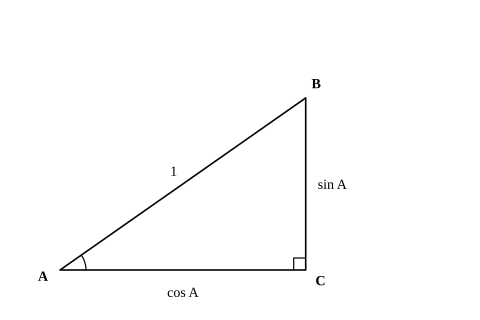

# L03 三角比の相互関係（鋭角）

- unit_id: hs-math-i-trigonometric-ratios
- 位置づけ: 単元第3レッスン（2時間）。sin・cos・tan は別々の3つの数ではなく、互いに結ばれていることを確かめる回。三平方の定理から sin²A＋cos²A=1 を導き、tan A=sin A/cos A・1＋tan²A=1/cos²A・90°−A との関係をそろえて、「1つの値がわかれば残りが計算できる」ようにする。L05（鈍角でも同じ関係が成り立つ）と L07（余弦定理）で再訪する。
- distribution_status: published_draft
- license: CC-BY-4.0
- verify_required: 例題数値・記述は監修者検証必須。
- 主概念: ①sin²A＋cos²A=1・tan A=sin A/cos A・1＋tan²A=1/cos²A を三平方の定理から導く ②90°−A との関係と「1つの値から残りを求める」

---

## 1. 同じ三角形を角 B から見る——90°−A の関係

L01 の例題1（AB=13、BC=5、AC=12）で、sin A=5/13 と cos B=5/13 が同じ値になったことを思い出そう。偶然ではない。∠C=90° の直角三角形 ABC では、三角形の内角の和が 180° だから ∠B=90°−A である。そして角 A の対辺 BC は角 B の隣辺、角 A の隣辺 AC は角 B の対辺になる——注目する角を A から B に変えると、対辺と隣辺が入れかわり、斜辺は変わらない。したがって、

sin B=AC/AB=cos A、cos B=BC/AB=sin A、tan B=AC/BC=1/tan A

B=90°−A を代入して書き直すと、次の関係が得られる。

**sin(90°−A)=cos A、cos(90°−A)=sin A、tan(90°−A)=1/tan A**

たとえば sin 70°=cos 20° である。三角比の表で確かめると、sin 70°=0.9397、cos 20°=0.9397 で確かに一致する。この関係を使うと、45° より大きい角の sin・cos は、45° より小さい角の cos・sin に言い直せる。

**例題1** 次の三角比を、45° 以下の角の三角比で表せ。
(1) sin 58°  (2) cos 71°  (3) tan 83°

(1) sin 58°=cos(90°−58°)=**cos 32°**
(2) cos 71°=sin(90°−71°)=**sin 19°**
(3) tan 83°=1/tan(90°−83°)=**1/tan 7°**

検算: 表で (1) を確かめる。sin 58°=0.8480、cos 32°=0.8480 ✓。(3) は tan 83°=8.1443、1/tan 7°=1/0.1228=8.143… で、四捨五入のずれの範囲で一致する。

## 2. 斜辺 1 の直角三角形と三平方の定理——sin²A＋cos²A=1

L01 §4 の見方を使う。∠C=90° の直角三角形 ABC で、斜辺 AB の長さを 1 にすると、対辺 BC の長さは sin A、隣辺 AC の長さは cos A そのものになる。

この三角形に三平方の定理を当てると、対辺²＋隣辺²=斜辺² だから、

(sin A)²＋(cos A)²=1²

となる。(sin A)² は sin²A と書く習慣がある（sin A の値を2乗した数、という意味。sin(A²) ではない）。この書き方で、

**sin²A＋cos²A=1**

これが三角比の**相互関係**の第1式である。中3の三平方の定理が、斜辺 1 の直角三角形の上で三角比の言葉に翻訳されたもの、と言ってよい。

L02 で出した特別な角の値で確かめておく。A=30° なら sin²30°＋cos²30°=(1/2)²＋(√3/2)²=1/4＋3/4=1 ✓。A=45° なら (1/√2)²＋(1/√2)²=1/2＋1/2=1 ✓。

:::guide
**分数の2乗と「1から引く」を、手順として固定する**

相互関係の計算では、分数を2乗し、それを 1 から引き、最後に平方根をとる。この3手を1つずつ確かめる。①分数の2乗は分子と分母を別々に2乗する: (3/5)²=3²/5²=9/25。②1 から引くときは 1 を同じ分母の分数に直す: 1−9/25=25/25−9/25=16/25。③平方根も分子と分母を別々にとる: √(16/25)=√16/√25=4/5。分子が平方数でなく、分母が平方数のときは √(5/9)=√5/3 のように分母だけ根号が外れ、分子に根号が残る（数と式で学んだ根号の計算の範囲）。慣れるまでは、①②③を1行ずつ別の行に書く。1行にまとめようとして 1−9/25=−8/25 のように分母をそろえ忘れる誤りが起きやすいからだ。
:::

## 3. tan A=sin A/cos A と 1＋tan²A=1/cos²A

残りの関係は、定義から出る。∠C=90° の直角三角形 ABC で、

sin A/cos A=(BC/AB)/(AC/AB)=BC/AC=tan A

分母の AB が約分されて消える。つまり、

**tan A=sin A/cos A**

これが第2式。さらに、第1式 sin²A＋cos²A=1 の両辺を cos²A で割ると（A は鋭角だから cos A≠0）、

sin²A/cos²A＋1=1/cos²A

左辺の sin²A/cos²A は (sin A/cos A)²=tan²A だから、

**1＋tan²A=1/cos²A**

これが第3式。特別な角で確かめると、A=60° のとき 1＋tan²60°=1＋(√3)²=4、1/cos²60°=1/(1/2)²=4 ✓。

3つの式と §1 の 90°−A の関係をまとめて、鋭角の三角比の**相互関係**と呼ぶ。

| 関係 | 式 | 出どころ |
|---|---|---|
| 第1式 | sin²A＋cos²A=1 | 斜辺 1 の直角三角形と三平方の定理 |
| 第2式 | tan A=sin A/cos A | 定義の分数どうしの割り算 |
| 第3式 | 1＋tan²A=1/cos²A | 第1式を cos²A で割る |
| 90°−A | sin(90°−A)=cos A、cos(90°−A)=sin A、tan(90°−A)=1/tan A | 注目する角を B に変える |

## 4. 1つの値から残りを求める

相互関係の使いどころは、**三角比のどれか1つがわかれば、残りの2つが計算できる**ことにある。与えられるのが sin か cos か tan かで、使う式の順番が変わる。

**例題2** A は鋭角で、sin A=3/5 のとき、cos A と tan A を求めよ。

第1式から cos²A=1−sin²A=1−9/25=16/25。A は鋭角で cos A>0 だから cos A=4/5。第2式から tan A=sin A/cos A=(3/5)/(4/5)=3/4。

別解: 対辺 3・斜辺 5 の直角三角形をかくと、三平方の定理で隣辺は √(25−9)=4。定義から cos A=4/5、tan A=3/4——同じ答えだ。

**例題3** A は鋭角で、cos A=2/3 のとき、sin A と tan A を求めよ。

sin²A=1−cos²A=1−4/9=5/9。sin A>0 だから sin A=√5/3。tan A=sin A/cos A=(√5/3)/(2/3)=√5/2。

別解: 隣辺 2・斜辺 3 の直角三角形で、対辺は √(9−4)=√5。sin A=√5/3、tan A=√5/2 ✓。

**例題4** A は鋭角で、tan A=2 のとき、cos A と sin A を求めよ。

tan から始めるときは第3式が近道になる。1＋tan²A=1＋4=5 だから 1/cos²A=5、つまり cos²A=1/5。cos A>0 だから cos A=1/√5=√5/5。次に第2式を sin A=tan A×cos A と読み替えて、sin A=2×(1/√5)=2/√5=2√5/5。

別解: 隣辺 1・対辺 2 の直角三角形で、斜辺は √(1＋4)=√5。cos A=1/√5、sin A=2/√5 ✓。

検算（3題共通）: 求めた sin A・cos A を第1式に戻す。例題2は (3/5)²＋(4/5)²=9/25＋16/25=1 ✓、例題3は (√5/3)²＋(2/3)²=5/9＋4/9=1 ✓、例題4は (2/√5)²＋(1/√5)²=4/5＋1/5=1 ✓。

:::guide
**式でも図でも出せる——2つの解き方を持っておく理由**

例題2〜4の別解は、いずれも「わかっている比を辺の長さとみなして直角三角形をかき、三平方の定理で残りの辺を出す」方法だった。式の方法（相互関係）と図の方法（三角形をかく）は同じ答えを出すので、どちらを使ってもよいし、片方で出してもう片方で検算するのがいちばん確実だ。ただし、鋭角のうちは「sin も cos も tan もすべて正」だから符号で迷うことはないが、次の L04・L05 で角を鈍角まで広げると、cos や tan が負になる場合が出てくる。直角三角形の図から読めるのは辺の長さ（正の数）だけだから、図の方法で出せるのは値の大きさまでである。符号は、式の方法でも図の方法でも「角が鋭角か鈍角か」を見て決める。式の方法は鈍角になっても同じ式のまま使えて、平方根をとるところでこの符号を選べばよい。いま両方を身につけておくのは、そのための準備でもある。
:::

## 5. 練習

**問1** 次の三角比を、45° 以下の角の三角比で表せ（表を引く必要はない）。
(1) sin 65°  (2) cos 41°  (3) tan 80°

**問2** A は鋭角で、sin A=5/13 のとき、cos A と tan A を求めよ。

**問3** A は鋭角で、cos A=3/4 のとき、sin A と tan A を求めよ。

**問4** A は鋭角で、tan A=3/2 のとき、cos A と sin A を求めよ。答えは分母を有理化した形で書け。

**問5** A は鋭角で、sin A=0.28 とする。
(1) cos A と tan A の値を求めよ（tan A は分数で答えてよい）。
(2) 三角比の表で sin A=0.28 に最も近い角を求め、その角の行の cos・tan の値が (1) の値に近いことを確かめよ。
(3) sin²A＋cos²A=1 が成り立つ理由を、直角三角形と三平方の定理を使って1〜2文で説明せよ。

---

:::stretch
**S1** A は 45° より大きい鋭角で、sin A＋cos A=7/5 とする。
(1) 両辺を2乗し、sin²A＋cos²A=1 を使って、sin A cos A の値を求めよ。
(2) (sin A−cos A)² の値を求め、A が 45° より大きいこと（45° より大きい鋭角では対辺が隣辺より長い——隣辺の長さをそろえて比べると、45° のとき対辺は隣辺と等しく、角が大きいほど対辺は長いから。L01 §5 の検算と同じ見方）を使って sin A−cos A の値を求めよ。
(3) sin A と cos A の値を求めよ。
:::

対応解答: answer_key_L01-05.md

<!-- gen_nav:nav:start（自動生成・手編集しない） -->

---

[← 前のレッスン](lesson_02.md)｜[単元の目次](README.md)｜[解答](answer_key_L01-05.md)｜[次のレッスン →](lesson_04.md)

<!-- gen_nav:nav:end -->
