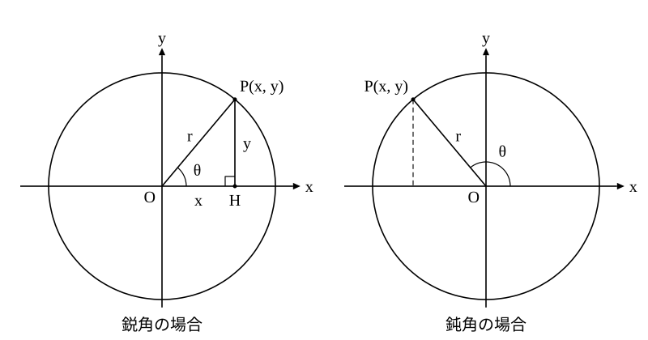
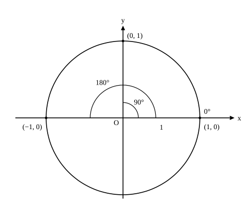

# L04 三角比の拡張——0°から180°まで

- unit_id: hs-math-i-trigonometric-ratios
- 位置づけ: 単元第4レッスン（2時間）。これまで鋭角（0° より大きく 90° より小さい角）だけに定めていた三角比を、0° から 180° まで広げる回。直角三角形のかわりに座標平面を使って定義を言い直し、0°・90°・180° と鈍角の三角比の値を定める。L05（180°−θ の関係）と、鈍角をもつ三角形を扱う L06 以降の土台になる。
- distribution_status: published_draft
- license: CC-BY-4.0
- verify_required: 例題数値・記述は監修者検証必須。
- 主概念: ①必然性（鈍角をもつ三角形でも使いたい）→座標平面（原点中心・半径 r の円周上の点 P(x, y)）で sin θ=y/r・cos θ=x/r・tan θ=y/x と定め直す ②0°・90°・180°の値・鈍角の値を表から（180°−θ の予告）

---

## 1. なぜ広げるのか——鈍角をもつ三角形にも同じ道具を使いたい

三角形の角は、鋭角とは限らない。1つの角が 90° より大きい鈍角三角形はいくらでもある。この単元の後半（L06 以降）では、直角のない三角形の辺と角の関係を三角比で表す定理を学ぶが、そこで「鈍角の sin や cos」が式の中に現れる。ところが、L01 の定義は直角三角形の辺の比だった。直角三角形の他の2つの角は必ず鋭角だから、鈍角を「直角三角形の1つの鋭角」として置くことはできない。**鈍角をもつ三角形にも同じ道具を使えるようにするために、三角比の定義を 0° から 180° まで広げる**——これがこのレッスンの目的である。

広げ方には条件がある。鋭角については、これまでの定義と同じ値を与えること。そうでないと、L01〜L03 で学んだことが使えなくなってしまう。そこで、鋭角の三角比を、直角三角形を使わずに言い直す方法を先に用意する。

## 2. 座標平面で三角比を言い直す

座標平面に、原点 O を中心とする半径 r の円をかく。円周上で x 軸より上側に点 P(x, y) をとり、OP と x 軸の正の向きとのなす角を θ とする。まず θ が鋭角の場合を考える。このとき P は y 軸の右側にあり、x>0、y>0 である。

P から x 軸に垂線を下ろし、その足を H とすると、△OPH は ∠H=90° の直角三角形で、角 θ に注目したときの斜辺は OP=r、対辺は PH=y、隣辺は OH=x である。L01 の定義をそのまま当てはめると、

sin θ=y/r、cos θ=x/r、tan θ=y/x

となる。これを P の座標の側から読むと、x=r cos θ、y=r sin θ、つまり **P(r cos θ, r sin θ)** である。「長さ r の線分 OP が x 軸の正の向きと角 θ をなすとき、P の座標は (r cos θ, r sin θ) と表される」——これが、直角三角形を使わない三角比の言い方だ。

この言い方の利点は、点 P が円周上のどこにあっても座標 (x, y) が読めることにある。θ が 90° を超えて P が y 軸の左側に来ても、x と y は（符号つきの数として）定まる。

:::guide
**「拡張」とは、狭い範囲で成り立っていた式を、広い範囲でも同じ形で使えるように定め直すこと**

中1で数を負の数まで広げたとき、「3−5 も計算できるようにしたい」という要求があって、しかも 3＋2=5 のような正の数の計算はそのまま成り立つように決めた。三角比の拡張も同じ形をしている。要求は「鈍角の三角比も使えるようにしたい」、条件は「鋭角についてはこれまでの値と一致すること」。§2 の言い直し sin θ=y/r・cos θ=x/r・tan θ=y/x は、鋭角では L01 の定義と同じ値を与えるうえに、θ が 90° を超えても式の形を変えずに使える。だからこれを新しい定義として採用する。拡張とは「新しい別の三角比を作る」ことではなく、「同じ式が通用する範囲を広げる」ことだ、と押さえておくと、この後の符号の話が腑に落ちる。
:::

## 3. 0° から 180° までの三角比の定義

§2 の言い直しを、そのまま定義にする。

原点 O を中心とする半径 r の円周上で x 軸より上側（x 軸上を含む）に点 P(x, y) をとり、OP と x 軸の正の向きとのなす角を θ（0°≦θ≦180°）とするとき、

**sin θ=y/r、cos θ=x/r、tan θ=y/x（ただし x≠0）**

と定める。θ が鋭角のときは §2 のとおり L01 の定義と一致するから、鋭角についてこれまで求めた値はすべてそのまま使える。θ が鈍角のときは P が y 軸の左側にあり x<0 だから、cos θ と tan θ は負の数になる。y は 0°≦θ≦180° の範囲では 0 以上だから、sin θ は負にならない。

r は円の半径で、いくつでもよい（円を大きくしても x と y が同じ倍率で伸びるので比は変わらない——L01 §2 の相似と同じ理由）。特に r=1 にとると、sin θ=y、cos θ=x と、P の座標そのものが三角比になる。半径 1 の円は**単位円**（たんいえん）と呼ばれる。以下では、値を求めるときに r=1 の単位円か、計算しやすい r を選んで使う。

:::guide
**直角三角形を手放し、符号は座標に決めさせる**

鈍角の三角比で最初に引っかかるのは、「対辺/斜辺」という言葉が使えなくなることだ。L01 の斜辺・対辺・隣辺は、直角三角形の鋭角に対して決めた呼び名だった。鈍角を1つの角にもつ直角三角形は無いから、鈍角にはこの呼び名を当てはめられない。だから鈍角では、言葉を「y/r」「x/r」「y/x」に切りかえる。r は半径（長さ）だから常に正で、符号を決めるのは x と y だけ。P が y 軸の左側にあれば x<0 で cos θ<0、tan θ<0、P が x 軸より上にあれば y>0 で sin θ>0。値の大きさ（絶対値）は、P から x 軸に垂線を下ろしてできる直角三角形で鋭角の三角比と同じように求め、符号は座標で決める——この2段構えにすると、鋭角で身につけた計算はそのまま生きる。
:::

## 4. 0°・90°・180° の三角比

新しい定義は、直角三角形では扱えなかった 0°・90°・180° にも値を与える。単位円（r=1）で、それぞれの角に対応する点 P を読む。

- θ=0° のとき P(1, 0)。sin 0°=0、cos 0°=1、tan 0°=0/1=0。
- θ=90° のとき P(0, 1)。sin 90°=1、cos 90°=0。tan 90° は y/x=1/0 となって、0 で割ることになるので**定められない**（三角比の表では「—」と書いてある）。
- θ=180° のとき P(−1, 0)。sin 180°=0、cos 180°=−1、tan 180°=0/(−1)=0。

| θ | 0° | 90° | 180° |
|---|---|---|---|
| sin θ | 0 | 1 | 0 |
| cos θ | 1 | 0 | −1 |
| tan θ | 0 | 定められない | 0 |

検算: どの角でも sin²θ＋cos²θ=1 になっているか確かめる。0°: 0＋1=1 ✓、90°: 1＋0=1 ✓、180°: 0＋1=1 ✓。相互関係が 0°・90°・180° でも成り立っていることは、L05 で一般に確かめる。

:::guide
**tan 90° が「定められない」のは、値が大きすぎるからではない**

三角比の表で tan の列を下へたどると、80° で 5.6713、89° で 57.2900 と急に大きくなり、90° で「—」になる。だから「tan 90° は無限に大きい」と言いたくなるが、定義に戻ると事情は違う。tan θ=y/x で、θ=90° のとき P(0, 1) だから x=0——分母が 0 の分数は数として定められない。「大きすぎて書けない」のではなく「0 で割る式になるので、そもそも値を与えない」のである。表の「—」はその印だ。同じ理由で、この単元で tan θ を使う式（L03 の 1＋tan²θ=1/cos²θ など）は、θ≠90° の断りつきで扱う。
:::

## 5. 鈍角の三角比——特別な角と、表の使い方

**例題1** sin 120°、cos 120°、tan 120° を求めよ。

半径 2 の円で考える。OP と x 軸の正の向きのなす角が 120° だから、OP と x 軸の負の向きのなす角は 180°−120°=60°（x 軸の正の向きと負の向きは一直線で 180°）。P から x 軸に垂線 PH を下ろすと、△OPH は斜辺 2 で ∠POH=60° の直角三角形になり、中3の比 1:2:√3 から OH=1、PH=√3。P は y 軸の左側にあるから x=−1、y=√3、つまり P(−1, √3)。定義から、

sin 120°=√3/2、cos 120°=−1/2、tan 120°=√3/(−1)=−√3

検算: (−1)²＋(√3)²=1＋3=4=2² で、P は確かに半径 2 の円周上にある ✓。sin²120°＋cos²120°=3/4＋1/4=1 ✓。

**例題2** sin 135°、cos 135°、tan 135° を求めよ。

OP と x 軸の負の向きのなす角は 180°−135°=45°。半径 √2 の円をとると、比 1:1:√2 から OH=1、PH=1 で、P(−1, 1)。

sin 135°=1/√2=√2/2、cos 135°=−1/√2=−√2/2、tan 135°=1/(−1)=−1

検算: (−1)²＋1²=2=(√2)² ✓。

**例題3** 三角比の表を使って、sin 130°、cos 130°、tan 130° の値を求めよ。

表には 90° までしか載っていない。そこで、130° に対応する単位円上の点 P と、50° に対応する点 Q を比べる。OP と x 軸の負の向きのなす角は 180°−130°=50° だから、P と Q は y 軸について対称の位置にある——y 座標が等しく、x 座標は符号だけが逆である。したがって sin 130° は sin 50° と等しく、cos 130° は cos 50° の符号を変えたもの、tan 130° は tan 50° の符号を変えたものになる。表で 50° の行を読むと sin 50°=0.7660、cos 50°=0.6428、tan 50°=1.1918 だから、

sin 130°=0.7660、cos 130°=−0.6428、tan 130°=−1.1918

検算: 0.7660²＋(−0.6428)²≒0.5868＋0.4132=1.0000 ✓。

例題3の「180° から引いて表を引き、cos と tan の符号を変える」という手順は、130° に限らず鈍角ならいつでも使える。その一般の形——sin(180°−θ)=sin θ、cos(180°−θ)=−cos θ、tan(180°−θ)=−tan θ——は、次の L05 で対称性から導く。

## 6. 練習

**問1** 原点 O を中心とする半径 r の円周上の点 P(x, y) について、OP と x 軸の正の向きとのなす角を θ とする。次の各場合について sin θ、cos θ、tan θ を求め、θ が鋭角か鈍角かを答えよ。
(1) r=5、P(−3, 4)
(2) r=13、P(12, 5)
(3) r=10、P(−8, 6)

**問2** 次の表を完成させよ。また、tan 90° の欄が埋まらない理由を1文で書け。

| θ | 0° | 90° | 180° |
|---|---|---|---|
| sin θ | | | |
| cos θ | | | |
| tan θ | | | |

**問3** 次の値を求めよ。
(1) sin 150°  (2) cos 150°  (3) tan 150°  (4) sin 0°＋cos 90°＋tan 180°

**問4** 三角比の表を使って、次の値を求めよ。
(1) sin 110°、cos 110°、tan 110°
(2) sin 155°、cos 155°

**問5** 次のことが成り立つ理由を、点 P の座標を使ってそれぞれ1〜2文で説明せよ。
(1) 0°<θ<180° のとき、sin θ>0 である。
(2) 0°≦θ<180° で cos θ<0 ならば、θ は鈍角である。

---

:::stretch
**S1** 長さ r の線分 OP が x 軸の正の向きと角 θ をなすとき、P の座標は (r cos θ, r sin θ) と表される。
(1) r=4、θ=150° のとき、P の座標を求めよ。
(2) r=6、θ=180° のとき、P の座標を求めよ。
(3) 半径 10 の円周上に点 P(−6, 8) がある。この P に対応する θ について sin θ、cos θ、tan θ を求め、θ が鋭角か鈍角かを答えよ。さらに、三角比の表を使って θ のおよその大きさ（最も近い整数の角）を求めよ。
:::

対応解答: answer_key_L01-05.md

<!-- gen_nav:nav:start（自動生成・手編集しない） -->

---

[← 前のレッスン](lesson_03.md)｜[単元の目次](README.md)｜[解答](answer_key_L01-05.md)｜[次のレッスン →](lesson_05.md)

<!-- gen_nav:nav:end -->
