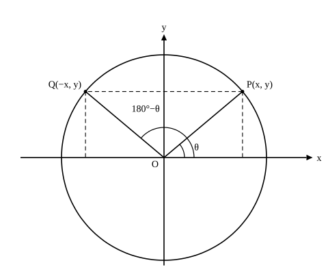

# L05 拡張後の関係——180°−θ と相互関係、値から角へ

- unit_id: hs-math-i-trigonometric-ratios
- 位置づけ: 単元第5レッスン（1.5時間）。L04 で 0° から 180° まで広げた三角比について、θ と 180°−θ の関係を対称性から導き、L03 の相互関係が鈍角でも成り立つことを確かめ、「値から角を求める」と「直線の傾きと tan」を扱う回。子単元「三角比の定義と相互関係」の最終レッスンで、L06 以降の定理はここまでの内容を前提にする。
- distribution_status: published_draft
- license: CC-BY-4.0
- verify_required: 例題数値・記述は監修者検証必須。
- 主概念: ①sin(180°−θ)=sin θ・cos(180°−θ)=−cos θ・tan(180°−θ)=−tan θ と、相互関係が鈍角でも成り立つこと ②三角比の値から角を求める（0°≦θ≦180°で解が2つになる場合）・直線の傾きと tan

---

## 1. θ と 180°−θ——y 軸についての対称

L04 例題3で、130° の点と 50° の点が y 軸について対称であることを使った。これを一般の θ で確かめる。

単位円（半径 1）上に、θ に対応する点 P(x, y) をとる。次に、180°−θ に対応する点を Q とする。OQ と x 軸の正の向きとのなす角が 180°−θ だから、OQ と x 軸の負の向きとのなす角は θ である。つまり Q は、P を y 軸について折り返した位置にあり、Q の座標は (−x, y) である——y 座標は同じで、x 座標の符号だけが逆になる。

単位円では sin θ=y、cos θ=x だから、Q の座標を読むと sin(180°−θ)=y、cos(180°−θ)=−x。tan は y/x で、Q では y/(−x)。まとめて、

**sin(180°−θ)=sin θ、cos(180°−θ)=−cos θ、tan(180°−θ)=−tan θ**（tan の式は x≠0、つまり θ≠90° のとき）

この関係を使うと、鈍角の三角比はいつでも鋭角の三角比に直せる。

**例題1** 三角比の表を使って、sin 140°、cos 140°、tan 140° の値を求めよ。

140°=180°−40° だから、sin 140°=sin 40°=0.6428、cos 140°=−cos 40°=−0.7660、tan 140°=−tan 40°=−0.8391。

検算: 0.6428²＋(−0.7660)²≒0.4132＋0.5868=1.0000 ✓。また、L04 例題1の cos 120° をこの関係で出し直すと cos 120°=−cos 60°=−1/2 で、座標から求めた値と一致する ✓。

:::guide
**鈍角が出てきたら、まず 180° から引く**

鈍角の三角比を求める手順は、いつも同じ3手だ。①180° から引いて鋭角にする（140°→40°）。②その鋭角の三角比を表か特別な角の値で出す。③sin はそのまま、cos と tan は符号を負にする。符号が変わるのは cos と tan だけ、というのは L04 で見た「鈍角の点 P は x<0、y>0」の言い換えである。逆に、鋭角の三角比から鈍角の三角比を作ることもできる。sin 40°=0.6428 という表の1行が、sin 140° の値も同時に教えてくれているわけだ。0° から 90° までの表しか無くても 180° まで扱えるのは、この関係のおかげである。
:::

## 2. 相互関係は鈍角でも成り立つ

L03 で導いた相互関係は、直角三角形と三平方の定理から出したものだった。定義を座標に置きかえた今、0°≦θ≦180° の全体で成り立つかを確かめ直す必要がある。

半径 r の円周上の点 P(x, y) は、原点からの距離が r だから x²＋y²=r² を満たす（中3の三平方の定理・座標平面上の2点間の距離）。定義 sin θ=y/r、cos θ=x/r を使うと、

sin²θ＋cos²θ=y²/r²＋x²/r²=(x²＋y²)/r²=r²/r²=1

したがって **sin²θ＋cos²θ=1** は、θ が鈍角でも、0°・90°・180° でも成り立つ。また、x≠0 のとき、

sin θ/cos θ=(y/r)/(x/r)=y/x=tan θ

だから **tan θ=sin θ/cos θ** も成り立つ。第1式の両辺を cos²θ で割れば（cos θ≠0、つまり θ≠90° のとき）**1＋tan²θ=1/cos²θ** も同じように出る。

つまり、鈍角になっても相互関係の式そのものは変わらない。変わるのは、**平方根をとるときの符号の決め方**である。

**例題2** θ は鈍角で、sin θ=2/3 のとき、cos θ と tan θ を求めよ。

cos²θ=1−sin²θ=1−4/9=5/9。θ は鈍角だから cos θ<0 で、cos θ=−√5/3。tan θ=sin θ/cos θ=(2/3)/(−√5/3)=−2/√5=−2√5/5。

**例題3** 0°≦θ≦180° で、cos θ=−1/4 のとき、sin θ と tan θ を求めよ。

sin²θ=1−cos²θ=1−1/16=15/16。0°≦θ≦180° では sin θ≧0 だから、sin θ=√15/4。tan θ=(√15/4)/(−1/4)=−√15。

検算: 例題2は (2/3)²＋(−√5/3)²=4/9＋5/9=1 ✓。例題3は (√15/4)²＋(−1/4)²=15/16＋1/16=1 ✓。例題3で cos θ<0 だから θ は鈍角で、tan θ<0 になっているのも整合する ✓。

:::guide
**sin θ が与えられたときだけ、鋭角か鈍角かの断りが要る**

例題2と例題3の違いに注意してほしい。cos θ=−1/4 と与えられれば、cos θ<0 から θ は鈍角と決まり、sin θ は 0°≦θ≦180° で必ず 0 以上だから、符号で迷う余地はない。ところが sin θ=2/3 だけでは、θ が鋭角（cos θ=＋√5/3）なのか鈍角（cos θ=−√5/3）なのか決まらない——単位円上で y=2/3 となる点は、y 軸の右と左に1つずつあるからだ。だから sin θ の値（0 より大きく 1 より小さい値）から始める問題には「θ は鈍角で」のような断りがついているし、断りが無ければ「鋭角の場合と鈍角の場合」の両方を答える（端の値は別で、sin θ=1 なら θ=90° の1通りだけ、sin θ=0 や tan θ=0 なら θ=0° と 180° の2通りになる。§3 でまとめて見る）。この「y 座標だけでは点が1つに決まらない」という事実は、次の §3 で「値から角を求めると解が2つになる」という形でもう一度現れる。
:::

## 3. 三角比の値から角を求める——解が2つになる場合

L01 では表の逆引きで角を求めたが、角の範囲が 0° から 180° に広がると、同じ値をもつ角が2つある場合が出てくる。単位円で考えると見通しがよい。

**例題4** 0°≦θ≦180° のとき、次の式を満たす θ を求めよ。
(1) sin θ=√3/2  (2) cos θ=1/√2  (3) tan θ=−√3

(1) 単位円上で y 座標が √3/2 になる点を探す。直線 y=√3/2 と単位円（の上半分）の交点は、y 軸の右側と左側に1つずつある。右側の点は 60° に対応し（sin 60°=√3/2）、左側の点はそれと y 軸について対称だから 180°−60°=120° に対応する。よって **θ=60°、120°**。

(2) x 座標が 1/√2 になる点を探す。直線 x=1/√2 と単位円の上半分の交点は1つだけで、45° に対応する。よって **θ=45°**。

(3) tan θ<0 だから θ は鈍角。tan 60°=√3 と tan(180°−θ)=−tan θ から、tan 120°=−√3。よって **θ=120°**。

検算: (1) sin 120°=sin(180°−60°)=sin 60°=√3/2 ✓。(3) 120° の点は P(−1/2, √3/2)（L04 例題1を単位円に直したもの）で、y/x=(√3/2)/(−1/2)=−√3 ✓。

表を使う場合も同じだ。たとえば sin θ=0.7 なら、表の sin の列で 0.7 に最も近いのは 44° の 0.6947 だから、鋭角の解は θ≒44°、鈍角の解は θ≒180°−44°=136° である。

:::guide
**解が2つか1つかは、単位円に引く線の向きで決まる**

sin θ=k（0<k<1）は「y 座標が k の点」を探す問いで、単位円に横の直線 y=k を引くと上半分と2点で交わる——だから 0°≦θ≦180° では解が2つ。cos θ=k（−1≦k≦1）は「x 座標が k の点」で、縦の直線 x=k は単位円の上半分と1点でしか交わらない——解は1つ。tan θ=k は「y/x が k の点」で、そのような点は原点を通る直線 y=kx の上にある。k≠0 なら、この直線は単位円の上半分と1点でしか交わらない（k>0 なら y 軸の右側で θ は鋭角、k<0 なら左側で θ は鈍角）——やはり1つ。k=0 のときは直線が x 軸に重なり、交点は (1, 0) と (−1, 0) の2つだから、θ=0° と 180° の2つ。例外は sin θ=1（点 (0, 1) だけで θ=90°）と sin θ=0（θ=0° と 180° の2つ）で、これも線を引けば見える。なお、sin θ=k で k<0 や k>1 のとき、cos θ=k で k<−1 や k>1 のときは、直線が単位円の上半分と交わらないので、解はない。「sin なら2つ」と丸暗記せず、円に線を引いて交点を数える癖をつけると、範囲が変わっても（数学Ⅱで角の範囲がさらに広がっても）同じ考え方で数えられる。
:::

## 4. 直線の傾きと tan

原点を通る直線 y=mx（m≠0）と単位円の交点は2つあり、そのうち y 座標が正の方を P とする。OP と x 軸の正の向きとのなす角 θ（0°<θ<180°、θ≠90°）を、この直線が x 軸の正の向きとなす角と呼ぶ。P は角 θ に対応する点だから P(cos θ, sin θ)。P は直線の上にあるから y=mx に代入できて、sin θ=m cos θ。cos θ≠0 で割ると、

**m=sin θ/cos θ=tan θ**

つまり、**原点を通る直線の傾きは、その直線が x 軸の正の向きとなす角の tan に等しい**。θ が鋭角なら傾きは正（右上がり）、鈍角なら傾きは負（右下がり）で、tan の符号と対応している。

**例題5** 直線 y=−√3x が x 軸の正の向きとなす角 θ を求めよ。

tan θ=−√3 で、0°<θ<180° だから、例題4(3) と同じく **θ=120°**。傾きが負だから右下がりの直線で、鈍角になっているのは自然である。

検算: 120° に対応する単位円上の点 (−1/2, √3/2) が y=−√3x を満たすか——−√3×(−1/2)=√3/2 ✓。

この対応は、数学Ⅱで直線の関係（平行・垂直）を角で見るときに再訪する。

## 5. 練習

**問1** 三角比の表を使って、次の値を求めよ。
(1) sin 125°、cos 125°、tan 125°
(2) cos 172°

**問2** θ は鈍角で、sin θ=3/5 のとき、cos θ と tan θ を求めよ。

**問3** 0°≦θ≦180° で、cos θ=−2/3 のとき、sin θ と tan θ を求めよ。

**問4** 0°≦θ≦180° のとき、次の式を満たす θ をすべて求めよ。
(1) sin θ=√2/2  (2) cos θ=−1/2  (3) tan θ=1  (4) sin θ=1  (5) cos θ=0

**問5** 次の問いに答えよ。
(1) 直線 y=x が x 軸の正の向きとなす角を求めよ。
(2) 直線 y=−√3x が x 軸の正の向きとなす角を求めよ。
(3) 傾きが 1/√3 で原点を通る直線が x 軸の正の向きとなす角を求めよ。
(4) x 軸の正の向きと 135° の角をなし、原点を通る直線の式を求めよ。

---

:::stretch
**S1** 0°≦θ≦180° とする。三角比の表を使って、次の問いに答えよ（角は最も近い整数の角で答える）。
(1) sin θ=0.4 を満たす θ をすべて求めよ。
(2) cos θ=−0.3 を満たす θ を求めよ。
(3) (1) では解が2つ、(2) では解が1つになった。その理由を、単位円に引く直線と円の交点の個数で1〜2文で説明せよ。
:::

対応解答: answer_key_L01-05.md

<!-- gen_nav:nav:start（自動生成・手編集しない） -->

---

[← 前のレッスン](lesson_04.md)｜[単元の目次](README.md)｜[解答](answer_key_L01-05.md)｜[次のレッスン →](lesson_06.md)

<!-- gen_nav:nav:end -->
