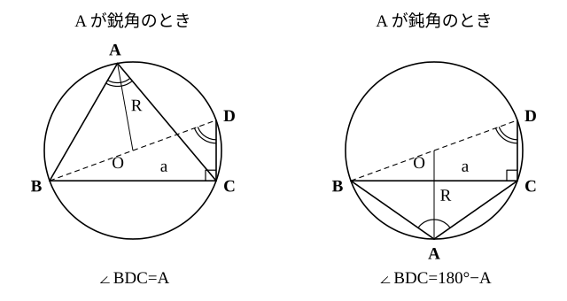

# L06 正弦定理——外接円と「1辺と2角」

- unit_id: hs-math-i-trigonometric-ratios
- 位置づけ: 単元第6レッスン（2時間）。子単元「正弦定理・余弦定理と三角形の計量」（L06〜L11）の1本目。L01〜L05 で 0° から 180° まで広げた三角比を、直角三角形ではない一般の三角形に持ち込む最初の道具として正弦定理を導く。中3の円周角の定理を土台に「外接円」を新しく定義し、1辺と2角から残りの辺と外接円の半径を求める。
- distribution_status: published_draft
- license: CC-BY-4.0
- verify_required: 例題数値・記述は監修者検証必須。
- 主概念: ①外接円（新出）と正弦定理 a/sin A=2R の導出（円周角の定理→直径を1辺にもつ直角三角形） ②1辺と2角から残りの辺・外接円の半径を求める

---

## 0. このレッスンで使う既習事項——前提の確認

このレッスンから、三角比を「直角三角形の中」から連れ出して、どんな三角形にも使える道具に育てていく。使うものは次の5つで、いずれも学んだ場所を書いておく。

1. 0° から 180° までの角の sin・cos・tan（L04）。とくに sin の値は、0° と 180° を除いて**正**である。
2. sin(180°−θ)=sin θ（L05）。鈍角の sin は、180° から引いた鋭角の sin と同じ。
3. [三角比の表](trig_table.md)（0° から 90° まで 1° 刻み）と、その引き方（L01）。電卓の sin・cos・tan のキーを使ってもよい（L01）。
4. 中2の合同条件——**1辺とその両端の角**が決まれば、三角形は1つに決まる。
5. 中3の円周角の定理——同じ弧に対する円周角は等しい。半円の弧に対する円周角は 90° である。

「三角形が1つに決まる」なら、残りの辺や角は本来「計算で出せる」はずである。中3では縮図をかいて測ったが、このレッスンからは計算で求める。

## 1. 記号の約束——辺 a は角 A の向かい

三角形 ABC で、頂点 A・B・C の角の大きさをそれぞれ A・B・C と書き、**辺 BC を a、辺 CA を b、辺 AB を c** と書く。つまり a は頂点 A の**向かい**の辺、b は B の向かい、c は C の向かいである。この対応（A と a、B と b、C と c）は、このあと出てくる定理のすべてで骨組みになるので、図をかいたら必ず辺に小文字を書き込む習慣にしよう。角の和は A＋B＋C=180° だから、2つの角が分かれば3つ目は引き算で出る。

直角三角形なら、1辺と1つの鋭角が分かれば、残りの辺は sin・cos で求められた（L02）。では、直角のない三角形で、たとえば a=4、A=30°、B=45° のとき、辺 b はいくらだろうか。1辺とその両端の角ではないが、C=105° が出るので「1辺と2角」——三角形は1つに決まっている。あとは、この b を計算で取り出す式がほしい。その式が、このレッスンの正弦定理である。

## 2. 外接円——3つの頂点を通る円

三角形 ABC の3つの頂点 A・B・C をすべて通る円を、三角形 ABC の**外接円**という。外接円の半径は、このあとずっと R で表す。

外接円の中心は、線分の垂直二等分線（中1で作図した）を使って見つけられる。垂直二等分線の上の点は、線分の両端までの距離が等しい——その点と線分の中点・両端を結ぶと、直角をはさむ2辺がそれぞれ等しい2つの直角三角形ができて合同になる（中2）からである。辺 AB と辺 BC の垂直二等分線の交点を O とすると、OA=OB、OB=OC だから、O を中心として A を通る円は B と C も通る。3点が一直線上にない限りこの交点は必ず1つあるから、どんな三角形にも外接円はちょうど1つある。中学で「3点を通る円」を作図したことがあれば、それと同じ円で、高校では三角形との関係で「外接円」と呼ぶ。

外接円をかくと、中3の円周角の定理がそのまま使える。辺 BC を弧 BC に対する弦と見ると、頂点 A の角 A は「弧 BC に対する円周角」である。円周角の定理によれば、点 A が（弧 BC の B・C 以外の）同じ側の円周上のどこにあっても、角 A の大きさは変わらない。つまり、**辺 a と外接円が決まれば、頂点 A が直線 BC のどちら側にあるかを決めるだけで、その向かいの角 A の大きさは決まってしまう**。角 A と辺 a のこの結び付きを、sin を使って式にしたものが正弦定理である。

## 3. 正弦定理を導く——直径を1辺にもつ直角三角形をつくる

三角比は直角三角形で定義された量だから、外接円の中に直角三角形を作るのが方針になる。「半円の弧に対する円周角は 90°」を使えば、**直径を1辺にもつ三角形は直角三角形**である。そこで、頂点 B を通る外接円の直径 BD を引く（D は円周上のもう一方の端）。

**A が鋭角のとき。** 点 D は、直線 BC について A と同じ側にある（A が鋭角だから）。三角形 BCD で、BD は直径だから ∠BCD=90°。また ∠BDC と ∠BAC はどちらも弧 BC に対する円周角だから等しく、∠BDC=A である。直角三角形 BCD で角 D の sin をとると、

sin A = sin ∠BDC = BC/BD = a/(2R)

したがって a/sin A=2R、言いかえると a=2R sin A である。

**A が 90° のとき。** 辺 BC そのものが直径になる（円周角が 90° になる弧は半円）から a=2R。sin 90°=1 なので a/sin A=2R は、この場合もそのまま成り立つ。

**A が鈍角のとき。** 直径 BD の端 D は、直線 BC について A と反対側に来る。弧 BC の両側にある2つの円周角 ∠BAC と ∠BDC に対応する中心角を x と 360°−x（一方は 180° を超える）とすると、円周角はそれぞれ x/2 と (360°−x)/2 で、合わせて 180° になる（円周角の定理は、中心角が 180° を超えるときも成り立つ——中3）。よって ∠BDC=180°−A である。直角三角形 BCD で sin ∠BDC=a/(2R) だから、L05 の sin(180°−A)=sin A を使って、

sin A = sin(180°−A) = a/(2R)

となり、やはり a/sin A=2R が成り立つ。鈍角まで三角比を広げておいたことが、ここで効いている——直角三角形の中に鈍角 A そのものは現れないのに、a/sin A=2R は鈍角でも同じ形で使える。

頂点 A について言えたことは、頂点 B・C についても同じである（B を通る直径のかわりに C や A を通る直径を引けばよい）。まとめると次の定理になる。

> **正弦定理**　三角形 ABC の外接円の半径を R とすると
>
> a/sin A = b/sin B = c/sin C = 2R

:::guide
**分数の形の式を、どう読めばよいか**

a/sin A=2R という「分数=定数」の形は、そのままではとらえにくい。3通りの読み方を持っておくと、場面に応じて使い分けられる。①「辺と、その向かいの角の sin の比は、3組とも同じ値 2R になる」——これが定理の本来の主張で、三角形の形（角）と大きさ（辺）を結び付けている。②分母を払って a=2R sin A と読む——「辺の長さ=直径×向かいの角の sin」。直角三角形で「斜辺×sin=対辺」と読んだ（L02）のと同じ形で、斜辺の役を外接円の直径が引き受けている。計算では、この形がいちばん使いやすい。③3組を並べて a:b:c=sin A:sin B:sin C と読む——辺の比は sin の比。角だけ分かっている三角形の「形」を辺の比で言い表せる。どの読み方でも、対応しているのは**辺と、その向かいの角**である。a と B のように向かい合っていない辺と角を組にした式は、A=B のとき以外は成り立たないので、§1 の対応（A と a）を図に書き込んでから式を立てる。
:::

:::guide
**外接円を使わない見方——高さを2通りに表す**

正弦定理のうち a/sin A=b/sin B の部分だけなら、外接円なしでも出せる。頂点 C から辺 AB（またはその延長）に垂線 CH を下ろすと、直角三角形 ACH で CH=b sin A、直角三角形 BCH で CH=a sin B である（A や B が鈍角のときは、L05 の sin(180°−θ)=sin θ で同じ式になる。A が 90° のときは H が A に重なって直角三角形 ACH はできないが、CH=b=b sin 90° で式はそのまま成り立ち、B が 90° のときも同じである）。同じ高さ CH を2通りに表したのだから b sin A=a sin B、つまり a/sin A=b/sin B。この見方は「同じ量を2通りに表して等式を作る」という、このあと面積（L09）でも使う考え方の練習になる。ただし、この経路では 2R が出てこない。「比の値が外接円の直径である」という情報は、§3 の直径を1辺にもつ直角三角形からしか得られない。2つの見方は、どちらか一方を覚えればよいのではなく、役割が違う。
:::

## 4. 正弦定理を使う——1辺と2角

**例題1** 三角形 ABC で a=4、A=30°、B=45° のとき、辺 b と外接円の半径 R を求めよ。

分かっている「辺と向かいの角」の組は a と A である。まず 2R を出す。

2R = a/sin A = 4/sin 30° = 4/(1/2) = 8

したがって R=**4**。次に b は、向かいの角 B を使って

b = 2R sin B = 8×sin 45° = 8×√2/2 = **4√2**

検算は、求めた b と B の組でも 2R が同じ値になるかを見る。b/sin B=4√2/(√2/2)=8 で、2R=8 と一致する。もう1つ、辺の長短と角の大小が合っているか（大きい角の向かいの辺が長い——正弦定理 a=2R sin A から、鋭角どうしなら角が大きいほど sin が大きく、辺も長い）——B=45° は A=30° より大きく、b=4√2≒5.66 は a=4 より長い。向きが合っている。この「大きい角の向かいの辺が長い」は、大きいほうの角 θ が直角や鈍角のときも成り立つ。3つの角の和が 180° なので、残りの角はどちらも 180°−θ より小さい鋭角になり、その sin は sin(180°−θ)=sin θ（L05）より小さいからである。

なお、この三角形では R=4 が a と同じ値になっている。偶然ではなく、sin 30°=1/2 のとき a=2R sin A=R となる——30° の角の向かいの辺は、外接円の半径にちょうど等しい。

**例題2** 三角形 ABC で b=10、B=40°、C=75° のとき、辺 c と外接円の半径 R を求めよ。小数第2位を四捨五入して小数第1位まで答えよ。

40° や 75° は特別な角ではないので、表を引く。sin 40°=0.6428、sin 75°=0.9659 である。

2R = b/sin B = 10/0.6428 = 15.556…

c = 2R sin C = 15.556…×0.9659 = 15.026…

よって c≒**15.0**、R=15.556…/2=7.778… から R≒**7.8**。途中の値を先に丸めると答えがずれることがあるので、**丸めるのは最後の1回**にする。電卓なら 10×0.9659÷0.6428 を一気に計算すればよい。

検算として、大小の向きを見る。C=75° は B=40° より大きいので、c は b=10 より長いはず——15.0 で向きが合う。残りの A=180°−40°−75°=65° についても a=2R sin A=15.556…×0.9063≒14.1 と、A（65°）が B（40°）より大きく C（75°）より小さいのに合わせて、a は b と c の間に入る。

**例題3** 外接円の半径が 5 の三角形 ABC で A=60° のとき、辺 a を求めよ。

a = 2R sin A = 2×5×sin 60° = 10×√3/2 = **5√3**

外接円の半径が先に分かっていれば、正弦定理はそのまま「辺=直径×sin」の公式として使える。

## 5. 手順の型

1. 図をかき、A の向かいに a、B の向かいに b、C の向かいに c を書き込む。
2. 角が2つ分かっていれば、3つ目を 180° から引いて出しておく。
3. 「辺と、その向かいの角」の組が1つそろっているものを探し、2R=（辺）/（sin 向かいの角）を計算する。
4. 求めたい辺=2R×sin（その辺の向かいの角）。特別な角（30°・45°・60°）以外は表か電卓を使い、丸めは最後の1回だけにする。
5. 検算: 別の「辺と向かいの角」の組で 2R を計算し直して一致するか。大きい角の向かいが長い辺になっているか。

:::guide
**「1辺と2角」なら、どの角が与えられても正弦定理が使える理由**

中2の合同条件は「1辺と**その両端の角**」だった。ところが正弦定理の立場では、与えられた2角がその辺の両端でなくても困らない。角は3つの和が 180° なので、2つ分かれば3つ目が出て、結局「与えられた辺の向かいの角」は必ず手に入るからである。例題2 で b=10 の向かいの角 B が与えられていたのはたまたまで、かりに A と C が与えられていても、B=180°−A−C から同じ計算に入れる。逆に、角が3つとも分かっていて辺が1つも分からない場合は、三角形の「形」は決まるが「大きさ」が決まらない（相似な三角形が無数にある）。このとき正弦定理は a:b:c=sin A:sin B:sin C という比の情報しかくれず、R も決まらない。定理を当てはめる前に、「決まっている三角形か」を数え上げておくと、式を立てる前に迷わなくなる。この数え上げは L08 で表にまとめる。
:::

## 6. 練習

**問1** 三角形 ABC で A=45°、B=60°、b=6√3 のとき、次を求めよ。
(1) 辺 a  (2) 外接円の半径 R

**問2** 三角形 ABC で a=8、A=50°、C=70° のとき、辺 b と辺 c を求めよ。小数第2位を四捨五入して小数第1位まで答えよ。

**問3** 外接円の半径が 3 の三角形 ABC で A=45°、B=30° のとき、次を求めよ。
(1) 辺 a  (2) 辺 b  (3) 辺 c（小数第2位を四捨五入して小数第1位まで）

**問4** 三角形 ABC で B=35°、C=25°、c=5 のとき、辺 a と辺 b を求めよ。小数第2位を四捨五入して小数第1位まで答えよ。

**問5** 三角形 ABC の3辺の比 a:b:c は、3つの角の sin の比 sin A:sin B:sin C に等しい。この理由を、正弦定理をもとに2〜3文で説明せよ。

---

:::stretch
**S1** 三角形 ABC で a=5、A=30° とする。
(1) 外接円の半径 R を求めよ。
(2) B=80° のときの辺 b と、B=100° のときの辺 b を、小数第2位を四捨五入して小数第1位まで求めよ。
(3) (2) の2つの三角形は形が違うのに、辺 b の長さが同じになる。その理由を、sin の性質と外接円をもとに説明せよ。
:::

対応解答: answer_key_L06-09.md

<!-- gen_nav:nav:start（自動生成・手編集しない） -->

---

[← 前のレッスン](lesson_05.md)｜[単元の目次](README.md)｜[解答](answer_key_L06-09.md)｜[次のレッスン →](lesson_07.md)

<!-- gen_nav:nav:end -->
