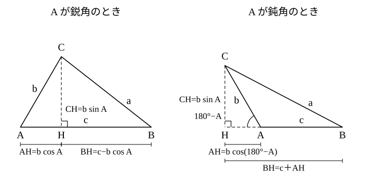

# L07 余弦定理——三平方の定理の一般化

- unit_id: hs-math-i-trigonometric-ratios
- 位置づけ: 単元第7レッスン（2時間）。子単元「正弦定理・余弦定理と三角形の計量」の2本目。「2辺とその間の角」から残りの辺を三平方の定理で求める活動を繰り返してから一般化し、余弦定理を導く。三平方の定理は cos 90°=0 の特別な場合になる。後半は3辺から角を求め、cos の符号で鋭角・鈍角を判定して、本サイトの中3教材（三平方の定理）で予想だけにとどめた「辺の2乗の大小と角の大小」の関係を完成させる。
- distribution_status: published_draft
- license: CC-BY-4.0
- verify_required: 例題数値・記述は監修者検証必須。
- 主概念: ①余弦定理 a²=b²＋c²−2bc cos A の導出（垂線→三平方の定理→一般化） ②3辺から角を求める・cos の符号で鋭角と鈍角を判定する

---

## 1. 2辺とその間の角から残りの辺——三平方の定理を繰り返す

三角形 ABC で b=5、c=8、A=60° のとき、辺 a はいくらだろうか。

L06 の正弦定理を使おうとすると、「辺と、その向かいの角」の組が1つも見つからない（b の向かいの B も、c の向かいの C も分からず、A の向かいの a が求めたいもの）。正弦定理では入口がない。そこで、中3の道具に戻る。三角比は直角三角形の量だから、**垂線を下ろして直角三角形を作る**。

頂点 C から辺 AB に垂線 CH を下ろす。直角三角形 ACH では、斜辺 AC=b=5 と角 A=60° が分かっているので（L02）、

AH = b cos A = 5×1/2 = 5/2、　CH = b sin A = 5×√3/2 = 5√3/2

次に、直角三角形 BCH を見る。BH は AB から AH を引いた残りで、BH=c−AH=8−5/2=11/2。三平方の定理から

a² = CH²＋BH² = (5√3/2)²＋(11/2)² = 75/4＋121/4 = 196/4 = 49

よって a=7 である。

同じ手順を、数値を変えてもう一度たどる。b=4、c=6、A=60° なら、AH=4×1/2=2、CH=4×√3/2=2√3、BH=6−2=4 で、a²=(2√3)²＋4²=12＋16=28、a=2√7。もう一度、b=3、c=4、A=90° なら、垂線の足 H は A そのものに重なり（AH=3 cos 90°=0）、CH=3 sin 90°=3、BH=4 で、a²=9＋16=25、a=5——これは三平方の定理そのものである。

3回とも、やっていることは同じだ。**AH=b cos A、CH=b sin A、BH=c−b cos A** を作って、a²=CH²＋BH² に入れる。数値を入れる前に、この形のまま計算してしまえば、毎回垂線を引き直さなくてよい公式になる。

## 2. 一般化——余弦定理

a² = (b sin A)²＋(c−b cos A)²
　 = b² sin²A＋c²−2bc cos A＋b² cos²A
　 = b²(sin²A＋cos²A)＋c²−2bc cos A

L03 の相互関係 sin²A＋cos²A=1 を使うと、

a² = b²＋c²−2bc cos A

A が鈍角のときは、垂線の足 H が辺 AB の上ではなく、辺 BA を A の側に延長した直線上に落ちる。このとき直角三角形 ACH の A の側の角は 180°−A で、AH=b cos(180°−A)、CH=b sin(180°−A) である。L05 の関係 cos(180°−A)=−cos A、sin(180°−A)=sin A を使うと AH=−b cos A（cos A<0 なので −b cos A>0、正の長さである）、CH=b sin A。BH は今度は c に AH を**足した**もので、BH=c＋(−b cos A)=c−b cos A——鋭角のときと同じ式になる。あとの計算は同じだから、a²=b²＋c²−2bc cos A は鈍角でも成り立つ。A=90° のときは cos 90°=0 で a²=b²＋c²、三平方の定理である。

頂点 A について言えたことは、頂点 B・C でも同じである。まとめると次の定理になる。

> **余弦定理**　三角形 ABC で
>
> a² = b²＋c²−2bc cos A
> b² = c²＋a²−2ca cos B
> c² = a²＋b²−2ab cos C

3つの式はどれも同じ形をしている。「求めたい辺の2乗は、他の2辺の2乗の和から、その2辺の積の2倍に**間の角**の cos を掛けたものを引く」。中3の三平方の定理は、間の角が 90°（cos 90°=0）で引く項が消えた場合にあたる。本サイトの中3教材で「高校では直角がない三角形でも3辺と角を結び付ける定理を学ぶ」と予告されていたのは、この定理のことである——**余弦定理は三平方の定理を一般の三角形に広げたもの**だと言える。

:::guide
**なぜ3回も三平方の定理を繰り返してから公式にしたのか**

余弦定理を先に「覚える公式」として渡されると、−2bc cos A という項がどこから来たのか分からないまま使うことになり、符号や角の選び方で迷ったときに戻る場所がない。§1 で3回たどった計算を見直すと、この項の正体が見える。a² は「三平方の定理の b²＋c²」から始まって、間の角が 90° からずれた分だけ補正されている。A が鋭角なら cos A は正で、a² は b²＋c² より**小さい**（垂線の足が辺の内側に入り、BH が c より短くなる。例外として B が鈍角のときは足が B の外側に出て BH=b cos A−c になるが、これは c−b cos A と符号が逆なだけで、2乗すれば同じ——あとの計算は変わらない）。A が鈍角なら cos A は負で、a² は b²＋c² より**大きい**（足が外側に出て BH が c より長くなる）。「補正項の符号は間の角が 90° より小さいか大きいかで決まる」——この見方は §4 の鋭角・鈍角の判定にそのままつながる。公式を忘れたときは、垂線を1本引いて三平方の定理を2回使えば、その場で作り直せる。
:::

**例題1** 三角形 ABC で b=7、c=8、A=120° のとき、辺 a を求めよ。

cos 120°=−cos 60°=−1/2（L05）である。

a² = 7²＋8²−2×7×8×(−1/2) = 49＋64＋56 = 169

a>0 だから a=**13**。

検算は2つ。①符号: A=120° は鈍角だから、a² は 7²＋8²=113 より大きいはず——169 で向きが合う。②求めた3辺から角 A を出し直す（§3 の式）: cos A=(49＋64−169)/(2×7×8)=−56/112=−1/2 で、120° に戻る。

**例題2** 三角形 ABC で a=6、b=9、C=40° のとき、辺 c を求めよ。小数第2位を四捨五入して小数第1位まで答えよ。

表から cos 40°=0.7660。

c² = 6²＋9²−2×6×9×0.7660 = 36＋81−82.728 = 34.272

c = √34.272 = 5.854…≒**5.9**

検算: C=40° は鋭角だから、c² は 6²＋9²=117 より小さいはず——34.272 で向きが合う。また、三角形の成立条件（2辺の差 < 残りの辺 < 2辺の和。これを外れると3辺が閉じず、三角形がかけない）で 9−6=3 < 5.9 < 15 も満たしている。

## 3. 3辺から角を求める

余弦定理を cos について解くと、3辺から角が求められる。

> cos A = (b²＋c²−a²)/(2bc)、　cos B = (c²＋a²−b²)/(2ca)、　cos C = (a²＋b²−c²)/(2ab)

分子は「求めたい角を**はさむ2辺**の2乗の和から、**向かいの辺**の2乗を引いたもの」、分母は「はさむ2辺の積の2倍」である。cos の値が決まれば、0° から 180° の角は1つに決まる（L05）——sin と違って候補が2つ出ないのが、この経路の強みである。

**例題3** 三角形 ABC で a=3、b=5、c=7 のとき、角 C を求めよ。

C をはさむ2辺は a と b、向かいの辺は c だから、

cos C = (3²＋5²−7²)/(2×3×5) = (9＋25−49)/30 = −15/30 = −1/2

0° から 180° で cos が −1/2 になる角は 120° なので、C=**120°**。

検算は、求めた角で向かいの辺を計算し直す。c²=3²＋5²−2×3×5×cos 120°=34＋15=49 で、c=7 に戻る。

:::guide
**3辺から角——分数のどこで間違えやすいか**

cos C=(a²＋b²−c²)/(2ab) の分子は、3つの2乗の中で**向かいの辺の2乗だけが引かれる**。ここで a² と c² を入れ替えて (c²＋b²−a²) としてしまうと、分子だけが別の角（A）の cos のものになり、分母の 2ab と組が合わなくなる。例題3 の数値なら 65/30 となって 1 を超え、どの角の cos でもない。分母も 2bc に替えれば角 A の cos にはなるが、それは求めたい角ではなく、答えの角が別の頂点に付く。防ぐには、式を書く前に「求める角をはさむ2辺はどれとどれか」を図で指さして、その2辺を分子の先頭と分母に置く。もう1つは分母の 2 の落とし——2ab を ab としたまま計算すると cos の値が2倍になり、1 を超えて表に無い値が出ることがある。表に無い値が出たら、まず分母の 2 を疑う。検算の型は例題3 のとおり「求めた角で向かいの辺を計算し直す」で、これは余弦定理を逆向きに使うだけなので新しい計算は要らない。
:::

## 4. cos の符号で鋭角・鈍角を判定する——中3の予想を完成させる

中3の三平方の定理では、3辺の長さから「直角三角形かどうか」を判定した（a²＋b²=c² なら c の向かいの角が直角）。等号が成り立たないとき、c の向かいの角が 90° より大きいか小さいかは、本サイトの中3教材では「図をかいて予想する」までにとどめ、きちんと調べるのは高校に残していた。余弦定理で、その仕事が終わる。

cos C=(a²＋b²−c²)/(2ab) の分母 2ab は正だから、**cos C の符号は分子 a²＋b²−c² の符号と同じ**である。一方、cos C の符号と角 C の関係は L04 で決めてある——鋭角の cos は正、90° の cos は 0、鈍角の cos は負。2つを合わせると、

> a²＋b² > c² ⇔ cos C > 0 ⇔ C は鋭角
> a²＋b² = c² ⇔ cos C = 0 ⇔ C は直角
> a²＋b² < c² ⇔ cos C < 0 ⇔ C は鈍角

三角形に鈍角は多くても1つで、あるとすれば最大の辺の向かいである。だから三角形全体が鋭角三角形か鈍角三角形かは、**最大の辺の向かいの角**だけを調べれば決まる。

**例題4** 3辺の長さが次のような三角形は、鋭角三角形・直角三角形・鈍角三角形のどれか。鈍角三角形の場合は、その鈍角の大きさを表を使って整数の角で答えよ。
(1) 5、7、9  (2) 6、7、8

(1) 最大の辺は 9。5²＋7²=25＋49=74、9²=81 で 74<81 だから、9 の向かいの角は鈍角——**鈍角三角形**。その角を θ とすると cos θ=(74−81)/(2×5×7)=−7/70=−1/10=−0.1。cos が負なので θ は鈍角で、cos(180°−θ)=0.1。表で cos の値が 0.1 に最も近い角を探すと 84°（cos 84°=0.1045）だから、180°−θ≒84°、θ≒**96°**。

(2) 最大の辺は 8。6²＋7²=85、8²=64 で 85>64——最大の角が鋭角なので**鋭角三角形**。（cos の値は (85−64)/(2×6×7)=21/84=1/4 で、確かに正である。）

:::guide
**判定は「最大の辺の向かい」だけでよい理由と、中3との接続**

三角形の内角の和は 180° だから、90° 以上の角は2つ入らない。鈍角があるとしても1つで、しかも大きい角の向かいには長い辺がある（L06 §4）ので、それは最大の辺の向かいに限られる。だから「最大の辺の2乗」と「他の2辺の2乗の和」を比べるだけで、鋭角三角形か鈍角三角形かが決まる。中3で使った「三平方の定理の逆」は、この判定の等号の場合だけを切り出したものだった。等号が崩れたときの向き（最大の辺を c として、a²＋b²<c² なら鈍角・a²＋b²>c² なら鋭角）は、当時は図で予想するしかなかったが、cos の符号が角の鋭鈍と対応している（L04）ことと、余弦定理で cos の符号が a²＋b²−c² の符号に一致することの2つがそろって、初めて理由付きで言えるようになった。判定に使う数は辺の2乗だけで、表も電卓も要らない。角そのものの大きさが必要なときだけ、例題4(1) のように cos の値を表で引く。
:::

## 5. 手順の型

**2辺とその間の角から残りの辺**
1. 図をかき、求めたい辺の向かいの角が「与えられた2辺の間の角」になっていることを確かめる。
2. （求めたい辺）²=（2辺の2乗の和）−2×（2辺の積）× cos（間の角）。鈍角の cos は負なので、引く項が足す項に変わる。
3. 2乗を外して正の平方根をとる。特別な角以外は表か電卓を使い、丸めは最後の1回だけにする。
4. 検算: 間の角が鋭角なら（求めた辺）² < 2辺の2乗の和、鈍角なら > になっているか。三角形の成立条件を満たすか。

**3辺から角**
1. 求めたい角をはさむ2辺と、向かいの辺を図で確かめる。
2. cos（角）=（はさむ2辺の2乗の和−向かいの辺の2乗）/（2×はさむ2辺の積）。
3. cos の値から角を1つ決める（負なら鈍角。表は 180° から引いた角で引く）。
4. 検算: 求めた角で向かいの辺を計算し直し、もとの長さに戻るか。

## 6. 練習

**問1** 次の三角形 ABC で、指定された辺を求めよ。
(1) b=4、c=5、A=60° のとき、辺 a
(2) a=5、b=16、C=120° のとき、辺 c

**問2** 三角形 ABC で b=7、c=4、A=50° のとき、辺 a を求めよ。小数第2位を四捨五入して小数第1位まで答えよ。

**問3** 次の三角形 ABC で、角 A を求めよ。
(1) a=13、b=7、c=15
(2) a=1、b=√3、c=2

**問4** 3辺の長さが次のような三角形は、鋭角三角形・直角三角形・鈍角三角形のどれか。理由も書け。
(1) 7、8、9  (2) 6、7、10  (3) 8、15、17

**問5** 三角形 ABC で、c が最大の辺であるとする。「a²＋b² < c² ならば C は鈍角である」といえる理由を、余弦定理と cos の符号をもとに2〜3文で説明せよ。

---

:::stretch
**S1** 平行四辺形 ABCD で AB=3、AD=5、∠A=60° とする。
(1) 対角線 BD の長さを求めよ。
(2) ∠B の大きさを求め、対角線 AC の長さを求めよ。
(3) (1)(2) の結果について、BD²＋AC² と 2(AB²＋AD²) を比べよ。
:::

対応解答: answer_key_L06-09.md

<!-- gen_nav:nav:start（自動生成・手編集しない） -->

---

[← 前のレッスン](lesson_06.md)｜[単元の目次](README.md)｜[解答](answer_key_L06-09.md)｜[次のレッスン →](lesson_08.md)

<!-- gen_nav:nav:end -->
