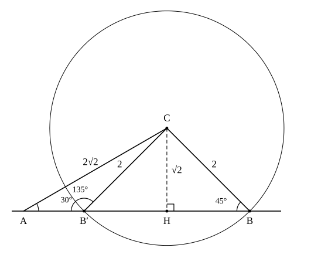

# L08 三角形を解く——決定条件で定理を選ぶ

- unit_id: hs-math-i-trigonometric-ratios
- 位置づけ: 単元第8レッスン（2時間）。子単元「正弦定理・余弦定理と三角形の計量」の3本目。L06 の正弦定理と L07 の余弦定理を、「分かっている3つの量から残りをすべて求める」1つの作業にまとめる。中2の合同条件を三角形の決定条件として読み直し、どの条件のときにどちらの定理から入るかを表に固定する。合同条件に無い「2辺と1つの対角」では三角形が2つできることがあり、図と検算で絞る。
- distribution_status: published_draft
- license: CC-BY-4.0
- verify_required: 例題数値・記述は監修者検証必須。
- 主概念: ①三角形の決定条件（1辺と2角／2辺とその間の角／3辺）と定理の対応表 ②「2辺と1つの対角」で正弦定理を使うと角が2つ出る場合の扱い（図で両方あり得るかを見て、検算で絞る）

---

## 1. 三角形を解く——3つの量から残りの3つを求める

三角形 ABC には、3つの辺 a・b・c と3つの角 A・B・C の、合わせて6つの量がある。このうちいくつかが分かっているとき、残りをすべて求めることは、三角形を**解く**と呼ばれる。L06 では1辺と2角から残りの辺を、L07 では2辺とその間の角から残りの辺を、また3辺から角を求めた。どれも「三角形を解く」作業の一部である。

では、6つの量のうち、いくつ分かっていれば残りが求まるのだろうか。中2の合同条件を思い出す。3辺／2辺とその間の角／1辺とその両端の角——このどれかがそろえば、三角形は1つに決まる（裏返しや回転で重なるものは同じ三角形と見る）。つまり、**3つの量**がうまく与えられれば三角形は決まり、残りの3つは計算で取り出せるはずである。三角形が1つに決まるための条件を、三角形の**決定条件**という。

ただし、3つならどんな組でもよいわけではない。角3つでは形は決まるが大きさが決まらない（L06 §5）。また、辺2つと、その間ではない角1つ（一方の辺の向かいの角。「2辺と1つの対角」の対角はこの意味）の組は合同条件に無く、実際に三角形が2つできることがある（§3）。決定条件と、それぞれで最初に使う定理を次の表にまとめておく。この表は L10 以降の活用でも毎回使う。

| 分かっている3つの量 | 三角形は決まるか | 最初に使う定理 | 進め方 |
|---|---|---|---|
| 1辺と2角 | 決まる | 正弦定理 | 3つ目の角を 180° から引く→2R を出す→残りの2辺 |
| 2辺とその間の角 | 決まる | 余弦定理 | 残りの辺→3辺がそろう→余弦定理で角 |
| 3辺 | 決まる（2辺の和が残りの辺より長いとき） | 余弦定理 | cos の形で角を1つずつ→最後の角は 180° から引く |
| 2辺と1つの対角 | 0個・1個・2個のどれもあり得る | 正弦定理（余弦定理でもよい） | 角の候補が2つ出る→図と検算で絞る（§3） |
| 3角 | 形だけ決まり、大きさは決まらない | （正弦定理は辺の比しか与えない） | 辺を1つ測り足す |

:::guide
**中2の合同条件と、この表の関係**

合同条件は「2つの三角形が重なるための条件」、決定条件は「1つの三角形が決まるための条件」で、言っていることは同じである。3辺・2辺とその間の角・1辺とその両端の角の3つが合同条件で、表の上3行はこれを「計算で残りを出す」向きに読み直したものである。1辺と2角の行だけ「両端の角」でなくてよいのは、角の和が 180° なので2角が分かれば3つ目が出て、結局その辺の両端の角も手に入るからである（L06 §5）。合同条件に無い「2辺と1つの対角」を表に入れたのは、活用の場面（L10）では測れる量がこの組になることがよくあり、そのときに「1つに決まらないかもしれない」と気付けることが大切だからである。逆に、表に無い組——たとえば1辺と1角だけ——では量が足りず、三角形は決まらない。図をかいて「あと何を測れば決まるか」を考えるのが、そのときの次の一手になる。
:::

## 2. 決定条件ごとに解く——3つの型

**例題1**（2辺とその間の角） 三角形 ABC で b=3、c=8、A=60° のとき、残りの辺 a と角 B・C を求めよ。角は表を使って整数の角で答えよ。

2辺とその間の角だから、余弦定理で残りの辺 a から入る。

a² = b²＋c²−2bc cos A = 3²＋8²−2×3×8×1/2 = 9＋64−24 = 49

a>0 だから a=**7**。これで3辺がそろったので、次の角は余弦定理の cos の形（L07 §3）で出す。B をはさむ2辺は c と a、向かいの辺は b だから、

cos B = (c²＋a²−b²)/(2ca) = (64＋49−9)/(2×8×7) = 104/112 = 13/14 = 0.9285…

表で cos の値が 0.9286 に最も近い角を探すと、cos 22°=0.9272（差 0.0014）、cos 21°=0.9336（差 0.0050）だから B≒**22°**。最後の角は引き算で C=180°−60°−22°=**98°**。

検算は2つ。①C を余弦定理で直接出し直す: cos C=(a²＋b²−c²)/(2ab)=(49＋9−64)/(2×7×3)=−6/42=−1/7=−0.1428…。負なので C は鈍角で、cos(180°−C)≒0.1429 に最も近いのは cos 82°=0.1392（cos 81°=0.1564 より近い）だから 180°−C≒82°、C≒98° で一致する。②辺の長短と角の大小: b<a<c（3<7<8）に対して B<A<C（22°<60°<98°）で向きが合う。

なお、a=7 が出た段階で B を正弦定理から求めることもできる。sin B=b sin A/a=3×(√3/2)/7=3√3/14=0.3711… で、表から B≒22°。同じ答えになるが、sin の値からは 22° と 158° の2つの角が出る（L05）ので、どちらかを選ぶ手間が1つ増える。この選び方は、この節の終わりで整理する。

**例題2**（3辺） 三角形 ABC で a=13、b=8、c=15 のとき、3つの角を求めよ。角は表を使って整数の角で答えよ。

3辺だから、余弦定理の cos の形で角を1つずつ出す。

cos A = (b²＋c²−a²)/(2bc) = (64＋225−169)/(2×8×15) = 120/240 = 1/2

よって A=**60°**（特別な角なので表は要らない）。

cos B = (c²＋a²−b²)/(2ca) = (225＋169−64)/(2×15×13) = 330/390 = 11/13 = 0.8461…

表で 0.8462 に最も近いのは cos 32°=0.8480（cos 33°=0.8387 より近い）だから B≒**32°**。C=180°−60°−32°=**88°**。

検算: cos C=(a²＋b²−c²)/(2ab)=(169＋64−225)/(2×13×8)=8/208=1/26=0.0384… で、表で最も近いのは cos 88°=0.0349（cos 87°=0.0523 より近い）——88° で一致する。辺の順 b<a<c（8<13<15）と角の順 B<A<C（32°<60°<88°）も合う。L07 §4 の判定でも、最大の辺 15 について 8²＋13²=233>225=15² だから最大の角は鋭角——C=88° と矛盾しない。

**例題3**（1辺と2角） 三角形 ABC で a=10、B=40°、C=60° のとき、残りの角 A と辺 b・c を求めよ。辺は小数第2位を四捨五入して小数第1位まで答えよ。

1辺と2角だから、まず3つ目の角。A=180°−40°−60°=**80°**。分かっている辺 a と、その向かいの角 A の組がそろったので、正弦定理で 2R を出す（L06 §5）。

2R = a/sin A = 10/sin 80° = 10/0.9848 = 10.154…

b = 2R sin B = 10.154…×0.6428 = 6.527…≒**6.5**
c = 2R sin C = 10.154…×0.8660 = 8.793…≒**8.8**

検算: 角の順 B<C<A（40°<60°<80°）に対して b<c<a（6.5<8.8<10）で向きが合う。丸めは最後の1回だけにし、途中の 2R は丸めずに持ち越す。

:::guide
**2つ目の角は、正弦定理と余弦定理のどちらで出すか**

例題1 のように「残りの辺」を出したあとには3辺がそろっているので、2つ目の角は正弦定理でも余弦定理でも求められる。計算の軽さでは正弦定理が上だが、sin の値から角を戻すと 0° から 180° の範囲で候補が2つ出る（L05）——θ と 180°−θ は sin が等しいからである。一方、cos の値から戻す角は1つに決まる（L07 §3）。だから、迷わずに済ませたいなら**3辺がそろった時点で余弦定理**に切り替えるのが安全である。正弦定理で出したいときは、**分かっている辺のうち小さいほうの辺の向かいの角**を求めるとよい——最大の辺の向かい以外の角は必ず鋭角なので（L07 §4）、2つの候補のうち鋭角のほうを機械的に選べる。例題1 で B（最小の辺 b=3 の向かい）を正弦定理で出しても 22° と決めてよかったのは、この理由による。どちらの定理を使うにせよ、最後の角は「180° から引く」で出し、出した角で余弦定理を1回だけ逆算して検算する、を型にしておく。
:::

## 3. 2辺と1つの対角——三角形が2つできることがある

**例題4** 三角形 ABC で a=2、b=2√2、A=30° のとき、角 B・C と辺 c を求めよ。辺 c は小数第2位を四捨五入して小数第1位まで答えよ。

分かっているのは辺 a・b と、a の向かいの角 A——「2辺と1つの対角」で、合同条件に無い組である。辺 a と向かいの角 A の組がそろっているから、正弦定理で B の sin が出る。

sin B = b sin A/a = 2√2×(1/2)/2 = √2/2

0° から 180° で sin が √2/2 になる角は 45° と 135° の2つ（L05）。ここで、どちらかを捨てる根拠が無いかを確かめる。三角形の角の和は 180° だから、A＋B<180° でなければならない。30°＋45°=75°<180°、30°＋135°=165°<180° で、**どちらも三角形として成り立つ**。したがって、この条件を満たす三角形は2つある。

B=45° のとき C=180°−30°−45°=105°、B=135° のとき C=180°−30°−135°=15°。辺 c は、2R=a/sin A=2/(1/2)=4 を使って、c=4 sin 105°=4 sin 75°=4×0.9659=3.863…≒3.9、および c=4 sin 15°=4×0.2588=1.035…≒1.0。

まとめると、**B=45°、C=105°、c≒3.9** と **B=135°、C=15°、c≒1.0** の2組である。

図で確かめる。角 A=30° をかき、一方の辺の上に A から距離 b=2√2 の点 C をとる。もう一方の辺の上で、C からの距離が a=2 になる点が B である。C を中心とする半径 2 の円をかくと、C からその辺までの距離（垂線の長さ）は h=b sin A=2√2×1/2=√2≒1.41 で、半径 2 より短いので、円はその辺と2点で交わる——これが B と B′ で、△ABC と △AB′C の2つができる。A から遠いほうの B で角 B は鋭角（45°）、近いほうの B′ で角 B′ は鈍角（135°）である。

同じ2つの答えは、余弦定理からも出る。a²=b²＋c²−2bc cos A に分かっている値を入れると、

2² = (2√2)²＋c²−2×2√2×c×(√3/2)、　つまり　c²−2√6 c＋4=0

これは c についての2次方程式で、中3の解の公式から c=(2√6±√(24−16))/2=(2√6±2√2)/2=√6±√2（√8=2√2 の根号計算を使う）。√6＋√2=3.863…、√6−√2=1.035… で、正弦定理で出した 3.9 と 1.0 に一致する。「三角形が2つある」ことが、2次方程式の正の解が2つあることとして見えている。

:::guide
**2つになるか、1つになるか——図では「円と直線の交点の数」**

例題4 の図で個数を決めているのは、C を中心とする半径 a の円と、角 A のもう一方の辺との交点の数である。C からその辺までの距離（垂線の長さ）は b sin A で、これは B の位置によらず先に決まっている。半径 a がこの距離より短ければ交点は無く（三角形は 0個）、ちょうど等しければ接して 1個（B=90° の直角三角形）、長ければ 2個の候補が出る。ただし、2個の候補のうち A に近いほうの交点は、a が b に等しくなると頂点 A に重なり、a が b より長くなると A の反対側（角の外）へ出てしまう。どちらの場合も三角形にならないので、a が b 以上のときは 1個に戻る。計算の側では、正弦定理で出た sin B が 1 を超える／1 になる／1 より小さい、が最初の分かれ目で、2つの候補のうち鈍角のほうは A＋B<180° を満たすかどうかで生き残るかが決まる——「a≧b なら A≧B だから B は鋭角に限る」も同じことの別の言い方である。図と計算のどちらでも同じ個数が出ることを確かめるのが、この場面の検算になる。なお、ここまでの図の数え方は、例題4 のように A が鋭角のときのものである。A が直角や鈍角のときは交点の出方が変わり、候補がどれも A＋B<180° を満たさないこともあるので、計算の側で候補を1つずつ A＋B<180° に通して数える。S1 で、この個数の分かれ目を a の値で整理する。
:::

**例題5** 三角形 ABC で a=6、b=3√2、A=45° のとき、角 B・C と辺 c を求めよ。

正弦定理から sin B=b sin A/a=3√2×(√2/2)/6=3/6=1/2 で、候補は B=30° と B=150°。ここで 150° を調べると、A＋B=45°＋150°=195°>180° となって三角形にならない。したがって B=**30°** の1つに決まり、C=180°−45°−30°=**105°**。

辺 c は余弦定理から。6²=(3√2)²＋c²−2×3√2×c×(√2/2)、つまり c²−6c−18=0。解の公式から c=3±3√3 で、c>0 だから c=**3＋3√3**（≒8.2）。負のほうの解 3−3√3 は、辺の長さにならないので除く。例題4 と同じように図をかくと、C を中心とする半径 6 の円と直線 AB の交点は B のほかにもう1つあるが、それは A をはさんで B と反対側（角 A の外）にあり、そこを頂点にとると A の角が 45° でなく 135° の三角形になって条件に合わない。正弦定理の側で B=150° を除いたのと同じく、こちらでも2つ目の候補が消えている。

検算: 正弦定理で c を出し直すと、2R=a/sin A=6/(√2/2)=6√2 で、c=6√2×sin 105°=6√2×sin 75°=8.485…×0.9659=8.195…≒8.2 で一致する。また a=6>b=3√2≒4.24 だから A>B、つまり B は A=45° より小さい鋭角——30° で向きが合う。

## 4. 手順の型

1. 図をかき、A の向かいに a、B の向かいに b、C の向かいに c を書き込む。分かっている3つの量が §1 の表のどの行かを決める。
2. 1辺と2角: 3つ目の角を 180° から引く→2R=（辺）/（sin 向かいの角）→残りの辺=2R×sin（向かいの角）。
3. 2辺とその間の角: 余弦定理で残りの辺→3辺から余弦定理の cos の形で角を1つ→最後の角は 180° から引く。
4. 3辺: 余弦定理の cos の形で角を2つ→最後の角は 180° から引く（角が1つで足りるなら、その角だけ）。
5. 2辺と1つの対角: 正弦定理で sin（向かいの角）。1 より大きければ 0個。候補（sin の値がちょうど 1 なら 90° の1つ、1 より小さければ2つ）を A＋B<180° で選別し、残った候補ごとに残りの角と辺を求める。図で交点の数を見て、個数が合うか確かめる。
6. 検算: 使わなかったほうの定理で1回逆算する／辺の長短と角の大小の向き／角の和が 180°。

:::guide
**検算は「別の道」で戻る**

三角形を解く計算には必ず「別の道」がある——正弦定理で出した辺は余弦定理で、余弦定理で出した角は正弦定理か別の角の cos で戻れる。同じ式に同じ数を入れ直すのは検算にならない（同じ間違いを繰り返す）ので、検算には使わなかったほうの定理を当てる。もう1つ、計算の前にできる検算が「向き」の確認である。大きい角の向かいには長い辺があるので、求めた辺と角を大きさの順に並べて、順番が食い違っていたらどこかで角と辺の対応（A と a）を取り違えている。表で角を戻すときは、値に最も近い行を選ぶだけでなく隣の行との差も見ておくと、丸めた角が 1° ずれる不安を減らせる。この単元の答えは「およそ何度」で十分だが、途中の 2R や cos の値は丸めずに持ち越し、丸めは最後の1回にする（L06 §4）。
:::

## 5. 練習

**問1** 次の(1)〜(5)の三角形 ABC について、分かっている量が §1 の表のどの行にあたるかを答えよ。また、三角形が1つに決まるものについては、残りを求めるとき最初に使う定理を答えよ（計算はしなくてよい）。
(1) a=5、B=50°、C=60°
(2) b=4、c=7、A=110°
(3) a=6、b=7、c=9
(4) A=40°、B=60°、C=80°
(5) a=7、b=5、A=50°

**問2** 三角形 ABC で b=16、c=21、A=60° のとき、辺 a と角 B・C を求めよ。角は表を使って整数の角で答えよ。

**問3** 三角形 ABC で a=4、b=5、c=6 のとき、3つの角を表を使って整数の角で求めよ。

**問4** 三角形 ABC で a=2、b=√6、A=45° のとき、角 B・C と辺 c を求めよ（c は根号を含む形で答えてよい）。あてはまる三角形が2つあれば両方答えよ。

**問5** 次の条件を満たす三角形 ABC は、それぞれ何個あるか（0個・1個・2個）。理由も書け。
(1) a=3、b=6、A=30°
(2) a=2、b=6、A=30°
(3) a=5、b=5、A=40°

---

:::stretch
**S1** 三角形 ABC で A=30°、b=8 とし、辺 a の長さをいろいろに変える。
(1) 頂点 C から、角 A のもう一方の辺（直線 AB）に下ろした垂線の長さ h を求めよ。
(2) a=3、4、5、8、9 のそれぞれについて、条件を満たす三角形の個数を答えよ。
(3) 三角形が 0個・1個・2個になる a の範囲を、それぞれ答えよ。
:::

対応解答: answer_key_L06-09.md

<!-- gen_nav:nav:start（自動生成・手編集しない） -->

---

[← 前のレッスン](lesson_07.md)｜[単元の目次](README.md)｜[解答](answer_key_L06-09.md)｜[次のレッスン →](lesson_09.md)

<!-- gen_nav:nav:end -->
