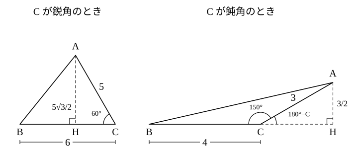

# L09 三角形の面積——(1/2)ab sin C

- unit_id: hs-math-i-trigonometric-ratios
- 位置づけ: 単元第9レッスン（2時間）。子単元「正弦定理・余弦定理と三角形の計量」の4本目。中学の「底辺×高さ÷2」の高さを sin で表し、2辺とその間の角から面積を求める公式 S=(1/2)ab sin C を導く。3辺しか分からないときは余弦定理で cos を出し、相互関係で sin に直して同じ公式へつなぐ。後半は「面積を2通りに表す」考え方で内接円の半径を求める。
- distribution_status: published_draft
- license: CC-BY-4.0
- verify_required: 例題数値・記述は監修者検証必須。
- 主概念: ①面積公式 S=(1/2)ab sin C の導出（高さ=b sin C）と、3辺から面積（余弦定理→相互関係→正弦） ②内接円の半径 r と S=(1/2)r(a＋b＋c)（面積を2通りに表す）

---

## 1. 高さを sin で表す——面積公式

中学以来、三角形の面積は「底辺×高さ÷2」で求めてきた。ところが、三角形の辺と角が分かっていても、高さそのものが分かっていることはめったにない。L02 で「斜辺×sin=対辺」を使って高さを求めたのと同じことを、一般の三角形でやってみる。

三角形 ABC で、辺 BC=a を底辺にとる。高さは、頂点 A から直線 BC に下ろした垂線 AH の長さである。直角三角形 AHC を見ると、斜辺 AC=b と角 C が分かっているので、

AH = b sin C

したがって、面積を S と書くと

S = (1/2)×a×b sin C = (1/2)ab sin C

C が 90° なら sin C=1 で S=(1/2)ab——直角をはさむ2辺の積の半分で、中学どおりである。C が鈍角のときは、垂線の足 H が辺 BC の C 側の延長上に落ちる。直角三角形 AHC の C の側の角は 180°−C だから AH=b sin(180°−C) で、L05 の sin(180°−C)=sin C により、やはり AH=b sin C。底辺 a はそのままなので、S=(1/2)ab sin C は鈍角でも同じ形で使える。

頂点の選び方を変えても同じことが言えるので、まとめると次のようになる。

> **三角形の面積**　三角形 ABC の面積を S とすると
>
> S = (1/2)bc sin A = (1/2)ca sin B = (1/2)ab sin C

3つの式はどれも「**2辺と、その間の角**の sin」の組でできている。掛け合わせる2辺を決めたら、sin をとる角はその2辺にはさまれた角である。ほかの角の sin を掛けた式は、その角の sin がはさまれた角の sin とたまたま等しいとき以外は、面積にならない。

**例題1** 次の三角形 ABC の面積 S を求めよ。(3) は小数第2位を四捨五入して小数第1位まで答えよ。
(1) a=6、b=5、C=60°  (2) a=4、b=3、C=150°  (3) a=7、b=8、C=35°

(1) S=(1/2)×6×5×sin 60°=15×√3/2=**15√3/2**

(2) sin 150°=sin 30°=1/2（L05）だから S=(1/2)×4×3×1/2=**3**

(3) 表から sin 35°=0.5736。S=(1/2)×7×8×0.5736=28×0.5736=16.060…≒**16.1**

検算は「高さで計算し直す」。(1) は底辺 a=6・高さ b sin C=5×√3/2=5√3/2 で、6×5√3/2÷2=15√3/2 に戻る。(2) は高さ 3×sin 150°=3/2 で、4×3/2÷2=3——鈍角でも高さは正の長さで、÷2 を忘れていないことを同時に確かめられる。大きさの目安としては、sin C≦1 だから S は (1/2)ab を超えない。(1) なら 15 以下、(2) なら 6 以下、(3) なら 28 以下で、いずれも収まっている。

:::guide
**÷2 の落としと、はさむ角の取り違え**

この公式でよくある2つの計算違いは、どちらも「公式の出どころ」に戻れば防げる。1つ目は ÷2 の落とし——ab sin C は、2辺 a・b とその間の角 C でできる**平行四辺形**の面積（底辺 a・高さ b sin C）で、三角形はその半分である。答えが出たら (1/2)ab と比べて「その値以下になっているか」を見る（例題1 の検算の最後がこれである）。ただし、これは目安にとどまる。sin C が 1/2 以下のとき（C が 30° 以下か 150° 以上のとき。例題1(2) がそうである）は、÷2 を落とした値 ab sin C も (1/2)ab 以下に収まってしまうので、÷2 の落としは「高さで計算し直す」検算のほうで確かめる。2つ目は、sin をとる角の取り違え——たとえば a と b を掛けたのに sin A を使ってしまう型で、A は辺 a の向かいの角であって、a と b にはさまれてはいない。公式の高さ b sin C は「斜辺 b の直角三角形で、角 C の対辺」として出てきた（§1）ので、b の端にある角でないと高さにならない。図で「掛ける2辺」を指でなぞり、その2辺が出会う頂点の角を sin にとる、を毎回の手順にする。
:::

## 2. 3辺から面積——余弦定理で cos、相互関係で sin

2辺とその間の角がそろっていれば公式に入れるだけだが、3辺しか分からない三角形の面積はどう求めるか。角が1つ分かれば公式が使えるので、余弦定理（L07 §3）で角の cos を出し、それを sin に直せばよい。角の大きさそのものは要らない。

**例題2** 3辺の長さが 2、3、4 の三角形の面積 S を求めよ。

長さ 4 の辺の向かいの角を θ とすると、θ をはさむ2辺は 2 と 3 だから、

cos θ = (2²＋3²−4²)/(2×2×3) = (4＋9−16)/12 = −3/12 = −1/4

cos が負なので θ は鈍角だが、公式に要るのは sin θ である。相互関係 sin²θ＋cos²θ=1（L03。鈍角でも成り立つことは L05 で確かめた）から、

sin²θ = 1−(−1/4)² = 1−1/16 = 15/16

0°<θ<180° では sin θ>0 だから sin θ=√15/4。よって

S = (1/2)×2×3×√15/4 = **3√15/4**

検算は「別の角で計算し直す」。長さ 2 の辺の向かいの角を φ（ファイ）とすると cos φ=(3²＋4²−2²)/(2×3×4)=21/24=7/8、sin φ=√(1−49/64)=√15/8 で、S=(1/2)×3×4×√15/8=3√15/4 に戻る。どの角から入っても同じ面積になるのは当然だが、cos の分数や sin の根号の計算違いは、この経路の違いで見つかる。

:::guide
**角の大きさを経由しない理由**

例題2 で、cos θ=−1/4 から表で θ≒104° と角を出し、そこから sin 104° を表で引き直す道もある。しかし表は 1° 刻みで、θ を整数の角に丸めた時点で誤差が入り、面積は近似値にしかならない。cos から相互関係で sin に直せば、根号のついた正確な値のまま面積が出る。この「cos→sin」の変換で気を付けるのは符号だけで、0° から 180° の角の sin は（0° と 180° を除いて）必ず正なので、平方根は正のほうをとる（L04）。cos が負（鈍角）でも sin は正——鈍角三角形の面積が負になることは無い、と考えれば覚えやすい。近似値でよい場面（例題1(3) のように表の値を使う問題）と、正確な値が要る場面（3辺が整数や根号で与えられた問題）で、経路を使い分ける。
:::

## 3. 内接円の半径——面積を2通りに表す

三角形の3辺すべてに接する円を、その三角形の**内接円**（ないせつえん）という。角の二等分線（中1で作図した）の上の点は、角をつくる2辺までの距離が等しい——二等分線上の点から2辺に垂線を下ろすと、斜辺を共有し1つの鋭角が等しい2つの直角三角形ができて合同になる（中2）からである。角 A の二等分線と角 B の二等分線の交点を I とすると、I から辺 AB・AC までの距離は等しく、I から辺 BA・BC までの距離も等しいので、I から3辺までの距離はすべて等しい。だから I を中心に3辺に接する円がかける——これが内接円で、その半径を r とする。外接円の半径 R（L06）とは別の量なので、大文字・小文字で区別する。

内接円の中心 I と頂点 A・B・C を結ぶと、三角形 ABC は3つの三角形 IBC・ICA・IAB に分かれる。底辺をそれぞれ a・b・c と見ると、高さはどれも r である（円の中心から接点までの半径は、接する辺に垂直）。だから

S = (1/2)ar＋(1/2)br＋(1/2)cr = (1/2)r(a＋b＋c)

一方で、S は §1・§2 の方法でも求められる。同じ面積を2通りに表したのだから、S が分かれば r=2S/(a＋b＋c) で内接円の半径が出る。

**例題3** 三角形 ABC で a=7、b=5、c=8 のとき、面積 S と内接円の半径 r を求めよ。

3辺だから、まず角を1つ。cos A=(b²＋c²−a²)/(2bc)=(25＋64−49)/(2×5×8)=40/80=1/2 で A=60°（この三角形は、L07 §1 で b=5、c=8、A=60° から a=7 を出したものと同じである）。

S = (1/2)bc sin A = (1/2)×5×8×√3/2 = **10√3**

次に S=(1/2)r(a＋b＋c) から

10√3 = (1/2)×r×(7＋5＋8) = 10r　　よって　r=**√3**

検算は2つ。①別の角から面積を出し直す: cos C=(a²＋b²−c²)/(2ab)=(49＋25−64)/(2×7×5)=10/70=1/7、sin C=√(1−1/49)=√(48/49)=4√3/7 で、S=(1/2)×7×5×4√3/7=10√3 に戻る。②内接円が三角形の内側に収まっているか: 直径 2r=2√3≒3.46 は、辺 a を底辺としたときの高さ 2S/a=20√3/7≒4.95 より短い（円が三角形の内側にあれば必ずこうなるので、目安の検算）。

:::guide
**「同じ量を2通りに表す」——L06 の高さと同じ考え方**

S=(1/2)r(a＋b＋c) の導き方は、新しい定理を覚えたのではなく「同じ面積を2通りに書いて等式を作った」だけである。この考え方は、L06 §3 で高さ CH を b sin A と a sin B の2通りに表して a/sin A=b/sin B を出したときにも使った。図形の計量では、求めたい量が直接は出せなくても、それを含む別の量（ここでは面積）を2通りに表せれば、等式から取り出せることが多い。R と r の混同にも注意する——2R は正弦定理の「辺÷sin」（L06）、r は面積の式から出る量で、同じ三角形でも R と r は別の値になる。例題3 の三角形では R=a/(2 sin A)=7/√3≒4.04 で、r=√3≒1.73 とは違う。
:::

## 4. 手順の型

**2辺とその間の角から面積**
1. 掛ける2辺を決め、その2辺にはさまれた角を確かめる。
2. S=(1/2)×（2辺の積）× sin（間の角）。鈍角なら sin(180°−θ) に直して表を引く。
3. 検算: (1/2)×（2辺の積）以下になっているか（sin≦1）。高さ b sin C で計算し直す。

**3辺から面積**
1. 余弦定理で角を1つ、cos の形で出す（どの角でもよい）。
2. 相互関係 sin²θ=1−cos²θ から sin θ を出す（正の平方根）。
3. その角をはさむ2辺と sin θ で S=(1/2)×（2辺の積）× sin θ。
4. 検算: 別の角から同じ手順で S を出し直す。

**内接円の半径**
1. 面積 S を上の方法で求める。
2. S=(1/2)r(a＋b＋c) を r について解く: r=2S/(a＋b＋c)。
3. 検算: 直径 2r が三角形の高さより短いか（内接円は三角形の内側にあるので、必ず短くなる。短くなければ誤り。短くても正しいとは限らないので、目安の検算）。求めた r を S=(1/2)r(a＋b＋c) に入れて、もとの S に戻るかも確かめる。

## 5. 練習

**問1** 次の三角形 ABC の面積 S を求めよ。(3) は小数第2位を四捨五入して小数第1位まで答えよ。
(1) a=4、b=6、C=30°
(2) a=5、b=6、C=135°
(3) a=9、b=4、C=52°

**問2** 3辺の長さが 3、5、6 の三角形の面積 S を求めよ。

**問3** 三角形 ABC で a=7、b=8、c=13 のとき、角 C・面積 S・内接円の半径 r を求めよ。

**問4** 平行四辺形 ABCD で AB=6、AD=4、∠A=120° のとき、面積を求めよ。

**問5** 三角形 ABC の面積が、C が鈍角のときも S=(1/2)ab sin C で求められる理由を、高さと sin(180°−C)=sin C をもとに2〜3文で説明せよ。

---

:::stretch
**S1** 4つの頂点がすべて1つの円の上にある四角形（円に内接する四角形）ABCD で AB=5、BC=8、CD=3、DA=5、∠B=60° とする。
(1) 対角線 AC の長さを求めよ。
(2) 三角形 ACD の3辺から、∠D の大きさを求めよ。
(3) 四角形 ABCD の面積を求めよ。また、(2) で求めた ∠D と ∠B の和について気付くことを書け。
:::

対応解答: answer_key_L06-09.md

<!-- gen_nav:nav:start（自動生成・手編集しない） -->

---

[← 前のレッスン](lesson_08.md)｜[単元の目次](README.md)｜[解答](answer_key_L06-09.md)｜[次のレッスン →](lesson_10.md)

<!-- gen_nav:nav:end -->
