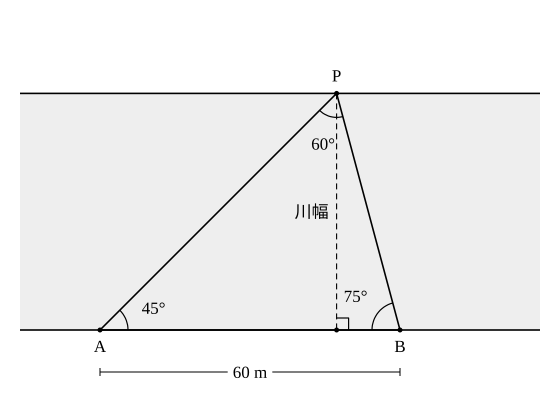

# L10 図形の計量への活用——測れない距離と高さ

- unit_id: hs-math-i-trigonometric-ratios
- 位置づけ: 単元第10レッスン（2時間）。子単元「正弦定理・余弦定理と三角形の計量」（L06〜L11）の5本目。L06〜L09 でそろえた道具（正弦定理・余弦定理・面積公式）を、直接は測れない距離や高さを求める場面で使う。「三角形を見つける→決定条件を確かめる→定理を選ぶ→処理して解釈する」の4段階を、活用の型として固定する。
- distribution_status: published_draft
- license: CC-BY-4.0
- verify_required: 例題数値・記述は監修者検証必須。
- 主概念: ①活用の4段階（三角形を見つける→決定条件を確かめる→定理を選ぶ→処理して解釈する） ②2地点間の距離・建物の高さ・平面図形の未知量を三角形の計量に直す

---

## 1. 道具はそろった——何を測り、何を計算するか

L02 では、直角三角形の辺の比（三角比）を使って、木や建物の高さを「水平距離と仰角」から求めた。あのときは、直角三角形が最初から見えていた。L06〜L09 で正弦定理と余弦定理を手に入れたいま、直角のない三角形でも、辺と角の一部が分かれば残りを計算できる。

このレッスンで扱うのは、次のような場面である。

- 川や池をはさんだ向こう岸の点までの距離（まっすぐ歩いて測れない）
- 塔や建物の高さ（真下まで近づけない・登れない）
- 図形の中の、直接は与えられていない辺や角

どれも共通するのは、**測れる量（歩ける距離・測れる角）から、測れない量を計算で出す**ことだ。測量では、距離を測るより角を測るほうが簡単なことが多い（川の向こう岸までは歩けなくても、角はこちら岸から測れる）。だから「1つの辺と2つの角」から残りの辺を出す正弦定理は、測量と相性がよい。

進め方を、先に型として書いておく。この単元の活用問題は、すべてこの4段階で進む。

1. **三角形を見つける**——場面を図にかき、求めたい量を辺または角にもつ三角形を1つ選ぶ。分かっている量を書き込み、求めたい量に「?」を付ける。
2. **決定条件を確かめる**——その三角形で分かっている量が、三角形を1つに決める組（1辺と2角／2辺とその間の角／3辺）になっているか見る（L08）。なっていなければ、別の三角形を先に解く、未知の長さを文字でおいて2つの三角形の式を連立させる（例題2）、測る量を足す、のどれかに進む。「2辺と1つの対角」のときは、三角形が何個できるかを先に確かめる（下の表の最後の行）。
3. **定理を選ぶ**——分かっている量の組に合わせて、使う定理を決める。
4. **処理して解釈する**——計算し、出た数値をもとの場面に戻して意味を確かめる（単位・大小関係・あり得る値か）。

段階3で使う対応を、L08 の表をもとに書いておく（直角三角形の行を足し、活用では使わない3角の行は省いた）。

| 分かっている量 | 三角形は決まるか | 使う道具 |
|---|---|---|
| 1辺と2角 | 決まる | 残りの角は 180° から引く。正弦定理で残りの辺 |
| 2辺とその間の角 | 決まる | 余弦定理で残りの辺。さらに角が要れば正弦定理か余弦定理 |
| 3辺 | 決まる | 余弦定理（cos の形に変形）で角 |
| 直角三角形で1辺と1つの鋭角 | 決まる | 三角比の定義（L02）で足りる |
| 2辺と1つの対角 | 0個・1個・2個のどれもあり得る | 正弦定理で角を出し、図で両方あり得るか確かめる（L08） |

:::guide
**なぜ「三角形を見つける」が最初に来るのか**

活用問題で手が止まるのは、たいてい計算の途中ではなく、最初の一歩——どの三角形を見るか——が決まらないときだ。定理は三角形について述べたものだから、三角形が決まるまでは、正弦定理も余弦定理も使いようがない。逆に、三角形が1つ決まって分かっている量を書き込めば、あとは段階2以降が機械的に進む。だから、図をかいて「この三角形」と指を置くことを、計算より先に、意識してやる。図は正確でなくてよい。分かっている辺の長さと角の大きさ、求めたい量の「?」が書き込まれていれば、それで用が足りる。慣れてきても、この一歩を頭の中だけで済ませないほうがよい。図に書き込む作業そのものが、段階2の「決定条件を確かめる」を自動的にやってくれるからだ。
:::

## 2. 2地点間の距離——川の向こう岸まで

**例題1** 川をはさんで向こう岸に杭（くい）P が立っている。こちら岸に 60 m 離れた2地点 A、B をとり、角を測ったところ、∠PAB=45°、∠PBA=75° であった。
(1) B から P までの距離を求めよ。
(2) A から P までの距離を、三角比の表を使って小数第1位まで求めよ。
(3) 川の幅（P から直線 AB までの距離）を小数第1位まで求めよ。

段階1。図をかく。こちら岸に A と B、向こう岸に P。求めたいのは PB、PA と川幅で、どれも △PAB に関わる量である。

段階2。△PAB で分かっているのは、辺 AB=60 と、その両端の角 45°、75°。「1辺と2角」だから、三角形は1つに決まる。残りの角は

∠APB = 180°−45°−75° = 60°

段階3。1辺と2角なので正弦定理（L06）。

段階4。
(1) PB は ∠PAB=45° の対辺、AB=60 は ∠APB=60° の対辺だから

PB/sin 45° = 60/sin 60°

PB = 60×sin 45°/sin 60° = 60×(√2/2)÷(√3/2) = 60×√2/√3 = 60√6/3 = **20√6**（m）

20√6 の値は、2.449²≒5.998、2.45²=6.0025 だから 2.449<√6<2.45、20倍して 48.98<20√6<49.0。およそ **49.0** m である。

(2) PA は ∠PBA=75° の対辺。75° は特別な角ではないので、[三角比の表](trig_table.md)（電卓でもよい）から sin 75°=0.9659、sin 60°=0.8660 を引く。

PA = 60×sin 75°/sin 60° = 60×0.9659/0.8660 = 66.92… ≒ **66.9**（m）

(3) 川幅は、P から AB に下ろした垂線の長さ。直角三角形をつくって、L02 の「斜辺×sin=高さ」で出す。B 側の直角三角形を使うと

川幅 = PB×sin 75° ≒ 48.99×0.9659 = 47.3… ≒ **47.3**（m）

解釈する。PA（66.9 m）のほうが PB（49.0 m）より長い。図で見ると、PA は大きいほうの角 ∠PBA=75° の対辺だから、長いのは当然だ（大きい角の向かいの辺が長い）。また、川幅 47.3 m は PB≒49.0 m より少し短い——川幅は、PB を斜辺とする直角三角形の ∠B の対辺（斜辺より短い）だから、これも当然である。数値どうしの大小が図と合っていれば、計算の大きな取り違えはない。

検算は、別の定理で戻す。PA と AB と ∠PAB=45° が分かったので、余弦定理（L07）で PB を出し直すと

PB² ≒ 66.92²＋60²−2×66.92×60×cos 45° ≒ 4478.3＋3600−5678.4 = 2399.9

PB = 48.98…。(1) の 20√6=48.98… と重なる（20√6 を2乗すると 400×6=2400 なので、この検算の値 2399.9 は四捨五入のぶんだけずれている）。

:::guide
**三角比の表の値は「途中は4桁のまま、丸めるのは最後」**

sin 75°=0.9659 は、表の値そのものが小数第4位で丸められた近似値である。この値を途中でさらに 0.97 のように粗くすると、60倍・100倍したときの誤差もそのぶん大きくなり、小数第1位が狂うことがある。手順としては、表の値は4桁のまま計算を進め、答えを書く段階で初めて、求められた桁（この単元では原則として小数第1位）に丸める。途中で求めた長さを次の計算に使うとき（例題1(3) の PB=48.99 や、検算の PA=66.92）も、4桁ほど残した値を使い、答えの桁まで丸めた 49.0 や 66.9 は使わない。L06・L08 では途中の値を丸めずに持ち越した（電卓で続けて計算する形）。途中の値をいったん書き留めて計算を続けるときは、このように4桁ほど残しておく。逆に、答えの桁を 66.92 のように増やしても、それだけ正確になるわけではない。実際の測量では、測った距離や角そのものに誤差があり、答えをどの桁まで信用できるかはその誤差の大きさで決まる。この単元の問題は数値を作ってあるので、問題文で指定された桁に丸めて答えればよい。自分で測った値を使うときは、測り方の粗さに合わせて答えの桁を控えめにする——これも段階4の「解釈」に含まれる。なお、電卓を使うなら sin 75° をそのまま計算させてよいが、途中の値を書き写すときは同じ注意がいる。
:::

## 3. 建物の高さ——真下まで近づけないとき

L02 では、建物までの水平距離と仰角（水平から見上げた角）から高さを出した。ところが、建物の真下まで近づけない場面では、水平距離そのものが測れない。そのときは、**2か所で仰角を測る**。

**例題2** 水平な地面に垂直に立つ塔の高さを測りたい。塔の真下までは近づけず、そこまでの距離は測れない。地点 A で塔の先端 T を見上げる仰角を測ると 30°、A から塔に向かってまっすぐ 40 m 進んだ地点 B で測ると 45° であった。目の高さを 1.6 m として、塔の高さを小数第1位まで求めよ。

段階1。図を自分でかく。地面に A、B、塔の真下の点 H を一直線に取り、T を H の真上に置く。仰角は目の高さから測るので、A・B の真上 1.6 m の点をそれぞれ P、Q とする。T から直線 PQ に下ろした垂線の足を R とする（R は H の真上 1.6 m の点）。地面が水平だから直線 PQ も水平で、PQ=40、∠TPR=30°、∠TQR=45°、∠TRP=90°。求めたいのは TR（それに 1.6 を足したものが塔の高さ）。

段階2。△TPR も △TQR も直角三角形だが、どちらも「1辺と1つの鋭角」がそろっていない（PR も QR も未知）。分かっているのは PQ=40 だけ。そこで、未知の長さを文字でおいて、2つの直角三角形を連立させる。

段階3。直角三角形なので、三角比の定義（tan）で足りる。

段階4。QR=x、TR=h とおく。△TQR で tan 45°=h/x、tan 45°=1 だから

h = x

△TPR で PR=x＋40 なので tan 30°=h/(x＋40)、tan 30°=1/√3 だから

√3 h = x＋40

x=h を代入して √3 h = h＋40、(√3−1)h = 40

h = 40/(√3−1) = 40(√3＋1)/((√3−1)(√3＋1)) = 40(√3＋1)/2 = 20(√3＋1)

分母の有理化は「数と式」の単元で身につけた技である。1.732²≒2.9998 から √3≒1.732 として、h≒20×2.732=54.64。塔の高さは、目の高さを足して

54.64＋1.6 = 56.24 ≒ **56.2**（m）

解釈する。B は A より塔に 40 m 近く、仰角も 30° から 45° へ大きくなっている——近づけば見上げる角が大きくなるのだから、数値の向きは場面と合っている。また、x=h≒54.6 だから、B から塔までの水平距離は約 55 m で、40 m 歩いた A からは約 95 m。塔の高さ 56 m と合わせて、どれも「あり得ない値」ではない。

検算は、別の三角形で。△TPQ に着目すると、PQ=40、∠TPQ=30°、∠PQT=180°−45°=135°、残りの ∠PTQ=15° で「1辺と2角」——正弦定理が使える。

QT = 40×sin 30°/sin 15° = 40×0.5/0.2588 = 77.27…

h = QT×sin 45° ≒ 77.28×0.7071 = 54.6… で、上の 54.64 と重なる。

:::guide
**定理は1つに決まらない——計算が少ない道を選ぶ**

例題2 は、直角三角形2つを連立させても、△TPQ で正弦定理を使っても解ける。どちらも正しい。違うのは手間で、前者は特別な角（30°・45°）だけで済み、後者は sin 15° を表から引く必要がある。段階3の「定理を選ぶ」は、「使える定理を1つ見つける」ことではなく、「使える道のうち、いちばん計算が少なく、いちばん確かめやすい道を選ぶ」ことだ。目安は2つ。分かっている角が特別な角（30°・45°・60° とその補角。補角とは、もとの角と足して 180° になる角のことで、150°・135°・120°）なら、その角を含む三角形を使うと √ の形で正確に出せる。分かっている量が「辺と両端の角」の形なら正弦定理、「2辺とはさむ角」の形なら余弦定理が最短になる。そして、選ばなかった道は捨てずに取っておく——例題1・例題2 でやったように、それが検算の道になる。
:::

## 4. 平面図形の未知量——対角線で2つの三角形に分ける

測量だけでなく、図形の問題でも4段階は同じように働く。四角形のように、三角形でない図形が出てきたら、**対角線を引いて三角形に分ける**のが段階1の決まった手である。

**例題3** 四角形 ABCD で、AB=8、BC=15、CD=5、DA=12、∠ABC=60° である。
(1) 対角線 AC の長さを求めよ。
(2) ∠ADC の大きさを求めよ。
(3) 四角形 ABCD の面積を求めよ。

段階1。対角線 AC を引くと、△ABC と △ACD に分かれる。AC は両方の三角形の辺だから、先に △ABC で AC を出し、それを △ACD に持ち込む。

段階2・3。△ABC は AB=8、BC=15 と、その間の角 ∠ABC=60°——「2辺とその間の角」で決まる。余弦定理。

(1) AC² = 8²＋15²−2×8×15×cos 60° = 64＋225−240×(1/2) = 289−120 = 169

AC>0 だから AC = **13**

段階2・3を △ACD でやり直す。CD=5、DA=12、AC=13 と「3辺」がそろった。角を求めるので、余弦定理を cos の形で使う。

(2) cos∠ADC = (DA²＋CD²−AC²)/(2×DA×CD) = (144＋25−169)/(2×12×5) = 0/120 = 0

0°<∠ADC<180° で cos が 0 になる角は 90° だけだから、∠ADC = **90°**

（5²＋12²=13² が成り立つので、三平方の定理の逆から直角と言ってもよい。余弦定理で cos が 0 と出るのは、L07 で見た「三平方の定理は cos 90°=0 の場合の余弦定理」そのものである。）

(3) 面積は2つの三角形の和。△ABC は2辺とその間の角から S=(1/2)ab sin C（L09）、△ACD は直角三角形。

△ABC = (1/2)×8×15×sin 60° = 60×(√3/2) = 30√3

△ACD = (1/2)×12×5 = 30

四角形 ABCD = **30√3＋30**

解釈する。30√3＋30 ≒ 30×1.732＋30 = 81.96。8・15・5・12 という辺の長さに対して、面積が 80 前後というのは大きさとして自然である（たとえば 8×15=120 の長方形より小さい）。検算として、△ABC の面積を別の道で出す。A から BC に下ろした垂線の長さは AB×sin 60°=8×(√3/2)=4√3 で、(1/2)×15×4√3=30√3——同じ値になる。

:::guide
**答えの数値を「もとの場面」に戻す——段階4の解釈で見ているもの**

計算が終わったら、数値を図や場面に戻して3つのことを見る。①単位と桁——m で測った距離が m で出ているか、100 m の池の向こうの点が 1000 m 先になっていないか。②大小の向き——大きい角の対辺は長い、近づけば仰角は大きくなる、対角線は辺より長いことが多い、といった図から読める向きと合っているか。③あり得る値か——長さが負になっていないか、cos の値が 1 を超えていないか、角の和が 180° を超えていないか。この3つは、計算のやり直しをしなくても数秒で見られる。細かい検算（別の定理で戻す）の前に、この粗い確かめを先にやると、大きな取り違え——正弦定理で対辺の組を間違えた、余弦定理の符号を落とした——の多くはここで捕まる。「答えが出た」で終わらず「答えが場面に収まった」で終わる、という習慣にしてほしい。
:::

:::zatsudan
角を測る道具がなくても、L02 の雑談で求めた「自分の拳1つ分の角」が使える。まず、車や自転車の通らない安全な場所に立ち止まる（見上げたまま歩かない）。腕をまっすぐ前に伸ばし、建物の壁のうち自分の目と同じ高さに見える所（まっすぐ水平に見た先）から屋上まで、拳を縦に積み上げるように数えていく。建物の足元から数え始めると、足元を見下ろす角のぶんだけ大きくなってしまうので、水平な向きから数える。拳が n 個分なら、仰角はおよそ n×（拳1つ分の角）である。あとは建物までの距離を、安全に歩ける所で歩数から見積もれば、L02 の直角三角形（水平距離と仰角）ができ、このレッスンの4段階どおりに高さが出る（L02 例題2 と同じく、最後に目の高さを足す）。測った値はどれも粗いから、答えも「およそ」でよい。それでも、拳と歩数だけで建物の高さの見当がつくのは、三角形さえ見つかれば道具は要らないからだ。
:::
<!-- zatsudan話題源: RESEARCH_RAW_A_20260902 §1.5（高等学校学習指導要領解説 数学編 課題学習〈図形と計量〉「指や拳を用いた距離や角度の概測に関する探究」・抽出テキスト2719〜2745行）。L02 の zatsudan（同じ例示・数値例つき）の続きとして、L02 で求めた値を仰角の見積もりに使う活動として書いた。解説は探究の題材名を挙げるのみで具体値を示していないため、本文にも角度の具体値は書いていない。 -->

## 5. 練習

段階1の「図をかく」を省かないこと。問4 は図が与えられていないので、文から自分でかく。

**問1** 池をはさんだ向こう岸に地点 C がある。こちら側に 100 m 離れた2地点 A、B をとり、角を測ると ∠CAB=60°、∠CBA=75° であった。
(1) ∠ACB の大きさを求めよ。
(2) BC の長さを、√ を使った形で求め、さらに小数第1位まで求めよ。
(3) AC の長さを、三角比の表を使って小数第1位まで求めよ。

**問2** 気球 P が、水平な地面の上の点 H の真上に静止している。地面の上の、H を通る一直線上に、H から見て同じ側に地点 A、B をとり、AB=200 m で、B のほうが H に近い。A で気球を見上げる仰角は 30°、B では 60° であった。目の高さは無視できるものとして、気球の高さ PH を求めよ。

**問3** 地点 O から地点 P までの距離は 80 m、地点 Q までの距離は 50 m で、∠POQ=60° である。P と Q の間の距離を求めよ。

**問4** 地点 A から見て、塔 T は真北の方向にあり、地点 B は真東の方向にある。AB=120 m である。地点 B から塔 T を見ると、真北から西へ 30° 回った方向に見えた。図をかき（北を上・東を右にとり、B から見た真北の向きも書き入れる）、どの三角形のどの量が分かっているかを書き込んでから、A から塔 T までの距離を求めよ。

**問5** 平行四辺形 ABCD で、AB=4、AD=6、∠BAD=60° である。2本の対角線 BD、AC の長さをそれぞれ求めよ。

---

:::stretch
**S1** 川のこちら岸に 50 m 離れた2地点 A、B をとる。向こう岸に2本の杭 P、Q が立っていて、角を測ると ∠PAB=75°、∠PBA=45°、∠QAB=30°、∠QBA=105° であった（P と Q は直線 AB に対して同じ側にある）。
(1) △PAB で正弦定理を使い、AP の長さを √ を使った形で求めよ。
(2) △QAB で正弦定理を使い、AQ の長さを三角比の表を使って小数第2位まで求めよ。sin 105° は L05 の関係を使って表から引くこと。
(3) ∠PAQ の大きさを求め、余弦定理で PQ の長さを小数第1位まで求めよ。
:::

対応解答: answer_key_L10-11.md

<!-- gen_nav:nav:start（自動生成・手編集しない） -->

---

[← 前のレッスン](lesson_09.md)｜[単元の目次](README.md)｜[解答](answer_key_L10-11.md)｜[次のレッスン →](lesson_11.md)

<!-- gen_nav:nav:end -->
