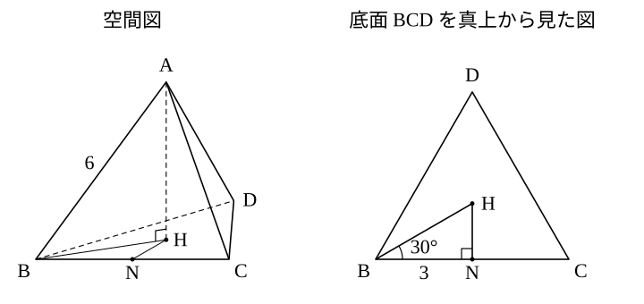

# L11 空間図形の計量——平面を1枚取り出す

- unit_id: hs-math-i-trigonometric-ratios
- 位置づけ: 単元第11レッスン（2時間）。子単元「正弦定理・余弦定理と三角形の計量」（L06〜L11）の最終回。L10 の4段階（三角形を見つける→決定条件を確かめる→定理を選ぶ→処理して解釈する）を、直方体・正四面体・円錐といった簡単な空間図形と、空間の測量（塔を見込む角）に広げる。空間図形の性質の一般論は扱わない（数学A「図形の性質」）。
- distribution_status: published_draft
- license: CC-BY-4.0
- verify_required: 例題数値・記述は監修者検証必須。
- 主概念: ①空間図形の中から適当な平面（三角形）を取り出して計量する（直方体の対角線と角・正四面体の高さと体積） ②三角比を空間の測量へ（水平面の三角形と鉛直面の直角三角形の2段構え）

---

## 1. 空間図形の中の三角形——直方体の対角線

空間図形の計量も、やることは L10 と変わらない。求めたい量を辺や角にもつ**三角形を1つ見つけ**、その三角形が乗っている平面を1枚取り出して、平面の問題として解く。空間で難しく見えるのは、どの平面を取り出すかが決まっていないうちだけである。

**例題1** 直方体 ABCD-EFGH は、AB=6、AD=3、AE=2 である（底面が ABCD、その真上に EFGH。E は A の真上、F は B の真上、G は C の真上、H は D の真上）。
(1) 対角線 AG の長さを求めよ。
(2) 対角線 AG と底面 ABCD のなす角を θ とする。sin θ の値を求め、θ がおよそ何度かを三角比の表で答えよ。

段階1。AG を辺にもつ三角形を探す。G は C の真上にあり、CG は底面に垂直だから、△ACG は ∠ACG=90° の直角三角形である。AC は底面の対角線で、これも △ABC（∠ABC=90°）の斜辺。つまり、三角形を2つ、順に使う。

(1) 底面の △ABC で、三平方の定理から

AC² = AB²＋BC² = 6²＋3² = 45

次に △ACG で

AG² = AC²＋CG² = 45＋2² = 49

AG>0 だから AG = **7**

（AC=√45=3√5 と直しても、2乗して使うだけなので √ のまま持ち込んでよい。）

(2) 「AG と底面 ABCD のなす角」とは、底面に垂直な GC を下ろしたときの ∠GAC のことである（直線と、その直線が底面に落とす影 AC とのなす角）。θ=∠GAC は直角三角形 ACG の鋭角だから、三角比の定義（L01）で

sin θ = CG/AG = **2/7**

2/7=0.2857…。三角比の表で sin の値が 0.2857 に近い角を探すと、sin 16°=0.2756、sin 17°=0.2924 で、0.2857 は 17° の値に近い。θ ≒ **17°**

解釈する。直方体は横に長く（6）、高さは低い（2）ので、対角線は底面から少ししか持ち上がらない——θ が 20° 足らずの小さな角なのは図と合っている。検算として、cos θ=AC/AG=3√5/7 を使って sin²θ＋cos²θ=4/49＋45/49=49/49=1（L03 の相互関係）。

:::guide
**空間で迷ったら「平面を1枚取り出す」——中3の「直角三角形を見つける」の続き**

中3の三平方の定理で、一見して直角三角形のない場面に直角三角形を見つける（作り出す）練習をした。直方体の対角線はその代表で、底面の対角線 AC を先に出し、次に AC と高さ CG で直角三角形を作った。この単元で増えたのは、直角三角形でない三角形も正弦定理・余弦定理で解けることだけで、「平面を取り出す」という発想は同じである。取り出す平面の候補は、たいてい次の3種類のどれかだ。①底面（または側面）そのもの、②底面に垂直な平面（高さを含む面——直角三角形が現れる）、③求めたい3点を通る平面（例題2 のように、辺の長さを別の平面で先に出してから、余弦定理で解く）。どの平面かを決めたら、その平面だけを紙に平面図としてかき直すとよい。空間の図の中に斜めに描かれた三角形は、辺の長さの見た目が実際と違うので、平面にかき直したほうが決定条件を確かめやすい。
:::

## 2. 直方体の3頂点を通る三角形——辺を集めてから余弦定理

**例題2** 例題1 と同じ直方体 ABCD-EFGH（AB=6、AD=3、AE=2）で、3点 A、F、C を通る三角形 AFC の面積を求めよ。

段階1。△AFC は、直方体を斜めに切った面の上にある。この三角形の辺 AF、FC、CA は、それぞれ直方体の側面・底面の対角線だから、各面の直角三角形で三平方の定理から出せる。

AF² = AB²＋BF² = 36＋4 = 40、AF = 2√10
FC² = BF²＋BC² = 4＋9 = 13、FC = √13
CA² = AB²＋BC² = 36＋9 = 45、CA = 3√5

段階2・3。△AFC は3辺がそろった——「3辺」なので、余弦定理で角を出し、正弦に直して面積公式へ（L09 の「3辺→面積」の道筋）。

段階4。∠FAC の余弦は

cos∠FAC = (AF²＋CA²−FC²)/(2×AF×CA) = (40＋45−13)/(2×2√10×3√5) = 72/(12√50) = 6/√50 = 6/(5√2) = 3√2/5

0°<∠FAC<180° では sin∠FAC>0 だから

sin∠FAC = √(1−cos²∠FAC) = √(1−18/25) = √(7/25) = √7/5

△AFC = (1/2)×AF×CA×sin∠FAC = (1/2)×2√10×3√5×(√7/5) = 3√50×√7/5 = 3×5√2×√7/5 = **3√14**

解釈する。3√14 ≒ 3×3.742=11.226≒11.2。直方体の底面 ABCD の面積は 6×3=18 で、△AFC はそれより小さい三角形として自然な大きさである。検算として、cos∠FAC=3√2/5≒0.849 は 1 を超えておらず、∠FAC はおよそ 32°（表で cos 32°=0.8480）の鋭角——3辺 2√10≒6.32、√13≒3.61、3√5≒6.71 のうち、最も短い辺 FC の対角が最も小さいことと合う。

## 3. 正四面体の高さと体積——垂線の足はどこか

**例題3** 1辺の長さが 6 の正四面体 ABCD（4つの面がすべて正三角形）について、
(1) 頂点 A から底面 BCD に下ろした垂線 AH の長さ（正四面体の高さ）を求めよ。
(2) 正四面体 ABCD の体積を求めよ。

段階1。高さ AH を辺にもつ直角三角形を探す。△ABH は ∠AHB=90° で、斜辺 AB=6 は分かっている。あとは BH が分かればよい。そのためには、H が底面のどこにあるかを決める必要がある。

**垂線の足 H の位置**。AB=AC=AD=6 で、AH は3つの直角三角形 ABH、ACH、ADH に共通の辺だから、この3つは「斜辺と他の1辺がそれぞれ等しい直角三角形」で合同である（中2）。よって HB=HC=HD。つまり H は、正三角形 BCD の3つの頂点から等しい距離にある点——正三角形の中心である。

BH の長さは、底面の中に直角三角形を作って出す。BC の中点を N とすると、HB=HC だから HN は BC の垂直二等分線の一部で、∠BNH=90°。また、H は正三角形の中心なので（HB=HC=HD と BC=BD から △HBC≡△HBD、よって ∠HBC=∠HBD）、BH は ∠CBD=60° を2等分し、∠HBN=30°。BN=3。直角三角形 BNH で三角比の定義から

cos 30° = BN/BH、BH = BN/cos 30° = 3÷(√3/2) = 6/√3 = 2√3

(1) 直角三角形 ABH で三平方の定理から

AH² = AB²−BH² = 36−12 = 24、AH = **2√6**

(2) 底面 △BCD の面積は、2辺とその間の角から（L09）

△BCD = (1/2)×6×6×sin 60° = 18×(√3/2) = 9√3

体積は「(1/3)×底面積×高さ」（中1）だから

V = (1/3)×9√3×2√6 = 3√3×2√6 = 6√18 = 6×3√2 = **18√2**

解釈する。AH=2√6≒4.90 で、1辺 6 より短い（垂線は斜辺 AB より短い）。体積 18√2≒25.5 は、1辺 6 の立方体（216）のおよそ 8分の1——正四面体が立方体よりずっと小さいことと合っている。検算として、BH=2√3 を別の道で確かめる。△BNH で HN=BN×tan 30°=3/√3=√3 だから、三平方の定理で BN²＋HN²=9＋3=12=BH² となり、一致する。

:::guide
**「H は底面の中心」を、どうやって言ったか**

正四面体の高さを求めるとき、垂線の足が底面の正三角形の中心に来ることを、なんとなく「対称だから」で済ませたくなる。本文では、これを合同な直角三角形3つ（斜辺 AB=AC=AD が等しく、AH が共通）で説明した。使ったのは中2の直角三角形の合同条件だけである。この理由づけを1回自分の言葉で言えると、正四面体でない場合——たとえば頂点から底面の3頂点までの距離が等しくない三角錐——では H が中心に来ないことも分かる。そのときは、この単元の道具（余弦定理で底面の角を出す、直角三角形を別に作る）で H の位置を決めにいくことになる。なお、正三角形の中心は、数学A「図形の性質」で名前をもらって、もっと一般の三角形について性質を調べる対象になる。ここでは名前より、「3頂点から等距離」という決め方と、その点を直角三角形の頂点として使う手つきを持っておけばよい。
:::

## 4. 空間の測量——塔を見込む角

L10 の測量では、A・B・塔の真下が一直線上にあった。実際には、塔の真下が見えていても、そこへ向かう直線上に2地点をとれないことがある。そのときは、**地面の上の三角形と、塔を含む鉛直な直角三角形の2段構え**で解く。

**例題4** 平らな地面に垂直に立つ塔の高さを測る。地面の上に 40 m 離れた2地点 A、B をとり、塔の真下の点を H とすると、∠HAB=70°、∠HBA=50° であった。また、A で塔の先端 T を見上げる仰角は 40° であった。測定器は地面に置いて測ったものとして（目の高さは考えない）、塔の高さ TH を小数第1位まで求めよ。

段階1。三角形は2つある。地面の上の △HAB（水平面）と、塔を含む △THA（鉛直面。∠THA=90°）。求めたい TH は △THA の辺で、そこで分かっているのは仰角 40° だけ——AH が分かれば直角三角形として解ける。AH は △HAB の辺だから、先に △HAB を解く。

段階2・3。△HAB で分かっているのは AB=40 と両端の角 70°、50°。「1辺と2角」——正弦定理。残りの角は ∠AHB=180°−70°−50°=60°。

段階4。AH は ∠HBA=50° の対辺、AB=40 は ∠AHB=60° の対辺だから

AH = 40×sin 50°/sin 60° = 40×0.7660/0.8660 = 35.38…

次に、鉛直面の直角三角形 THA で、tan 40°=TH/AH だから

TH = AH×tan 40° ≒ 35.38×0.8391 = 29.68… ≒ **29.7**（m）

解釈する。仰角 40° は 45° より小さいから、高さ TH は水平距離 AH（35.4 m）より短いはず——29.7 m はそれに合う。また、∠HBA=50° より ∠HAB=70° のほうが大きいので、B のほうが塔から遠い（BH は ∠HAB の対辺で AH より長い）。B から見た仰角は 40° より小さくなるはずで、もし B の仰角も測っていれば、この向きで検算できる。

検算は、△HAB の残りの辺で。BH = 40×sin 70°/sin 60° = 40×0.9397/0.8660 ≒ 43.40。余弦定理で AB² = AH²＋BH²−2×AH×BH×cos 60° ≒ 1251.7＋1883.6−2×35.38×43.40×0.5 ≒ 3135.3−1535.5 = 1599.8。AB=40 の2乗 1600 と重なる。

:::guide
**測量が「空間」になる瞬間——三角形が別々の平面に乗る**

例題4 の2つの三角形 △HAB と △THA は、辺 AH を共有しているが、同じ平面には乗っていない。前者は水平な地面の上、後者は地面に垂直な面の上にある。だから1枚の図に一緒にかくと、角の大きさが見た目では読めない（∠HAB=70° は、斜めから描いた図の上では 70° に見えない）。対策は §1 の guide と同じで、平面ごとに別の図をかくことだ。地面の三角形を真上から見た図として1枚、鉛直面の直角三角形を真横から見た図として1枚。2枚の図をつなぐのは共有している辺 AH で、「1枚目で AH を出し、2枚目に持ち込む」という手順になる。この「共有する辺で2つの三角形をつなぐ」は、L10 の例題3（四角形の対角線 AC）とまったく同じ構図で、平面か空間かの違いは、2つの三角形が同じ紙に正確にかけるかどうかだけである。
:::

## 5. 練習

**問1** 1辺の長さが 4 の立方体 ABCD-EFGH（底面 ABCD、E・F・G・H はそれぞれ A・B・C・D の真上）について、
(1) 対角線 AG の長さを求めよ。
(2) AG と底面 ABCD のなす角を θ とする。sin θ の値を求め、θ がおよそ何度かを三角比の表で答えよ。

**問2** 直方体 ABCD-EFGH で、AB=2、AD=2、AE=1 である（頂点の並びは問1 と同じ）。3点 A、F、C を通る三角形 AFC の面積を求めよ。

**問3** 1辺の長さが 4 の正四面体 ABCD について、
(1) 頂点 A から底面 BCD に下ろした垂線 AH の長さを求めよ。
(2) 正四面体 ABCD の体積を求めよ。
(3) 辺 AB と底面 BCD のなす角を θ（=∠ABH）とする。cos θ の値を求めよ。

**問4** 平らな地面に垂直に立つ鉄塔の高さを測る。地面の上に 80 m 離れた2地点 A、B をとり、鉄塔の真下の点を H とすると、∠HAB=30°、∠HBA=45° であった。また、A で鉄塔の先端を見上げる仰角は 35° であった。目の高さは考えないものとして、鉄塔の高さを小数第1位まで求めよ（sin 105° は L05 の関係で表から引くこと）。

**問5** 底面の半径が r、母線（頂点と底面の円周上の点を結ぶ線分）の長さが 6 の円錐がある。母線と底面のなす角が 60° のとき、r、円錐の高さ、円錐の体積を求めよ。

---

:::stretch
**S1** 三角錐 OABC は、頂点 O に集まる3つの角がすべて直角（∠AOB=∠BOC=∠COA=90°）で、OA=1、OB=1、OC=2 である。
(1) 3辺 AB、BC、CA の長さを求めよ。
(2) cos∠BAC の値を求め、△ABC の面積を求めよ。
(3) 3つの直角三角形 △OAB、△OBC、△OCA の面積をそれぞれ S1、S2、S3、(2) で求めた △ABC の面積を S4 とする。S1²＋S2²＋S3² と S4² を計算して比べよ。
:::

対応解答: answer_key_L10-11.md

<!-- gen_nav:nav:start（自動生成・手編集しない） -->

---

[← 前のレッスン](lesson_10.md)｜[単元の目次](README.md)｜[解答](answer_key_L10-11.md)｜[次のレッスン →](lesson_12.md)

<!-- gen_nav:nav:end -->
