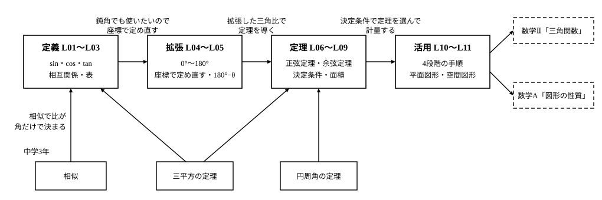

# L12 単元のまとめ——「計量」の道具箱

- unit_id: hs-math-i-trigonometric-ratios
- 位置づけ: 単元第12レッスン（1時間）。L01〜L11 の統合演習・総括回。**本線では新しい概念・新しい用語は立てない**（雑談・発展の枠を除く）。親単元「図形と計量（三角比）」直属の章末相当（どの子単元にも属さない）——定義→拡張→定理→活用の順に単元をふり返り、数学Ⅱ・数学Aへの接続を確かめる。
- distribution_status: published_draft
- license: CC-BY-4.0
- verify_required: 例題数値・記述は監修者検証必須。
- 主概念: ①親単元の1枚地図（定義→拡張→定理→活用の4段と、段どうしをつなぐ矢印） ②数学Ⅱ「三角関数」・数学A「図形の性質」への接続予告

---

## 1. 単元の地図——道具箱を4段に分ける

L01 で、この単元の入口を「縮図を引かずに済ませたい」から始めた。角が同じなら直角三角形はすべて相似で、辺の比は角だけで決まる——その比に名前をつけたのが三角比だった。L11 まで歩き終えたいま、手元の道具箱を開けて、中身を4段に分けて並べ直してみる。

- **定義**（L01〜L03）: sin A・cos A・tan A は直角三角形の辺の比。使うときの決定は3つ——どの直角三角形を見るか・どの2辺を使うか・どちらを分母にするか。sin A は「斜辺を 1 としたときの対辺の長さ」でもあり「斜辺に対する対辺の割合」でもある（だから 斜辺×sin A で対辺が出る）。三平方の定理から sin²A＋cos²A=1、定義から tan A=sin A/cos A。値は[三角比の表](trig_table.md)か電卓で引く。
- **拡張**（L04〜L05）: 鈍角をもつ三角形にも同じ道具を使いたい。しかし鈍角は直角三角形の中に置けないので、原点を中心とする半径 r の円周上の点 P(x, y) を使って sin θ=y/r・cos θ=x/r・tan θ=y/x と定め直した（tan 90° だけは、0 で割ることになるので定められない）。0°≦θ≦180° で、符号は点 P の座標が決める（鈍角では cos θ と tan θ が負）。sin(180°−θ)=sin θ・cos(180°−θ)=−cos θ で、表の範囲の外も引ける。
- **定理**（L06〜L09）: 直角のない三角形でも辺と角を結ぶ関係——正弦定理 a/sin A=b/sin B=c/sin C=2R（R は外接円の半径）と余弦定理 a²=b²＋c²−2bc cos A（三平方の定理の一般化）。どちらを使うかは、分かっている量の組（1辺と2角／2辺とその間の角／3辺）——三角形の決定条件——で決まる。面積は S=(1/2)ab sin C。
- **活用**（L10〜L11）: 測れない距離や高さ、平面図形・空間図形の未知量を、4段階（三角形を見つける→決定条件を確かめる→定理を選ぶ→処理して解釈する）で求める。空間では、三角形の乗っている平面を1枚取り出す。

4段は、前の段が次の段を支えている。定理は拡張した三角比で書かれているから鈍角三角形にも使え、活用は定理の使い分けの上に立つ。逆にいえば、活用でつまずいたとき、原因が「どの段」にあるかを切り分けられる——三角形が見つからないのか（活用）、定理を選び違えたのか（定理）、鈍角の符号を落としたのか（拡張）、対辺と隣辺を取り違えたのか（定義）。このレッスンでは、新しいことを何も足さない。4段を例題で1つずつ確かめ直し、段と段のつながりを見て、単元をたたむ。

:::guide
**「どの段の道具か」を言えることの値打ち**

単元の終わりに中身を4段に分けるのは、暗記の整理のためではない。「いま使っている道具がどの段のものか」が言えると、間違えたときに戻る場所が決まるからだ。活用問題の答えが合わないとき、計算を最初からやり直すのは効率が悪い。まず、どの段でつまずいたかを見る。図に三角形を1つ決められていなければ活用の段（L10）へ、分かっている量の組と定理が合っていなければ定理の段（L08）へ、鈍角の cos に負号がついていなければ拡張の段（L04・L05）へ、対辺と隣辺が入れ替わっていれば定義の段（L01）へ戻る。逆に、4段それぞれの中身を自分の言葉で言えるなら、この単元は「覚えた」のではなく「つながった」状態にある。もう1つ。段の間の矢印にも目を向けてほしい。相似が定義を生み、定義の限界（鈍角が置けない）が拡張を要求し、拡張した三角比が定理を鈍角にも通用させ、定理の使い分けが活用を支える。矢印が言えると、次に似た道具（数学Ⅱの三角関数）に出会ったとき、どこが同じでどこが新しいかを自分で見つけられる。
:::

## 2. 定義と拡張——1つの値から残りを出す、符号は座標で決める

**例題1** 0°≦θ≦180° で sin θ=3/5 のとき、
(1) cos θ と tan θ の値を求めよ。
(2) θ はおよそ何度か。三角比の表で答えよ。

(1) 相互関係 sin²θ＋cos²θ=1（L03・L05）から

cos²θ = 1−(3/5)² = 1−9/25 = 16/25

ここで、cos θ は点 P の x 座標を r で割ったものだから（L04）、鋭角なら cos θ>0、鈍角なら cos θ<0。sin θ=3/5 だけでは θ が鋭角か鈍角かは決まらない（sin(180°−θ)=sin θ）ので、2つの場合に分かれる。

θ が鋭角のとき cos θ=**4/5**、tan θ=sin θ/cos θ=(3/5)÷(4/5)=**3/4**
θ が鈍角のとき cos θ=**−4/5**、tan θ=(3/5)÷(−4/5)=**−3/4**

検算: 鋭角の場合、斜辺 5・対辺 3・隣辺 4 の直角三角形をかけば、定義（L01）から sin=3/5、cos=4/5、tan=3/4——同じ値になる。鈍角の場合は、r=1 として x 座標 −4/5、y 座標 3/5 の点 P を考えればよく、x²＋y²=16/25＋9/25=1 で、たしかに単位円の上にある。

(2) sin θ=3/5=0.6。表の sin の列で 0.6 に最も近いのは sin 37°=0.6018（sin 36°=0.5878）だから、鋭角のほうは θ≒**37°**。鈍角のほうは 180°−37°=**143°**。

解釈する。例題1 では「定義」の段と「拡張」の段が同時に働いた。相互関係の式は鋭角でも鈍角でも同じ形で、変わったのは符号の決め方だけ——辺の長さは負にならないが、座標は負になる。拡張で増えたのは、この符号の判断1つである。

:::guide
**拡張で変わったのは「長さ」から「座標」へ、の1点だけ**

鈍角の三角比で符号を落とすのは、拡張の段でいちばん多い取り違えだが、原因ははっきりしている。頭の中の定義がまだ「直角三角形の辺の比」のままだと、辺の長さは負にならないので、負号を書く理由が見当たらないのだ。L04 で定義を「点 P の座標で定める」形に置き換えたのは、まさにこのためだった。座標なら、x が負になることは中1の座標平面のときから当たり前である。だから、符号に迷ったら式ではなく図に戻る——単位円をかき、角 θ の点 P を打ち、x 座標の符号を見る。θ が鈍角なら P は y 軸の左にあり、x は負で y は正、つまり cos θ<0 で tan θ<0。sin θ は y 座標だから 0°≦θ≦180° では負にならない。この「図で符号を読む」手つきは、数学Ⅱで角が 180° を超えたときにも、そのまま使える。
:::

## 3. 定理——決定条件で選び、面積と外接円まで

**例題2** △ABC で b=3、c=5、A=120° のとき、
(1) a を求めよ。
(2) △ABC の面積 S を求めよ。
(3) 外接円の半径 R を求めよ。

決定条件を確かめる（L08）。分かっているのは2辺 b、c とその間の角 A——「2辺とその間の角」なので三角形は1つに決まり、残りの辺は余弦定理（L07）で出る。

(1) a² = b²＋c²−2bc cos A = 9＋25−2×3×5×cos 120°。cos 120°=−cos 60°=−1/2（L05）だから

a² = 34−30×(−1/2) = 34＋15 = 49

a>0 だから a = **7**

(2) 2辺とその間の角がそろっているので S=(1/2)bc sin A（L09）。sin 120°=sin 60°=√3/2 だから

S = (1/2)×3×5×(√3/2) = **15√3/4**

(3) a と A の組がそろったので、正弦定理 a/sin A=2R（L06）から

2R = 7/(√3/2) = 14/√3、R = 7/√3 = **7√3/3**

解釈と検算。a=7 は b=3、c=5 のどちらより長い——最大の角 A=120° の対辺が最大の辺で、向きが合う。また a<b＋c=8 で、三角形として成り立つ。検算は、別の定理で残りの角を出して戻す。正弦定理から sin B=b sin A/a=3×(√3/2)/7=3√3/14=0.371…。表で sin 22°=0.3746、sin 21°=0.3584 だから B≒22°、C≒180°−120°−22°=38°。このとき c=a sin C/sin A=7×0.6157/0.8660=4.97… で、与えられた c=5 とほぼ重なる（22° は 1° 刻みの近似なので、ぴったりにはならない）。

もう1つ、見ておきたいことがある。余弦定理の式に A=90° を入れると cos 90°=0 で a²=b²＋c²——三平方の定理になる（L07）。三平方の定理は、定義の段では相互関係 sin²A＋cos²A=1 を生み、定理の段では余弦定理の特別な場合として現れる。同じ1つの定理が、2つの段をつないでいる。

## 4. 活用——4段階を最後にもう一度

**例題3** 平らな地面に垂直に立つ塔の高さを測る。地面の上に 30 m 離れた2地点 A、B をとり、塔の真下の点を H とすると、∠HAB=45°、∠HBA=75° であった。また、A で塔の先端 T を見上げる仰角は 30° であった。目の高さは考えないものとして、塔の高さ TH を小数第1位まで求めよ。

段階1。三角形は2つ。地面の上の △HAB と、塔を含む鉛直な直角三角形 △THA（∠THA=90°）。求めたい TH は △THA の辺で、AH が分かれば tan 30° で出る（定義の段）。AH は △HAB の辺だから、先に △HAB を解く。

段階2・3。△HAB で分かっているのは AB=30 と両端の角 45°、75°——「1辺と2角」で三角形は決まり、正弦定理（定理の段）。残りの角は ∠AHB=180°−45°−75°=60°。

段階4。AH は ∠HBA=75° の対辺、AB=30 は ∠AHB=60° の対辺だから

AH = 30×sin 75°/sin 60° = 30×0.9659/0.8660 = 33.46…

△THA で tan 30°=TH/AH だから

TH = AH×tan 30° ≒ 33.46×0.5774 = 19.31… ≒ **19.3**（m）

解釈する。仰角 30° は 45° より小さいから、高さ TH は水平距離 AH（約 33.5 m）より短いはず——19.3 m はそれに合う。もう1つ。BH=30×sin 45°/sin 60°=30×0.7071/0.8660=24.49… で、B のほうが塔に近い。B から見上げる仰角は、tan の値が 19.32/24.49=0.788… で、表で tan 38°=0.7813、tan 39°=0.8098 だから、およそ 38°——A の 30° より大きく、近いほど見上げる角が大きいことと合う。

検算: AH を別の道で出す。∠HAB=45°、∠HBA=75° は L10 例題1（AB=60 m のとき、75° の対辺 PA≒66.92 m）と同じ角の組だから、2つの三角形は相似で、AB が半分なら AH も半分——66.92÷2=33.46 で重なる。単元の入口で使った「角が同じなら辺の比は同じ」（相似）が、最後の検算にも顔を出した。

:::guide
**「解決の過程を振り返る」——測る量を減らせないか、別の道はないか**

活用問題は、答えが出たところで終わりにせず、解いた道を振り返ると、もう1段深く分かる。振り返りの問いは2つある。1つは「測る量を減らせないか」。例題3 では AB と2つの角と仰角の4つを測った。仮に塔の真下 H まで歩けるなら、AH を直接測って仰角と合わせるだけで済む（L02）。歩けないから、地面の三角形を1つ増やして AH を計算で出した——測れない量を、測れる量から計算で置き換えたのである。何が測れて何が測れないかで、必要な三角形の数が決まる。もう1つは「別の道はないか」。例題3 は B の仰角も測っておけば、△THB からも TH が出て、2つの値の一致が検算になる。同じ答えへ向かう道が2本あるとき、1本を答えに、もう1本を検算に使う——L10 からずっと続けてきたこの習慣は、この単元が終わっても、どの単元でも同じように使える。
:::

## 5. この先へ——地図の矢印の先

単元の地図には、外から入ってくる矢印と、外へ出ていく矢印がある。

- 中学から入ってきたもの: 相似（比が角だけで決まる——定義の根拠）、三平方の定理（相互関係と余弦定理の根拠）、円周角の定理（正弦定理を外接円で導いた根拠）。この3つがなければ、4段のどれも立たなかった。
- 数学Ⅱ「三角関数」へ: この単元では角を 0° から 180° までに限り、三角比を図形の辺や座標を結ぶ「数」として使った。高等学校学習指導要領解説（数学Ⅱ「三角関数」）にも「『数学Ⅰ』での三角比は，あくまでも図形の計量を目的としたものであり，関数としての取扱いではない」と書かれている。数学Ⅱでは角の範囲を 180° を超えて広げ、θ を動かしたときの sin θ の変化を関数として扱う——グラフ・周期・加法定理は、そこで学ぶ。L04 の「点 P の座標で定める」定義は、そのまま数学Ⅱの出発点になる。
- 数学A「図形の性質」へ: 外接円の中心（L06）・内接円の中心（L09）・正三角形の中心（L11）といった点は、数学Aで外心・内心・重心という名前をもらい、その性質を調べる対象になる。円に内接する四角形の性質、空間の直線と平面の位置関係も同じ単元で扱う。この単元で使ったのは、それらの「計量」の側——長さ・角・面積・体積を三角比で求める側——だけである。

:::zatsudan
道路に「とまれ」のような文字が描かれているのを、真上から見る機会があれば（航空写真でもよい）、文字が進行方向に細長く引き伸ばされていることに気づくはずだ。運転席から路面の文字を見下ろす角（俯角）を θ とする。文字が遠くにあって、文字のどこを見ても見下ろす角が θ のままだとみなすと、道路に沿った長さ L の線分は、視線に垂直な向きには L×sin θ の長さにしか見えない——路面上の線分 L を斜辺、視線に垂直な向きを対辺とする直角三角形（線分と視線のなす角が θ）を1つ見つければ出る。θ が小さいほど sin θ は小さいから、遠くの文字ほど縦方向が縮んで見える。文字を縦に伸ばしておくのは、この縮みをあらかじめ打ち消して、運転者から見たときにふつうの形に見せるためだと考えられる。この見方のもとでは、どれだけ伸ばせばよいかの見当は、θ の値しだいで、三角比の表で計算できる（実際には文字の手前と奥とで見下ろす角が少し違うので、近似である）。道具箱の中身は、こんなところにも使われている。
:::
<!-- zatsudan話題源: RESEARCH_RAW_A_20260902 §1.5（高等学校学習指導要領解説 数学編 課題学習〈図形と計量〉「路面に描かれた「とまれ」などの表示や図柄に関する探究」・抽出テキスト2719〜2745行）。解説は探究の題材名を挙げるのみで、引き伸ばしの比率や具体値は示していないため、本文にも数値は書かず、L×sin θ の関係を直角三角形から導く活動として書いた（引き伸ばしの目的は「と考えられる」の推定形）。 -->

## 6. 練習

問1 は定義と拡張（L01〜L05）、問2 は定理（L06〜L09）、問3 は活用（L10〜L11）、問4 は段と段のつながりを言葉で確かめる問題である。手が止まったら、その段のレッスンに戻って確かめてから再挑戦しよう。

**問1** 次の問いに答えよ。
(1) △ABC は ∠B=90°、AB=8、BC=15、CA=17 の直角三角形である。sin A、cos A、tan A、sin C、cos C の値を求めよ。
(2) sin 150°、cos 135°、tan 120° の値を求めよ。
(3) 0°≦θ≦180° で cos θ=−3/5 のとき、sin θ と tan θ の値を求めよ。また、θ はおよそ何度か。三角比の表で答えよ。

**問2** △ABC で a=√7、b=2、c=3 のとき、次の問いに答えよ。
(1) A の大きさを求めよ。
(2) △ABC の面積を求めよ。
(3) 外接円の半径 R を求めよ。
(4) この三角形は、鋭角三角形・直角三角形・鈍角三角形のどれか。最大の角の余弦の符号で判定せよ。

**問3** 次の問いに答えよ。
(1) 池をはさんだ2地点 P、Q の距離を求めたい。池のそばの地点 O から P までの距離は 70 m、Q までの距離は 80 m で、∠POQ=120° であった。PQ の長さを求めよ。
(2) 直方体 ABCD-EFGH は AB=3、AD=4、AE=5 である（底面が ABCD、E・F・G・H はそれぞれ A・B・C・D の真上）。対角線 AG の長さと、AG と底面 ABCD のなす角 θ の大きさを求めよ。

**問4** 次の問いに、それぞれ2〜3文で答えよ。
(1) 三角比を鈍角まで拡張するとき、「直角三角形の辺の比」という定義をそのまま使えなかった理由と、代わりに何を使って定めたかを説明せよ。
(2) 余弦定理が「三平方の定理の一般化」と呼ばれる理由を、余弦定理の式を1つ書いて説明せよ。

---

:::stretch
**S1** △ABC の面積を S、外接円の半径を R とする。
(1) 面積公式 S=(1/2)ab sin C と正弦定理 c/sin C=2R から、S=abc/(4R) が成り立つことを導け。
(2) a=7、b=5、c=8 の三角形について、余弦定理で cos A の値を求め、A の大きさを答えよ。
(3) (2) の三角形について S と R をそれぞれ求め、(1) の式 S=abc/(4R) が成り立つことを確かめよ。
:::

対応解答: answer_key_L12.md

<!-- gen_nav:nav:start（自動生成・手編集しない） -->

---

[← 前のレッスン](lesson_11.md)｜[単元の目次](README.md)｜[解答](answer_key_L12.md)

<!-- gen_nav:nav:end -->
