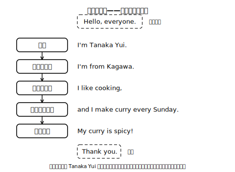

# Lesson 1　自分を紹介する——言えることを文字にする

## 主概念（この時間の柱・2つ）

1. **音声既習の自己紹介を文字にする**（言えることは、もう書く材料になっている）
2. **紹介には情報の順序がある**（名前→出身・所属→好きなこと・していること→ひとこと）

## ねらい（生徒の姿）

- 小学校から口で言ってきた自己紹介の表現を、声に出しながら文字で書き写し、自分の内容に置き換えて言える・書き始められる。
- 「どの順番で言うと紹介らしく聞こえるか」を、モデルを読み比べて自分の言葉で説明できる。

## 導入（10分）——モデル紹介を「聞く」

モデル話者 Tanaka Yui（架空の教員）の自己紹介スクリプトを、**声に出して**2回読む（まだ書かない。音が先）。

> Hello, everyone. I'm Tanaka Yui. I'm from Kagawa. I like cooking, and I make curry every Sunday. My curry is spicy! Thank you.

- 1回目：内容だけつかむ（「Yui さんについて何が分かった？」を日本語でつぶやいてみる）。
- 2回目：**順番**に注目する。「最初に何を言った？　次は？」→ 名前→出身→好きなこと→していること→ひとこと、という流れをノートに日本語ラベルで並べる。

**ここでの説明（生徒向け）**
紹介は、知っている文を思いつくままに並べるのではなく、聞く人が受け取りやすい順番で話す。ふつうは「名前→出身や所属→好きなこと→ふだんしていること→ひとこと」の流れにすると、初めて聞く人にも像が結びやすい。今日はこの流れに沿って、小学校から声に出して言ってきた文を、自分の手で文字にしていく。音で言えることは、書くための材料がもうそろっているということ。まず言って、それから書く。この順番はユニット全体でも同じ。（約170字）

## 展開1（15分）——口頭リハーサル（ひとりで）

1. ノートの流れ（日本語ラベル）だけを見て、自分の紹介を**口頭で**言ってみる。書かない。できれば録音して聞き返す。
2. 聞き返したら（または言い終えたら）、「いま自分について何が伝わったか」を1つ、日本語でつぶやいてみる（「カレーの人だね」のように）。聞き手を想像すると「伝える」姿勢になる。
3. 言えなかった箇所は、ことば銀行や辞書で語句を探す。それでも英語にならないときは、AIチャットに「中1で習う英語だけを使って、『放課後にバドミントンをします』を自己紹介の1文にしてください」のように頼んでもよい（この段階では書き写さない。音が先）。

## 展開2（15分）——「言った文」を文字にする

ワークシートに、いま口で言った文を**声に出しながら**書く。

- 手順：①モデル文（上と同じ）を音読しながら1回書き写す　②自分の内容に置き換えて書く。
- 支援：好きなこと・していることの語彙は「ことば銀行」（badminton, drawing, video games, my dog, ramen... 等の語彙カード）から選んでよい。
- 約束：**言えない文は書かない**。書きたい文があれば、まず声に出して言ってみてから書く。

## まとめ（10分）——読み上げ確認

- 書いた紹介を自分で音読する（書いた文字と自分の音が合っているか確かめる）。
- もう一度通しで音読し、「順番の流れに乗っていたか」だけを観点に自分で一言メモする（正確さのチェックはまだしない）。
- 次回予告：「今日書いた文を、つないで『紹介文』に育てる」。

## stretch（早く終わった人向け・分離）

- ひとことの部分を1文足す：好きなものについての補足（My dog is three years old. / I want a new racket.）。
- モデル話者 Yui さんの紹介を読み返して、内容についての質問を1つ英語で考えてみる（Do you...?）。

## 教材（新規自作・架空）

- モデル自己紹介スクリプト（上記 Tanaka Yui 版。架空の教員プロフィール）
- ことば銀行カード（趣味・食べ物・部活の語彙、絵付き）
- ワークシート「言ってから書く」（模写欄＋自分版欄）

<!-- gen_nav:nav:start（自動生成・手編集しない） -->

---

[単元の目次](README.md)｜[解答](answer_key_supplement.md)｜[次のレッスン →](lesson_02.md)

<!-- gen_nav:nav:end -->
