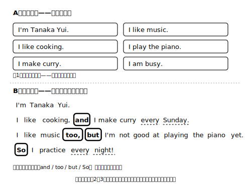

# Lesson 2　自分の紹介文を書く——文をつないで「紹介らしく」

## 主概念（この時間の柱・1つ）

1. **接続語（and, but, so）で文をつなぐと、文の羅列が「紹介文」になる**

## ねらい（生徒の姿）

- 前時に書いた自分についての文を、順序を整え and / but / so でつないで、簡単な語句や文からなるまとまりのある自己紹介文に仕上げられる。
- ※到達上限は「簡単な語句や文」を順序と接続語でまとめるまで。段落構成や理由の展開は求めない。

## 導入（10分）——2つの紹介、どっちが聞きたい？

2種類の自己紹介スクリプトを、**声に出して**読み比べる（どちらも新規自作・内容はほぼ同じ。B は every Sunday など情報を少し足している）。

**A（羅列版）**
> I'm Tanaka Yui. I like cooking. I make curry. I like music. I play the piano. I am busy.

**B（接続版）**
> I'm Tanaka Yui. I like cooking, and I make curry every Sunday. I like music too, but I'm not good at playing the piano yet. So I practice every night!

- 問い：「どちらが『その人らしさ』が伝わる？　なぜ？」を日本語で考えて、理由を一言メモする。
- 「つながっている」「too とか but がある」のような気付きが出たら、A→Bの差分（and / but / so / too / every Sunday）にペンで印を付けて可視化する。B が良く聞こえるのは接続語だけの効果ではなく、足された情報（every Sunday 等）や順序も効いている——その点にも気付けたらなお良い。

**ここでの説明（生徒向け）**
文を1つずつ置いていくと「文のリスト」になるが、紹介はリストではなく「話」。and は仲間の情報を足すとき、but は流れを裏切るとき、so は「だから」と結果につなぐときに使う。全部の文をつなぐ必要はなく、2〜3か所つなぐだけで、聞く人には流れが生まれる。もう1つの道具は「順序」で、前の時間の流れ（名前→出身→好き→していること→ひとこと）に乗せてからつなぐと効果が出る。（約180字）

## 展開1（10分）——口頭でつなぐ練習

書く前に、まず**口で**つなぐ。前時の自分の紹介を、声に出して言い直す。ルールは1つ：「and / but / so のどれかを最低1回使う」。言いながら（または録音を聞き返しながら）、どの接続語を使えたか自分で指を折って数える。

## 展開2（20分）——自分の紹介文を書く（下書き）

1. 前時のワークシートの文を並べ替え、つなぐ箇所を2つ選んで印を付ける。
2. 清書ではなく下書きとして、5〜6文程度の自己紹介文を書く。
3. 書けたら**必ず音読**して、口で言えるかを自分で確かめる（言えない文は、言える形に直す）。

書き出しモデル（新規自作・写して自分用に改変してよい）：

> Hi, I'm ______. I'm from ______. I like ______, and I ______. But I ______. So I ______ every day. Thank you.

- 支援：接続語カード（and / but / so / too）を机上に置き、使った枚数が見えるようにする。

## まとめ（10分）——読み返し（観点は1つ）

- 少し時間を置いてから、自分の下書きを黙読→音読する。観点は「**どこで流れを感じたか**」を1か所指さすことだけ。誤りの訂正はこの時間の観点にしない（正確さの扱いは後半のライティングで行う。気になった箇所は印だけ付けておく）。
- 下書きは捨てずに取っておく（次の時間以降、この文が材料になる）。読んでもらう相手がほしければ、AIチャットに「中1の自己紹介文です。内容が伝わるかだけ教えてください。誤りの指摘はまだしないでください：（自分の下書き）」と頼む手もある。
- ※自分の名前や住んでいる場所など、実際の個人情報はAIに送らず、ぼかして（I'm from Minami Town. のような形で）試すのが安全。

## stretch（分離）

- too / also を使って「意外な共通点」を1文足す（I like natto too!）。
- 接続を1か所増やした版を作り、両方を音読してどちらが読みやすいか自分で選ぶ。

## 教材（新規自作・架空）

- 読み比べスクリプトA/B（上記）
- 接続語カード（and / but / so / too）
- 下書きシート（並べ替え欄＋接続印欄＋下書き欄）

<!-- gen_nav:nav:start（自動生成・手編集しない） -->

---

[← 前のレッスン](lesson_01.md)｜[単元の目次](README.md)｜[解答](answer_key_supplement.md)｜[次のレッスン →](lesson_03.md)

<!-- gen_nav:nav:end -->
