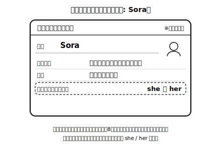
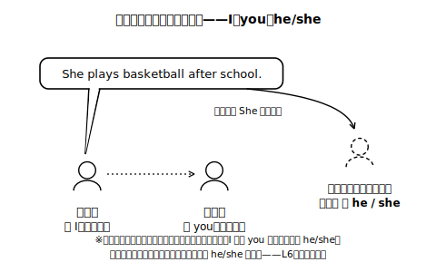

# Lesson 3　その場にいない人を伝える——他者紹介への転換

## 主概念（この時間の柱・2つ）

1. **話し手（I）でも聞き手（you）でもない人のことは、He / She で伝える**（本人がその場にいない場面で、その必要性を体験する——他者紹介への転換）
2. **人が変わると動詞の音が少し変わる**ことへの「気付き」（整理は次時。この時間は気付きまで）

## ねらい（生徒の姿）

- 「本人不在の相手に、その人のことを伝える」場面で、I の文を He / She の文に言い換える必要性を体験する。
- モデル文と自分の発話から、like → likes のような音の違いに自分で気付き、日本語で言語化できる。

## 導入（10分）——「転校していく友達を、新しいクラスに伝えよう」

場面設定（新規自作・架空）：架空の生徒 Sora が隣町の中学へ転校する。転校先の先生から「どんな生徒か教えてほしい」と手紙が来た——**本人は答えられない。まわりが伝えるしかない**、という状況をイメージする。

モデル紹介を声に出して読む（Sora のプロフィールは架空カード）：

> This is Sora. Sora is my friend. **She** plays basketball after school, and **she** draws pictures very well. Everyone loves her drawings.

- 問い（日本語）：「これまでの自己紹介と、何が変わった？」→ I が She になった、に気付けるか。「なぜ I じゃだめ？」→ **本人がここにいない／話しているのは私だから**、を自分の言葉で確認する。
- ※つまずき防止の注意：He / She は「本人が不在のとき」で決まる語ではなく、**話し手（I）でも聞き手（you）でもない人**を指す（本人がその場にいても使う。L6 では、いま Do you ...? とやり取りしたばかりのカードの人物を He/She で紹介する）。「不在」は必要性を体験するための場面設定であり、ルールの条件として覚えない。
- この段階では動詞の変化にはまだ触れない（気付かせるのは展開2）。

## 展開1（15分）——伝言紹介ゲーム（音声のみ・書かない）

※カード8種が手元にない場合の代替：Sora のカード（上の図）と同じ枠組み（名前・部活・好きなこと・特技）で、**自分で8人分の架空プロフィールを書いて**カードにする。名前は実在の友だち・有名人を避けた架空の名前にし、内容もすべて架空でよい。紙を8枚に切って1人1枚書けば、以下の活動はそのまま進められる。

1. 架空プロフィールカード（名前・部活・好きなこと・特技が絵と語句で書かれた新規自作カード・8種）から1枚選ぶ。
2. カードを見ながら、その人物になりきって**一人称で**自己紹介を声に出す（I play tennis. I like anime movies.）。
3. カードを裏返し、今度は**さっきの人物を別の人に伝えるつもりで**、記憶だけで紹介する（He plays tennis...）。言い終えたらカードを表に返し、情報を3つ以上正しく伝えられていたら成功。録音して聞き返すと確かめやすい。
- 仕掛け：一人称→三人称の変換を、ルール説明なしで「伝えるために」やらざるを得ない構造にする。変換の揺れ（I のまま言う、He like と言う等）は**この段階では直さなくてよい**。気付いたことだけメモに留める。

## 展開2（15分）——聞き比べで「音の違い」に気付く

1. 次の文の組を、**声に出して**対比しながら読む（左右を続けて読み、音の違いに耳を澄ます。すべて新規自作）：
   - I play basketball. — She play**s** basketball.
   - I like anime movies. — He like**s** anime movies.
   - I watch soccer on TV. — She watch**es** soccer on TV.
2. 問い（日本語）：「I の文と He/She の文、**音**はどこが違った？」→ 語尾に /s/ /z/ /ɪz/ のような音が付く、という気付きを自分の言葉でメモする。
3. 気付きの確認として、He/She の文だけをもう一度音で言ってみる（綴りの理屈はまだ考えない。**音が先**）。

**ここでの説明（生徒向け）**
今日見つけたとおり、He や She で人のことを伝えるとき、動詞の終わりに小さな音が付く。これは英語を話す人が自然にやっている音の変化。「あの人の話だ」と伝える仕事は、まず主語の He / She がしていて、動詞の終わりの s は、その主語とペアで働く合図——主語と動詞が手をつないでいる印で、飾りではない。どんなときにどの音になるか、綴りではどう書くかは、次の時間に自分の気付きメモを持ち寄って整理する。（約180字）

## まとめ（10分）——気付きメモと次時予告

- 振り返りシートに日本語で1行：「今日、He/She の文について気付いたこと」。このメモを次時（整理）の導入素材にする。
- 最後に、別のカードを1枚選んで伝言紹介をもう1周やって終わる（気付いた「音」を意識して言えたら成功。言い間違いは気にしない）。

## stretch（分離）

- カードの人物について、聞き手に伝わる「ひとこと」を足して紹介してみる（Her drawings are amazing. / He is funny.）。
- I と He/She 以外（＝2人以上：They）の場合は音が付くか、AIチャットに質問して確かめてみる（例：「They が主語のとき、動詞に -s は付きますか。中1向けに短く教えてください」）。

## 教材（新規自作・架空）

- 転校場面スクリプト（Sora 版）＋Sora プロフィールカード
- 架空プロフィールカード×8種（伝言紹介ゲーム用。実在生徒・実在人物のプロフィールは使わない）
- 聞き比べ文ペア（play/plays, like/likes, watch/watches 等）
- 気付きメモ欄付き振り返りシート

<!-- gen_nav:nav:start（自動生成・手編集しない） -->

---

[← 前のレッスン](lesson_02.md)｜[単元の目次](README.md)｜[解答](answer_key_supplement.md)｜[次のレッスン →](lesson_04.md)

<!-- gen_nav:nav:end -->
