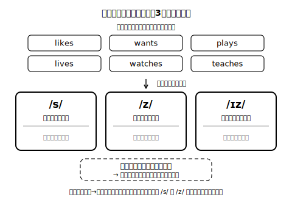
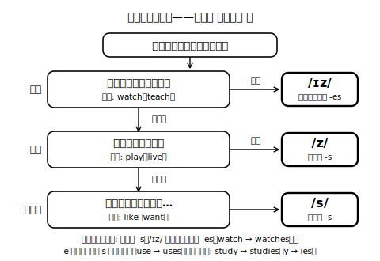

# Lesson 4　気付きを整理する——三人称の文の形と -s/-es の音・綴り

## 主概念（この時間の柱・2つ）

1. **He / She の文では、一般動詞の現在の文で、動詞の終わりに -s/-es が付く**（前時の気付きを「形」として整理する。She is... のような be の文は別の仕組みで、この時間の対象外）
2. **その音は3種類（/s/ /z/ /ɪz/）あり、綴りと対応している**（音が先、綴りはその記録）

## ねらい（生徒の姿）

- 前時に自分が見つけた「音の違い」のメモを持ち寄り、He/She の文の形として自分の言葉でまとめられる。
- 動詞を聞いて、語尾の音を3種類に耳で仕分けられる。仕分けた音と綴り（-s / -es）の対応に気付く。

## 導入（10分）——「自分の気付き」から始める

前時の振り返りシートの気付きメモを読み返す。「語尾に小さい音が付く」「s みたいな音」「watch のときはちょっと長い」——ここまで、全部自分の耳で見つけたもの。

- 問い（日本語）：「この気付き、今日は表にして整理しよう。まず確かめたいことは何？」→「いつ付くのか」「どんな音か」の2つに絞る。
- ノートの左に I の文、右に He/She の文を書き並べる（前時の聞き比べ文の組を再掲。すべて新規自作）。「付くのは He/She のとき」をまず確認する。

## 展開1（15分）——音の仕分けゲーム（文字はまだ見せない）

1. 紙に「/s/（すっと消える音）」「/z/（のどが震える音）」「/ɪz/（イズと聞こえる音）」の3つの置き場を作る。
2. 読み上げ文リストの He/She の文を、1文ずつ**自分で声に出して**読む（すべて新規自作）。聞こえた語尾の音の置き場へ、その動詞（カードまたは書き込み）を置く。
   - She like**s** music. ／ He want**s** a dog. → /s/
   - He play**s** the guitar. ／ She live**s** near the park. → /z/
   - She watch**es** dramas. ／ He teach**es** us kendo. → /ɪz/
3. 置くたびに「なんでそっち？」の理由を一言つぶやく。迷った語は保留の置き場に置き、後でもう一度声に出して聞き直す。
- 仕掛け：答え合わせを急がず、「耳で決める→理由を言う」を繰り返す。のどに指を当てて震えを確かめる方法を使うと、/s/ と /z/ の判定が自分でできるようになる。

**先生の雑談枠（展開1の締めに・2〜4文）**
> 実はこの3つの音、He/She の文だけの特別ルールじゃない。cats、dogs、boxes——名詞を2つ以上にするときの s も、まったく同じ3種類で鳴っている。英語の口は「言いやすい音を選ぶ」のがとても得意で、一度この耳ができると、あちこちで同じ仕組みが見えてくるよ。

## 展開2（15分）——音を文字にする（綴りとの対応）

1. 仕分けた動詞を、今度は文字カードで提示する。likes / wants / plays / lives / watches / teaches。
2. 問い（日本語）：「音が /ɪz/ だった仲間、綴りに共通点はない？」→ -es が付いている、元の語尾が ch などシューッとした音、という気付きを自分の言葉でメモする。
3. 気付きを整理表（音3種×綴り）に落とし、最後に自分で音読して「音→文字」の往復を確かめる。studies（study→studies）のような y の変化は、表の隅に「発展の窓」として1例だけ載せ、深追いしない。

**ここでの説明（生徒向け）**
前の時間に自分の耳が見つけた小さな音の正体は、/s/・/z/・/ɪz/ の3種類。どれになるかは動詞の最後の音で決まる。見分けは順番が大事で、**まず**シューッと終わる語（watch, teach）なら /ɪz/、**次に**、響いて終わる語（play, live）なら /z/、静かに終わる語（like, want）なら /s/。どの音になるかは直前の音で自然に決まる仕組みで、暗記表から生まれた規則ではない。綴りはこの音の記録で、多くは -s、/ɪz/ の仲間は多くが -es（watch → watches）。ただし use のように e で終わる語は、s を足すだけで uses になる。音が先、文字はあと——この順番で付き合うと迷いにくい。（約260字）

## まとめ（10分）——自分の紹介を He/She 版にする

- Lesson 2 で書いた自分の紹介文から1〜2文選び、「別の誰かがあなたを紹介する」つもりで He/She の文に**口頭で**変換する（I play tennis. → She plays tennis.）。書くのは次時以降、今日は音まで！
- 振り返りシートに日本語で1行：「-s/-es の音で、今日いちばん腑に落ちたこと」。

## stretch（分離）

- goes（go→goes）は3種類のどの音か、耳で判定して理由を言ってみる。
- 「のどの震え」の見分け方を使って、身の回りの動詞（use, help, wash など）の He/She 形の音を自分で予想→辞書の発音表示や、AIチャットへの質問（例：「washes の語尾の音は /s/ /z/ /ɪz/ のどれですか。理由も中1向けに短く」）で答え合わせする。

## 教材（新規自作・架空）

- 聞き比べ文ペア再掲カード（Lesson 3 と同一セット）
- 音の仕分けゲーム用の読み上げ文リスト（/s/ /z/ /ɪz/ 各3文以上・新規自作）
- 動詞の文字カード（likes / wants / plays / lives / watches / teaches ほか）
- 整理表ワークシート（音3種×綴り・「発展の窓」欄付き）

<!-- gen_nav:nav:start（自動生成・手編集しない） -->

---

[← 前のレッスン](lesson_03.md)｜[単元の目次](README.md)｜[解答](answer_key_L04-08.md)｜[次のレッスン →](lesson_05.md)

<!-- gen_nav:nav:end -->
