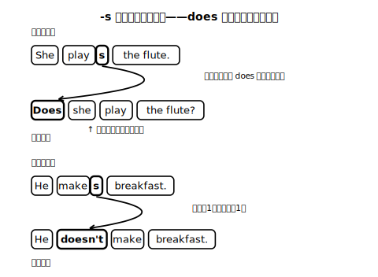
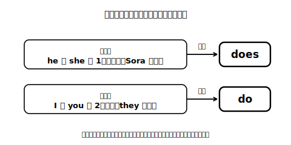

# Lesson 5　他者についてたずねる・確かめる——Does she...? / She doesn't...

## 主概念（この時間の柱・2つ）

1. **他者について知らないことは、Does he/she ...? で確かめられる**（Yes, she does. / No, she doesn't. の応答まで）
2. **does が出てくると、動詞は元の形に戻る**（-s は文の中で一度だけ働く、という気付き）

## ねらい（生徒の姿）

- カードの人物について「まだ知らないこと」を、Yes/No で答えられる質問文にして声に出し、カードの情報をもとに Yes, he does. / No, she doesn't. で応答を構成できる。
- Does の質問文・doesn't の否定文では動詞に -s が付かないことに、活動の中で自分で気付き、日本語で言語化できる。

## 導入（10分）——「知っているつもり」をゆさぶる

場面設定（新規自作・架空）：転校した Sora から手紙が届いた。「新しいクラスに、わたしとよく似た人がいるらしい。本当かどうか、確かめる質問を送ってほしい」——似ているかどうかは、**たずねてみないと分からない**。

モデルの問答を、**一人二役で**（質問役と返事役で声の調子を替えて）音読する：

> **Does** she play basketball, too? — Yes, she **does**.
> **Does** she cook dinner on weekends? — No, she **doesn't**. She makes sweets on weekends.

- she は Sora ではなく、その「よく似た人」。答えの側は「Sora が転校先で確かめて、返事をくれた」体で読む（質問する話題の人物と場面がずれないようにする）。
- 問い（日本語）：「知らないことを確かめたいとき、文の最初に何が来た？」→ Does、を引き出す。この段階では動詞の形にはまだ触れない（気付かせるのは展開2）。

## 展開1（15分）——プロフィール当てゲーム（音声のみ・書かない）

1. 架空プロフィールカード（新規自作・8種）を全部並べ、その中から「当てたい1枚」を心の中で決める（または裏返しに混ぜて1枚引き、それを「正解」として脇に置く）。
2. 8種の中の1枚に絞り込めるまで、Does he/she ...? の質問を**声に出して**作り、カードの情報を見て自分で Yes, he does. / No, she doesn't. と答える。5問以内で1枚に絞れる質問の順番を作れたら成功！
   - 例：Does your person play a sport? — Yes, he does. ／ Does he play soccer? — No, he doesn't.
3. 絞れたら別の1枚でもう1周。Do と Does の揺れや Does she plays...? のような形は**この段階では直さなくてよい**（気付いたらメモだけ）。
- 仕掛け：カードは「共通点が多く、1つだけ違う」組が混ぜてあり、質問を重ねないと絞れない構造になっている。
- **AI活用オプション**：AIチャットを「出題者」にすると本物の当てゲームになる。例：「次の8人のプロフィールから、あなたが1人をこっそり選んでください。私が英語で Does he/she ...? と質問するので、Yes/No だけで答えてください。当てたら教えてください。プロフィール：（8種カードの情報を書き写す）」。

## 展開2（15分）——「-s はどこへ行った？」

1. 展開1で自分が作った質問文（整えた形）を、ノートで肯定文と対比して書き並べる：
   - She play**s** the flute. ／ **Does** she play the flute?
   - He make**s** breakfast. ／ He **doesn't** make breakfast.
2. 問い（日本語）：「肯定の文にあった -s、質問と否定の文ではどこにいる？」→ -s は動詞に付かなくなり、その仕事を does / doesn't が引き受けている（動詞は元の形に戻る）、という気付きを自分の言葉でメモする。
3. 気付きを声に出して確かめる：Does she...? と自分で聞いて、does で答える——一人二役の往復練習をテンポよく数往復（音が先、文字カードはその後に見る）。

**ここでの説明（生徒向け）**
He/She の文で動詞に付けた -s は、「これは（1人の）第三者の話」という合図だった。質問や否定では、その合図の仕事を does がまとめて引き受ける。だから Does she play...? / She doesn't play... のとき、動詞はもう合図を背負わなくてよくて、元の形に戻る。合図は1つの動詞に1つ——does が引き受けたら、後ろの動詞には付けない。そう考えると、-s と does を二重に付けたくなる気持ちも整理できる。does は He / She や1人の名前など、I・you 以外の「1人」の主語のときの相棒。I や you、2人以上の主語（they など）の相棒は do。相棒選びは主語で決まる。（約250字）

**先生の雑談枠（説明のあとで・2〜4文）**
> 質問の作り方は言語によってずいぶん違って、語順を入れ替える言語もあれば、文の最後に「か」を置く日本語のようなタイプもある。英語は、することの文の質問では do / does という「質問専用の相棒」を呼び出す、比較的珍しいやり方だと言われているんだ（Are you...? のような be の文は、ひっくり返すだけで相棒は呼ばない）。相棒を呼ぶ感覚がつかめると、疑問文づくりは一気に楽になるよ。

## まとめ（10分）——インタビューの質問を仕込む

- 次時は架空プロフィールカードの人物に「誌上インタビュー」をして、その人を紹介する。カードから1枚選び、「この人に聞いてみたいこと」を Does you...? にならないよう注意しながら、**Do you ...?（本人にたずねる形）で3つ、口頭で**準備する（紹介するときに Does/He/She に変わることを予告だけしておく）。
- 振り返りシートに日本語で1行：「does について今日分かったこと」。

## stretch（分離）

- No, she doesn't. のあとに「本当のこと」を1文足して答えてみる（No, she doesn't. She plays badminton.）。
- What does she play? のような「Yes/No で答えられない質問」をAIチャットに1つ投げて、答え方を観察してみる（例：「中1英語で短く答えてください。She plays the flute. という人について：What does she play?」。整理は求めない・耳の準備だけ）。

## 教材（新規自作・架空）

- Sora の手紙（場面提示用スクリプト・新規自作）
- 架空プロフィールカード×8種（Lesson 3 と同一セット・共通点の多い組を含む）
- 対比用の文カード（plays/Does ... play?, makes/doesn't make 等）
- 振り返りシート

<!-- gen_nav:nav:start（自動生成・手編集しない） -->

---

[← 前のレッスン](lesson_04.md)｜[単元の目次](README.md)｜[解答](answer_key_L04-08.md)｜[次のレッスン →](lesson_06.md)

<!-- gen_nav:nav:end -->
