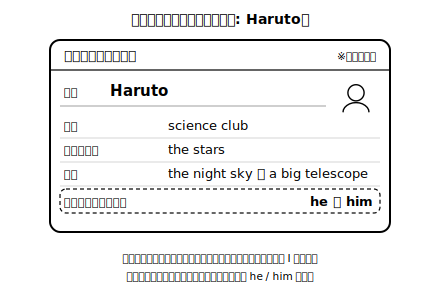
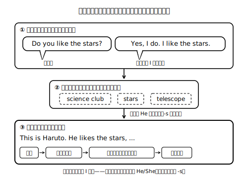

# Lesson 6　インタビューして紹介する——口頭発表

## 主概念（この時間の柱・1つ）

1. **カードの人物から Do you ...? で聞き取った（誌上インタビューの）情報を、He/She の文に組み替えて、順序をつけて口頭で紹介する**（発表は「簡単な語句や文」を並べて接続語でつなぐところまで。段落構成は求めない）

## ねらい（生徒の姿）

- 誌上インタビューで得た情報（答える側は I で答える）を、He/She の文に変換して3〜5文の口頭紹介にまとめられる。
- 紹介の順序（名前→関係→すること・好きなこと→ひとこと）を意識して、聞き手に伝わる発表ができる。

## 導入（10分）——モデル発表を「設計図ごと」見る

架空の生徒 Haruto（新規自作カード）にインタビューした体のモデル発表を、声に出して読む：

> This is Haruto. He is in the science club. He likes the stars, so he watches the night sky from his window. He wants a big telescope!

- 問い（日本語）：「この紹介、どんな順番で情報が出てきた？」→ 名前→所属→好きなこと→ひとこと、の並びをノートで確認する。「話し手のメモには何が書いてあったと思う？」→ 文ではなく**語句だけ**（science club / stars / telescope）だったことを種明かしする。

## 展開1（15分）——誌上インタビュー（メモは語句のみ）

1. 架空プロフィールカード（8種）から1枚選ぶ。前時に仕込んだ Do you ...? の質問（3〜4問）を、カードの人物に向かって**声に出して**たずねる。
2. 質問するたびに、カードの情報からその人物になりきって **I で**答えを構成し、声に出して答える（I play tennis. のように）。一人二役の「誌上インタビュー」——質問役と本人役で声の調子を替えると場面が生きる。
3. メモ欄には**語句・絵だけ**を書く（tennis ／ curry ♪ など）。文を書かない——文にするのは声で、そして次の時間！
4. 時間があれば別のカードでもう1巡。カードに情報がない質問には、本人役として Pass, please. と答えてよい（Pass, please. はこの活動の中の合図。一般の英語では「取ってください／回してください」の意味にもなる表現なので、活動の約束として使う）。
- **AI活用オプション**：AIチャットに本人役を頼むと、本物のインタビューのように練習できる。例：「あなたは Haruto です。次のプロフィールの情報だけを使って、私の英語の質問に中1レベルの英語で答えてください。情報にないことを聞かれたら Pass, please. と答えてください。プロフィール：理科部／星が好き／夜に窓から星空を見る／大きな望遠鏡がほしい」。自分の質問が通じるか、答えを聞き取ってメモできるか、両方の練習になる（カードは架空人物なので、実在の人の情報は入力しない）。

**先生の雑談枠（展開1のあとで・2〜4文）**
> 紹介といえば名前だけれど、名前の並び順は文化によって違って、日本語のように名字が先の言語圏もあれば、名が先の言語圏もある。英語で自分の名前をどの順で言うかは、自分で選べる場面もあるんだ。世界のあいさつでは「相手の名前を確かめること」自体が敬意の表現になっている、というのも面白いところ。

## 展開2（15分）——He/She に組み替えて、ミニ発表

1. メモの語句を見ながら、カードの人物の紹介を口頭で組み立てる練習。I like curry. と聞いた情報は She likes curry. に——変換は声でやる。
2. 3〜5文・接続語 and / so / but を1回以上で、通しのミニ発表を声に出す。録音して聞き返し、カードと照べて「その人について新しく知ったこと」が1つ以上正しく入っていたら聞き取り成功。
3. -s や does の揺れに気付いても、この時間は発表を止めて直さない。気付いた箇所をメモに留め、次時（文字にする時間）の材料にする。

**ここでの説明（生徒向け）**
インタビューでは、答える側は自分のことだから I で話す。それをほかの人に紹介する瞬間、主語は He / She に替わり、動詞には合図の -s が付く——この組み替えこそが「他者紹介」の心臓部。もうひとつの鍵は順序で、名前→関係や所属→すること・好きなこと→ひとこと、と並べると、聞き手は頭の中にその人の絵を描きやすい。りっぱな長い文はいらない。短い文を、伝わる順に並べて、and や so で軽くつなげば十分。（約200字）

## まとめ（10分）——仕上げの通し発表と「握っておく」こと

- 仕上げとして、通しの発表をもう一度声に出す（30秒程度。録音しておくと次時の材料になる）。そのあと、自分で Does he ...? の確認質問を1つ作り、カードを見て答えられたら上級！（AIチャットに聞き手役を頼み、発表文を送って「この紹介を聞いた人として、Does he ...? の確認質問を1つ英語でください」と言ってもらう手もある。）
- 振り返りシートに日本語で1行：「I から He/She に組み替えるとき、いちばん気を付けたこと」。次時はこの発表を**文字にする**と予告する。

## stretch（分離）

- 発表に「聞き手への一言」（Please talk to her about music!）を足してみる。
- メモの語句から、発表で**言わなかった**情報を1つ選び、Does he ...? と質問される前に先回りして足す即興に挑戦する。

## 教材（新規自作・架空）

- Haruto プロフィールカード＋モデル発表スクリプト（新規自作）
- インタビューメモシート（語句・絵のみ記入欄／Pass ルール明記）
- 発表の順序ガイド（名前→関係→すること→ひとこと・手元に置く用）
- 架空プロフィールカード×8種（誌上インタビュー用・Lesson 3 と同一セット）

<!-- gen_nav:nav:start（自動生成・手編集しない） -->

---

[← 前のレッスン](lesson_05.md)｜[単元の目次](README.md)｜[解答](answer_key_L04-08.md)｜[次のレッスン →](lesson_07.md)

<!-- gen_nav:nav:end -->
