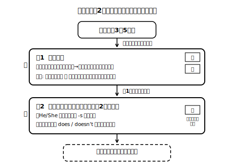

# Lesson 7　他者紹介文を書く——下書きとセルフレビュー

## 主概念（この時間の柱・2つ）

1. **口頭で発表した紹介を、文字にして残す**（音声既習の文字化。書くのは「簡単な語句や文」を接続語でつなぐところまで）
2. **読み直しは2軸の順で**：まず「伝わるか」（読んでその人の絵が描けるか）、次に「形が正確か」（-s・does など）。順序を逆にしない。

## ねらい（生徒の姿）

- 前時に口頭発表した内容をもとに、3〜5文の他者紹介文の下書きを書ける。
- 自分の下書きを、①内容が伝わるか→②形が正確か、の順で読み直し、付箋（印）で具体的に残せる。

## 導入（10分）——声は消える、文字は残る

前時の発表を思い出して（録音があれば聞き返して）、問い（日本語）：「あの発表、来週の自分はどこまで覚えていられそう？」——声はその場で消えるけれど、文字にすればその場にいなかった人にも、未来の自分にも届く。今日は前時の発表を「紹介カード」の下書きにする、と目的を確かめる。

モデル下書き（Haruto 版・新規自作）を見て、順序ガイド（名前→関係→すること→ひとこと）が文字でも同じであることだけ確認する。

## 展開1（20分）——下書きを書く

1. インタビューメモ（語句のみ）と発表の記憶を頼りに、3〜5文で下書きを書く。接続語（and / so / but）を1回以上使う。
2. 迷ったら「まず声に出して言ってから書く」を合言葉にする（言えた文を書き取る、が本ユニットの背骨）。
3. 綴りが分からない語は、カタカナ仮置きや絵でもいったん前へ進んでよい（止まらないことを優先し、清書までに直せばよい）。
- 手が止まったら、「発表で最初に何て言った？」と自分に問いかけて、口頭再生から入り直す。この時間は誤り探しをしない！

**先生の雑談枠（展開1のあとで・2〜4文）**
> 話すときは、声の大きさや間、顔の表情がずいぶん手伝ってくれている。書き言葉にはそれがない代わりに、綴りや語順、ピリオドが同じ仕事を引き受けてくれる。文字は「声の道具立てを紙の上に引っ越しさせたもの」と思うと、なぜ形をていねいに整えるのかが腑に落ちてくるはず。

## 展開2（15分）——2軸のセルフレビュー（付箋で残す）

1. 下書きを書いたら少し時間を置き（お茶を1杯でもよい）、**まず軸1**：初めて読む人のつもりで黙読して、「この人がどんな人か」を日本語で声に出して言う。カードと照べて言えたら「伝わった」の付箋（青）。言えない・引っかかった箇所には「？」の付箋を貼り、どこで迷ったかを一言添える。
2. **次に軸2**：形のチェック。観点は今日この2つだけ——「He/She の文の動詞に -s はあるか」「否定・疑問に does/doesn't が使えているか」。気付いた箇所に黄色の付箋（直し方はまだ書かない。場所を指すだけ）。
3. 付箋を貼り終えたら、なぜそこに付いたのかを考えて、直したい箇所に印を付ける。直すのは次時。
- 仕掛け：軸1が終わるまで軸2に入らない。「まず伝わっている」を自分で確かめてから、形の話をする。

**ここでの説明（生徒向け）**
読み直しの順番には理由がある。文章の値打ちは、まず「読んだ人の頭にその人の姿が浮かぶか」で決まるから、最初にそこを確かめる。形の正確さはそのあとに磨く2枚目の軸で、-s や does が整うと、読み手は立ち止まらずにすっと読める。逆の順でやると、内容を味わう前に赤ペンの話になってしまい、書く気持ちがしぼんでしまう。伝わった、をまず自分で確かめてから、形を整える——この順番は、これから先どんなライティングでも使える型。（約210字）

## まとめ（5分）——修正メモ

- 付箋をもとに、次時に直すことを日本語で1〜2個、下書きの余白にメモする（例：「疑問文に does を入れる」「likes の s」）。
- 振り返りシートに日本語で1行：「読み直しで、自分の文について気付いたこと」。

## stretch（分離）

- ひとこと欄に、読み手への呼びかけ文（Please ask him about his dog!）を足してみる。
- 自分の下書きの中で「いちばん好きな1文」を選んで理由を言う（形ではなく内容をほめる練習）。

## 教材（新規自作・架空）

- モデル下書き（Haruto 版・順序ガイド対応・新規自作）
- 下書き用紙（順序ガイド薄印刷・余白広め・修正メモ欄付き）
- 付箋（青＝伝わった／？＝迷った／黄＝形）とセルフレビュー手順カード（軸1→軸2の順を明記）
- 振り返りシート

<!-- gen_nav:nav:start（自動生成・手編集しない） -->

---

[← 前のレッスン](lesson_06.md)｜[単元の目次](README.md)｜[解答](answer_key_L04-08.md)｜[次のレッスン →](lesson_08.md)

<!-- gen_nav:nav:end -->
