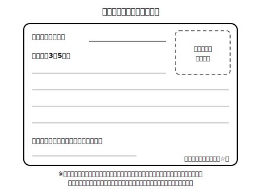

# Lesson 8　仕上げと振り返り——紹介カードの完成

## 主概念（この時間の柱・2つ）

1. **セルフレビューの結果を反映して清書し、紹介カードを完成させる**（直す理由を確かめながら書く。写す作業にしない）
2. **自分の誤りの「くせ」を自分の言葉で言えるようにする**（振り返り＝次の単元への持ち物）

## ねらい（生徒の姿）

- 前時の付箋と修正メモをもとに、直す箇所とその理由を自分で説明しながら清書できる。
- ユニット全体を振り返り、「自分がつまずきやすい形」と「そのとき確かめること」を日本語で1つ言語化できる。

## 導入（5分）——直す理由をひとこと言ってから

修正メモを開き、「今日、どこを・なぜ直すか」を日本語で声に出して宣言する（30秒でよい）。「likes の s——He の文の合図だから」のように、**理由まで言えたら**清書に入ってよい合図とする。理由が言えない付箋は、Lesson 4〜5 の説明を読み返すか、AIチャットに確かめてから直す（例：「中1英語です。He like music. の like に -s が要る理由を、1〜2文で教えてください」）。

## 展開1（20分）——清書（紹介カードづくり）

1. 紹介カード台紙（新規自作・名前／紹介文3〜5文／ひとこと欄／イラスト枠）に清書する。
2. 直した箇所には小さく☆印を付ける——どこを成長させたかを、あとで自分が見えるように。
3. 書き終えたら、**声に出して読み直す**のを仕上げ前の儀式にする（音声既習の力で自分の目より先に耳が誤りを見つけることがよくある）。
- 題材は架空プロフィールカードの人物（またはモデル人物 Haruto・Hana など）。カードに書く内容は、誌上インタビューでカードから得た情報の範囲まで——情報を足したくなったら、stretch の「1文足すなら？」で創作として足す（実在の人の情報は書かない）。

## 展開2（15分）——マイ紹介文コレクション（単元のまとめ作品）

1. 完成した紹介カードを、このユニットで書いたもの（L2 の自己紹介文の下書き・L7 の下書き）と一緒にノートやファイルに綴じる・貼る——これが「マイ紹介文コレクション」。ユニットの成果を1か所に集めた、自分だけのまとめ作品になる。
2. 少し時間を置いてから読み返し、一言メッセージ用紙（日本語でよい）を1枚添える——「バドミントンの話、聞いてみたくなった！」のように、読み手としての内容への反応を。
3. セルフレビュー：「順序」「接続語」「-s・does」の3つの視点で、自分のカードのよかったところを1つずつ具体的に挙げてほめる。よかった探しが先、直し探しはもう終わっている。
- **AI添削オプション**：仕上がりをもう一段確かめたければ、AIチャットに観点を絞って頼む。例：「中1英語のつもりで書いた紹介文です。三単現の -s と does の誤りだけ指摘してください。他の書き換え提案は不要です：（自分の清書）」。全部を書き直させるのではなく、観点を1つに絞るのがこつ（直すかどうかは自分で決める）。

**先生の雑談枠（展開2のあとで・2〜4文）**
> 英語は、母語として話す人だけの言葉ではなくて、外国語として使う人どうしが出会うための共通の道具でもある。だから世界の英語のやり取りの多くは、お互いに完璧じゃない者どうしで成り立っていると言われるんだ。今日作ったカードのように「伝わる形を、少しずつ正確に」は、世界の多くの学び手に共通する、ふつうの上達の仕方だよ。

## まとめ（10分）——自分の「くせ」を持ち物にする

1. ユニットの振り返りシートに、日本語で次の2つを書く：
   - **自分がつまずきやすかった形を1つ**（例：「質問の文で does を忘れがち」「is と plays を混ぜがち」）
   - **そのとき自分に掛ける確認の言葉**（例：「質問はまず相棒（do/does）から」「様子の文？ することの文？」）
2. 書いた2つを声に出して読み、マイ紹介文コレクションの最初のページに貼って終わる。自分のくせを知っていると、次の単元で直すのが楽になる——これがこのユニットの最後の持ち物。

**ここでの説明（生徒向け）**
このユニットの始まりは、自分のことを声で言えるようにするところだった。そこから文字にし、He/She の文で他者を伝え、たずね、発表し、紹介文に仕上げるところまで来た。振り返りで書いた「自分のくせ」は、弱点リストではなく、次に文を作るとき自分でチェックできる場所が分かった、という地図。間違いは消すものではなく、どこを見れば整うかを教えてくれる目印として、これからも付き合っていけばいい。（約190字）

## stretch（分離）

- 完成したカードの人物について、まだ書いていない情報を1文だけ足すなら何か、口頭で言ってみる（創作として。カードの設定と矛盾しない範囲で）。
- 別の架空プロフィールカードを1枚選び、その人物を紹介する3文を口頭作文してみる（書くのは希望者のみ）。

## 教材（新規自作・架空）

- 紹介カード台紙（名前／紹介文／ひとこと／イラスト枠・新規自作）
- 一言メッセージ用紙（マイ紹介文コレクション用）
- ユニット振り返りシート（つまずきの形／確認の言葉・2欄式）
- ☆印シール（修正箇所可視化用・任意）

<!-- gen_nav:nav:start（自動生成・手編集しない） -->

---

[← 前のレッスン](lesson_07.md)｜[単元の目次](README.md)｜[解答](answer_key_L04-08.md)

<!-- gen_nav:nav:end -->
