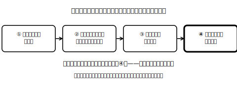
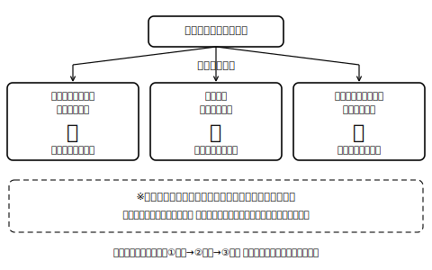

<!--
status: published_draft
unit: jhs-jpn-all-kanji-goi-unyou
lesson: 01
系統タグ: 同訓弁別／形式: 選択中心
例文: 全て自作／字体・読みはverify_required（教科書照合前提）
license: CC-BY-4.0
-->

# Lesson 01 同訓異字は文脈が決める

## ねらい

同じ訓読みを持つ漢字（同訓異字）を、規則の暗記ではなく「文脈の意味→候補→語義→辞書」の手順で選べるようになる。あわせて、「どちらでも間違いではない場合がある」ことを知る。

## 主概念1: 漢字は文脈が決める（約200字）

「はやい」と打つと、「速い」と「早い」が出てきます。どちらを書くかを決めるのは、漢字のルール表ではなく、**その文が何を言おうとしているか**です。時刻が前なら「早い」、スピードが大きいなら「速い」と書くことが多い——つまり、文の意味を先につかめば、多くの場合、字は後から選べます。手順は4つ。①文脈の意味を捉える ②同じ訓の候補を思い浮かべる ③それぞれの字の意味で見分ける ④辞書や用例で確かめる。この授業では、この手順を何度も使います。

## 主概念2: 「どちらも間違いではない」場合がある（約180字）

同訓異字の使い分けは、実は国の資料でも「慣用上の使い分けの**大体**」とされていて、はっきり線が引けない場合や、人によって感覚が分かれる場合があると説明されています。だから「この字が絶対に正解！」と言い切れないことがあるのです。大事なのは、迷ったときに「なぜこの字を選んだか」を文脈で説明できること、そして辞書で確かめる習慣です。テストの丸バツより一段深い、言葉を選ぶ力の話です。

## 導入（5分）

黒板に「はし」とだけ書く。「橋」？「端」？——語だけでは決められない！ 文脈を足した文（「川に（はし）がかかる」「机の（はし）に置く」）を示すと決まることを体験させ、「字を決めるのは文脈」という本時の軸を宣言する。

## 活動1: 文脈から選ぶ（選択式）

次の（ ）に入る漢字を候補から選び、**選んだ理由を文脈の言葉を指さして**説明する。

> ※問1・問2は、主概念1で見た「はやい」をそのまま使う**手順の練習台**です。答えを当てることよりも、①文脈→②候補→③語義→④辞書の手順を声に出して確認しながら選ぶこと。問3以降で本番の文脈判断に入ります。

**問1** 朝五時に起きるのは、私にはまだ（ はやい ）。 〔速・早〕
**問2** この新幹線は、隣の県まで三十分で着くほど（ はやい ）。 〔速・早〕
**問3** 真夏の体育館は、立っているだけで（ あつい ）。 〔暑・熱・厚〕
**問4** （ あつい ）スープを、ふうふう冷ましながら飲む。 〔暑・熱・厚〕
**問5** 辞書のように（ あつい ）本をかばんに入れる。 〔暑・熱・厚〕
**問6** 日曜日に、駅前で小学校の友人と（ あう ）。 〔会・合〕
**問7** この靴は、私の足にぴったり（ あう ）。 〔会・合〕

## 活動2: 「どちらも許容」に出会う（考えて書き出す）

次の2問は、**候補のどれを書いても間違いとは言えない**とされる例です。「自分ならどれを書くか」「その字を選ぶとどんな感じが出るか」を、自分の言葉で書き出してみる（答えを1つに決めるのが目的ではありません）。

**問8** 二人は（ かたい ）約束を交わした。 〔固・堅〕
**問9** この地域に、新しい町を（ つくる ）計画がある。 〔作・造・創〕

> 指導上の注意: ここで教師が「本当はこっち」と裁定しないこと。「一般には〜と書くことが多い」「この文脈ではどちらの意味も通る」という言い方を貫く。

## 雑談枠: 増えた「異字同訓」

「答える／応える」「作る／造る／創る」という組は、平成22年（2010年）の常用漢字表の改定にともなって、新たに「同じ訓を持つ漢字の組」として整理されたという経緯があります。言葉の書き分けのリストは、昔から固定されたものではなく、時代とともに見直されているのですね。今日「どちらも許容」に出会ってモヤモヤした人は、実は言葉の最前線に立っていたわけです！

## まとめ（振り返り）

- 字を決めるのは、多くの場合、文脈。手順は「文脈→候補→語義→辞書」。決めきれないときは辞書で確かめる。
- どちらも間違いではない場合がある。そのときは選んだ理由を説明できればよい。

---

## stretch（発展・希望者のみ）

**S1** 「おさめる」には〔収・納・治・修〕の4候補があります。次の各文で、文脈からどの字がふさわしいかを考え、**辞書で確かめてから**書きなさい。
1. 学問を（おさめる）。
2. 注文の品を、期日までに倉庫に（おさめる）。
3. 争いを（おさめる）。
4. 撮影した映像をカメラに（おさめる）。

**S2** 自分で「文脈が字を一つに決める文」を1つ、「どちらでも通りそうな文」を1つ作り、隣の人に判定してもらいなさい（ひとりで学習しているときは、選んだ理由を声に出して説明してみよう。作った文をAIに見せて、どの字が合うか判定してもらうのもよい）。

<!-- gen_nav:nav:start（自動生成・手編集しない） -->

---

[単元の目次](README.md)｜[解答](answer_key_supplement.md)｜[次のレッスン →](lesson_02.md)

<!-- gen_nav:nav:end -->
