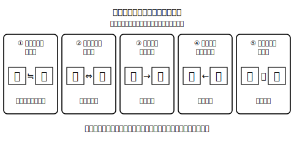
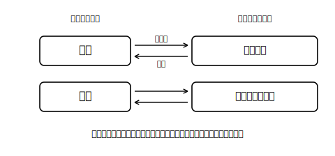

<!--
status: published_draft
unit: jhs-jpn-all-kanji-goi-unyou
lesson: 02
系統タグ: 熟語ネットワーク／形式: 選択＋部分書字
例文: 全て自作／字体・読みはverify_required（教科書照合前提）
license: CC-BY-4.0
-->

# Lesson 02 熟語の構成——読みと意味の「道具」にする

## ねらい

二字熟語の構成の型を知り、それを「知らない熟語の意味を推理する道具」「訓読みの言葉と熟語をつなぐ道具」として使えるようになる。

## 主概念1: 熟語には組み立ての型がある（約210字）

二字熟語は、漢字二つがでたらめに並んでいるのではなく、組み立ての型があります。教科書などでよく使われる整理のしかた（呼び名や分け方は本によって少し異なります）では、①似た意味を重ねる（岩石）②対になる意味を並べる（左右）③上の字が下の字を説明する（温水＝温かい水）④下の字が上の字の動作の対象になる（着席＝席に着く）⑤主語と述語の関係（国営＝国が営む）。型が分かると、初めて見る熟語でも「たぶんこういう組み立てで、こういう意味だろう」と推理できます。熟語を丸暗記の対象から、分解できるパズルに変えましょう。

## 主概念2: 熟語と訓読みをつなぐと語彙が増える（約190字）

「着席」を「席に着く」とほどけるように、多くの熟語は訓読みの言葉に言い換えられます。逆もできます。「満ちる」「足りる」を知っていれば、「満足」の意味は推理できるわけです。この「音読みの熟語⇔訓の言葉」の行き来ができると、知っている言葉同士が網の目のようにつながり、読める字・書ける語が一気に増えます。今日は熟語を「ほどく」「編み直す」練習をします。

## 導入（5分）

「温水」「読書」「県立」を板書し、「意味を知らなくても意味が言えるのはなぜ？」と問う。→組み立てから推理している、という気づきを引き出す。

## 活動1: 型を見分ける（選択式）

次の熟語の構成を、①似た意味 ②対の意味 ③上が下を修飾 ④下が上の対象 ⑤主語＋述語 から選ぶ。

**問1** 豊富　**問2** 明暗　**問3** 深海　**問4** 洗顔　**問5** 日没　**問6** 増加　**問7** 乗車　**問8** 高低

## 活動2: 熟語をほどく・編む（部分書字）

**問9** 次の熟語を、訓読みを使った言い方にほどきなさい。（例: 着席→席に着く）
1. 帰国　2. 造船　3. 消火

**問10** 次の訓読みの言い方に合う二字熟語を、（ ）の一字をヒントに書きなさい。
1. 山に登る →（登□）
2. 席が空く →（□席）
3. 手を挙げる →（挙□）

**問11** 「満」を使う熟語をできるだけ多く挙げ、それぞれ構成の型を言いなさい。（例: 満員——「員が満ちる」…どの型か？）

## 雑談枠: 2,136字は「目安」

いま私たちが使う常用漢字表（平成22年告示）には2,136字が載っています。おもしろいのはその位置づけで、この表は「これ以外使ってはいけない」という絶対的な規則ではなく、社会生活で漢字を使うときの「**目安**」だと、表自身の前書きに書かれています。言葉の世界は広く、表の外にも漢字はたくさんある——その広い海で迷わないための海図が2,136字、というイメージですね。

## まとめ（振り返り）

- 熟語には組み立ての型があり、型から意味を推理できる。
- 熟語⇔訓読みの行き来が、読み・意味・書きの三つを同時に強くする。

---

## stretch（発展・希望者のみ）

**S1** 三字熟語「衣食住」「新学期」「不参加」の組み立てを、二字熟語の型を応用して説明しなさい。
**S2** 「造」と「創」はどちらも「つくる」に関わる字です。「造船」「創作」という熟語から、それぞれの字が持つ意味の傾向を**自分の言葉で**説明しなさい（言い切れなくてよい。「〜という感じがする」で構いません。仕上げに辞書で確かめること）。

<!-- gen_nav:nav:start（自動生成・手編集しない） -->

---

[← 前のレッスン](lesson_01.md)｜[単元の目次](README.md)｜[解答](answer_key_supplement.md)｜[次のレッスン →](lesson_03.md)

<!-- gen_nav:nav:end -->
